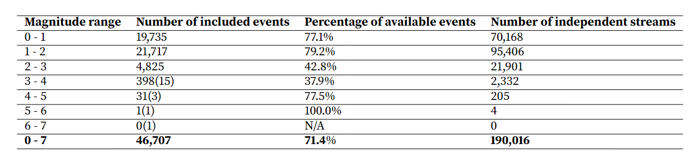

# Curated Pacific Northwest AI-ready Seismic Dataset

太平洋西北部人工智能地震数据集

## 摘要


* 描述了一个AI就绪地震数据集
* 包括各种地震事件参数 仪器元数据 地震波行
* 描述地震目录和事件属性（事件震级类型，信道类型，波形极性，信噪比，相位选择）随着网络检测系统的时间演变


## 非技术型总结


* AI 准备数据集是推动机器学习发展的关键因素
* 训练模型的数据多样性是推动模型性能或者泛化能力的主要因素
* 该数据集包括由太平洋西北地震网整理的元数据和典型地震的波形，也包括人为的采石场爆炸和音爆，以及雪崩等地表过程


## Introduction

* 太平洋西北地区包含了大量的地震，各种类型的地震
* PNW地区地震记录的持久性和活跃地质灾害的丰富性为探索广泛的地震特征提供了独特的机会。

* 地震数据的高维性，数据量急剧增长的特性大大推动了机器学习在地震科学上的使用
* 目前有几个准备好的数据集：STEAD,INSTANCE,ETHZ,SCEDC
* 这些数据集包含各种地震仪记录的地震和噪声时间序列，56个典型数据属性是震源的基本特征
* 这样的数据集被认为是“ai就绪”的，因为它们的数据和属性是用机器学习社区常用的数据格式打包的
* 地表滑坡事件也可以产生地震波
* 本文介绍的地震数据集：构造地震、爆炸、地表事件（岩石坠落/雪崩）、音爆、雷暴


## 数据的选择和准备


* 从iris下载数据
* 老事件的筛选：要求每一个台站都对地震事件有P和S的到达信息
* 我们使用SeisBench的元数据格式:表￿列出了我们与每组波形相关联的属性
* 新事件的检测由区域地震台网sta￿自动和手动审查
* pnsn利用地震台站的数据监测和报告该地区的地震活动  使用STA/LTA来判别地震事件
* 子网站点组：一组地震站，称为“子网站”，用于监测特定地理区域的地震活动。当子网站内的多个站点检测到一个重要事件（即它们的STA/LTA超过阈值），就会考虑进一步的分析。
* 自动保存事件：如果子网站内的多个站点检测到一个事件，系统会自动保存有关事件的信息以供进一步审查


* 关于表面事件的定义
    * 清晰但是突发的信号，没有明显的p和S的到达，频率比较低，pnsn标记为表面事件，并且分配相关的标签
    *  大多数表面事件是与喀斯喀特山脉和火山上的冰川相关的"ice"（冰震）或雪崩，但也可能是泥石流或岩石崩塌等
    * 分析员还会保存一些非地震现象的记录，如音爆、雷暴和其他"有趣"的事件。这样的波形通常只在非常少数的附近地震站（一到两个站点）上被捕获，而PNSN会将这些事件的相位信息收集在一个目录中，称之为"Exotic Event"（异类事件）目录。
    * 这些事件只能在非常有限数量的台站检测到

* 当确定一个事件是一个地震事件的时候，自动拾取系统会尝试从地震图形中识别和提取地震相（如P波和S波）的到达时间。这些到达时间对于确定地震的位置和深度非常重要
* 接着进行手动拾取：PNSN的分析员会仔细检查自动选取的到达时间，确保它们准确无误。如果需要，他们会对这些选取进行修改，以确保地震参数的准确性

* 分析员会手动注释到达时间并估计其选取的不确定性。
* 这些相到达时间仅在每个站点的单个分量上进行选择，通常选择P波在垂直通道（Z分量）上，而S波在水平通道（E/N或其他分量）上。
* 在相到达时间的选择中，既使用加速度通道又使用速度通道，尽管速度通道是最常用的。PNSN操作站点使用速度通道

* pnm分为好几个数据集
    * comcat数据集：经过pnsn验证过数据集的属性
    * 异类数据集：一个数据集我们称之为"异类事件"数据集，仍保存在PNSN AQMS数据库内部
    * 还有一个数据集专注于北加利福尼亚地震序列。这些数据集由于具有不同的时间窗口长度和数据属性，因此被打包成不同的文件

  


## ComCat Events


* 从ANS comcat下载一些事件，这些事件的震级大于特定值，时间从1～12月
* 这些事件的源类型可以是地震或爆炸。下载包含了许多相关的相到达时间。在这些选取中，有一部分是在速度通道上进行的，而只有一小部分是在强动通道上进行的。
* 爆炸或者地震类型的事件


## Exotic Events-异类事件 

* 这些事件没有被标记为地震事件 也没有被标记为爆炸事件
* 在这个数据集中，我们包括被标记为"surface event"（表面事件）、"thunder"（雷声）、"sonic boom"（音爆）以及不幸的"plane crash"（飞机坠毁，一个在华盛顿的Whidbey Island附近发生的已确认事件，发生在某年的三月）。

  


* 异类事件的监测和记录在很大程度上受到分析员的手动干预和时间可用性的限制，主要是火山活动期间发生的事件

* 大多数异类事件的震级和振幅都比较小，因为只有几个台站，缺乏额外的观测，所以无法提供关于事件的源特性，（起始时间，震级，）由于都是局部性，难以提供很详细的地震参数来分析特征。


## 2022 Northern California Ferndale Earthquake Sequence


* 加利福尼亚北部费尔代尔（Ferndale）地震相关的事件
* 添加中等或者大型地震事件
* 手动拾取p 或者S到时


## Station Metadata


* 台站元数据包含了进行地震数据处理所需的技术信息，并跟踪了元数据更改的历史记录


## Event Waveforms


事件波形


* 对于每一个comcat事件，我们只选取同时有p和s到时的台站
* 数据窗口：为每一个comcat事件准备一个时间窗口，从震源开始前的一段时间开始，到震源结束一段时间之后
* 与数据窗口长度相同的噪声波形也包括在数据集中，以便在未来修正数据和移动数据具有一定的灵活性
* S波达到：因为S波达到在震源到达时间之后的一定秒数之内的比例小于特定的百分比，大多数的S波到达都包含在窗口内部
* 数据处理：数据经过各种处理步骤，包括线性去趋势化和重新采样到特定采样率。
* 重新采样：采样率进行了调整，包括对具有时钟不准确性的某些站点进行重新采样到特定速率
* 缺失轨迹：带有缺口或缺失段的数据被丢弃。
* 单一仪器数据挑选：我们只是用每一个站点的单一仪器数据进行挑选，即使站点有很多传感器，保证每个数据流都是独立的
* 从触发式数据到连续数据的过渡是渐进的，有时触发数据（经过去趋势化处理）和连续数据（未经处理）会同时传输：触发数据会覆盖连续数据，从而在数据中创建一个跃迁

* 噪声波形是在地震事件波形之前提取的，而在噪声波形中，使用机器学习模型进行测试，以确定是否可能存在未被察觉的事件。
* 将三分量波形整理为Numpy数组，将三分量数组定义为stream, 为了在机器学习生态系统中提高数据的可访问性，遵循SeisBench数据格式规范，元数据以csv文件的形式存储，所有的波形以层次数据格式(hdf5)存储，信噪比SNR经过计算，并保存为元数据文件的属性。
  

## comcat数据集

* 选择标准应用：超过某个百分比的comcat实践被保留在数据集中
* 事件排除标准：因为这些事件没有S波的到时标记，另外较早的事件也会被排除，这是因为在数据被截取或者仅仅有垂直分量台站数据可用，S波的到时标记比较少

  

  

## Machine Learning Phase Picker and Enhanced Earthquake Picks

* 使用EQTransformer模型在不同的数据集进行预训练模型，这意味着模型在不同的背景数据集（在STEAD、ETHZ、SCEDC和INSTANCE数据集）条件下进行了训练，让模型从地震波形中提取相位信息。
* 然后使用预训练模型对comcat数据中的事件进行自动拾取，然后这些模型生成的标记与pnsn分析员手动标记进行比较，
* 这样的比较可以评估这些模型在地震相位标记任务中的性能和准确性。

* 评估地震事件检测和相位标记性能的方法包括：
  * 地震网络特定的手动标记不确定性期望值：通过比较机器生成的标记与地震网络人工标记的不确定性期望值来评估性能
  * 相对于其他研究的残差分布中的偏差和方差比较：通过将机器生成的标记与其他研究中的残差分布中的偏差和方差比较来评估性能。
  * 使用STEAD数据集得到的预训练模型在相位标记准确性方面表现最佳，但是错过了超过一定百分比的事件检测
  * 使用SCEDC数据集训练的模型具有最好的检测性能，仅仅错过了大约一定百分比的P波和S波到达，但是相位标记准确性，尤其是S波标记准确性比较差
* 性能权衡意味着需要重新训练相位标记器，以在PNW数据获得更好的性能，以平衡事件检测的准确性和相位标记的质量。这种权衡反映了在地震数据处理中不同目标之间的取舍


* 使用我们经过筛选的ComCAT地震和爆炸数据集，我们重新训练EQTransformer，与从头开始训练（随机初始化权重）不同，我们从SeisBench经过训练的模型开始训练，该模型使用STEAD数据集，并在我们的数据集上继续训练额外的一些时期，在训练过程中，我们使用较小的学习率和Adam优化器（就是先使用STEAD训练出一个预训练模型，然后再进行额外的训练）
* 与其他预训练模型相比，将PNW数据集进行迁移学习可以显著提高检测的准确性，大幅度改善S波的到时标记，并且表现得和使用STEAD训练的数据集一样出色，其中INSTANCE包含最多的加速度波形（占据一定的百分比），结果现实，PNW迁移学习模型胜过其他预训练模型

* 使用重新训练的EQTransformer模型，通过改进的震相拾取模型，筛选出新的地震事件到时标记，将它们添加到一个筛选数据集中，同时从噪声波形中删除未标记的地震事件，这有助于创建一个更完整和准确的地震目录。将新生成的标记和PNSN人工标记进行结合，形成一个独立的筛选数据集。使用重新训练的模型来预测噪声波形，将具有大于某个预测值的标记从数据中删除，清楚噪声波形中未标记的地震事件

  

* P波和S波拾取残差
* 每个子图右上角的数字显示了平均绝对误差（MAE）,均方根误差（RMSE）,残差的平均值以及相对于基本事实的百分比选择完整性
* PNM训练的EQTransformer模型在拾取精度和检测完整性都是由于SeisBench的其他四个预训练模型

## Description of the AI-ready Data Set

* 数据集包括每个数据的两个文件
* HDF5 :波形数据
* CSV文件  属性信息，波形的时间戳，位置，通道等
* 这种分离的文件结构有助于数据的组织和检索，以便进行后续分析和处理

### Waveforms

* 数据集中包括从ComCat和异类事件目录中精选的三分量波形数据，分别是190016和9627个事件
* 我们将所有波形存储在HDF5文件中，并且使用元数据中的跟踪名称进行索引
* 属性：trace_start_time以"YYYY-MM-DDTHH:MM:SS.SSSZ"格式描述了波形流开始时的时间。
* 下面的代码块演示用户如何在Python中读取波形数据并且定位波形流。


* 使用h5py从SeisBench格式波形文件中读取流数据

```py

import h5py


f = h5py.File("/waveforms.hdf5", "r")

# 数据以固定窗口长度的三分量垂直串联的Numpy数组形式保存
# 数据分布在多个HDF5 bucket中，这些bucket在hdf5层次结构中是组

# 波形数据的名称（作为元数据数据框中的数据属性保存）bucket1
# 1000： 数据在bucket中的索引
# 3 x 15001 表示波形数据的形状

trace_name = "bucket1$1000,:3,:15001"

bucket, array = trace_name.split('$')


#  0 3 15001
x, y, z = iter([int(i) for i in array.split(',:')])

print(x)
print(y)
print(z)

# 找到
data = f[f'/data/{bucket}'][x, :y, :z]

#  3x15001
print(data.shape)


```


## MetaData

* 元数据是用来描述波形数据和属性的信息，对于我们的数据集非常重要
* 每个波形流对应元数据文件的一条记录
* 遵循SeisBench的规范，每个属性的单位作为属性名称的一部分附加在后面

## Station network code

* 在这两个数据集中选择的地震台站来自九个不同的FDSN，这些台站要么由PNSN（太平洋西北地震网络）安装和维护，要么在PNSN进行相位标记和事件定位时使用
* ComCat事件和异类事件的台站分布相似


## Event ID

* 每个地震事件在PNSN处理完成后都会被分配一个事件标识符（ID），ComCat事件具有八位数字的事件ID，前缀为"uw"，例如"uw********"。
* 为了区分异类事件与ComCat事件，我们在它们的事件ID前面添加了"pnsn"前缀。这种标识方式有助于区分ComCat事件和异类事件，并确保它们在数据集中能够被正确识别


## Event Type
  


* 当地震数据到达的时候，地震网络的分析员会手动指定事件类型
* 比如，PNSN将具有类似浅层采石场爆炸的特征（强烈的P波和位于已知的采石场附近）的波形标记为可能的爆炸
* 在将最终处理的事件从AQMS数据库发送到ComCat时，PNSN将多种类型的事件映射和合并为以下两个类别，将earthquale和slow earthquake 和long period volcanic earthquake 映射为earthquake类别，将explosion、shot和probable explosion合并为explosion类别，为了简化和保持一致性，我们在Comcat事件中使用事件类型"earthqualke"和“explosion"，但是原始事件类型也包括在元数据供参考

  

* 在Comcat和异类事件目录中，各种通道类型的波形流随着事件的推移数量不同
* 在2012年之前。短周期（EH）和宽频通道(BH) 传感器是Comcat和异类数据集中主要通道类型
* 但是在2012年之后，宽屏传感器（HH）以更高的采样率进行记录，逐渐成为标准
* 也就是说，随着时间的推移，不同通风道类型的波形流数量的变化趋势，这些趋势反映了地震台站使用不同类型传感器的演变和技术升级

## Source Magnitude and Type

  


* Comcat数据集中的事件震级都在7以下，且大于0
* 震级完整性指的是目录中所记录事件震级的范围和准确性
* 数据集中使用三种震级类型，PNSN使用局部震级（MI），它通过将两个水平地震图的平均最大振幅转换为具有Wood-Anderson相应来测量局部地震的震级
* 持续时间震级（Md）是基于垂直分量上测量的震动持续时间计算的
* 从2015年，PNSN将局部震级改为首选和默认的震级类型，取代了持续时间震级。后面Comcat数据集中的事件 更多的使用持续时间震级


&emsp;持续时间震级（Md）和局部震级（Ml）是两种用于测定地震事件震级的不同方法，它们有以下区别：

    * 计算方法：

    * 持续时间震级（Md）是基于地震波在地壳中传播的持续时间来计算的。它通常使用垂直分量的地震波形来测量地震事件的震动持续时间，以确定震级。
    * 局部震级（Ml）是根据水平分量的地震波形，通常是从宽频地震计中获取，经过特定的处理和校正，包括转换为具有Wood-Anderson响应，以计算地震事件的震级。
    * 适用情况：

    * 持续时间震级（Md）通常用于小型地震事件或那些未在具有水平分量的良好校准地震台站上得到良好记录的事件。它是一种相对简单的震级测定方法，对于一些小型地震事件来说可能是唯一可用的震级类型。

    * 局部震级（Ml）通常用于更大或更广泛地记录的地震事件，尤其是对于具有良好的水平分量地震波形的地震事件。它通常提供更准确的震级测定。
    * 区域性：

    * 持续时间震级（Md）通常较局部，适用于局部地震活动和小型地震事件。
    * 局部震级（Ml）更常用于区域性地震，对于涵盖更广范围的地震事件更为适用。

## Stream Signal-to-Noise Ratio


* 信噪比是衡量地震波行噪声水平的重要因素
* 定义噪声窗口为Comcat事件的P波到达前的秒数
* 为了更好捕捉出现的S波起点的能量，信号窗口被定义为S波到达前和S波达到之后的秒数

* 对于异类事件，由于P波和S波到达可能不能用，噪声窗口被定义为从跟踪开始后开始

SNR = （信号窗口内的最大振幅）/(噪声窗口内的振幅均值)

* 这个定义量化地震波行中信号和噪声之间的比率，来评估信号的性喜读和可靠性，那么SNR越低，表示噪声小，信号强

* SNR > 80db  或者 SNR < 20db的波形数据都会从数据集中删除，排除错误或者低信噪比的波形，确保数据的质量和准确性


  


## Uncertainties

* 元数据包括Comcat事件的四种不确定性类型，P波和S波到达的不确定性是在拾取的时候估计的


## 总结

* 这项工作的主要贡献在于收集和整理太平洋西北地区的地震数据，数据集是由太平洋西北地区地震网络（PNSN）的分析员和地震学家长期以来的工作和标注贡献
* 原创性工作主要集中在准备地震波行和PNSN提供的数据属性
* 作者还在Comcat数据集进行了迁移学习，使用EQTransformer
* 但是数据属性的质量和一致性仍然需要大量的工作，一部分事件使用局部真机一部分使用持续时间震级，两者存在偏差
* 下面的后续任务是使用一致的方法重新计算这些震级
* 另一个改进的方向是重新估算P波和S波的极性，
* 下一步工作，事件分类工作，将波形用于预测事件类型


