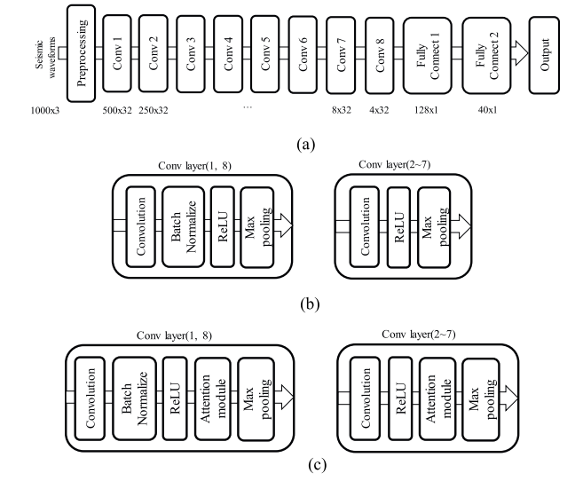

# Attention-Based Convolutional Neural Network forEarthquake Event Classification

## 摘要

&emsp;这段摘要介绍了一篇论文，其中提出了一种带有注意力模块的深度卷积神经网络（CNN），旨在提高对各种地震事件的分类性能。研究的目标是处理所有可能的地震事件，包括微地震和人工地震，以及大地震。为了成功应对这些事件，需要合适的特征表达和一个在不利条件下能够有效区分地震波形的分类器。

为了鲁棒地分类地震事件，论文提出了一种在原始地震波形上使用深度CNN和注意力模块的方法。通过代表性的实验结果，论文表明该方法为地震事件分类提供了有效的结构，并且在2016年至2018年的韩国半岛地震数据库上表现优于先前的最先进方法。

## Introduction

&emsp;这一段讨论了时间序列分析在不同领域的应用，如语音识别、金融分析、地震分析和生物信号分析。传统的时间序列分析方法通常包括特征提取和机器学习。在传统的基于特征的时间序列分析中，特征提取和参数设置是根据专家经验和实验因素进行的。然而，近年来，时间序列分析的方法已经从传统方法转向使用深度学习进行高效特征提取和机器学习。

&emsp;文中引用的 [1] 中提到了一种多尺度卷积神经网络（CNN），用于解决不同尺度上的时间序列分类问题。多尺度CNN具有一种结构，将特征提取和分类集成在一个单一的框架内，并自动提取各种尺度和频率的特征。

&emsp;[2] 中提到的CNN模型使用基于原始波形样本数据的小卷积滤波器，用于解决音乐类型分类问题，以克服帧级谱图模型存在的问题。

&emsp;在 [3] 中，提出了一种基于心电图信号的小波领域多分辨率CNN模型，用于医学工程领域的生物特征认证。

&emsp;最后，文中指出，为了增加数据表征的多样性，随机选择的样本被转换成小波空间，并在应用多分辨率一维CNN之前表示为多分辨率时频空间。

&emsp;这一段讨论了在地震分类或检测中常用的一种方法——短时平均过长时平均（STA/LTA）。该方法通过STA和LTA之间的比率来检测地震，对于大地震的检测是有效的，但在信噪比较低的环境中不太适用 [4]。

&emsp;自相关法是一种检测来自单一区域的地震的方法 [5]。虽然这种自相关方法是最有效的方法之一，但在计算上较为昂贵，对于长时间序列数据来说实际操作不太可行。为了解决自相关方法的计算负担问题，提出了模板匹配方法，该方法通过模板集和输入地震波形之间的相关分析来检测地震 [6]。这种方法的检测性能主要受到模板数量的影响，通过主成分分析来减少模板数量的方法也被提出。

&emsp;最近，提出了一种名为“指纹和相似度阈值（FAST）”的方法 [7]，该方法使用二进制指纹特征提取和通过局部敏感哈希进行相似性搜索，以降低模板匹配的计算强度。

&emsp;此外，也介绍了使用深度学习分类地震事件的各种方法 [8]–[11]。其中，Perol提出了一种使用三通道原始地震波形数据的CNN模型，类似于用于时间序列分类问题的深度学习模型 [8]。该模型的结构包括八个卷积层，卷积滤波器和非线性变换修正线性单元（ReLU），以及一个全连接（FC）层。Mousavi的模型将30秒的原始地震波形转换成谱图，将地震检测问题构建为谱图中三通道地震图的序列到序列学习 [9]。Zhu和Beroza [10] 提出了一个修改版的 U-net，具有编码器-解码器结构，以从30秒的地震波输入中挑选P波和S波的到达时间。

&emsp;在本文中，我们提出了一种基于注意力机制的CNN结构，能够实现对不同地震事件的分类。首先，我们提出了一种基于注意力机制的CNN结构，以提高对各种地震事件进行分类时的性能。注意力机制可以使特征图更具区分性，使模型能够更专注于重要的特征。在这封信中，我们提出了一种改进的注意力模块，基于对提取的特征图通道之间的相互依赖性进行建模。

其次，我们提出了一种CNN结构，其中批量归一化和丢弃技术被适当地安排用于地震事件分类。批量归一化防止输入分布在层之间的差异，而丢弃正则化抑制过拟合，潜在地增强了所提出模型的稳定性和性能。我们对其在2016年至2018年的韩国半岛地震数据上的性能进行了评估，实验结果表明，与传统算法相比，所提出的算法实现了更优越的性能。

## II. ATTENTION-BASED CONVOLUTIONAL NEURAL NET

&emsp;提出的用于地震分类的CNN结构包括三个阶段：预处理、特征提取和分类。如图1所示，特征提取阶段包括八个卷积层，其中包括有和没有注意力模块，并且分类阶段包括两个全连接层和一个Softmax函数。所提出的方法是在一个包含1000个样本的带标签的三通道原始地震波形数据集上进行训练的，这些样本使用10秒的窗口以100 Hz的频率记录。

### A. Preprocessing

&emsp;由于不同站点的地震波形存在不同的偏差，根据公式（1），我们对数据进行预处理。预处理的效果是将数据的中心几何地移动到原点。

### B. CNN Without Attention Module

&emsp;在所有卷积层中，进行了卷积、ReLU激活和最大池化操作，并生成了特征图作为输出。在卷积操作中，我们使用前一层的特征图与滤波器权重进行卷积，如公式（2）所示，然后进行非线性变换ReLU，如公式（3）所示，并进行最大池化以减小特征图的尺寸。

&emsp;在卷积层1和卷积层8中，进行了与上述描述的卷积层相同的处理过程，但它们在卷积和ReLU之间还进行了批量归一化，如图1所示。批量归一化 [12] 的设计初衷是防止内部协方差的偏移，即在每一层中输入分布和输出分布不同。研究发现，批量归一化对于深度学习中的梯度爆炸和梯度消失问题是有效的。在训练时，批量归一化首先使用每个小批量单元的均值和标准差标准化每一层的特征图，然后通过添加比例因子和位移因子来转换特征图的标准化值。由于相同的地震事件可能在每个站点以不同方式记录，应用批量归一化可以改善由于其对输入到网络的原始地震数据的归一化效应而提高的分类性能。虽然批量归一化在频谱图输入的卷积层中经常被使用 [9]，但在使用原始地震波形的地震分类任务中，它并不是一种常见的做法 [8]，[10]。为了解决这个问题，我们提出了一种用于地震分类的CNN结构，该结构将批量归一化应用于第一层和最后一层。通过最后一个卷积层后，创建的特征图通过平坦化过程转换为特征向量。特征向量输入到两个全连接层，然后使用softmax函数进行地震分类。为了防止过拟合，对于第一个全连接层应用了一种丢弃正则化 [13]，该正则化根据概率值随机激活每个神经元。

### C. CNN Structure With Attention Module

&emsp;带有注意力模块的CNN结构与上述描述的类似，但在ReLU和最大池化之间插入了一个注意力模块，如图1所示。注意力可以被解释为通过提取信号的最具信息性的组件来增强特征的手段。在从卷积层提取的特征图中计算基于重要性或显著性的注意力值之后，我们可以通过这个注意力值得到经过加权的精炼特征图。

&emsp;注意力机制主要可以分为对什么进行关注以及在哪里进行关注。在这封信中，我们提出了一种基于压缩和激励网络（SENET）[14]的改进注意力模块，它有效地表示了应该关注的内容。SENET通过对特征图通道之间的相互依赖性进行建模来提高网络的表示能力，如图2所示。SENET由两个操作组成：压缩操作和激励操作。前者在保留全局信息的同时压缩特征图，后者根据它们包含的每个通道的重要性进行自适应重新校准。压缩操作使用全局平均池化（GAP），对特征图的每个通道进行平均，而激励操作采用两个全连接层和一个带有sigmoid激活的简单门控机制。第一个全连接层是一个降维层，具有减小比例r，而第二个全连接层是一个恢复特征图通道维度的增维层。带有sigmoid激活的门控机制调节通道的相对重要性。函数“scale”指的是门控值和特征图之间的按通道乘法。

&emsp;为了改进SENET，不仅激励操作很重要，压缩操作也同样重要。在原始的SENET中，使用全局平均池化（GAP），其中通道中的所有特征值都被分配相同的权重，作为压缩操作，如公式（4）所示。然而，一种根据每个特征值的相对重要性分配权重的全局加权平均池化（GWAP）可能比GAP更好地保留特征图的全局信息。为了有效计算注意力值，我们提出了使用GWAP的两个压缩操作，如下所示的方程式：

  

## III. EXPERIMENTS

&emsp;从每个站点记录的数据以100 Hz的频率在三个通道上进行：Z轴朝向垂直，N轴朝向南北，E轴朝向西东。如图3所示，数据库集是基于24小时的连续原始地震数据和由国家地震综合信息系统（NECIS）[16]提供的地震事件目录文件构建的。图3的顶部显示了一个站点的24小时连续数据波形，底部显示了一个地震事件的示例，截取了包括P波到达之前3秒的13秒窗口。我们仅使用HH和EL类型的速度计传感器，提取显示三种事件类型的13秒窗口：大地震（2.0或更大的震级）、微小地震（小于2.0的震级）以及由地下核试验或爆破场引起的人工地震。对于噪声事件，我们通过两种方法获得仅包含地震噪声的数据集：从不包括目录事件的日期中提取随机10秒的地震噪声窗口，或者从除了目录事件之外的随机10秒的地震噪声窗口中提取。

&emsp;通常，数据增强用于增加数据集的容量，以防止过拟合并提高模型的泛化能力。我们使用窗口切片方法 [1] 对提取的数据集进行数据增强，通过在0到3秒之间以1秒的间隔滑动一个10秒的窗口，如图4所示。通过使用窗口切片方法，我们将与地震事件相关的数据集增加了四倍，而与噪声事件相关的数据集则没有应用数据增强。

&emsp;为了评估各种地震事件分类的性能，所提出的模型使用表II中总结的事件数据集进行训练和测试。我们将表I中两年（2016年至2017年）的数据集拆分为80%的训练集和20%的验证集，将表I中2018年的数据集作为测试集。在表II中，分类目标设置为“地震与噪声”，“大地震与噪声”，“微小地震与噪声”，“人工地震与噪声”，“自然地震与人工地震与噪声”。"地震"包括大地震、微小地震和人工地震，而"自然地震"包括大地震和微小地震。在表II中，加粗的数字表示测试集的数量。

&emsp;CNN结构无注意力模块的结果：首先，我们评估了没有注意力模块的提出的CNN结构的分类性能。基线方法采用ConvNetQuake [8]，它使用与我们相同的输入数据类型，详细的超参数列在表III中。我们将没有注意力模块的我们的方法（修改后的CNN）与ConvNetQuake进行了比较。表IV总结了我们的方法和ConvNetQuake的比较结果。从表IV中，我们观察到我们的方法对于所有事件分类都提供了比基线方法更好的性能。所提出的方法平均提高了3.2%的准确性，尤其是在真正例率（TPR）改善而假正例率（FPR）减少方面特别显着。人工地震事件的分类表现并不如其他事件分类那么好。这种性能下降可能归因于数据量和数据长度不足。训练数据中人工地震事件的数量明显低于其他事件。

&emsp;带有注意力模块的CNN结构结果： 为了评估提出的注意力模块的影响，我们比较了三个具有不同集成注意力模块的CNN结构的分类性能。三个带有注意力模块的CNN结构除了压缩操作之外，其他结构都相同。在注意力模块中，压缩操作使用了GAP、GWAP1和GWAP2，压缩比r设置为4。表V显示了基于注意力的CNN方法根据压缩操作的分类性能。首先，我们将表V中的结果与表IV中的结果进行比较，以查看注意力模块的效果。所有基于注意力的CNN方法都表现出比基线方法和修改后的CNN更好的性能结果。特别是，使用GWAP2的基于注意力的CNN的准确性平均优于基线方法和修改后的CNN分别4.2%和0.92%。此外，表V显示，使用GWAP1的提出的基于注意力的CNN（AM-CNN）的性能与使用GAP的AM-CNN相似，但使用GWAP2的提出的AM-CNN在所有实验中的性能均优于使用GAP的AM-CNN。与使用GAP和GWAP1的AM-CNN相比，使用GWAP2的AM-CNN的平均改进分别为0.38%和0.42%。也就是说，我们获得的最增强的注意力方法使用了包含对比度拉伸方法的压缩操作。

&emsp;基于传感器类型的注意力CNN结构结果： 最后，我们比较了基于注意力的CNN模型根据传感器类型的数据集的分类性能。在第III-B1和III-B2节的实验中，我们使用了HH型和EL型传感器训练了基于注意力的CNN模型。然而，在本节中，我们的模型只使用一个传感器类型的数据集进行训练和测试。在表VI中，第二列显示了仅在HH型传感器数据上进行训练和测试的结果，第三列显示了仅在EL型传感器数据上进行训练和测试的结果。第四列和第五列显示了在两种数据类型上进行训练，但在特定数据类型上进行测试的结果。从表VI中，我们观察到使用单个传感器类型和所有传感器类型训练模型之间的性能差异很小。由于CNN可以自动从给定的数据集中提取最优的特征集，我们的方法可以有效地处理由不同传感器类型组成的数据集。

## 总结

&emsp;本文中，我们提出了一个带有注意力模块的CNN结构，用于地震事件分类。我们首先提出了一个改进的CNN结构，采用批量归一化和丢弃操作，以处理各种地震事件和环境条件，然后通过基于新颖全局池化的SE注意力模块提高了网络的表征能力。实验结果表明，带有注意力模块的提出方法是一种有效的结构，可用于分类各种地震事件，并且在性能上优于先前的最先进方法。此外，实验结果表明，所提出的结构能够灵活地学习适用于不同传感器类型的良好特征表示。最后，提出的基于注意力的CNN结构可以有效地应用于地震主动监测系统和地震预警系统等系统。

 

