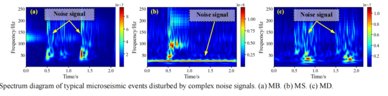
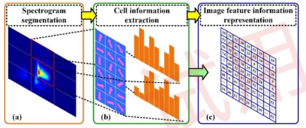
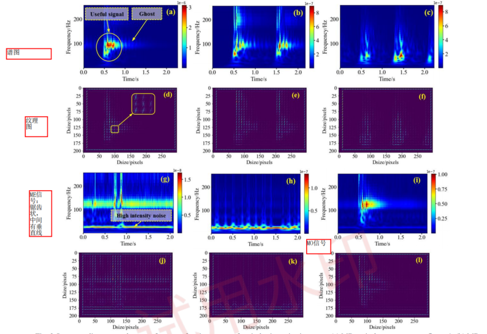
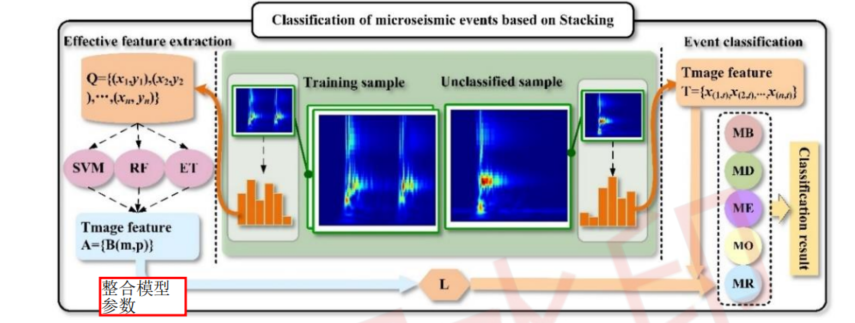
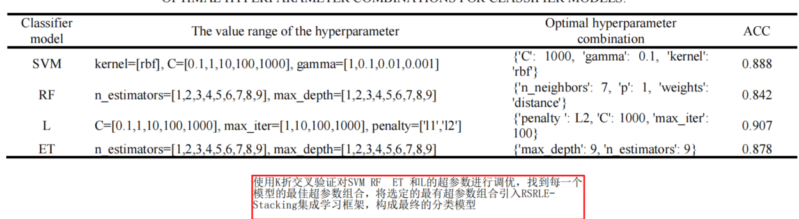
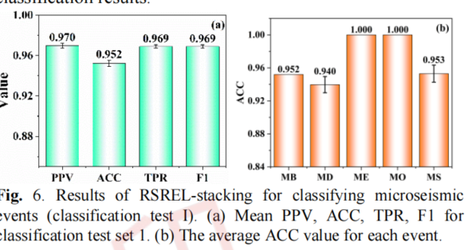
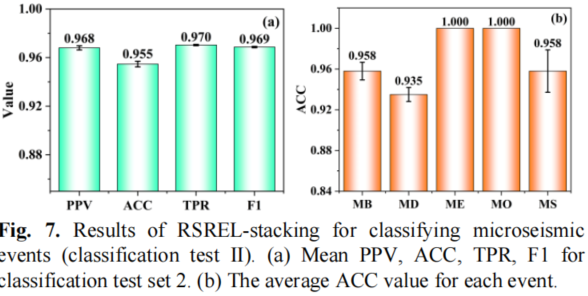

# 【论文阅读笔记】Automatic Classification of Microseismic EventsWith Similar Features and Noise Interference UsingRSREL-stacking

## 摘要

&emsp;这篇论文的摘要主要介绍了在地震监测中，对微地震事件进行自动分类的问题。为了提高微地震事件分类的准确性和效率，研究者使用了岩爆监测的微地震数据，并结合时频分析理论，分析了影响微地震事件分类的主要因素。在这个研究中，首次有效地结合了矩形-梯度直方图（Rectangle-Histogram of Oriented Gradient，RHOG）和堆叠技术，建立了一种新的堆叠集成学习模型（RSREL-stacking）用于微地震事件的分类。最后，对RSREL-stacking、深度学习模型以及其他模型的分类性能进行了测试。研究结果表明：（1）噪声信号干扰和一些具有相似特征的事件是导致事件误判率高的主要因素。 （2）RSREL-stacking能够准确区分有用信号的频谱和复杂噪声干扰，有效提取有用信号频谱的轮廓、区域和空间位置特征信息。 （3）通过不同实验证实，RSREL-stacking有效地结合了许多独立模型的优势，能够深入识别相似事件的细微差异和特征，提高了事件分类的准确性。相较于其他方法，RSREL-stacking结合了微地震事件的高效和准确分类的优势，保证了快速获取有效的灾害信息。

## I. INTRODUCTION

&emsp;这一段主要介绍岩爆（rockburst）是深层地下工程建设中的主要灾害之一，具有突发性和强烈的破坏力。作者指出使用微地震技术对岩爆进行监测和预警是深层地下工程领域的研究方向之一。微地震技术作为一种先进的监测方法，揭示了岩爆的发生机制，并通过收集的微地震信息获取岩爆的前兆信息。准确分类微地震事件是获取有效微地震信息的先决条件。长期以来，对微地震事件进行准确、高效和智能的分类一直是微地震技术研究的焦点和热点。

&emsp;这一段介绍了为了准确、高效和智能地分类微地震事件，研究者进行了大量研究并提出了一系列微地震事件分类方法。这些方法主要包括微地震参数、波形和图像分类方法。在微地震参数分类方法中，主要使用微地震参数（如微震能量、S波能量与P波能量比、拐点频率等）作为特征信息，然后将它们与分类模型结合，实现对微地震事件的自动分类。例如，Malovichko等人选择了四个主要参数作为特征数据，并成功地区分了矿井中的爆炸事件。

&emsp;这一段为后续的研究背景提供了一个框架，说明了研究者们为解决微地震事件分类问题所采取的方向和方法。

&emsp;在这一段中，提到了Vallejos和McKinnon等人[13]建立了一个基于逻辑回归和神经网络的分类模型，利用微地震参数数据成功地对爆破事件（MB）和微地震事件（MS）进行分类。尽管这些研究取得了相当大的进展，但它们不适用于微地震事件的实时处理和预警系统[14]。

&emsp;波形分类方法是一种使用获取的原始波形或处理后的波形数据作为输入特征的方法。举例来说，Esposito等人[15]使用从监测波形数据中提取的信息作为特征数据，并构建了一个监督神经网络分类模型来区分爆破和火山微地震信号。在处理噪声信号干扰方面，Zhang等人[16]引入了集合经验模态分解（Ensemble Empirical Mode Decomposition，EEMD）来分解原始信号，并选择主要的本征模态函数（Intrinsic Mode Function，IMF）作为输入特征来分类微地震事件。这种方法可以提高特征信息的有效性，但在实验过程中发现该方法耗时较长。此外，准确选择信号的主要IMFs是困难的。

&emsp;这一段提供了有关现有研究的一些具体例子，强调了这些方法的优势和局限性，特别是在实时处理和微地震事件的早期预警系统中的适用性。

&emsp;这一段提到随着深度学习技术的发展，改进的深度学习模型已经被用于分类微地震事件，例如卷积神经网络分类器和CapsNet [17]，以及包含注意力机制的卷积神经网络算法 [18]。上述方法成功地提高了微地震事件分类的准确性，但在噪声抗干扰方面较为薄弱（通常需要对输入特征数据进行去噪），并且在工程应用中对微地震事件的高效分类方面还不足够满足要求。

这一段主要强调了使用深度学习模型进行微地震事件分类的发展趋势，并指出了现有方法在噪声抗干扰和工程应用效率方面的一些限制。

&emsp;这一段介绍了图像分类作为一种方法，其使用微地震波形图像或微地震波形谱图作为输入特征。Zhao等人[19]提出了基于VGG4-CNN的分类模型，该模型对九类微地震事件进行分类，分类准确率达到94%。Song等人[20]有效地结合了S变换和CNN构建了一个新的分类模型。该模型对测试集中的事件进行了分类，准确率达到96.15%。Li等人[14]使用了包括AlexNet和VGG16在内的四个深度学习模型，对噪声、电信号、爆破和MS以及包含多个信号混合的事件进行分类。评估指标的分析结果表明，VGG16模型对微地震事件的分类准确率达到98%，呈现出最佳的分类效果。上述研究结果表明，这种方法的主要优势在于能够准确分类微地震事件，但存在两个缺点：首先，对样本图像质量有严格要求；其次，计算密集且耗时，因此无法迅速获取灾害预警信息。

&emsp;这一段提到了为了解决前述问题，考虑到深层工程环境中的噪声信号干扰，并旨在实现对微地震事件的自动、准确、高效分类，研究者建立了一个RSREL-stacking综合模型，该模型整合了特征信息的自动提取和快速事件分类。该模型引入了图像特征提取技术，增强了提取微地震事件有用特征信息的能力，同时使用Stacking综合技术构建更强大的分类器，增强了对事件详细特征的学习能力，提高了具有相似特征的事件分类的准确性。此外，进行了不同的微地震事件分类实验，比较分析了六个模型（包括VGG16）的分类结果，使用准确率（ACC）、正预测值（PPV）、真正例率（TPR）、F1分数、运行时间和吞吐量等指标来验证提出的新综合模型的分类性能。

## II. ENGINEERING BACKGROUND AND DATA SOURCES

&emsp;这一段介绍了研究所使用的微地震信号数据来自中国湖北省西部宜昌市的一个磷矿。该矿的初步设计年产量为80万吨，采用房柱法进行采矿。在采矿深度超过400米时，可能发生轻微的岩爆。当采矿深度超过550米时，岩爆情况明显加剧，并出现屋顶脱落等问题。

&emsp;这一段说明为了揭示岩爆的发生机制，以及实时监测和提供岩爆预警，该矿在130中巷附近安装了一个微地震监测系统，用于监测微地震事件。该系统的软件设置了五种类型的事件，分别是MB（爆破事件）、MS（微地震事件）、螺栓钻孔事件（MD）、电信号噪声事件（ME）和另一个事件（MO），即未知事件可能是MB、MS、MD、ME和MO中的一种。

## III. FEATURE EXTRACTION

### A. Feature Extraction Method

&emsp;这一段描述在岩爆监测中，微地震系统对收集的微地震信号进行去噪。由于随机噪声与微地震事件的有用信号共享相同的频带，无法完全去除[21, 22]。如图1所示，去噪后的微地震信号仍然包含噪声信号，这导致微地震事件谱图中出现幽灵或生成额外的清晰频谱，干扰了有用信号特征的提取。此外，一些不同类型的事件在其特征上存在细微差异，例如MB和MS，这影响了微地震事件的分类。因此，需要开发一种方法，既能够区分噪声信号，又能够提取有用信号的详细特征，以支持后续微地震事件的准确分类。

&emsp;这一段介绍了在计算机视觉领域中，R-HOG（矩形-梯度直方图）是一种用于图像特征提取的强大技术[23]。特征提取的原理如下：首先，将图像分成多个块，然后将每个块细分成多个矩形单元；接着提取单元边缘的结构特征（梯度），以反映局部区域的形状信息，并增强识别和提取图像详细特征信息的能力。光学信息用于区分图像信息，丢弃或减弱不相关的特征信息（噪声信号）。最后，将每个单元的特征信息组合起来完成图像特征提取。由于微地震事件谱图是矩形的，因此可以使用R-HOG对谱图进行完全分割。总的来说，这种方法能够精细提取图像信息，抵抗噪声，适用于提取微地震事件的特征。

  

### B. Event Feature Extraction

&emsp;这一段描述了基于R-HOG的微地震事件谱图图像特征提取的过程，图2展示了这个过程的示意图。在这个方法中，模型首先对谱图进行分割预处理。如图2(a)所示，通过重叠分割，图像被划分为3×3的单元，每个单元再细分为6×6的像素。在分割的重叠方法中，单元相互重叠，保障信息的完整性。然后，逐个获取每个像素的大小和方向进行统计，生成直方图，即获得与像素相同维度的一组向量（如图2(b)所示）。最后，将所有单元的向量拼接在一起形成表征图像特征的向量矩阵，如图2(c)所示

  

&emsp;这一段描述了为了充分了解不同类型事件的特征，从2022年9月26日到10月29日收集的微地震事件进行了统计。图3展示了各种典型微地震事件及其纹理特征的谱图。从形态特征的角度进行分析，可以看到ME信号呈锯齿状，在谱图中有一条垂直条（图3（g）），MO的有用信号谱位于图像底部，呈周期性波动，其频率范围较窄（图3（h））。由此可见，ME和MO的谱特征是独特的，与其他类型事件的差异显著且易于识别。MB、MD和MS的一些事件谱特征相似，存在相互干扰。例如，图3（a）和图3（i），图4（b）和图4（c）。此外，微地震信号混有噪声。在图3中，各种类型事件的谱中包含大量的幽灵，这些幽灵是由低能量噪声产生的，可以使有用信号的谱形变和模糊，从而影响事件分类。高能量的噪声信号也会生成清晰的谱，如ME（图3（j）），这会干扰事件的识别。

&emsp;这一段说明使用R-HOG技术提取了每种微地震事件的谱特征。R-HOG提取的是图像的纹理特征。为了评估提取的纹理特征信息的有效性，使用可视化方法进行了表示。在图3中，事件纹理特征图提供了一个典型事件谱图提取的纹理特征信息的视觉呈现。通过比较和分析典型事件纹理特征图和谱图，发现对于不同类型事件，外部边界发生变化，谱特征图和纹理特征图的局部有用信号形状特征高度相似，表明R-HOG技术能够准确提取微地震事件谱的轮廓和区域特征。有用信号的谱和纹理特征在图中具有相同的平面空间位置，表明R-HOG技术还能有效提取微地震事件谱的空间位置特征。形状和空间位置特征可以反映事件的频率分布范围、持续时间和能量强度信息。此外，与幽灵图像对应的区域没有纹理，或者纹理模糊，而与强信号对应的纹理清晰明显。这表明R-HOG技术利用光学信息来区分图像颜色特征，丢弃或减弱噪声信号的特征信息。当有用信号强度较低且噪声信号强度相对较高时，R-HOG还会提取噪声信号的特征信息。然而，在实验过程中，发现这种特征信息主要集中在ME事件中，并且对事件分类影响较小。

  

## IV. MICROSEISMIC EVENT CLASSIFICATION MODEL CONSTRUCTION

### A. Classification Method

&emsp;这段文字指出，具有相似特征的事件是导致分类准确度降低的主要因素之一，尤其是当这些事件之间存在细微差异。为了提高对具有相似特征事件的分类准确度，建立一个强大的模型以深度学习事件的微小特征是至关重要的。

&emsp;这段文字介绍了集成学习，是一种有效地将多个弱学习器结合成一个强大学习器的技术。集成学习是机器学习领域四个主要研究方向之一[24]，在不同领域广泛应用。其中，Stacking是一种异构集成学习技术，改变了不同模型相互独立的劣势，可以充分整合每个模型，以最大化每个模型的性能[25]，[26]。在文本分类、岩爆趋势分类等应用领域，Stacking表现出有效性、适用于复杂数据、强解释性，并成为融合领域中的实用先驱方法。因此，它适用于对微地震相似特征事件进行分类。

&emsp;这段文字描述了为了准确高效地分类微地震事件，引入了多个机器学习分类器在Stacking集成框架中，以构建一个强大的微地震事件多分类集成模型。该模型主要由基础模型层和元模型层组成，其分类过程包括两个阶段：

基础模型层阶段： 集成模型首先使用多种不同的策略通过基础模型层提取原始数据。R-HOG从图像特征中提取了大量的原始数据，而在这个阶段通过使用多个模型提取信息，可以使冗余的特征数据变得简练，同时保证特征数据的多样性和有效性。这简练、多样且有效的特征数据能够有效避免模型过拟合，提高模型的操作效率。

元模型层阶段（Stacking阶段）： 在第二阶段，Stacking使用元模型调用新的特征矩阵进行训练，从而对微地震事件进行分类。元模型在这里起到整合基础模型层输出、学习其组合规律的作用，使得整个模型更适应微地震事件分类任务。

### B. Classification Model Construction

&emsp;这一部分描述了RSREL-stacking分类模型的构建过程。根据之前的研究[22]，在微地震事件分类方面，支持向量机（SVM）[27]，[28]、随机森林（RF）[29]、逻辑回归（L）[30]、决策树（ET）[31]等机器学习模型表现出色。因此，为了建立一个综合的RSREL-stacking模型，引入了R-HOG、SVM、KNN、L和ET进入Stacking框架。为了避免过拟合，SVM、RF和ET被用作基础模型，而L被用作元模型。如图4所示，RSREL-stacking对微地震事件进行分类的具体流程如下：

* 数据准备： 首先，准备微地震事件的数据集。

* 特征提取： 利用R-HOG技术从微地震事件的谱图中提取纹理特征。

* 模型构建： 引入SVM、RF、ET作为基础模型，L作为元模型，构建RSREL-stacking模型。

* 基础模型训练： 使用SVM、RF和ET对原始数据进行训练，学习模型参数。

* 特征整合： 将基础模型的输出结果整合为一个新的特征矩阵。

* 元模型训练： 使用元模型L对整合后的特征矩阵进行训练，学习元模型的参数。

* 模型评估： 对RSREL-stacking模型进行评估，检查其在微地震事件分类任务上的性能。

这个RSREL-stacking模型的设计考虑到了不同模型之间的协同作用，通过整合多个模型的优势，提高了对微地震事件进行分类的准确性和鲁棒性。

  

&emsp;这段文字讨论了超参数调优在模型构建中的重要性。研究中采用了基于网络搜索算法和K折（K=10）交叉验证算法的超参数调优模型。具体过程如下：

超参数遍历： 超参数的值按照循环方式逐个调用，然后将这些值输入机器学习模型。

K折交叉验证： 将机器学习模型与K折交叉验证算法结合使用，计算分类准确度。K折交叉验证将数据集分为K个折（子集），依次使用其中K-1个折作为训练集，剩下的一个折作为验证集，进行K次训练和验证。

性能评估： 记录每组超参数对应的分类准确度。

迭代调优： 通过上述步骤逐渐调用下一组超参数，直到最后一组超参数。

选择最优超参数： 最终，通过对分类准确度的评估，选取具有最佳性能的超参数组合作为最优超参数。

这个过程保证了在模型构建中选择了最适合任务的超参数组合。超参数调优的目标是找到一组能够在给定任务上表现最好的模型配置，以提高模型的性能和泛化能力。在这个研究中，准确度被作为评估指标，以选择最优的超参数组合。

  

## V. FIELD DATA APPLICATION AND MODEl PERFORMANCE EVALUATION

  

  

&emsp;SREL-stacking的PPV、ACC、TPR和F1，以及MB、MD和MS的分类ACC都高于R-RF、R-SVM、R-ET和R-L；而ME和MO的分类ACC与R-RF、R-SVM、R-ET和R-L相同，都为100%。这表明RSREL-stacking的功能强大，提高了对相似特征事件的分类准确性，增强了细致识别事件特征差异的能力，并具有良好的整合效果。值得注意的是，R-RF、R-SVM、R-ET和R-L在分类MB、MD和MS方面的能力存在差异，例如，R-ET在识别MB方面表现较差，但在识别MS方面表现出色。在MB的分类结果中，R-ET的ACC为0.788，比R-RF、R-SVM和R-L分别低10.5%、13.9%和9.6%；而RSREL-stacking的ACC最高（0.955）。这主要是由于R-RF、R-SVM和R-L在识别MB方面的优越能力，提高了RSREL-stacking对MB的综合识别精度。在MS的分类结果中，R-ET的ACC为0.947，比R-RF、R-SVM和R-L分别高3.8%、4.5%和6.2%；而RSREL-stacking的平均ACC为0.958。这表明R-ET对RSREL-stacking全面识别MS做出了最大贡献。可以得出结论，整合模型能够集成独立模型，充分发挥R-RF、R-SVM、R-ET和R-L的优势，并提高微地震事件分类的准确性。此外，RSREL-stacking分类事件结果的标准差较小，表明具有较高的分类稳定性。

&emsp;显示了五个模型在测试集中预测事件类型所消耗的总时间，包括谱图调用、特征提取、模型训练和模型分类的时间。如图10所示，RSREL-stacking比子模型消耗更多的总时间来对微地震事件进行分类，这是因为集成模型更为复杂，导致计算量更大，耗时更长。然而，整合模型消耗的时间远远小于子模型消耗时间的总和。此外，从理论上讲，由于使用了复杂的非线性变化来提取特征，整合模型更容易出现过拟合

&emsp;使用VGG16对测试集1和测试集2的微地震事件进行分类。图11和图12展示了VGG16分类结果的均值和标准差。如图11(a)和图12(a)所示，两次分类测试的结果显示，RSREL-stacking对MB和MS的平均ACC值大于VGG16，这意味着RSREL-stacking对于识别MB和MS的能力更强。VGG16对MD的平均ACC值比RSREL-stacking大0.01，表明VGG16和RSREL-stacking在识别MD方面具有类似的能力。从图11(b)和图12(b)中可以看出，RSREL-stacking的PPV、ACC、TPR和F1平均分别比VGG16高0.023、0.029、0.019和0.021。这证明了新的整合模型能够准确分类各种类型的微地震事件，其分类准确性优于深度学习模型VGG16。

&emsp;在这项研究中，使用RSREL-stacking进行了多分类测试，而基于L的微地震参数方法仅进行了二分类测试，这是由于微地震数据的不足。由于深层地下建设环境的复杂性，很难区分一些具有相似特征的不同类型的微地震事件（不仅限于MB和MS）。因此，在多类型事件中准确区分MB和MS更加困难。其次，通过从图6和7中计算，RSREL-stacking对MB和MS进行分类的平均准确率为95.5％，而基于L的微地震参数方法的平均准确率为93.2％（表III）。RSREL-stacking具有更高的分类准确度。就分类效率而言，通过从表III中计算，基于L的微地震参数方法需要0.01秒来分类一个事件，而RSREL-stacking需要0.428秒。显然，基于L的微地震参数方法具有更快的分类效率。

## VI. CONCLUSIONS

&emsp;这项研究旨在解决微地震事件分类中的挑战，其中包括噪声信号和相似事件导致的误分类。为此，研究引入了一种名为RSREL–stacking的综合模型，旨在提高分类准确性，尤其是对于复杂噪声和相似事件的处理。

&emsp;RSREL–stacking模型结合了R-HOG特征提取方法和多个机器学习分类器，包括支持向量机（SVM）、随机森林（RF）、逻辑回归（L）和决策树（ET）。该模型包含基本模型层和元模型层，通过超参数调整和交叉验证以优化性能。

&emsp;研究发现，RSREL–stacking模型在微地震事件分类方面表现出色，准确性高于单个模型（如SVM、RF、ET和L），甚至超过深度学习模型VGG16。该模型在识别相似特征事件方面取得了更好的准确性。

&emsp;尽管RSREL–stacking模型在总体分类时间上略高于VGG16等子模型，但其吞吐量（单位时间内分类的事件数）显着更高，表明其效率更高。

&emsp;研究还将RSREL–stacking模型的分类性能与基于普等人的微地震参数方法进行了比较。尽管后者在分类效率上稍微领先，但RSREL–stacking模型在准确性上更为出色。

&emsp;综合而言，RSREL–stacking综合模型在解决微地震事件分类挑战方面表现出很大潜力，特别是在处理噪声、相似事件和及时生成灾害前兆信息方面。

&emsp;在来自湖北西部的磷矿中收集的五类微地震事件中，ME和MO的谱特征与其他事件明显不同，因此它们很容易区分。MB、MD和MS的特征相似，这是导致微地震事件低分类准确性的重要原因。此外，噪声信号可能导致微地震事件谱中的幽灵或清晰光谱，干扰事件的分类。

&emsp;提出了一种使用R-HOG提取谱图图像信息的微地震事件特征提取方法。通过基于光学信息识别图像颜色特征，该方法能够在复杂噪声信号干扰下准确区分微地震事件的有用信号谱，精确提取有用信号谱的轮廓、区域和空间位置特征信息。

&emsp;与R-RF、R-SVM、R-ET和R-L相比，RSREL–stacking在PPV、ACC、TPR和F1方面展现出良好的整合性能。这表明RSREL–stacking充分结合了四个独立模型（RF、SVM、ET和L）的优势，提高了识别事件细节特征的能力，有效降低了类似特征事件的误判率。

&emsp;基于湖北西部磷矿的微地震事件监测原始数据，进行了微地震事件的自动分类研究。研究结果表明，RSREL-stacking能够在噪声干扰下有效地对类似特征的微地震事件进行分类，尤其是MB和MS。与VGG16和基于L的微地震参数方法相比，RSREL-stacking结合了对微地震事件高效准确分类的优势，足以提供及时获取有效的灾害前兆信息。

