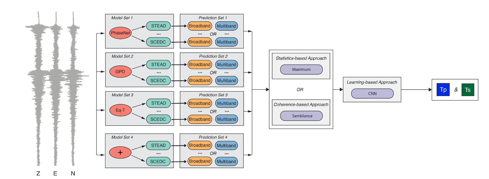
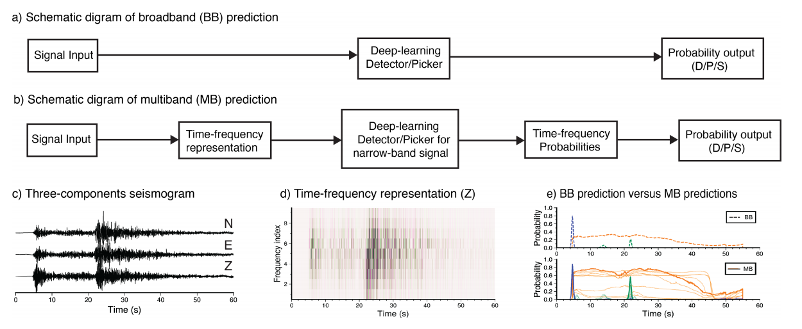
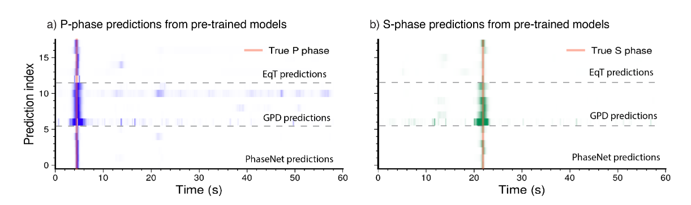
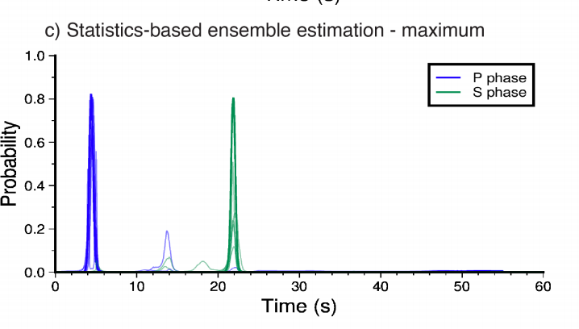
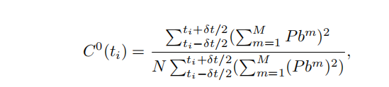
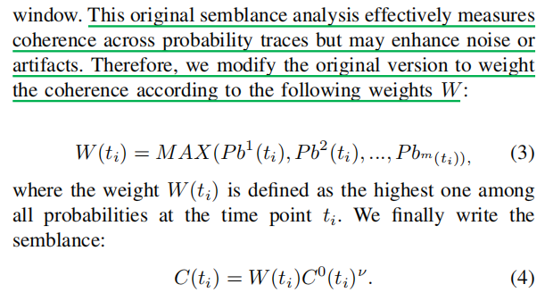
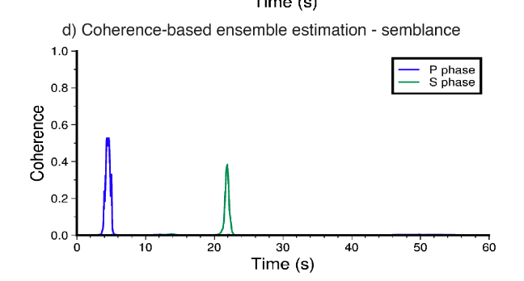
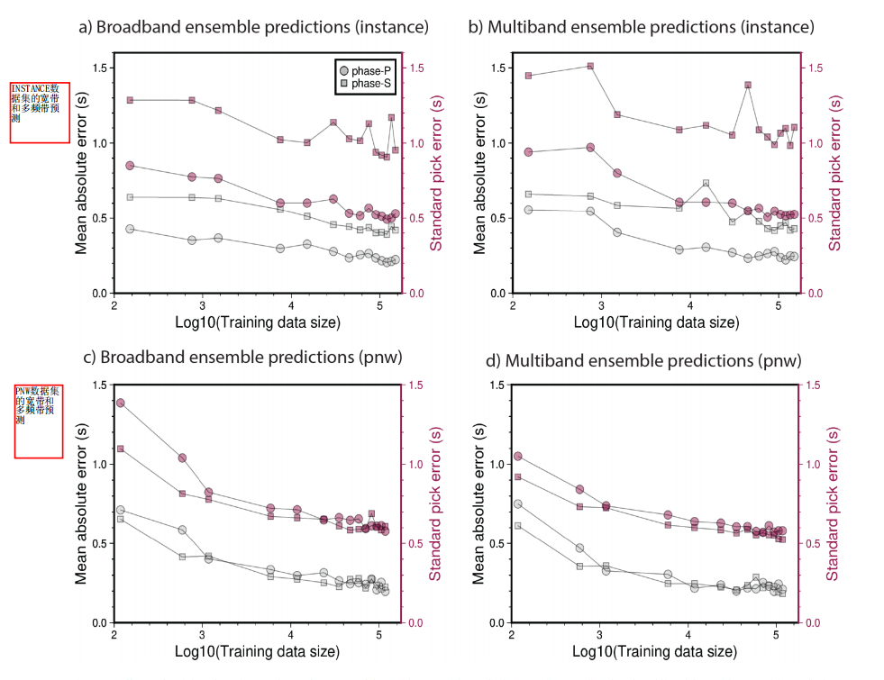
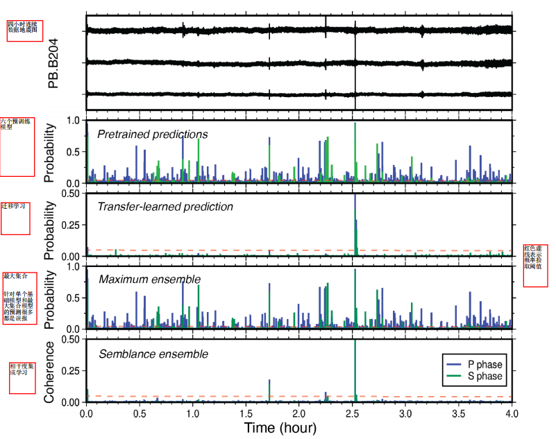

# 【论文阅读笔记】Better Together: Ensemble Learning for Earthquake Detection and Phase Picking

## 摘要

* 深度学习对地震波的检测与拾取显示出比较好的能力，但是收到低信噪比的影响，阻碍泛化能力和性能
* 本文提出一个新的处理工作流程，增强了算法的泛化能力
  * 预训练深度学习模型：这些模型已经在大量的数据上进行训练
  * 多频带预测：表明在不同频带上进行预测，可以提高波浪检测的准确性
  * 集成估计：集成方法将多个模型的预测组合在一起，以生成最终的预测，这可以增强算法的泛化能力
* 本文使用三个基准数据集测试集成模型的性能，一个是域内，用于训练深度学习模型，另外两个是跨域测试数据集
* 将集成方法和迁移学习方法进行比较，集成学习的泛化能力提高显著，从而在不存在标记数据集的情况下减轻迁移学习的需要

## INTRODUCTION

* 地震波形特征来自自动筛选地震事件
* 震相到时来进行地震定位
* 传感器技术的发展是的地震数据海量增加
* DL技术主要是从连续地震数据中提取特征，自动化的表征地震源的性质
* 相位选择可以认为是一个监督学习的问题，需要从大量的标记数据集中从0开始训练
* 目前有几个流行的相位拾取器，GPD,PhaseNet,EqTransformer,Siamese EqTransformer,DPP,ARRU 
* 许多基准数据集：scEDC,STEAD,lquique,lendb,neic,instanc,DiTing,pnw,DeepBlue
* SeisBench 用于互操作的机器学习模型和基准数据集，以及对这些不同模型的用户友好访问
* 不同的数据集或者不同的DL模型的跨域性能差别比较大，这表明泛化能力相当有限，模型设计可能影响模型在给定数据集上面的性能
* 研究人员采用多个复杂的多个顺序深度学习模型的工作流
* DL模型在不同的数据集上的训练有不同的性能
* 本文提出：
  * 利用训练数据集的多样性来提高深度学习在地震监测和相位拾取的能力
  * 研究采用集成学习方法，采用多个窄频带版本的地震数据进行预测
  * 同时，探索了不同的集成技术 提高泛化能力

### 多个模型组合工作流

* 集成学习：集成学习方法通过将多个模型的预测结果结合起来，以获得更准确的预测。常见的集成方法包括投票法（Majority Voting）、加权投票法、堆叠法（Stacking）等。在地震相位拾取中，可以让多个模型独立进行预测，然后根据它们的预测结果来做出最终的决策。

* 级联模型：在级联模型中，多个模型按照一定的顺序排列，其中一个模型的输出作为下一个模型的输入。这可以用于逐步提炼特征或进一步筛选结果。例如，一个模型可以用于初步的相位拾取，然后另一个模型可以在前一个模型的输出上进一步细化。

* 注意力机制：注意力机制可以用于加权不同模型的输出。它可以根据每个模型的性能和置信度来调整它们的权重，以获得更好的整体性能。

* 模型融合：模型融合可以将多个模型的参数结合在一起，从而创建一个更强大的模型。这通常需要更复杂的技术，如迁移学习或联邦学习。

* 深度神经网络的组合：在深度学习中，可以使用多个神经网络层构建一个深度神经网络，每个层具有不同的功能。这被称为深度神经网络的堆叠，其中每个层在前一个层的输出上操作。

### 关于迁移学习

* 迁移学习是在新的标记数据上继续训练机器学习模型的步骤，需要对模型权重进行微调以提高性能
* 迁移学习通常需要一个标记的数据集，这使得在没有相位到达时间先验知识的情况下应用于数据集是不切实际的
* 训练数据的质量和多样性，训练性能仍然存在局限性，在这些情况下，对于没有大型和多样化数据集的情况，迁移学习模型的性能可能不会得到显著改善
* 为什么迁移学习的效果受到数据集的规模和多样性的限制
  * 数据偏差：如果训练数据集相对较小或者不够多样化，那么模型学习到的信息将受限于不同的情境和变化条件，这将导致模型在新数据的新能受到训练数据的偏差影响，因为模型没有足够的多样性来应对不同的情况
  * 缺少泛化能力：模型没有见过多样性的情况，他可能没法适应新数据中的变化，因此不能再不同的情境下表现良好
  * 不同地区和条件的变化:地震数据可能因为地理位置 低质条件 和检测设备的不同而有很大的变化，如果训练数据不包括多样性的地震事件和条件，模型可能没办法正确处理新的地震数据

### 总结

* 旨在使用多样性的训练数据集，提高深度学习在地震监测和相位拾取方面的性能和泛化能力
* 采用了集成学习的方法，通过对多个窄频带版本的地震数据进行预测
* 探索了多种不同的集成技术，如最大值、相似性和元学习，以比较相位拾取性能，研究在领域内和跨领域数据上进行了测试，将结果和一个迁移学习模型进行了比较，以评估模型的性能，最终，研究将相位拾取模型应用于连续数据，结果显示虚假检测率显著降低
  

## METHODOLOGY

### 集成学习地震预测

* 开发了一个框架
* 1 多个单独的模型预测
* 2 聚合多个模型预测

#### 第一个组件

* 利用基于DL的模型来预测在多个数据集上训练的输入三分量地震图，该框架可能包括多个模型架构，每一个模型架构都可以在不同的数据集上进行训练，用于具有不同的神经权重的预训练模型
* 我们将具有不同架构或者预训练权重的DL模型称之为基础模型，我们在原始数据（宽带）或过滤数据上应用单个基础模型，以生成对相同输入地震图的多个预测，感兴趣的预测是输入地震数据中P相位或者S相位两个时间序列概率

#### 第二个组件

* 顺序集成估计
* 聚合所有预测以获得P和S的最终到达时间

### Part I: Broadband and multiband prediction workflows

宽带和多频带预测工作流程

* 基本模型通常用于解决分类问题
* 接受长度为6000 的三分量地震波行作为输入数据，并且输出三个通道，分别用于检测地震、P相位和S相位的时间序列概率
* 基本模型已经经过不同频谱内容的数据集进行了训练
* 原始数据集中存在的噪声会影响模型的性能，比如STEAD数据集中添加地震台站附近的地震噪声将有助于深度神经网络更好地识别地震信号，这表明数据的噪声特性对于训练和性能的影响很大

#### 宽带预测

* 第一种工作流程直接使用宽带（1-45hz）地震波作为基本模型的输入，然而这种方法对噪声敏感，特别是对于低幅度信号或者低震级的地震，为了减轻这个问题，研究开发第二个预测工作流程，基于多频带
* 多频带（MB）预测，与宽带预测相比，多频带预测增加了两个步骤，首先信号被分解为多个频带，基于小波的变换或者s变换来实现，但是计算成本比较高，这里采用Poiata提出的递归多频带滤波MBF方法，这是一种有效的选择，用于实时地震监测中的地震相位拾取

* 实际操作
  * 研究对数据进行了十个频带的滤波
  * 每个滤波之后的信号被输入深度学习模型以进行个别的预测
  * 宽带预测使用的深度学习模型在多频带中也可以直接适用，而无需设计新的深度学习模型
  * 对于MB预测，进行了十次类似于宽带的预测，原始的Eqtransformer模型的每次预测都生成了三个通道的时间序列输出，包括地震监测概率，P拾取和S拾取概率
  * 在多频带工作流程中，每一个前向模型都生成了十次预测，首先，我们通过选择每个输出中概率最高的给定预测结果（粗线），进行了第一层的聚合，这部分最佳输出

  

&emsp;研究通过在不同频带上对数据进行滤波，利用相同的深度学习模型进行预测，以实现宽带和多频带的预测。在多频带工作流程中，每个前向模型生成了多个预测，然后从中选择概率最高的预测，形成最佳输出，以进行进一步的聚合。这种方法允许更好地平衡了计算效率和预测效果

&emsp;在图2e中，展示了宽带（BB）和多频带（MB）预测的比较。即使在图2c中显示的简单明显的示例中，最佳多频带（MB）预测（粗线）具有更高的概率，并且保留了从这些概率时间序列的时间宽度推断出的个别预测的准确性。多频带滤波（MBF）提供了数据的更多表示，其中一些可能更符合经过训练的深度学习基本模型。从这个实验中，我们可以得出结论，MBF增强了深度学习模型对多个信号变换的预测的信心。这表明MBF可以提高模型对多样性数据的信心，从而提高了预测的可靠性。

  

### B. Part II: Ensemble estimations and predictions

&emsp;聚合来自多个基本模型的预测，将他们视为集成，并将它们组合起来以改进预测，我们忽视一些模型输出的检测分支，专注于P和S到达时间的选择

* 开发了三种独特的集成方法进行集成估计：基于统计的、连贯性、基于学习的方法
* 十八种预训练模型：三种网络 六种数据集

  

#### 基于最大值的集成器

* 对于基于统计的集成估计，我们通过应用最大函数来识别概率最大的预测，这个过程是针对P和S相位独立进行的
* Pb是P或者S预测概率轨迹，MaX是最大算子，也就是找到所有模型概率最大值的索引，这个索引就是P或者S波到达时刻的那一刻的采样点

  

#### 基于相干度的集成学习

* 获取多个预测结果：首先，多个预测模型或方法被用于对相同的地震波形进行预测。每个模型都会生成概率或决策的时间序列，例如P-相位和S-相位的到达时间的概率
* 计算相干度：接下来，对于每个预测结果，计算其与其他预测结果之间的相干度。相干度通常是通过比较两个信号之间的波形相似性来计算的。高相干度表示两个信号在某些方面相似，低相干度表示它们不太相似。
* 合并预测结果：最后，根据相干度的计算结果，选择具有高相干度的预测结果来生成最终的概率或决策。这样做的目的是利用多个模型之间的一致性来提高预测的准确性和可靠性。如果多个模型都产生相似的结果，那么可以更有信心地采纳这些结果
* 合并预测结果：最后，根据相干度的计算结果，选择具有高相干度的预测结果来生成最终的概率或决策。这样做的目的是利用多个模型之间的一致性来提高预测的准确性和可靠性。如果多个模型都产生相似的结果，那么可以更有信心地采纳这些结果

&emsp;基于相干度的集成估计方法有助于消除单个模型可能出现的误差或偏差，因为它考虑了多个模型之间的一致性。这在地震相位拾取等任务中特别有用，因为地震数据可能会受到噪声和其他干扰的影响，多模型集成有助于提高对地震相位的准确性。此外，相干度分析通常是计算高效的，适用于大规模数据处理

* 计算ti时间点，所有模型的概率之间的一致性系数
  

* 一致性分析会受到噪声的干扰，引入权重W进行调整
  

**总结一下：**

* 1. 获得多个模型预测结果
* 2. 计算相干度，比较预测结果之间的相干度，高相似性表示两个信号在某些方面具
有相似性
* 3. 合并预测结果，最后根据相干度的计算结果，选择具有高相干度的预测结果来提高预测的准确性和可靠性

  

#### 局限性

* 集成最大值方法仅仅选择最大概率，因为对最高概率比较敏感，虽然实验效果不错，但是容易出现比较大的拾取误差
* 集成相似度方法，虽然优先考虑概率一致性，但是通常在拾取准确率做出妥协

### 元学习集合

* 超参数：概率阈值，用户决定选择阶段的概率阈值
* 相位选取是一个回归问题
* 基本模型用于解决分类问题：输出的是三个具有概率时间序列的通道
* 元学习器旨在提高模型的性能和准确性，已解决之前提到的概率预测方法存在的限制

&emsp;在这个方法中，对于每个地震波形，有六个基本概率预测，以及从先前的基本预测中截取的20秒（2000个时间样本）的概率预测。每个层次的维度如图3e所描述。为了处理P和S相位的预测，研究创建了两个独立的模型，以分别处理P相位和S相位，避免模型学习P和S之间的相对时间（例如，地震的位置）。元学习器的输出是一个表示从波形开始以来的旅行时间的单一标量值，可以是Tp或Ts，分别表示P相位或S相位的到时。这个值表示了相对于波形开始的时间。这个方法旨在提供更精确的到时预测，同时减少了模型学习相对时间的需求

* 元学习步骤
* 首先使用集成学习获得结果裁剪输出预测（附近20S）将裁剪之后的时间序列作为
输入，元学习根据这些时间序列，来确定最后的拾取结果

### III. PERFORMANCE OF ELEP FRAMEWORK

* 针对六种预训练模型以及相关阈值设置
* 最大值集成器：P 0.1 S 0.05基于相干度集成器： P 0.05 S 0.05
* 数据预处理：数据时间长度60S, 带通滤波：1-45hz，对于单通道数据，直接把其他两个通道填充为0
* 性能指标：预测和标签之间的算术平均值（偏差）和标准差
  

#### 使用INSTANCE数据集进行测试

* 选择INSTANCE数据集：根据信噪比分成十五组，从每组再选15000数据
* 比较宽频带和多频带数据的预测：域内数据进行测试，表现良好因为测试的宽频带数据可能与EQT训练数据重叠。多频带效果好一点
* 多频带预测增加误差，作者归因于基本模型的性能问题
* 跨域检测ethz、neic、instance表现良好，因为有重复数据其他三种表现比instance差，但是SNR大于10之后好一些
* 低阈值带来高检测率和拾取率，但是质量比较低
* 宽频带预测对阈值敏感，多频带预测相对不敏感
* 六种预训练模型和集成学习的方法来获得震相拾取结果，强调在低信噪比的情况下模型预测的不确定性以及最大值和相干度模型的性能，
* 集成最大值方法多频带工作流都是一种增加检测率和拾取率，但是牺牲准确率的一
种方法
* 基于相干度的集成学习方法更加依赖于预测值之间的一致性，不是概率最大值
* 最大集成方法检测率提高，但是有许多错误检测，几秒的误差意味虚假到达

#### 使用PNW数据集测试

* 使用PNW数据集来测试模型的泛化能力
* 使用PNW数据测试各个单独模型，随着信噪比的提高，性能提高的不是很显著
* 多频带检测能够带来性能上面的提升
* 比较集成学习模型和迁移学习模型，最大或者集成学习模型提高了更高的拾取率，但是误差增大很多
* 相比于迁移学习，相关性集成模型在拾取准确性更好，跨领域的泛化能力更好
* 基准测试：集成学习方法和迁移学习方法一样有效
* 集成学习只需要很少的数据就可以表现出很好的性能

  

#### 海底OBS数据测试

* 海洋噪声对地震信号有较大的干扰
* 相干度集成学习在拾取的准确率表现得更好，虽然最大值集成拾取数量更多，但是准确性不好

#### 部署在连续数据

* 预处理：重采样到100hz带通滤波：1-45hz数据切分：60s,重叠50%，总共得到479个窗口波形
* 基于连续数据的测试产生了许多高概率的拾取结果，但是存在一些错误拾取
* 相似度集成学习模型和迁移学习模型表现最佳，前者更加稳健
* 相似度学习相比于迁移学习能持续检测
* 多频带预测需要对每个窗口波形进行十次预测，因此计算成本更高
  

### 讨论

* 1：基于多频带为每个预训练模型成基准的地震事件检测和震相拾取预测
* 2：基于集成学习的方法基于相似度的集成学习方法更加准确和稳健
* 计算成本高：多频带预测计算成本高，随着频带数量和选的基础模型数量大幅度增加权衡性能：基于相似度的集成方法很好的平衡

* 数据多样性改善性能
* 集成学习的潜力
* 数据比模型复杂度重要
