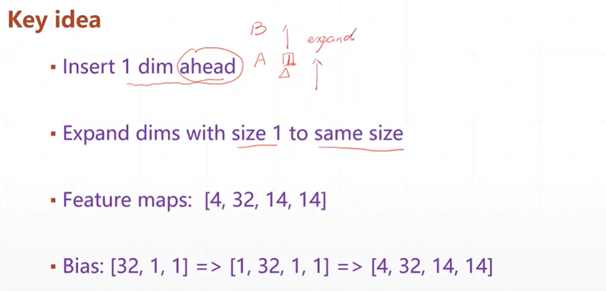
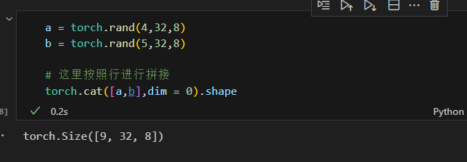
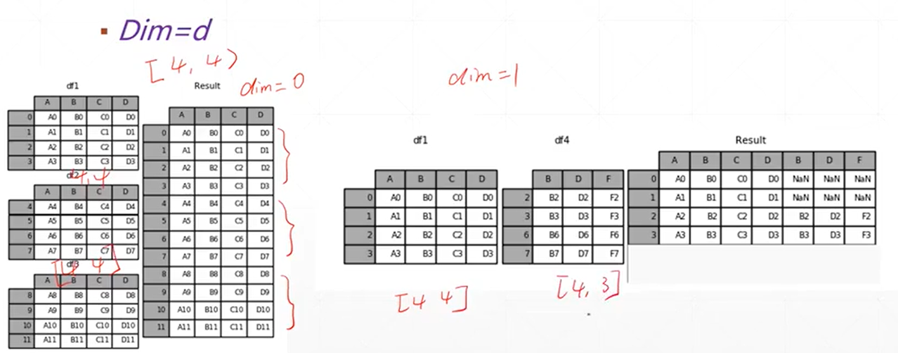
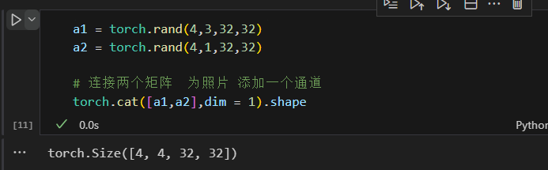
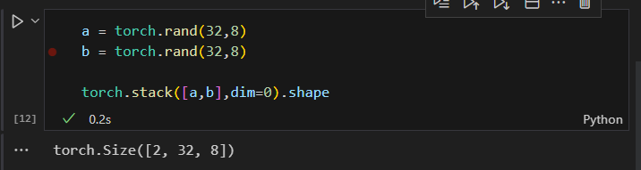
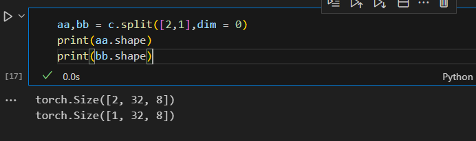

# pytorch合并拆分运算

## 简述

* 如果维度少了直接添加一个维度
* 如果每一个维度的偏少，直接扩展每一个维度的元素数量

  

## Cat合并操作

  

  

**cat操作的维度必须是一致的，只能有一个维度不一样（拼接的维度），但是其他的维度都必须是一样的**

**案例：为一张RGB照片再添加一个通道变成四通道**

  

## stack-插入新的维度操作

**stack操作两个张量的维度必须全部保持一致**

  

**stack操作是创建一个新的维度**

## splict拆分操作

**第一个参数是拆分的尺寸，第二个参数是拆分的维度**

  

