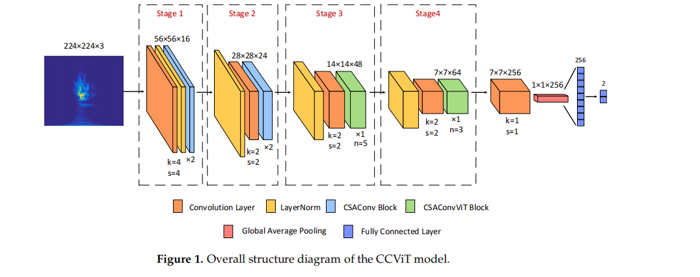
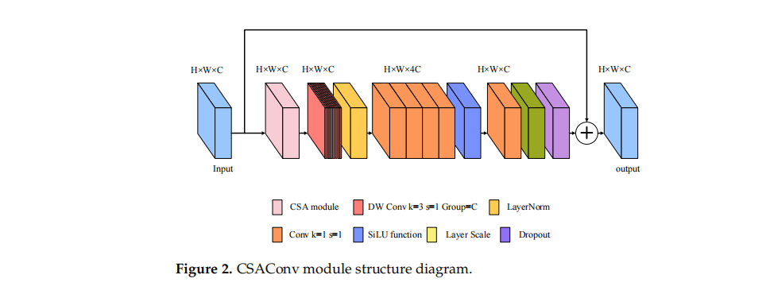
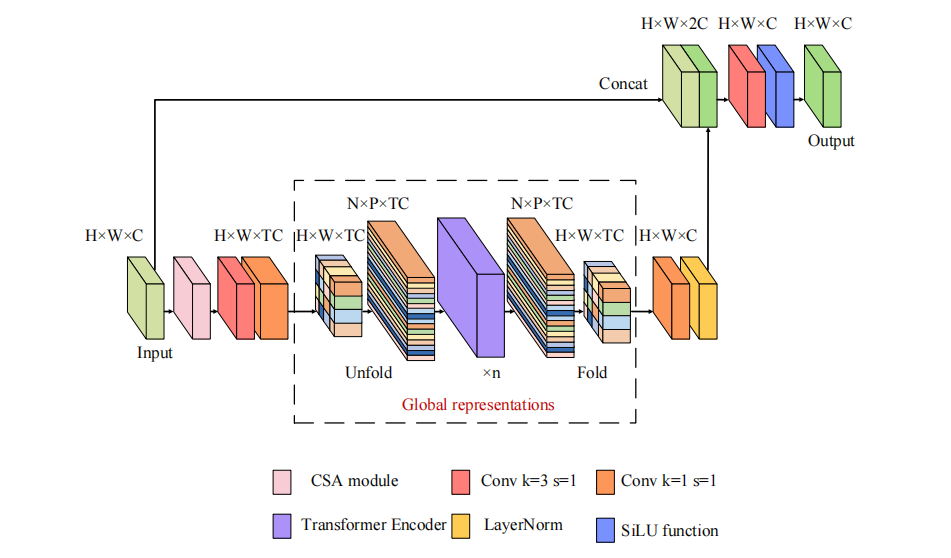
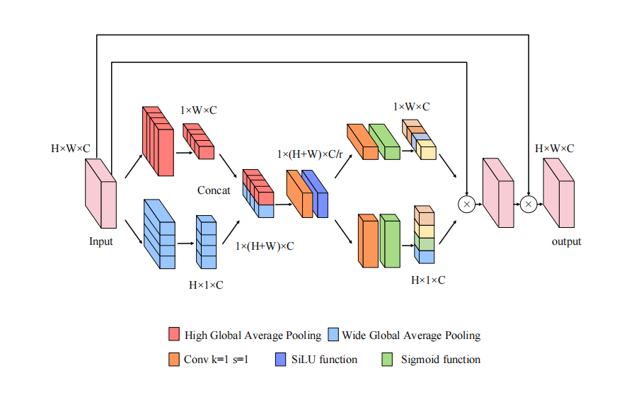
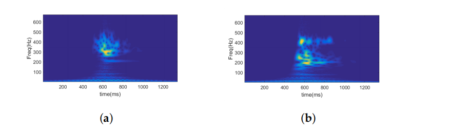
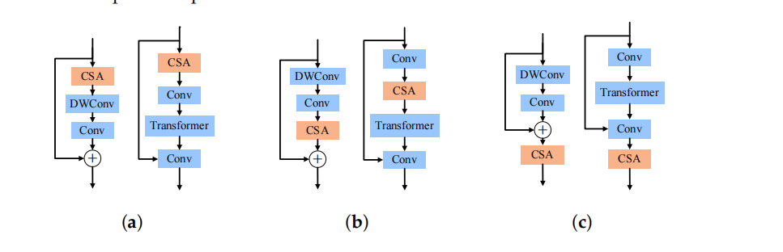

# 【论文阅读笔记】CNN-Transformer for Microseismic Signal Classification


## 摘要

&emsp;这篇论文提出了一种名为CCViT的轻量级网络模型，用于快速准确地识别地下传感器采集的煤矿和岩石裂缝的微震信号中由煤矿爆破产生的大量爆破振动信号。这些微震信号与爆破振动信号的波形高度相似。为了解决这一问题，作者采用了一个结合了卷积神经网络（CNN）和Transformer的网络模型。其中，CNN用于局部提取浅层特征，而Transformer用于全局提取深层特征。此外，作者还引入了一个修改后的通道注意模块，为模型提供重要的通道信息，并抑制无用信息。实验证明，在本文使用的数据集上，所提出的CCViT模型在浮点运算量（FLOPs）、参数数量和准确度方面相比许多先进的网络模型具有显著优势。

## 1. Introduction


* 背景：微震监测技术在近年来成为煤矿监测动态灾害的有效手段，能够实时监测煤矿中煤岩石裂缝的微震活动并记录监测数据。

* 环境复杂性：煤矿环境复杂，传感器采集的信号受到各种干扰，包括爆破振动和噪音。特别是，煤岩石裂缝的微震信号与爆破振动信号具有非常相似的波形，难以在微震监测系统中区分它们。

* 问题影响：这一问题影响了对煤岩石裂缝微震活动的监测，进而影响了对灾害预警的准确性和及时性。导致煤矿开采效率低下，难以确保工人的安全。

* 解决方案需求：因此，迫切需要快速准确地从大量监测数据中识别煤岩石裂缝的微震信号。

* 实际问题：在实际工程中，有效微震信号的获取主要依靠手动识别，工程师的经验是主要的识别依据，这使得识别困难且效率低下。


* 常用方法： 用于识别煤岩石裂缝微震信号的常见方法包括时间序列分析、机器学习和深度学习。传统的时间序列分析方法包括参数识别和时频分析。

* 参数识别方法： 通过从待识别的时间序列数据中选择一个或多个特征参数，参数识别方法在时域分析中分类不同类型的信号。Ma等人利用源和波形参数作为特征向量来识别微震和爆破信号。Zhao等人利用微震波形重复、唤醒下降、主频和发生时间作为特征参数来识别信号。

* 时频分析方法： 该方法通过变换信号序列以获取频域或与能量相关的特征参数来识别信号。Lu等人使用傅里叶变换来分析不同类型微震信号的功率谱和振幅频率特性，为矿井中不同类型微震信号的初步识别提供基础。小波分析和小波包分析融合微震信号的时频域信息，以增强微震信号的区分度。

* 经验模态分解（EMD）和变分模态分解（VMD）： EMD将原始信号分解成不同频带，以更好地处理随机非平滑信号。VMD是一种非递归信号分解方法，能够自适应高效地分离信号的频域部分及其组成部分。

* VMD分析技术： Zhang等人利用VMD分析技术研究了煤岩石裂缝微震波形和爆破振动波形在每个模态分量中的能量分布特征和能量重心。然后，能量分布的重心系数被用作特征，用于分类和识别这两种类型的信号。

* 方法局限性： 这些方法依赖于研究人员和工程师的经验，通过手动提取信号特征和根据特征参数手动识别微震信号。尽管取得了一些成功，但它们仍然存在一些缺陷，其效率仍需进一步提高。


```java
传统机器学习方法： 传统机器学习方法首先通过常规时间序列分析获取一些特征参数作为输入，然后利用机器学习算法进行微震信号识别。

支持向量机（SVM）方法： Zhu等人构建了一个支持向量机（SVM）网络模型，利用频带的分形盒计数维度作为信号特征，用于爆破、电磁和微震信号的分类。Shang等人利用EMD和奇异值分解（SVD）技术提取矿山信号特征，并应用SVM在沙坝矿山区分微震和爆破信号。

局部均值分解（LMD）和模式识别方法： Li基于局部均值分解（LMD）和模式识别方法对微震和爆破信号进行分类。

高斯混合隐马尔可夫模型（GMM-HMM）： Peng等人基于梅尔频率倒谱系数（MFCC）开发了一个基于高斯混合隐马尔可夫模型（GMM-HMM）的模型。

VMD和多尺度奇异谱熵结合支持向量机： Zhang等人结合VMD和多尺度奇异谱熵构建信号的特征向量，并使用支持向量机识别微震信号。

方法局限性： 这些方法需要预先提取相关的特征参数，未充分利用原始数据信息，可能错过一些重要信息，在处理大量波形信号的识别时效率较低。
```


* 深度学习方法： 深度学习方法通过构建网络框架自动从输入数据中提取特征，并基于提取的特征对信号进行分类。

* 卷积神经网络（CNN）： Peng等人提前从信号中提取特征，构建特征矩阵，然后使用CNN进行分类。然而，这种方法仍依赖于研究学者的经验，无法从原始数据中自动提取特征。

* 短时傅里叶变换与卷积神经网络结合： Ma等人利用卷积神经网络从短时傅里叶变换获得的时频图中自动提取时间和频域特征，以识别微震信号。设计的网络在相应的数据集上表现良好。然而，由于网络结构相对简单，对包含大量具有高度相似波形的信号的复杂数据集的性能有限。

* ResNet： ResNet提出了一种残差结构，缓解了由于网络深度增加而引起的梯度消失和梯度爆炸问题。它通过增加网络层数来使卷积神经网络获得更好的性能。先前的研究选择构建更深的卷积神经网络以提高模型的鲁棒性，但相应的模型参数数量大幅增加。此外，训练需要大规模数据集，模型的训练难度和训练时间也大大增加。


* 这篇论文的主要目标是设计一个统一的轻量级分类框架，利用卷积神经网络（CNN）和Transformer，同时构建了一个通道注意结构，以实现对微震信号的快速准确识别。论文的主要贡献如下：

* 统一轻量级分类框架： 论文设计了一个包含CNN和Transformer的统一轻量级分类框架。该模型的浮点运算量（FLOPs）比MobileViT [20]少67%。该框架从空间、通道、局部和全局视角提取特征，仅使用少量参数即可获取丰富的特征信息，以实现对信号的快速准确分类。

* 通道注意结构： 论文构建了一个通道注意结构，以捕捉通道间的重要信息。该模块是即插即用的，使用少量参数增强了分类框架的特征提取能力。


## 2. Related Work


&emsp;考虑到微震信号识别任务对速度和性能的要求，构建轻量级网络模型更为合适。自Chollet [21]提出深度可分离卷积以提高卷积层的计算效率以来，许多研究人员已将其应用于构建轻量级CNN网络，如MobileNetv1 [22]、MobileNetV2 [23]、MobileNetv3 [24]和ShuffleNet系列模型 [25]。尽管这些轻量级网络易于训练，但CNN的实际感知领域不能覆盖整个情境。当用于微震信号识别时，很难准确捕捉特征。Transformer [26]模型放弃了传统的CNN结构，以自注意方式捕捉全局上下文信息，对各个领域产生影响。Vision transformer (ViT) [27]首次将标准transformer结构应用于图像，但对预训练权重有很高的依赖性。此外，transformer结构缺乏CNN独特的归纳偏差，使学习变得困难，通常需要大规模数据集以获得更好的训练结果。本文借鉴了MobileViT [20]的思想，将CNN和transformer结合起来。CNN为transformer提供了空间归纳偏差信息，提高了transformer的稳定性和性能，并大幅减少了模型的参数数量。Transformer以全局视角捕捉信号特征，弥补了CNN的不足。


&emsp;注意力机制的本质是聚焦于重要信息并抑制无用信息。Jaderberg等人 [28]提出了一种空间注意机制，用于定位人们感兴趣的目标并进行转换或获取其权重。SENet [29]关注通道维度，提出了一种通道注意机制，增强或抑制各种通道信息。CBAM [30]提出了一种混合的空间和通道注意机制，同时关注空间和通道信息。CA [31]在SENet的基础上增加了高度和宽度的位置信息，以获取两个方向的特征信息。然而，上述提到的所有注意机制并不适用于微震信号分类任务，反而可能降低模型性能。这些注意机制提取的通道权重过于概括，无法聚焦于特定的特征。


&emsp;本文的重点是设计轻量级模型，为此设计了CCViT模型。该模型融合了CNN、Transformer和通道注意的优势，确保模型能够准确捕捉微震信号分类和识别任务所需的特征信息，同时有效降低了整体计算开销。该模型更轻量级，使用的参数较少，所需的浮点运算量（FLOPs）也较其他轻量级模型更少。该模型性能更好，在微震信号分类识别任务中表现优于其他模型。


## 3. Method


&emsp;为了满足微震信号识别任务对速度和性能的要求，本文采用了CNN和transformer的组合来构建一个轻量级网络模型。CCViT模型的整体结构如图1所示，其中k代表卷积核大小，s代表步幅，n代表transformer堆叠块的数量。模型包含四个阶段，每个阶段首先使用池化层进行下采样。模型的前两个阶段使用CNN提取局部浅层特征，被命名为CSAConv模块。模型的后两个阶段使用transformer作为特征提取器，全局提取深层特征，被命名为CSAConvViT模块。最后，使用分类器进行分类。为了实现模型的轻量化，本文选择构建一个浅而窄的网络模型。设置每个阶段中堆叠的块数为2、2、1和1；将模型的重点放在第三阶段；设置第三和第四阶段模块中transformer堆叠块数n分别为5和3。设置每个阶段的通道数为16、24、48和64。CCViT模型的具体内部参数如表1所示。


&emsp;CSAConv模块以深度可分离卷积为主体，每个卷积核只处理一个通道，从而显著降低了计算复杂性。CSAConv模块的结构如图2所示，其中H、W和C分别表示张量的高度、宽度和通道；k表示卷积核大小；s表示步幅。输入特征图INc首先通过CSA模块，获取重要的通道信息，得到特征图Gc。该模块进行深度卷积[32]，只在空间维度上混合信息。第i个特征图的计算如下：

&emsp;其中，∗ 表示卷积操作。输出特征图V的第i通道是从特征图G的第i通道通过第i卷积核计算得到的。卷积核的大小k值由实验讨论确定。然后，两个卷积变换函数通过先增加通道维度，然后减小通道维度，集成更高维度的信息。它们为模型提取了更丰富的高级特征。最后，通过快捷分支将特征图添加到输入特征图中，得到输出特征图。方程如下


  


  


&emsp;CSAConvViT模块使用ViT编码器作为特征提取器，以注意机制的方式捕捉全局信息。这解决了CNN无法充分利用上下文信息的问题。CSAConvViT模块的结构如图3所示，其中H、W和C分别表示张量的高度、宽度和通道；k表示卷积核大小；s表示步幅；n表示transformer编码器堆叠块的数量。输入特征图INc首先通过CSA模块获取感兴趣通道的信息，得到特征图Gc。模块首先使用卷积局部化提取特征，特征图包含CNN独特的归纳偏差信息。方程如下：


  


&emsp;注意机制的基本原理借鉴了人类在接收信息时关注重要和有趣部分的现象。通过为不同的特征部分分配不同的权重，注意机制使模型关注输入特征中相对更重要的部分。为了准确捕捉模型所需的通道间信息，本文提出了一种新的通道注意机制，命名为CSA。CSA模块的结构图如图4所示，其中H、W和C分别表示张量的高度、宽度和通道；k表示卷积核大小；s表示步幅；r表示缩放倍数。CSA模块分别聚合了输入特征图INc中在高度和宽度方向上的特征，得到一对具有位置信息的特征图，有助于网络更准确地定位感兴趣的目标。方程如下：


  

&emsp;为解决神经网络训练难的问题，通常会向神经网络添加归一化层，以增加模型的适应能力。在卷积神经网络中，最流行的组件之一是批归一化（Batch Normalization，BN）[33]，它对单个批次进行归一化，通过减少过拟合来提高网络的收敛性。然而，BN具有可能影响模型性能的缺点[34]。另一方面，层归一化（Layer Normalization，LN）[35]是一种一次性对所有批次进行归一化的方法，具有更直观的架构，使其成为自然语言处理领域的首选选择。LN的原理如下：

&emsp;随着网络的发展，出现了各种各样的激活函数。Sigmoid及其组合函数[36]通常用于分类器，但在其他方面表现一般。深度卷积神经网络的隐藏层通常使用修正线性单元（Rectified Linear Unit，ReLU）函数[37]，以避免梯度饱和，并加速随机梯度下降法的收敛速度。然而，ReLU存在一个严重的缺点，即一旦输入值小于0，该神经元的一部分将进入“死区”并无法被激活。在自然语言处理领域，大多数模型使用高斯误差线性单元（Gaussian Error Linear Unit，GeLU）函数[38]，因为它与随机正则化有关，提高了神经元的输出概率。此外，使用GeLU函数的模型在图像分类领域的性能与ReLU函数相媲美。强化学习提出了一种新的激活函数：SiLU函数[39]。SiLU函数是Sigmoid函数的加权线性组合。SiLU函数的原理如下：


&emsp;SiLU函数是一种显著的自稳定隐式正则化器，可以成功抑制大量权重的学习，防止网络过拟合。YOLOv7 [40]模型采用了SiLU激活函数并取得了优越的结果。在本研究中，SiLU函数被用作CCViT模型的激活函数。该模型使用较少的激活函数，每个CSAConv模块和CSAConvViT模块中仅使用一个SiLU激活函数，从而使CCViT模型表现更好。


## Data Pre-Processing Process

&emsp;为了提高模型的鲁棒性并降低对噪声的敏感性，本文使用真实的监测数据对模型进行训练。本文使用的数据来自山东省的一个煤矿工作面，平均煤层厚度为7.03米。该煤层直线而稳定，主要采用重型机械化和高效采矿方法。矿井的水文地质类型复杂，是一座冲击震爆煤矿。采用的是冲击式综采工作面采煤方法，开采过程中采用综掘和大炮综掘，因此在采煤过程中会产生大量微震事件和爆破事件。为了获得准确的爆破和微震事件，矿井进行了爆破追踪记录。记录的爆破波形经过P波和S波的时间校准，并定位到爆破源。然后，将其与记录的爆破时间和爆破位置进行比较，可以确认波形是否为当前记录的爆破作业的信号。从而可以获得一个确定的爆破事件数据库。目前，在矿区完全准确地识别微震事件的方法尚不存在。本文首先排除背景噪声和无用数据，排除爆破时间内的事件，最终分析微震事件的波形特征，以建立一个经过验证的微震事件数据库。


&emsp;数据集中的长度和幅值被统一。数据长度都是1344个样本，并进行了归一化，将它们压缩到范围[-1,1]内。假设煤岩破裂微震信号或爆破振动信号为x(t)，其中t = 1, 2, · · · , 1344。根据以下方程计算信号的绝对最大特征值：

  


&emsp;横轴时间  纵轴频率 颜色幅度 颜色越黄 振幅雨打 颜色越蓝 振幅越小


## 4. Experiments

### 4.1. Parameter Settings

&emsp;为了研究CCViT模型在区分微震信号方面的有效性，本文将数据集按6:2:2的比例划分为训练集、验证集和测试集。即使用2400个数据进行模型训练，使用800个数据进行调优，使用800个数据进行评估。CCViT模型从零开始进行了800个epoch的训练，仅使用了随机裁剪和水平翻转等最基本的数据增强策略。批大小为8。使用AdamW优化器[41]更新网络权重。初始学习率为0.0002，L2权重衰减为0.01。采用带有标签平滑的交叉熵损失函数，平滑率为0.1。本文使用FLOPs、参数数量和准确度对模型进行评估。FLOPs代表浮点运算次数，用于衡量模型的复杂性。当模型进行前向传播时，执行卷积、池化、层归一化和激活函数等操作时，会产生相应的计算功耗。参数数量用于描述模型的大小，换句话说，描述模型所需内存，独立于输入特征的大小。模型的FLOPs和参数数量是通过使用Python开源库中的函数进行计算的。准确度用于评估模型在测试集上的分类效果。为了更准确地评估模型的性能，本文对模型进行了五次训练，将五次结果的平均值作为最终结果。


&emsp;本文研究了Transformer编码器叠加块数量对模型性能的影响，以调整模型。通过比较实验设置了不同数量的Transformer编码器叠加块，实验结果如表2所示。当Transformer编码器的叠加块数量设置为5、3时，模型性能最佳。当增加第三或第四阶段的叠加块数量时，模型的FLOPs和参数的增长范围大致相同，但在增加第三阶段的叠加块数量时，模型相对稳定。因此，模型的关注点集中在第三阶段，适度增加第三阶段的叠加块数量有助于提高CCViT模型的性能。

&emsp;选择合适的卷积核大小有助于提高模型的性能。为了研究不同卷积核大小对CCViT模型性能的影响，本文通过反复实验选择了适合CCViT模型的卷积核大小。首先，剩余卷积核大小默认为3。深度卷积核的大小在比较实验中设置为不同的值。在选择适当的深度卷积核大小后，通过比较实验选择了卷积层后两个阶段的适当卷积核大小。实验结果如表3所示。从表3可以看出，随着卷积核大小的增加，CCViT模型的计算量增加，性能下降。选择3 × 3卷积核时，CCViT模型表现最佳。结论是，对于微震信号分类和识别任务，CCViT模型的较大卷积核不一定更好。在CCViT模型中使用小的卷积核有助于提取微震信号的特征


```java
CSA模块的放置位置影响CCViT模型的性能。为了评估CSA模块位置对模型的影响，本文进行了一系列实验，探讨了以下几种情况：

插入到每个阶段的模块的顶部，如图8a所示；
插入到每个阶段的模块的中部，如图8b所示；
插入到每个阶段的模块的底部，如图8c所示。
实验结果如表4所示。结果表明，当CSA模块放置在每个阶段的顶部时，模型的性能最佳。模型优先使用CSA模块来提取重要的通道信息，有助于捕捉相关的特征。

```


  


### 4.4. Comparison Experiments


&emsp;为了评估CCViT模型的有效性，本文选择了在微震信号分类领域中也被使用的TFMC模型[16]，以及在参数数量、FLOPs和准确性等方面较重的网络（ResNet、Vision Transformer和ConvNext）和轻量级网络（MobileNetv2、MobileViT）进行比较实验。实验结果如表6所示。在由真实监测数据组成的数据集上，本文提出的模型在准确性上优于其他深度学习方法，准确率达到96.18%。与其他方法相比，本文提出的方法具有低计算功耗和高准确性的优势。与重型模型相比，CCViT模型使用较少的参数取得了更好的性能。例如，本文提出的CCViT模型的参数数量和FLOPs仅为ConvNext的2%。这表明使用多个视角提取特征使模型更容易捕捉特征，有助于信号的识别。与轻量级模型相比，本文提出的CCViT模型使用更少的参数，具有更少的FLOPs，并且更容易训练。例如，本文提出的CCViT模型的参数数量为MobileViT的60%，FLOPs为MobileViT的33%。TFMC模型在我们的数据集上表现不佳，准确率仅为68.25%。其参数数量和FLOPs要比本文提出的CCViT模型大得多。这证实了简单的卷积模型很难区分微震和爆破信号。比较实验表明，CCViT模型更适用于微震信号识别任务，具有高的分类效率和更好的性能。


## 5. Conclusions


&emsp;这篇论文介绍了CCViT模型，一种轻量级方法，可准确区分煤岩破裂微震信号和爆破振动信号。该模型结合了卷积神经网络（CNN）和transformer，以从多个角度捕获特征，降低参数和计算量，同时保持性能。所提出的通道注意机制CSA增强了通道间的重要特征。实验结果表明，CCViT模型在减少FLOPs的同时保持卓越性能，实现了快速的微震信号识别。CCViT模型对噪声具有鲁棒性，同时提取时域和频域特征。其在煤矿安全微震监测中的应用前景广泛。未来的工作可能会探索多通道数据集成以提高微震事件识别的效果。


