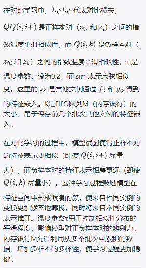

# Contrastive Learning with Stronger Augmentations

## 摘要

基于提供的摘要，该论文的核心焦点是在对比学习领域提出的一个新框架——利用强数据增强的对比学习（Contrastive Learning with Stronger Augmentations，简称CLSA）。以下是对摘要的解析：
* 问题陈述：
  * 表征学习（representation learning）已在对比学习方法的推动下得到了显著发展。
  * 当前对比学习方法广泛使用数据增强技术，这些技术被仔细设计以维持图像身份，从而使得从同一实例变换而来的图像依旧可以检索到。
  * 然而，这些精心设计的转换限制了探索其他转换可能揭示的新模式的能力。
* 研究发现：
  * 强数据增强扭曲了图像的结构，这使得检索过程变得困难。
* 研究贡献：
  * 为了解决上述问题，论文提出了一种名为CLSA的通用框架来补充当前的对比学习方法。
  * CLSA通过采用弱增强和强增强图像在表征库上的分布差异来指导从实例池中检索强增强查询的过程。
* 实验结果：
  * 在ImageNet数据集和下游数据集上的实验表明，弱增强和强增强图像所提供的信息可以显著提升性能。
  * 具体来说，使用标准ResNet-50架构并通过单层分类器微调的CLSA在ImageNet上达到了76.2%的top-1准确率，这几乎与76.5%的监督学习结果处于同一水平。
* 资源分享：
* 论文还提供了代码和预训练模型的链接，方便其他研究者使用和参考。
综上所述，这项工作提出了在对比学习中引入不同级别的数据增强技术的新框架，尤其强调了强增强带来的好处。通过在实验中表明这种方法有助于改善模型性能，研究者们为深度学习社区贡献了一个有价值的工具，尤其对于那些需要提高图像相关任务性能的研究者来说尤为重要。

## Introduction

* 本段文本继续探讨了对比学习（contrastive learning）在无监督视觉表征学习领域的角色和发展。以下是对文本内容的详细解析：
* 深度学习成功的基础：
  * 深度神经网络在从像ImageNet这样的大型标注数据集中学习方面取得了巨大成功。
  * 这些成功建立在有大量昂贵的标注样本可供训练的基础上。
* 挑战和应对策略：
  * 这种依赖大量标注样本的方式使数据收集变得昂贵且困难，因此研究者们开始转向无监督的视觉表征学习和自监督学习，以摆脱对大量标签的依赖，并学习到健壮和通用的特征表征。
* 对比学习的作用：
  * 在这些方法中，对比学习脱颖而出，显示出缩小与监督学习性能差距的潜力。对比学习是实例学习的一种形式，在实例学习中，将每张图像视为一个独立的实例。
* 实例学习目标：
  * 实例学习的目标是训练网络使得同一个实例的不同增强视图的表征尽可能接近，同时保证来自不同实例的不同视图的表征彼此有区别。
* 对比学习方法：
  * 对比学习通过最小化同一实例不同视图之间的相似度，同时最大化不同实例的视图之间的相似度来实现这一目标。
* 对比学习的发展：
  * 为了提高对比学习的效果，提出了各种方法来探索不同的方向，包括增加负例的数量、改善负例的质量、数据增强等。
* 总结而言，这段文本强调了对比学习在无监督学习领域中的重要性，并概述了学者们在结合实例学习和对比学习原则以学习强大的特征表征方面的研究和进展。这些无监督的学习策略在减少对大规模标注数据集的依赖上发挥了关键作用，并在视觉表征的学习方法上提供了新的突破。

* 这段文字继续讨论了数据增强在无监督学习特别是对比学习中的重要性，以及强数据增强对模型性能的潜在正面影响。以下是对文本内容的详尽解释：
* 数据增强方法的普遍依赖：
  * 通常，无监督学习或自监督学习方法依赖于精心设计的图像增强（image augmentations），目的是维护实例的身份，允许图像增强后的实例能从实例池中准确检索到。
* 数据增强设计的重要性：
  * 研究如InfoMin强调了精心设计的数据增强对模型性能的重要影响，并指出了使用强数据增强的潜在功效。
* 强数据增强的应用：
  * 一些新的工作，如SwAV和PIRL，相较于早期的方法如MoCo和SimCLR，采用了更强的数据增强策略。
  * 但是，现有研究没有尝试应用像RandAugment那样的随机组合不同增强来实现更强的数据增强效果。
* 强数据增强揭示新模式：
  * 强数据增强能够揭示新的模式，从而提升模型在监督和半监督任务中的性能。
* 强数据增强与自监督学习：
  * 作者认为，强数据增强中隐藏的模式也能为自监督学习做出贡献，通过提升学习到的表征的泛化性，最终缩小与完全监督模型之间的差距。
* 强数据增强的挑战：
  * 直接在对比学习中应用强数据增强可能会损害性能，因为引入的扭曲可能会严重改变图像结构，使变换后的图像无法保持原始实例的身份。
* 未来的研究方向：
  * 为了进一步提升自监督学习，需要额外的努力去探索强数据增强的作用并克服相关的挑战。
* 总的来说，这段文字表明，尽管强数据增强被认为在提高模型性能方面具有潜力，但是它们也带来了新的挑战，例如可能改变图像结构并丢失实例标识。因此，为了充分利用强数据增强的潜力，需要针对性地研究和开发新方法以适应这类增强手段。

* 提出的CLSA（使用更强数据增强的对比学习）框架旨在解决强数据增强可能导致的问题。以下是对该方法的关键点详细解读：
* 更强数据增强：
  * 该框架引入了一个被称为“强化增强”的新的数据增强方案，它是14种增强类型（如剪切、平移、旋转、自动对比、反相、均衡化、晒化、海报化、对比度、颜色、亮度、锐度等）的随机组合。
* 分布差异最小化：
  * CLSA不是将强化增强视图应用到对比损失中，而是提出最小化弱增强图像与强增强图像在表征库上的分布差异，以此来指导强查询的检索。
  * 这种设计避免了过于乐观的假设，即认为强化增强视图的嵌入应与弱增强视图的嵌入完全相同。
  * 同时，利用弱增强视图的分布，该框架能够探索强增强视图所携带的新模式。
* 与对比损失的结合：
  * 由于CLSA独立于对比损失，因此它可以与任何基于对比损失的方法相结合，如MoCo、SimCLR、BYOL等。
* 实验结果：
  * 实验表明，该框架通过引入分布损失，可以显著提高性能。
  * 实验也验证了CLSA不仅改善了弱增强视图的特征表征质量，还同时进一步增强了强增强视图的表征。
* 在多种数据集上的表现：
  * 在不同数据集上的实验表明，所提框架能够通过学习更强的数据增强显著提升性能。
  * 在ImageNet线性评估协议下，使用标准的ResNet-50网络背景，达到了76.2%的top-1准确率，几乎达到了完全监督模型的76.5%的top-1准确率。
  * 同时，在若干下游任务上也取得了有竞争力的表现，包括在VOC07上使用预训练的ResNet-50线性分类器达到93.6%的top-1准确率，以及在COCO小目标检测任务上将APS提高到24.4%。
* 对强化增强的讨论：还有关于在对比学习中简单应用更强数据增强可能会降低性能的消融研究。
* 综上所述，CLSA框架通过在对比学习中引入了更强的数据增强并最小化弱增强和强增强图像的分布差异，显示了在自监督学习中使用强数据增强提升学习性能的可能性。在实验结果的支持下，CLSA证明了其在多种视觉任务上提升表征学习性能的有效性。

* 首次探索强数据增强对自监督学习的贡献：
* 我们是第一个研究如何利用更强的数据增强手段来促进自监督学习的团队。
提出分布损失：
* 我们提出了一种分布损失机制，用于从弱增强视图向强增强视图迁移知识。
  * CLSA能和其他对比学习方法集成，并大幅提升性能：
  * CLSA框架可以轻松地与现有的基于对比损失的方法集成，并显著提高它们的性能。
* 详尽的消融研究：
  * 我们细致地开展了消融研究以验证分布损失的影响。
  *   CLSA框架能同时提升弱增强和强增强图像的表征能力：
  * CLSA能够自主训练神经网络，同时改善对弱增强图像和强增强图像的表征。
* 总的来说，这些贡献表示该研究的CLSA框架不仅突破了以往自监督学习对数据增强方法的应用局限，而且提出了一个新的分布损失概念，有助于更有效地利用数据增强来提升模型性能。此外，CLSA的通用化设计意味着它可以与其他对比学习算法结合使用，从而提高了对这类算法的广泛适用性和实用性。通过详细的消融研究，该框架的有效性得到了进一步证实。

## 2 RELATED WORK

### 2.1 Self-Supervised Learning

* 自监督学习方法被广泛研究，用以缩小与监督学习之间的差距，并减少标记大量数据所需的时间和成本。这些方法可以从五个不同的方面进行分类：
* 生成模型: 这些模型通过构建数据的潜在空间表示来生成新的数据样本。例如，* 变分自编码器(VAEs)和生成式对抗网络(GANs)。
* 上下文预测: 通过预测数据中缺失的部分或预测数据的未来状态来学习有用的特征。例如，在自然语言处理中的BERT，它通过上下文来预测句子中缺失的单词。
排列顺序预测: 这些模型通过重建输入数据的正确顺序来学习特征，如颠倒图像块或文本片段的顺序，并训练模型将它们恢复到原来的顺序。
* 对比学习: 这些方法包括训练模型区分正负样本对。如SimCLR和MoCo，它们通过学习将增强的数据对拉近而将未匹配的示例推远，从而学习表示。
基于探索的方法: 主要通过交互式环境中的探索来学习特征，如强化学习或在游戏中自动生成训练样本。
* 这些类别中的方法通过不同的学习范式允许模型学习到丰富的特征表征，而这些特征通常在没有显式标签的情况下被学习。自监督学习有助于提高数据效率和可扩展性，特别是在不可能或不实际手动标注大量数据的领域。

* 自监督学习方法中的生成式方法通常采用自编码器和对抗学习算法来训练无监督的表征。这些方法主要关注图像的像素级信息来区分不同类别的图像。以下是对这些方法的进一步详细解释：

* 生成式方法：
  * 自编码器：通常被用来在训练阶段通过重构输入来学习隐含的数据表示。自编码器的目标是学习一个压缩的、丢失尽可能少信息的数据表示。
  * 对抗学习：例如双向生成式对抗网络（BiGAN），用来捕捉潜在语义表征与输入图像之间的关系。

* 聚类：
  * 深度聚类（DeepCluster）：将 k-means 概括为通过交替地分配伪标签和更新网络进行学习，从而学习视觉表征。
  * SWAV（Swapping Assignments between Views）：最近提出的方法通过在不同视图之间强制一致性的聚类原型分配，已在ImageNet上取得了最先进的性能。

* 一致性表征学习：
  * BYOL（Bootstrap Your Own Latent）：研究人员首次发现可以不使用负样本自我训练编码器。它利用了孪生架构，在编码器和投影器之上的查询分支中添加了预测器结构。编码器可以通过简单地最小化查询嵌入和关键嵌入之间的余弦相似性来学习良好的表征。
  * Simsiam：进一步移除了动量关键编码器，并使用了停止梯度策略来避免模型崩溃问题。
  * SCRL（Spatial Consistency Representation Learning）：进一步将一致性损失应用于两个视图的交集区域的感兴趣区域，以改善下游检测任务的编码器表征。
此外，用于一致性学习的KL损失也被广泛用于帮助表征学习，例如CO2和RELIC，在这些方法中添加了正则化以强制不同数据增强下嵌入间的一致性。

### 2.2 Augmentation in Representation Learning

* 数据增强在训练深度神经网络中发挥着核心作用。一方面，它帮助学习到的表征在不同的数据增强下更加鲁棒，这有助于模型学习到变换不变的表征。另一方面，增强手段也为训练引入了更丰富的数据。
* 在监督学习中，位置和方向调整首先在MNIST数据集中被引入，并取得了有希望的提升。之后，对于自然图像数据集，例如CIFAR-10、ImageNet，随机裁剪、图像镜像和颜色变换/美白等技术被引入来训练更好的神经网络。这些早期工作都是手动设计的，需要时间和专业知识。当我们想要结合数据增强以实现更强的增强时，手动设计既不可行也不是最优的。为了解决这个问题，研究人员通过两种不同的方法探索了组合。
* 首先，**生成对抗网络（GANs）**被用来通过生成器直接生成具有不同变换的更多数据。然而，后来发现通过条件性GAN重新定义增强池，来学习数据增强的最佳序列更有益。受此启发，提出了其他方法来仔细研究如何自动找到好的数据增强组合。AutoAugment首先采用强化学习来学习带有应用概率和幅度的增强操作序列。继此工作之后，提出了基于人口的增强（PBA）、快速AutoAugment、更快速AutoAugment，以加速数据增强策略搜索并改进它。RandAugment进一步发现，通过均匀采样不同数据增强和均匀采样幅度可以构建强大的数据增加，而无需广泛搜索。这些通过不同变换的组合创建的更强的增强在分类和检测的监督学习中做出了巨大贡献。
* 在半监督学习中，MixMatch引入了MixUp增强，以帮助半监督学习，其中模型通过混合视图和使用MixUp的凸组合混合标签进行训练。EnAET利用具有仿射和投影变换的视图来进一步改进半监督学习。FixMatch发现，通过RandAugment产生的高度扭曲图像对于从少量标记数据和大量未标记数据中进行学习起着关键作用。
这表明数据增强不仅对于提高模型的鲁棒性至关重要，而且在各种学习范式中发挥作用，包括监督学习和半监督学习。通过数据增强，模型可以从多样化的样本中学习，提高其泛化能力并提升对未见数据的预测精度。

* 在自监督学习中，InstDisc和MoCo等研究将颜色抖动操作加入到数据增强管道中，并在对比学习方面取得了明显的增益。SimCLR进一步在其数据增强管道中加入了高斯模糊，这一改进在MoCo v2以及后续的工作中得到了进一步的验证。基于这些观察，InfoMin探究了不同数据增强组合在对比预训练中的效果，发现某些数据增强组合能够带来额外的改进。同时，SwAV进一步引入了多重裁剪（multi-crop），包含额外的更小尺寸96x96裁剪，以帮助模型学习更强大的特征表征。此外，BoWNet甚至将CutMix作为更强大的增强方法引入到表征学习中。
* 前述工作探索了如何通过引入越来越多的变换设计和构建更合适的数据增强管道。然而，这些方法都需要时间、精力和专业知识来手动设计增强，并且这些设计的数据增强可能只适用于某些数据集。为了克服这个问题，我们提出了由14种不同增强类型的随机组合以及MoCo v2中的基线增强来构建更强大的增强方法，应用概率和强度同样随机，详细内容在第3.3节进行了说明。
首先，通过重复5次采样增强操作，不同增强方法的完全随机组合构成了更强大的增强手段。其次，与以前的方法相比，我们的数据增强完全是自动随机采样的，无需人工干预。此外，如同在监督学习和半监督学习中指出的那样，我们同样展示了这种更强大的增强有助于模型在扭曲图像下学习到强大的特征表征。

## 3 CLSA: CONTRASTIVE LEARNING WITH STRONGER AUGMENTATIONS

* 在本节中，我们首先将回顾对比学习的初步工作，并在第3.1节中讨论它们的优势和局限性。然后，在第3.2节中，我们将介绍一种新的分布式发散损失，该损失在弱增强和强增强图像之间进行，通过利用来自强增强视角的底层视觉语义信息来自训练表征。在那之后，实施细节将在第3.3节中解释。

### 3.1 Contrastive Learning

* 对比学习是一种流行的自监督学习思想，并且在近年来由于计算能力的提高和各种图像增强技术的应用而取得了巨大的成功。它的目标是找出一个参数函数fθ，它可以将输入图像x ∈ R^D映射到特征表示z = fθ(x) ∈ R^d，使得在特征空间中的特征表示z能够反映输入空间中的语义相似性。为了实现这一目标，提出了对比损失函数以优化网络fθ，该损失函数鼓励z及其正样本z₀在特征空间中紧密相连，并将所有其他负样本的表示推开。在SimCLR之后，还引入了投影器g以进一步将表示映射为z = gθ(fθ(x))用于对比预训练，尽管在下游任务中（例如分类/检测），我们依旧只使用fθ(x)。这种设计被证实是提升对比学习性能的关键

* 图1展示了对比学习方法的最新通用框架。在有监督的设置中，通过将同一类别的图像定义为正样本对，而其余的图像作为负样本对，就可以实现对比损失。类似的，在对比损失中正样本对的定义也是受到了实例识别任务的启发。在实例识别中，正样本对通常是由同一个实例的不同变换得到的图像组成的，而负样本对则是由不同实例的图像组成。在对比学习框架中，正样本和负样本是通过特定的数据增强策略来生成的，以确保正样本对保持有相同的底层语义信息，同时负样本之间具有足够的区别。这种方法通过最小化正样本对的距离以及最大化负样本对的距离，从而使得模型能够学习到有意义的特征表示。

* 在对比学习中，通常会采用随机增强的同一图像的裁剪版本作为正样本对，而其他图像的裁剪则作为负样本。因此，在自监督学习中的对比损失是用来最大化同一实例不同视图（增强的裁剪）之间表示的一致性，同时最小化与其他负样本表示之间的一致性。通过这种方式，模型被训练去识别哪些特征对区分图像是否为同一实例更为重要，从而在没有标签的情况下学习有意义的特征表示。这对于提高模型对未标记数据的理解和泛化能力至关重要。

* 具体来说，对于每个批次B中的图像x，我们应用两种不同的变换T₀和T来获取同一个实例x的两个不同视图V₀和V。然后，这两个视图分别通过一个查询编码器fθ和一个键编码器fφ，接着通过MLP投影层（gθ/gφ），产生两个嵌入表示z₀和z来计算等式(1)中的对比损失。这种方法允许网络学习如何把语义相似的图像映射到特征空间中的靠近点，并将不相似的图像映射到距离较远的点，通过这种训练，网络能够捕获输入图像的关键特征，改善其特征表示的质量。

  

* 正样本对的设计：在设计正样本对时，数据增强是经过仔细设计的。例如，在SimCLR [8] 中，研究者们小心翼翼地设计了颜色偏移和高斯模糊转换来进一步增强随机裁剪视图的效果。InfoMin [17] 探讨了对比预训练中不同数据增强效果，并展示了某些数据增强组合相比于MoCo [4] 或SimCLR [8] 能够进一步改善性能。
* 负样本对的设计：对于负样本对，研究者们探索了大量方法来提高负样本对的数量和质量。例如，InstDisc [9] 首次使用了内存银行（负样本池）来追踪前面批次的特征嵌入，作为负样本对，这大大提高了性能，通过大量的负样本。MoCo [4], [5] 通过使用动量编码器作为键编码器 gφ 来进一步提高负样本的质量。SimCLR [8] 通过使用大批量在线训练，并使用同一个批次中的其他实例作为负样本来平衡负样本的质量和数量，以优化对比损失。AdCo [16] 最近甚至利用了一个对抗性内存银行作为负样本对，其中内存银行可以通过端到端训练来生成负特征。简而言之，负样本的潜力已经从各种角度被充分探索并大大提升了表征学习。

* 然而，如果直接在对比学习中采用更强烈的变换（例如，使用更大的旋转角度、更激进的颜色抖动和切割），并不能进一步提高性能，甚至可能会导致下游任务的性能恶化，这并不令人意外。较强烈的变换可能扭曲图像结构和它们在学习到的表示中的感知模式，以至于强烈的增强视图无法在训练底层网络时被视为同一实例。在InfoMin [17] 中，他们也只是探索了弱增强的组合，而没有探索可能包含更多信息、有助于模型学习到健壮特征的强增强。不同的弱增强组合可能提供了不同的信息，以获得独特的特征表示，因此完全有可能某些有用的信息只能通过更强的增强来学习。在监督学习 [18], [46], [54] 和半监督学习 [20] 中，不同的更强数据增强方法已经被广泛研究，并通过由强烈增强图像所展示的新颖模式大大提升了性能。RandAugment [18] 中的发现验证了即使没有明确的增强策略，强烈增强的视图也能提供更多线索。因此，我们相信从这些新颖模式中学习表示将铺平最后一英里，以缩小与完全监督表示之间的差距。这进一步激发了我们探索在自监督学习中利用更强变换的新方法，同时避免通过在对比模型 [4] 中直接使用它们而导致性能下降。

* 通过探索先前的方法和我们的广泛实验，我们发现学习强增强图像中嵌入的模式并不是一个直截了当的任务。如图 2 所示，强增强图像在感知上可能与原始图像看起来不同。因此，强增强图像的表示可能与弱增强图像的表示相差甚远。因此，在对比学习中天真地使用强增强图像可能过于乐观，因为引入的扭曲可能会显著改变它们的图像结构。
* 为此，在第3.2节中，我们提出了一种分布发散最小化（DDM）方法，该方法在弱增强图像和强增强图像的表示库上应用，以避免对强增强图像的表示进行过拟合，以匹配相应的正目标。具体来说，DDM方法致力于最小化在表示空间中由于深度学习模型学习到的特征表示而产生的分布差异，达到平衡强增强图像与弱增强图像的表示，促使模型能够更好地泛化至新的、未见过的数据变换。这样的策略有助于保持对比学习中正样本对的一致性，同时又不丧失通过更多样化的数据增强带来的额外信息。

### Distributional Divergence Minimization between Weakly and Strongly Augmented Images

* 由于上述所提到的限制，从对强烈增强查询的检索中学习对于自我训练深度网络来说是不可行的。然而，相对相似性的分布可以帮助我们从不同的角度理解对比学习，这激发了我们提出分布发散最小化（DDM）来从更强烈的增强中学习。
* DDM的概念基于这样的观察：尽管强增强图像的表示可能与其对应的弱增强图像的表示有较大差异，但这些表示之间的相对相似性分布仍然可以为网络训练提供有用的指导。通过最小化强增强图像与弱增强图像在表示空间中相对于其他随机图像的相似性分布之间的距离，模型可以更有效地利用从强增强图像中学到的有价值的信息，同时避免因增强过度导致的性能退化。

* 然而，我们无法从语义视角获得理想的可能性分布。测量查询图像与键图像（正/负）之间的最优可能性是很困难的。为了避免这种未知分布的探索，对比损失将q视为一个one-hot分布，其中正对满足 q(zi|z₀i) = 1 ，而负对则满足 q(zk|z₀i) = 0 (k ∈ [1, K])。这意味着对比损失仅仅最大化同一实例不同视图表示之间的一致性，同时最小化与其他负样本的一致性。查询图像与键图像之间所有其他复杂的关系都完全被忽略了。
* 对比损失的优势在于它可以极大地加速表示学习的收敛，并显著改善分类和检测任务的表示特征。然而，查询图像与负图像之间的信息并没有被充分利用，这些信息可能包含有助于进一步提升表示学习的有用线索。
* 这说明当代对比学习框架主要集中在区分正负样本对上，并没有利用负样本之间的相互关系或结构。正是这种对简单one-hot分布的依赖，可能会导致在某些情况下的表现受限。举例来说，如果能够挖掘查询图像与负样本之间的细微和有意义的关联，可能有助于进一步提炼和丰富表示空间，从而提供更为强大和泛化的模型性能。在实践中，开发新的损失函数或方法，能够合理地利用这些额外的信息，是当前对比学习领域的一个有趣和重要的研究方向。

* 与弱增强视图的表示类似，探索强增强模式的一个直接解决方案是直接使用强增强图像作为查询（query），并使用弱增强图像作为键（key）在对比损失中。然而，这种过于乐观的设计假设强增强视图的表示应该与其弱增强对（pair）非常接近，而且远离其他实例的弱增强视图。一种one-hot分布不能模拟甚至接近最优可能性分布，因此不能再帮助表示学习。
* 因此，应该提出另一种分布q来解决一种one-hot分布的这些限制。新的分布q需要能够更好地反映强增强图像和其它图像之间实际的相似度，而不仅仅是简单地将正样本的相似度最大化和负样本的相似度最小化。新的分布可以更细致地学习不同实例之间的差异性，包括查询图像与自身弱增强版本的细微差异以及与其他实例的不同弱增强版本之间的差异。
* 这样的分布可以采用一种软分配（soft assignment）或者分布对齐策略，允许模型学习到更丰富的、不只是基于一对一正负对关系的表示。例如，可以采用温度调整的softmax函数或者其他权衡正负样本影响的技术来更好地适应强增强查询的特性。通过这种方式，表示学习可以从不仅仅是弱增强的视图中受益，同样也可以从强增强图像中发现更多的模式和特征，从而提升学习到的表示的泛化能力和效用。

* 尽管几乎不可能完美地获得实际可能性分布来自我训练网络，幸运的是，我们发现使用来自同一实例的弱增强图像在表示库中的相对相似度分布可以为强增强学习提供有用的线索。在图3中，我们比较了弱（强）增强查询的正对概率分布 p(zi|z₀i)（p(zi|zi'')）和负对概率分布的方差 p(zk|z₀i)（p(zk|zi'')），其中k ∈ [1, K]。在图3A中，强增强查询的初始相似度分布与弱增强查询的相同，这表明预训练网络的强视图或弱视图嵌入之间不存在差异。然而，经过使用最具代表性的基于对比的方法MoCo[4],[5]训练后，正如图3B所示，强增强视图和弱增强视图之间的相似度分布差异变得明显。换句话说，分布差异表明，现有对比方法未能学习到对较强图像扭曲鲁棒的表示。这激发了我们提出一种可以在更强增强下稳定学习表示的方法。同时，我们不能直接将强增强视图的表示拉到弱增强视图的表示上，因为我们在实验中发现这会破坏表示学习。作为一种替代方案，我们采用了一种宽松的协议，利用查询和键之间相对相似度的分布来预先训练模型。这个特性启发了我们，弱增强查询的相对相似度分布可以用来监督强增强查询的分布。

## 3.3 Implementation Details

* 在之前的研究中（如文献 [19], [20], [31] 所示），强增强通常有两种类型：几何和非几何增强。具体而言，我们考虑了 14 种类型的增强：ShearX/Y（剪切），TranslateX/Y（平移），Rotate（旋转），AutoContrast（自动对比度），Invert（反转），Equalize（均衡化），Solarize（曝光），Posterize（色彩简化），Contrast（对比度），Color（颜色调整），Brightness（亮度），Sharpness（锐度）。每种增强的幅度都足够大，尽可能地生成强增强效果。不同变换的更多细节展示在表 1 中。例如，剪切操作是从 [-0.3,0.3] 范围内抽取，导致强烈变形的图像，如果给定一个对应目标，这些图像可能很难检索。特别地，为了变换一张图像，我们随机从上述 14 类变换中选择一种，并以 0.5 的概率应用于图像。这个过程重复五次，这将强烈增强图像，如图 2 的右侧面板中所示的例子。与中间面板中的弱增强图像相比，可以清楚地看到强增强视图的图像结构完全变了。
* 弱增强 T 是根据文献中大多数现有对比学习方法（如文献 [4], [5], [6], [8]）所做的：首先从输入图像中裁剪图像并调整大小至 224×224 像素。然后依次应用随机颜色抖动、高斯模糊、灰度转换、水平翻转、通道颜色归一化等，以生成弱增强图像，图 2 中间的示例展示了这种情况。
* 技术细节 与之前工作（如文献 [5], [6], [8]）类似，我们使用 ResNet-50（文献 [57]）作为我们的编码器骨干 fθ 和 fφ，以及一个 2 层 MLP（隐藏层为 2048-d，ReLU 激活，输出 FC 无 ReLU）作为投影头 gθ 和 gφ。我们在对比损失和 DDM 损失中使用余弦相似度。温度 τ 设为 0.2。跟随 MoCo [5]，动量平滑因子 α 设为 0.999 用于更新关键编码器 fφ = α*fφ + (1−α)fθ 以及关键 MLP gφ = αgφ + (1−α)*gθ。损失平衡系数 β 设为 1.0。我们将队列 M 的大小 K 设为 65536，以存储用于计算弱增强和强增强查询的条件分布的负样本，并最小化它们之间的差异。我们使用了相同的温度用于 DDM 损失和对比损失，以简化公式。我们相信，通过为 LC 和 LD 调整不同的温度，性能可以进一步提高。

