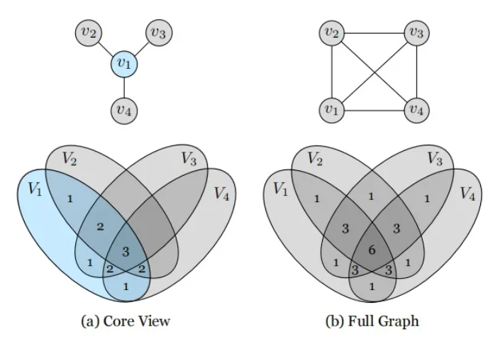

# Contrastive Multiview Coding

## 摘要


&emsp;这篇文章主要探讨人类通过多种感官通道来观察世界，比如左眼观察到的长波长光通道，或右耳听到的高频振动通道。每个观察角度都带有噪音且是不完整的，但一些重要的因素，如物理、几何和语义，往往在所有观点之间共享（例如，“狗”可以被看到、听到和感受到）。文章研究了一个经典的假设，即一个强大的表示应该能够建模与观察角度无关的因素。

&emsp;在多视图对比学习的框架下，他们通过学习一个表示来最大化同一场景不同视图之间的互信息，但这个表示本身要尽可能紧凑。该方法可以扩展到任意数量的视图，并且对视图是不可知的。作者分析了该方法的关键属性，发现对比损失在性能上优于基于跨视图预测的流行替代方法，而且从更多视图学习时，所得到的表示更好地捕捉了场景底层的语义。


## 介绍

* 在编码理论中的一个基本思想是学习压缩表示，尽管这种表示仍然可以用于重构原始数据。这一思想在当代的表示学习中体现为自动编码器[65]和生成模型[40, 24]，它们试图尽可能无损地表示数据点或分布。然而，无损表示可能并不是我们真正想要的，实际上，这是微不足道的——原始数据本身就是无损表示。相反，我们可能更喜欢保留“好的”信息（信号）并丢弃其余的（噪音）。那么，我们如何确定哪些信息是信号，哪些是噪音呢？

* 在这段文字中，作者重新审视了一个经典的假设，即好的信息位通常是在世界的多个视图之间共享的，例如在多个感官模态之间，比如视觉、听觉和触觉[70]。从这个角度来看，“狗的存在”是好的信息，因为狗可以被看到、听到和感觉到，但“相机的位置”是坏的信息，因为相机的位置对图像场景的声学和触觉特性几乎没有影响。这一假设对应于这样的归纳偏好：观察场景的方式不应该影响其语义。在认知科学和神经科学的文献中有很多证据表明，大脑通过编码这种与观察角度无关的表示来处理信息（例如，[70, 15, 32]）

* 因此，我们的目标是学习能够捕捉多个感官通道之间共享信息的表示，但这些表示在其他方面要尽可能紧凑（即舍弃特定通道的干扰因素）。为了实现这一目标，我们采用了对比学习，通过学习一个特征嵌入，使得同一场景的不同视图映射到附近的点（在表示空间中用欧几里得距离测量），而不同场景的视图映射到相距较远的点。具体而言，我们改编了最近提出的对比预测编码（CPC）方法[57]，但进行了简化（去除了循环网络）并进行了泛化（展示了如何将其应用于任意图像通道的集合，而不仅仅是时空预测）。与CPC相关联，我们将我们的方法称为对比多视图编码（CMC），尽管我们指出我们的表述可能同样与实例辨别[79]相关。在我们的公式中，对比目标，就像在CPC和实例辨别中一样，可以理解为试图最大化数据的多个视图的表示之间的互信息。

* 我们故意将“好的信息”留给了较为宽泛的定义，并将其定义视为一个经验性问题。最终，实践出真知：我们认为一个表示是好的，如果它使得后续问题的解决变得容易，尤其是在人们感兴趣的任务上。例如，图像的一个有用的表示可能是一个特征空间，其中容易学习识别对象。因此，我们通过测试学到的表示是否能够良好地迁移到标准的语义识别任务来评估我们的方法。在多个基准任务上，我们的方法在与其他自监督表示学习方法的比较中取得了与现有技术水平竞争的结果。此外，我们发现表示的质量随着用于训练的视图数量的增加而提高。最后，我们将多视图学习的对比公式与最近流行的跨视图预测方法进行比较，并发现在直接比较中，对比方法学到了更强大的表示。

```

• 我们将对比学习应用到多视图环境中，试图最大化同一场景的不同视图的表示之间的互信息（特别是不同图像通道之间的互信息）。
• 我们将这一框架扩展到从两个以上的视图中学习，并且展示了学到的表示质量随着视图数量的增加而提高。我们是第一篇明确展示多视图对表示质量的益处的工作。
• 我们进行了有控制的实验，以测量互信息估计对表示质量的影响。我们的实验表明互信息与视图之间的关系是微妙的。
• 我们的表示在流行的基准测试上与最先进的方法相媲美。
• 我们证明对比目标优于跨视图预测。

```


## 2. Related work


* 无监督表示学习旨在学习数据的变换，使得后续的问题解决变得更容易[7]。这个领域有着悠久的历史，始于一些经典方法，拥有成熟的算法，例如主成分分析（PCA [37]）和独立成分分析（ICA [33]）。这些方法倾向于学习聚焦于数据中的低级变化的表示，从对象识别等下游任务的角度来看，这些表示通常不太有用。

* 更适合这些任务的表示是使用深度神经网络学习的，始于一些开创性的技术，如玻尔兹曼机（Boltzmann machines [71, 65]）、自动编码器（autoencoders [30]）、变分自动编码器（variational autoencoders [40]）、生成对抗网络（generative adversarial networks [24]）和自回归模型（autoregressive models [56]）。还有许多其他的工作，可以在[7]中找到综述。无监督表示学习中一类强大的模型被归纳在“自监督”学习的范畴下[64, 35, 85, 84, 78, 60, 83]。在这些模型中，模型的输入 X 被转化为输出 ˆX，该输出应该接近另一个信号 Y（通常在欧几里得空间中），而 Y 本身与 X 以某种有意义的方式相关联。这些 X/Y 对的示例包括图像的亮度和色度通道[85]、来自单个图像的补丁[57]、视觉和声音等模态[58]，或者视频的帧[78]。显然，这样的示例在世界中非常丰富，为我们提供了几乎无限量的训练数据，这是这一范式的吸引之一。

* 时间对比网络（time contrastive networks [68]）使用三元损失框架从同一场景的不同视频摄像机拍摄的对齐视频序列中学习表示。与自监督学习密切相关的是多视图学习的概念，它是一个涉及许多不同方法的通用术语，例如协同训练[8]、多核学习[13]和度量学习[6, 87]；关于综述，请参见[80, 45]。几乎所有现有的工作都处理了一两个视图，如视频或图像/声音。然而，在许多情况下，可以提供更多的视图来为任何表示提供训练信号。

* 用于训练基于深度学习的表示的目标函数通常包括基于重构的损失函数，例如不同规范下的欧几里得损失[34]，对抗性损失函数[24]（它们学习除了表示之外的损失），或者对比损失，例如[26, 81, 72, 25, 31, 57, 3, 29, 36]，利用多个视图的共现性。


* 一些与我们工作最相似（并对我们产生启发）的先前研究包括对比预测编码（CPC）[57]、Deep InfoMax [31]和实例辨别 [79]。与我们的方法类似，这些方法通过对比场景的一致和不一致的表示来学习表示。CPC从两个视图学习——过去和未来——适用于时空序列数据。Deep InfoMax [31]将这两个视图视为神经网络的输入和输出。实例辨别则学习匹配同一图像的两个子裁剪。CPC和Deep InfoMax最近分别在[29]和[4]中进行了扩展。这些方法都共享相似的数学目标，但在视图的定义上存在差异。我们的方法与这些工作的不同之处在于：我们将目标扩展到两个以上的视图的情况，并探索了不同的视图定义、体系结构和应用设置。此外，我们为这一表示学习范式做出了独特的经验性研究贡献。

## 3. Method

* 我们的目标是在没有人类监督的情况下学习捕捉多个感官视图之间共享信息的表示。我们首先回顾先前的预测性学习（或基于重构的学习）方法，然后详细介绍了两个视图内的对比学习。我们展示了与最大化互信息的联系，并将其扩展到包括两个以上视图的情况。我们考虑数据的M个视图的集合，表示为V1, . . . , VM。对于每个视图Vi，我们用vi表示一个随机变量，表示遵循vi ∼ P(Vi)的样本。

### 3.1. Predictive Learning

* 假设V1和V2代表数据集的两个视图。例如，V1可能是特定图像的亮度，而V2是色度。我们将预测性学习设置定义为通过潜在变量z的深度非线性转换从v1到v2，如图2所示。形式上，z = f(v1)，vˆ2 = g(z)，其中f和g分别表示编码器和解码器，vˆ2是在给定v1的情况下对v2的预测。然后使用一个目标函数训练编码器和解码器模型的参数，该目标函数试图使vˆ2“接近”v2。这样的目标函数的简单例子包括L1或L2损失函数。请注意，这些目标假设在给定v1的情况下，v2的每个像素或元素之间是独立的，即p(v2|v1) = Πip(v2i|v1)，从而降低了模拟相关性或复杂结构的能力。预测性方法在表示学习中得到了广泛应用，例如颜色化[84, 85]和从视觉预测声音[58]。


  

### 本文思想

* 两个视角的目标函数：两个视角对比着学习，f1和f2是两种backbone 不共享参数，这个和Spreading Instance是有区别的

  

* 多个视角的目标函数

  

  

## 3.4. Implementing the Contrastive Loss

* 对比学习可以学到更好的表示，通过使用许多负样本。在极端情况下，我们可以对于给定的数据集将每个数据样本都包括在分母中。然而，计算完整的softmax损失对于大型数据集（如ImageNet）来说是代价高昂的。一种近似这个完整的softmax分布并减轻计算负担的方法是使用Noise-Contrastive Estimation [25, 79]（详见补充说明）。另一种解决方案，我们在这里也采用了，是随机抽样m个负例，并进行简单的(m+1)-way softmax分类。这种策略也在[4, 29, 27]中使用，并可以追溯到[72]。

* 内存银行。根据[79]，我们维护一个内存银行来存储每个训练样本的潜在特征。因此，我们可以有效地从内存缓冲区中检索m个负样本，与每个正样本配对，而无需重新计算它们的特征。内存银行是根据实时计算的特征动态更新的。内存银行的好处是允许与更多负对进行对比，代价是略微滞后的特征。

## 4. Experiments

* 我们在许多数据集和任务上进行了对比多视图编码（CMC）的广泛评估。我们在两个已建立的图像表示学习基准上进行评估：ImageNet [16] 和 STL-10 [12]（详见补充说明）。我们进一步在视频表示学习任务上验证了我们的框架，其中使用图像和光流模态作为联合学习的两个视图。最后一组实验将我们的CMC框架扩展到两个以上的视图，并提供了其有效性的经验证据。

### 4.1. Benchmarking CMC on ImageNet

### 4.3. Extending CMC to More Views

* 我们进一步将我们的CMC学习框架扩展到多视图场景。我们在包含1449张标记图像的NYU-Depth-V2 [53]数据集上进行实验。我们致力于更深入地理解CMC的行为和有效性。我们考虑的视图包括：亮度（L通道）、色度（ab通道）、深度、表面法线[20]和语义标签。

* 实验设置。为了从每个视图中提取特征，我们使用了一个具有5个卷积层和2个全连接层的神经网络。由于数据集的规模相对较小，我们采用了基于子图像的对比目标（详见补充说明），以增加负对的数量。从原始图像中随机裁剪大小为128×128的补丁用于对比学习（从大小为480×640的图像中裁剪）。对于下游任务，我们舍弃全连接层，并使用卷积层作为表示进行评估。

### 4.3.1 Does representation quality improve as number
of views increases?

* 为了衡量学到的表示的质量，我们考虑从L的表示中预测语义标签的任务。我们遵循核心视图的范式，将L作为核心视图，因此通过与L对比学习一组表示。我们使用UNet风格的体系结构[63]执行分割任务。对上述体系结构进行对比训练，相当于UNet的编码器。在完成对比训练后，我们从L编码器初始化UNet的编码器权重（它们是等效的体系结构），并将其冻结。在此微调阶段仅训练解码器。

由于我们使用基于补丁的对比损失，在1个视图的情况下，CMC与DIM [31]相一致。2-4个视图的情况将L与ab进行对比学习，然后顺序添加深度和表面法线。通过所有类别的平均IoU和像素准确率来衡量语义标签的结果，如图4所示。我们看到随着新的视图的添加，性能稳步提高。我们已经测试了添加视图的不同顺序，它们都遵循类似的模式。


* 我们还将CMC与两个基线进行比较。首先，我们随机初始化并冻结编码器，将其称为随机基线；它作为质量的下限，因为表示只是一个随机投影。与冻结随机初始化的编码器不同，我们可以与解码器一起训练它。这种端到端的监督基线作为上限。结果呈现在表3中，表明即使CMC对下游任务一无所知，它仍然产生高质量的特征图。

### 4.3.2 Is CMC improving all views?


