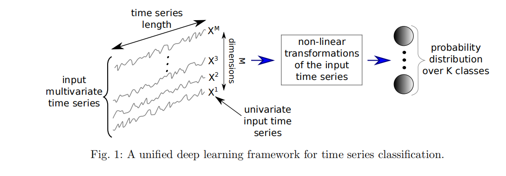

# 【论文阅读笔记】Deep learning for time series classification: a review

## 摘要

&emsp;在这篇文章中，作者通过对TSC的最新DNN架构进行实证研究，探讨了深度学习算法在TSC中的当前最新性能。文章提供了对DNNs在TSC的统一分类体系下在各种时间序列领域中的最成功应用的概述。此外，作者还向TSC社区提供了一个开源的深度学习框架，其中实现了每种比较方法，并在单变量TSC基准（UCR/UEA存档）和12个多变量时间序列数据集上进行了评估。通过在97个时间序列数据集上训练8,730个深度学习模型，文章提出了迄今为止对DNNs在TSC进行的最全面的研究。

## Introduction

&emsp;在过去的两个十年中，时间序列分类（TSC）一直被认为是数据挖掘中最具挑战性的问题之一（Yang和Wu，2006；Esling和Agon，2012）。随着时间数据的增加（Silva等人，2018），自2015年以来提出了数百种TSC算法（Bagnall等人，2017）。由于时间序列数据具有自然的时间顺序，它们几乎出现在几乎每个需要某种人类认知过程的任务中（L¨angkvist等人，2014）。实际上，任何涉及到按某种顺序注册的数据的分类问题都可以被视为TSC问题（Cristian Borges Gamboa，2017）。时间序列在许多现实世界的应用中都会遇到，范围从电子健康记录（Rajkomar等人，2018）和人体活动识别（Nweke等人，2018；Wang等人，2018）到声学场景分类（Nwe等人，2017）和网络安全（Susto等人，2018）。

&emsp;此外，在UCR/UEA存档中数据集类型的多样性（Chen等人，2015b；Bagnall等人，2017）（这是时间序列数据集的最大存储库）展示了TSC问题的不同应用。这些数据集包含了来自不同领域的时间序列，进一步表明了TSC在各种实际场景中的广泛应用。

&emsp;在过去的两个十年中，时间序列分类（TSC）一直被认为是数据挖掘中最具挑战性的问题之一（Yang和Wu，2006；Esling和Agon，2012）。随着时间数据的增加（Silva等人，2018），自2015年以来提出了数百种TSC算法（Bagnall等人，2017）。由于时间序列数据具有自然的时间顺序，它们几乎出现在几乎每个需要某种人类认知过程的任务中（L¨angkvist等人，2014）。实际上，任何涉及到按某种顺序注册的数据的分类问题都可以被视为TSC问题（Cristian Borges Gamboa，2017）。时间序列在许多现实世界的应用中都会遇到，范围从电子健康记录（Rajkomar等人，2018）和人体活动识别（Nweke等人，2018；Wang等人，2018）到声学场景分类（Nwe等人，2017）和网络安全（Susto等人，2018）。

&emsp;此外，在UCR/UEA存档中数据集类型的多样性（Chen等人，2015b；Bagnall等人，2017）（这是时间序列数据集的最大存储库）展示了TSC问题的不同应用。这些数据集包含了来自不同领域的时间序列，进一步表明了TSC在各种实际场景中的广泛应用。

&emsp;鉴于对时间序列数据进行准确分类的需求，研究人员提出了数百种方法来解决这一任务（Bagnall等人，2017）。其中一种最流行且传统的TSC方法是使用最近邻（NN）分类器结合距离函数（Lines和Bagnall，2015）。特别是，当与NN分类器一起使用时，动态时间规整（DTW）距离已被证明是一个非常强大的基准（Bagnall等人，2017）。Lines和Bagnall（2015）比较了几种距离度量，并表明没有单一的距离度量明显优于DTW。他们还表明，将各个NN分类器（使用不同的距离度量）集成胜过集成的所有个体组件。因此，最近的研究主要集中在开发集成方法，这些方法显著优于NN-DTW（Bagnall等人，2016；Hills等人，2014；Bostrom和Bagnall，2015；Lines等人，2016；Sch¨afer，2015；Kate，2016；Deng等人，2013；Baydogan等人，2013）。这些方法使用决策树（随机森林）的集成（Baydogan等人，2013；Deng等人，2013）或不同类型的判别分类器的集成（支持向量机（SVM），具有几种距离的NN）在一个或多个特征空间上（Bagnall等人，2016；Bostrom和Bagnall，2015；Sch¨afer，2015；Kate，2016）。大多数这些方法都显著优于NN-DTW（Bagnall等人，2017），并且它们共享一个共同的特性，即数据转换阶段，其中时间序列被转换为新的特征空间（例如使用形状变换（Bostrom和Bagnall，2015）或DTW特征（Kate，2016））。

&emsp;这一概念促使了一个名为COTE（Collective Of Transformation-based Ensembles）的35个分类器的集成的开发，该集成不仅在相同的转换上集成不同的分类器，而且在不同的时间序列表示上集成不同的分类器（Bagnall等人，2016）。Lines等人（2016，2018）通过使用分层投票系统将COTE扩展为HIVE-COTE，通过利用具有概率投票的新分层结构，包括两个新分类器和两个额外的表示转换领域，显著提高了COTE的性能。HIVE-COTE目前被认为是时间序列分类的最先进算法（Bagnall等人，2017），在对UCR/UEA存档中的85个数据集进行评估时取得了显著的改进。

&emsp;这段文本指出了HIVE-COTE在追求高准确性的过程中面临的计算密集性和实际运行上的不可行性。为了实现高准确性，该方法需要训练和交叉验证37个分类器的每个超参数。这使得在某些情况下，该方法难以训练（Lucas等人，2018）。其中一个问题在于，其中一个分类器是Shapelet Transform（Hills等人，2014），其时间复杂度为O(n^2·l^4)，其中n是数据集中时间序列的数量，l是时间序列的长度。除此之外，其中一个分类器（最近邻）在测试时需要扫描整个训练集才能做出决策，这增加了训练时间的复杂性。因此，由于最近邻是HIVE-COTE的重要组成部分，其在实时环境中的部署仍然受到限制，如果不是不切实际的话。

&emsp;此外，除了HIVE-COTE巨大的运行时间外，由37个分类器做出的决策对领域专家来说不容易解释，因为研究人员已经在理解个别分类器的决策上感到困难。综合来看，这段文本强调了HIVE-COTE在处理大规模数据挖掘问题时的计算复杂性、训练不可行性以及实时部署的限制，同时指出了对结果的解释难题。

&emsp;在确立了非深度分类器在时间序列分类（TSC）中的当前最先进水平之后（Bagnall等人，2017），文本讨论了深度学习（LeCun等人，2015）在各种分类任务中的成功，这促使了最近在TSC中使用深度学习模型的趋势（Wang等人，2017b）。深度卷积神经网络（CNNs）已经在计算机视觉领域产生了革命性的影响（Krizhevsky等人，2012）。例如，2015年，CNNs被用于在图像识别任务中达到了人类水平的性能（Szegedy等人，2015）。在深度神经网络（DNNs）在计算机视觉中取得成功之后，大量研究提出了多种DNN体系结构，以解决自然语言处理（NLP）任务，如机器翻译（Sutskever等人，2014；Bahdanau等人，2015）、学习词嵌入（Mikolov等人，2013；Mikolov等人，2013）和文档分类（Le和Mikolov，2014；Goldberg，2016）。DNNs还对语音识别社区产生了巨大的影响（Hinton等人，2012；Sainath等人，2013）。有趣的是，应该注意到自然语言处理和语音识别任务之间的内在相似性是由于数据的序列性质，而这也是时间序列数据的主要特征之一。

&emsp;在这个背景下，本文针对以下开放性问题进行研究：当前时间序列分类（TSC）的最新深度神经网络（DNN）是什么？是否存在一种当前的DNN方法，其在TSC方面达到了最先进的性能且比HIVE-COTE更简单？哪种类型的DNN架构对于TSC任务效果最好？随机初始化如何影响深度学习分类器的性能？最后，能否避免DNN的黑盒效应以提供可解释性？鉴于TSC社区尚未解决这些问题，令人惊讶的是最近的论文在很大程度上忽视了使用纯特征学习算法（Neamtu等人，2018；Bagnall等人，2017；Lines等人，2016）来解决TSC问题的可能性。事实上，最近的一项实证研究（Bagnall等人，2017）在85个时间序列数据集上评估了18种TSC算法，其中没有一个是深度学习模型。这显示了社区对于深度学习模型在解决TSC问题时的当前性能缺乏全面的了解（Lines等人，2018）。

&emsp;在这篇论文中，我们进行了一项实证比较研究，探讨了最近用于时间序列分类（TSC）的深度学习方法。随着图形处理单元（GPU）的普及，我们展示了深度架构如何通过端到端的方式高效地从原始时间序列中学习隐藏的判别特征。与Bagnall等人（2017）类似，为了在被测试的方法之间进行公平比较，我们开发了一个通用框架，使用Python、Keras（Chollet，2015）和Tensorflow（Abadi等人，2015）在一个包含60多个GPU的集群上训练深度学习模型。

&emsp;除了对单变量数据集的评估之外，我们还在12个多变量时间序列（MTS）数据集上测试了这些方法（Baydogan，2015）。多变量评估展示了深度学习模型的另一个优点，即通过利用构成函数中不同程度的平滑度（Poggio等人，2017）以及GPU的并行计算（Lu等人，2015），能够处理维度灾难（Bellman，2010；Keogh和Mueen，2017）

&emsp;在比较多个数据集上的分类器时，我们遵循Demˇsar（2006）的建议，使用Friedman检验（Friedman，1940）来拒绝零假设。一旦我们确定了在分类器性能中存在统计差异，我们按照Benavoli等人（2016）的建议进行了成对事后分析，其中平均排名比较被Wilcoxon符号秩检验（Wilcoxon，1945）替代，使用Holm's alpha校正（Holm，1979；Garcia和Herrera，2008）。请参见第5节的关键差异图示例（Demˇsar，2006），其中粗水平线显示一组在准确性方面没有显著差异的分类器（一个团体）。

&emsp;在这项研究中，我们在97个单变量和多变量时间序列数据集上训练了大约10亿个参数。尽管巨大数量的参数存在过拟合的风险（Zhang等人，2017），但我们的实验证明，深度神经网络（DNNs）不仅能够显著优于NN-DTW，而且还能够在使用深度残差网络架构（He等人，2016；Wang等人，2017b）时取得与COTE和HIVE-COTE不显著不同的结果，即便在UCR/UEA存档的相对较小的训练集上。最后，我们分析了随机初始化对DNN性能的显著影响。

* 我们通过实际示例解释了深度学习如何适应一维时间序列数据。
* 我们提出了一个统一的分类法，将近期DNNs在不同领域中应用于TSC的各种应用归为两大类：生成模型和判别模型。
* 我们详细介绍了专门用于TSC的九个端到端深度学习模型的架构。
* 我们在单变量UCR/UEA存档基准和12个多变量时间序列分类数据集上评估了这些模型。
* 我们为TSC社区提供了一个开源的深度学习框架，其中包括我们实现的所有九种方法。
* 我们研究了使用类激活图（CAM）来减少DNN的黑盒效应，解释了不同模型所做决策的方法。

### 2.2 Deep learning for time series classification

  

&emsp;在训练过程中，神经网络通过一定数量的已知输入-输出对（例如数据集 D）进行学习。首先，权重被随机初始化，也可以考虑采用在源数据集上预训练的模型，然后在目标数据集上进行微调（这称为迁移学习，本文中未进行实证研究，但在第3节中讨论了模型相对于架构的可迁移性）。在权重初始化后，通过模型进行前向传播：使用函数 f 计算输入 x 的输出，输出是一个向量，表示 x 属于每个类别的概率。然后，使用代价函数计算模型的预测损失，例如负对数似然。通过梯度下降，通过反向传播更新权重以传播误差。通过反复进行前向传播和反向传播，模型的参数被更新，以最小化在训练数据上的损失

&emsp;在测试阶段，概率分类器（模型）在未见过的数据上进行测试，也被称为推理阶段：在这些未见过的输入上进行前向传播，然后进行类别预测。预测对应于概率最大的类别。为了衡量模型在测试数据上的性能（泛化），我们采用了准确度度量（类似于Bagnall等人（2017））。相对于非概率分类器（例如NN-DTW），DNN的一个优势是网络做出了概率性的决策（Large等人，2017），从而允许测量算法给出的某个预测的置信度

#### 2.2.1 Multi Layer Perceptrons

#### 2.2.2 Convolutional Neural Networks

#### 2.2.3 Echo State Networks

* 另一种深度学习模型的流行架构是循环神经网络（RNN）。除了时间序列预测，我们发现这些神经网络很少用于时间序列分类，主要有三个原因：（1）这种架构主要设计用于预测时间序列中每个元素（时间戳）的输出（L¨angkvist等人，2014）；（2）由于在长时间序列上训练，RNN通常受到梯度消失问题的困扰（Pascanu等人，2012）；（3）认为RNN难以训练和并行化，因此研究人员出于计算原因避免使用它们（Pascanu等人，2013）

* 考虑到前面提到的限制，相对较新的一种递归架构被提出用于时间序列：回声状态网络（Echo State Networks，ESNs）（Gallicchio和Micheli，2017）。ESNs最初由Jaeger和Haas（2004）发明，用于在无线通信通道中进行时间序列预测。它们旨在通过消除对隐藏层梯度的计算需求来缓解RNN的挑战，从而减少这些神经网络的训练时间，从而避免梯度消失问题。这些隐藏层是随机初始化的，并构成储层（reservoir）：ESN的核心，即稀疏连接的随机RNN。储层中的每个神经元将对传入信号创建自己的非线性激活。储层内部和输入权重之间的相互连接的权重不是通过梯度下降学习的，只有输出权重使用学习算法（如逻辑回归或Ridge分类器（Hoerl和Kennard，1970））进行调整。

* 最后，我们应该注意，对于所有类型的DNNs，深度学习社区提出了一系列技术来增强神经网络的泛化能力。正则化方法，如 l2-范数权重衰减（Bishop，2006）或Dropout（Srivastava等人，2014），旨在通过限制神经元的激活来减少过拟合。另一种流行的技术是数据增强，通过增加训练实例的数量来解决小数据集的过拟合问题（Baird，1992）。该方法包括裁剪、旋转和模糊图像，已经证明在计算机视觉任务中提高了DNN的性能（Zhang等人，2017）。尽管本调查中有两种方法包括数据增强技术，但目前对其在TSC上的影响的研究还有限（Ismail Fawaz等人，2018a）。

### 2.3 Generative or discriminative approaches

* TSC的深度学习方法可以分为两个主要类别：生成模型和判别模型（如L¨angkvist等人（2014）所提出的）。我们进一步将这两个组分成子组，详细说明在以下小节中，并在图5中进行了说明。

* 生成模型通常表现出在分类器学习阶段之前的无监督训练步骤（L¨angkvist等人，2014）。这种类型的网络在TSC社区中被称为基于模型的分类器（Bagnall等人，2017）。其中一些生成型非深度学习方法包括自回归模型（Bagnall和Janacek，2014）、隐马尔可夫模型（Kotsifakos和Papapetrou，2014）和核模型（Chen等人，2013）

* 对于所有生成型方法，目标是在训练分类器之前找到时间序列的良好表示（L¨angkvist等人，2014）。通常，为了对时间序列建模，分类器在无监督预训练阶段之前，如堆叠去噪自动编码器（SDAEs）（Bengio等人，2013；Hu等人，2016）。Wang等人（2016b）提出了一种基于生成型CNN的模型；Mittelman（2015）引入了一个反卷积操作，后跟上采样技术，有助于重建多变量时间序列。深度置信网络（DBNs）也被用来以无监督的方式对潜在特征进行建模，然后利用这些特征对单变量和多变量时间序列进行分类（Wang等人，2017a；Banerjee等人，2017）。在Mehdiyev等人（2017）；Malhotra等人（2018）；Rajan和Thiagarajan（2018）中，设计了一个RNN自编码器，首先生成时间序列，然后使用学习到的潜在表示，他们在这些表示之上训练了一个分类器（如SVM或随机森林），以预测给定输入时间序列的类别。

* 其他研究，如Aswolinskiy等人（2017）；Bianchi等人（2018）；Chouikhi等人（2018）；Ma等人（2016），使用自预测建模进行时间序列分类，其中首先使用ESNs重建时间序列，然后在储层空间中学到的表示用于分类。我们在图5中将这种类型的架构称为传统ESNs。其他基于ESN的方法（Chen等人，2015a，2013；Che等人，2017b）在学到的表示上定义了一个核，然后使用SVM或MLP分类器。在Gong等人（2018）；Wang等人（2016）中，提出了一种基于元学习的进化算法，用于构建适用于单变量和多变量时间序列的最佳ESN架构。有关用于TSC的生成型ESN模型的更多细节，我们建议感兴趣的读者参考一项最近的实证研究（Aswolinskiy等人，2016），该研究比较了多变量和单变量时间序列的储层和模型空间中的分类。

### 2.3.2 Discriminative models

&emsp;判别型深度学习模型是一个分类器（或回归器），它直接学习时间序列的原始输入（或其手工设计的特征）与数据集中类变量之间的映射，并输出类别变量的概率分布。已经提出了多个判别型深度学习架构来解决TSC任务，但我们发现这种类型的模型可以进一步分为两组：（1）具有手工设计特征的深度学习模型和（2）端到端深度学习模型。

&emsp;手工工程方法中最常见且受计算机视觉启发的特征提取方法是使用特定的成像方法将时间序列转化为图像，如Gramian场（Wang和Oates，2015b,a），复发图（Hatami等，2017；Tripathy和Acharya，2018）和马尔科夫过渡场（Wang和Oates，2015）。与图像转换不同，其他特征提取方法并不是领域无关的。这些特征首先使用一些领域知识手工设计，然后馈送给深度学习判别分类器。例如，在Uemura等人（2018）中，从放置在外科医生手上的传感器数据中提取了几个特征（如速度），以确定在手术培训过程中的技能水平。实际上，大多数深度学习方法用于TSC，其中一些包含手工设计的特征，出现在人体活动识别任务中（Ignatov，2018）。关于使用移动和可穿戴传感器网络进行人体运动检测的深度学习方法的不同应用的更多细节，我们建议感兴趣的读者参考最近的调查（Nweke等人，2018），在该调查中，专门为人体活动识别任务全面描述了深度学习方法（具有或没有手工设计的特征）

&emsp;在Wang等人的研究中（2017b）；Geng和Luo（2018）中，设计了一个MLP来从头开始学习判别性时间序列分类器。使用MLP的问题在于失去了时间信息，学到的特征不再是时间不变的。这就是CNN最有用的地方，它可以从原始输入时间序列中学习空间不变的滤波器（或特征）（Wang等人，2017b）。在我们的研究中，我们发现CNN是TSC问题中最广泛应用的架构，这可能是因为它们的稳健性和相对较小的训练时间与复杂的架构（如RNN或MLP）相比。已经提出并在UCR/UEA存档的子集上验证了CNN的多个变体（Chen等人，2015b；Bagnall等人，2017），如Residual Networks（ResNets）（Wang等人，2017b；Geng和Luo，2018），它们为卷积层添加了线性快捷连接，潜在地增强了模型的准确性（He等人，2016）。在Le Guennec等人（2016）；Cui等人（2016）；Wang等人（2017b）；Zhao等人（2017）中，传统的CNN也在UCR/UEA存档上得到验证。更近期的是在Wang等人的研究中（2018），对Wang等人（2017b）中提出的架构进行了修改，以利用基于Daubechies 4小波的滤波器初始化技术（Rowe和Abbott，1995）。在UCR/UEA存档之外，深度学习已经在不同领域的几个数据集上取得了最先进的性能（L¨angkvist等人，2014）。

&emsp;在解决时空序列预测问题（如气象学和海洋学）时，Ziat等人（2017）提出了使用DNNs的方法。Strodthoff和Strodthoff（2019）提出使用深度CNN从心电图数据中检测心肌梗塞。对于可穿戴传感器的人体活动识别，深度学习正在取代特征工程方法（Nweke等人，2018），其中特征不再是手工设计的，而是通过反向传播训练深度学习模型学到的。另一种时间序列数据存在于电子健康记录中，在这里，最近使用具有CNN的生成对抗网络（Che等人，2017a）进行了基于患者历史医疗记录的风险预测。在Ismail Fawaz等人（2018b）中，CNN被设计成达到外科技能识别的最新性能。Liu等人（2018）利用CNN模型进行多变量和滞后特征的特点，以在2015年的Prognostics and Health Management（PHM）挑战数据上实现最先进的准确性。最后，对生理信号分类的深度学习的最新综述表明，CNN是考虑的任务中最受欢迎的架构（Faust等人，2018）。我们提到最后一种混合架构类型，它在UCR/UEA存档数据集上显示出有希望的TSC任务结果，主要是CNN与其他类型的架构结合使用，如门控循环单元（Lin和Runger，2018）和注意力机制（Serr`a等人，2018）。读者可能已经注意到，在图5中，CNN既出现在Auto Encoders下，也出现在End-to-End学习下。这可以解释为，当作为Auto Encoders训练时，CNN具有与在端到端方式训练的CNN完全不同的目标函数。

## 3 Approaches

### 3.1 Why discriminative end-to-end approaches

* 文献中普遍存在的共识是，生成模型通常比直接的判别模型不够准确（Bagnall等，2017年；Nguyen等，2017年）；
* 这些模型的实现通常比判别模型更复杂，因为它引入了拟合时间序列生成器的额外步骤 - 这被认为是大多数方法的一个障碍，这些方法的代码并未公开，如Gong等（2018年）；Che等（2017b）；Chouikhi等（2018年）；Wang等（2017a）；
* 这些模型的准确性高度依赖于所选择的现成分类器，有时甚至不是神经网络分类器（Rajan和Thiagarajan，2018年）

&emsp;鉴于上述生成模型的限制，我们决定将实验评估限制为时间序列分类的判别深度学习模型。除了将研究限制在判别模型上之外，我们还决定只考虑端到端方法，因此进一步将包含特征工程的分类器排除在我们的实证评估之外。我们做出这个选择，因为我们认为深度学习方法的主要目标是消除由手动设计的特征引起的偏差（Ord´o¨nez和Roggen，2016年），从而使网络能够学习用于分类任务的最具判别性的有用特征。这也是在人体活动识别文献中的共识，深度学习方法的准确性高度依赖于提取特征的质量（Nweke等，2018年）。最后，由于我们的目标是为任何时间序列分类任务提供一个领域不可知的深度学习方法的实证研究，我们发现最好比较那些不将任何领域知识纳入其方法的模型。

&emsp;关于为什么选择了九种方法（在下一节中描述），首先，由于在所有用于TSC的判别端到端深度学习模型中，我们希望涵盖各种架构，如CNNs、Fully CNNs、MLPs、ResNets、ESNs等。其次，由于我们无法覆盖所有在所有TSC领域验证过的方法的实证研究，我们决定仅包括在整个（或其中一部分）单变量时间序列14 Hassan Ismail Fawaz等。
UCR/UEA档案（Chen等，2015b；Bagnall等，2017）和/或MTS档案（Baydogan，2015）上验证过的方法。最后，我们选择与不尝试解决TSC问题的子任务的方法一起工作，例如在Geng和Luo（2018）中，CNN被修改为对不平衡的时间序列数据集进行分类。为了证明这个选择，我们强调不平衡的TSC问题可以使用多种技术来解决，如数据增强（Ismail Fawaz等，2018a）和修改类别权重（Geng和Luo，2018）。然而，任何深度学习算法都可以从这种修改中受益。因此，如果我们包含修改以解决不平衡的TSC任务，要确定是深度学习分类器的选择还是修改本身提高了模型的准确性将更加困难。最近研究的中心是早期时间序列分类（Wang等，2016a），在这个任务中，深度CNN被修改为包括对时间序列的早期分类。最近，还提出了一种深度强化学习方法来处理早期TSC任务（Martinez等，2018）。有关更多详细信息，我们建议感兴趣的读者阅读关于深度学习用于早期时间序列分类的最新调查（Santos和Kern，2017）

## 3.2 Compared approaches

### 3.2.1 Multi Layer Perceptron

&emsp;MLP（多层感知器）是最传统的DNN形式之一，被提出作为TSC的基线架构。该网络总共包含4个层，其中每一层都与其前一层的输出完全连接。最后一层是一个softmax分类器，完全连接到其前一层的输出，并包含与数据集中的类别数量相等的神经元数。所有三个隐藏的全连接层由500个神经元组成，激活函数为ReLU。每一层之前都有一个dropout操作（Srivastava等人，2014），其丢弃率分别为0.1、0.2、0.2和0.3，用于第一、第二、第三和第四层。Dropout是一种正则化形式，有助于防止过拟合（Srivastava等人，2014）。丢弃率表示在训练期间在前馈传递中停用的神经元的百分比。

MLP没有任何一个层的参数数量对于不同长度的时间序列是不变的（在表1中用#invar表示），这意味着网络的可迁移性并不是显而易见的：网络的参数数量（权重）直接取决于输入时间序列的长度。

### 3.2.2 Fully Convolutional Neural Network

&emsp;Fully Convolutional Neural Networks (FCNs)首次在Wang等人的研究中（2017b）被提出，用于对单变量时间序列进行分类，并在来自UCR/UEA存档的44个数据集上进行了验证。FCNs主要是卷积网络，不包含任何局部池化层，这意味着在整个卷积过程中时间序列的长度保持不变。此外，该架构的一个主要特征是用全局平均池化（GAP）层替代传统的最终全连接（FC）层，从而在神经网络中显著减少了参数数量，同时使CAM（Zhou等人，2016）的使用成为可能，CAM可以突显哪些部分的输入时间序列对于特定分类做出了最大的贡献。

&emsp;在Wang等人（2017b）提出的架构首先由三个卷积块组成，每个块包含三个操作：卷积，然后是批量归一化（Ioffe和Szegedy，2015），其结果被馈送到ReLU激活函数。第三个卷积块的结果在整个时间维度上进行平均，对应于GAP层。最后，传统的Softmax分类器完全连接到GAP层的输出。

&emsp;所有卷积的步幅都等于1，使用零填充以保留卷积后时间序列的确切长度。第一个卷积包含128个过滤器，过滤器长度为8，然后是具有256个过滤器的第二个卷积，过滤器长度为5，然后馈送到由128个过滤器组成的第三个和最后一个卷积层，每个过滤器的长度均为3。

&emsp;我们可以看到，FCN既不包含池化操作，也没有正则化操作。此外，FCN的一个优势是在不同长度的时间序列上具有四个图层（共五个）上的参数的不变性（在表1中用＃invar表示）。这种不变性（由于使用GAP）使得可以使用迁移学习方法，在某个特定的源数据集上训练模型，然后在目标数据集上进行微调（Ismail Fawaz等人，2018c）

### 3.2.3 Residual Network

&emsp;Wang et al. (2017b)中提出的第三种架构是一个相对深的残差网络（ResNet）。对于TSC，这是深度最深的架构之一，有11个层，其中前9个层是卷积层，后跟一个GAP层，该层在时间维度上对时间序列进行平均。ResNets的主要特点是在连续的卷积层之间添加了快捷的残差连接。实际上，与通常的卷积（例如在FCN中）的区别在于，在残差块的输出和输入之间添加了线性的快捷连接，从而通过这些连接直接传递梯度流，通过减少梯度消失效应，使得训练深度神经网络更加容易（He等人，2016）

&emsp;该网络由三个残差块组成，后跟一个GAP层和一个最终的softmax分类器，其神经元数量等于数据集中的类数。每个残差块首先由三个卷积组成，其输出添加到残差块的输入，然后输入到下一层。所有卷积的滤波器数量都固定为64，使用ReLU激活函数，该函数之前有一个批量归一化操作。在每个残差块中，第一个、第二个和第三个卷积的滤波器长度分别设置为8、5和3。

&emsp;ResNet模型中的各层（除了最后一层）与FCN模型类似，其参数数量在不同数据集之间是不变的。也就是说，我们可以在源数据集上轻松预训练模型，然后将其转移到目标数据集上进行微调，而无需修改网络的隐藏层。正如前面提到的，并且由于这种类型的迁移学习方法可能对某些类型的架构有优势，我们将对这个研究领域的探索留待将来研究。Wang等人（2017b）提出的ResNet架构如图6所示。

### 3.2.4 Encoder

&emsp;Encoder模型最初由Serrà等人（2018）提出，是一种混合型深度CNN，其架构受到FCN（Wang等人，2017b）的启发，主要区别在于GAP层被替换为一个attention层。在Serrà等人（2018）的工作中，提出了Encoder的两个变体：第一种方法是在目标数据集上以端到端的方式从头开始训练模型，而第二种方法是在源数据集上预训练相同的架构，然后在目标数据集上进行微调。后一种方法达到了更高的准确性，因此受益于迁移学习技术。另一方面，由于几乎所有方法在一定程度上都可以受益于迁移学习方法，我们决定只实现端到端方法（从头开始训练），这已经在作者的原始论文中展现了高性能

&emsp;与FCN类似，Encoder的前三层是卷积层，有一些相对较小的修改。第一层卷积由长度为5的128个滤波器组成；第二个卷积由长度为11的256个滤波器组成；第三个卷积由长度为21的512个滤波器组成。每个卷积之后都有一个实例标准化操作（Ulyanov等人，2016），其输出传递给参数修正线性单元（PReLU）（He等人，2015）激活函数。PReLU的输出后面是一个dropout操作（速率为0.2）和长度为2的最大池化。第三个卷积层传递给一个注意力机制（Bahdanau等人，2015），它使网络能够学习哪些时间序列的部分（在时间域中）对于某种分类是重要的。更具体地说，为了实现这一技术，输入MTS与相同长度和通道数量的第二个MTS相乘，只是后者经过了softmax函数。第二个MTS中的每个元素将作为第一个MTS的权重，从而使网络能够学习每个元素（时间戳）的重要性。最后，传统的softmax分类器与后一层完全连接，其神经元数量等于数据集中的类数。

### 3.2.5 Multi-scale Convolutional Neural Network

&emsp;MCNN（Multi-scale Convolutional Neural Network）最早由Cui等人（2016）提出，是第一个在UCR Archive上验证端到端深度学习架构的方法。MCNN的架构与传统的CNN模型非常相似：两个卷积层（和最大池化），后跟一个FC层和最终的softmax层。另一方面，这种方法非常复杂，具有繁重的数据预处理步骤。Cui等人（2016）是第一个引入窗口切片（WS）方法作为数据增强技术的人。WS在输入时间序列上滑动一个窗口并提取子序列，因此训练网络时使用提取的子序列而不是原始输入时间序列。在使用WS方法从输入时间序列中提取子序列之后，将使用一个变换阶段。更确切地说，在任何训练之前，子序列将经历三个转换：（1）身份映射；（2）降采样和（3）平滑；因此，将单变量输入时间序列转换为多变量输入时间序列。这种繁重的预处理可能会对这种方法的端到端性提出质疑，但由于他们的方法足够通用，我们将其纳入了我们开发的框架中。

&emsp;在MCNN中，进行了三种不同的转换来预处理输入的子序列。首先，进行了身份映射的变换，即输入的子序列保持不变，原始子序列将作为独立的第一个卷积的输入。第二个是降采样技术，该技术将导致长度不同的较短子序列，然后这些子序列将与第一个卷积并行进行独立的卷积。至于平滑技术，其结果是一个平滑的子序列，其长度等于输入的原始子序列，这也将被馈送到与第一个和第二个卷积并行的独立卷积

&emsp;MCNN的结构包括两个卷积阶段，每个阶段都使用256个带有Sigmoid激活函数的滤波器，然后进行最大池化操作。接着是一个包含256个神经元的全连接层，使用Sigmoid激活函数。最后，采用具有与数据集中类数相等的神经元数量的Softmax分类器。

&emsp;需要注意的是，该网络中的每个卷积都使用带有Sigmoid激活函数的256个滤波器，然后进行最大池化操作。有两个体系结构超参数进行了交叉验证，使用来自训练集的未见分割的网格搜索：滤波器长度和决定最大池化操作的池化因子的大小。这个网络的总层数是4，其中只有前两个卷积层是不变（可转移的）。最后，由于WS方法在测试时也被使用，因此输入时间序列的类别是通过对提取的子序列的预测标签进行多数投票来确定的。

### 3.2.6 Time Le-Net

&emsp;Time Le-Net（t-LeNet）最初由Le Guennec等人（2016）提出，灵感来自于LeNet在文档识别任务中的出色性能（LeCun等人，1998a）。这个模型可以被看作是一个传统的CNN，有两个卷积层，接着是一个全连接层和一个最终的Softmax分类器。与FCNs相比，有两个主要的区别：（1）一个全连接层和（2）本地最大池操作。与GAP不同，本地池引入了对激活图中小扰动的不变性（卷积的结果），通过在本地池窗口中取最大值。因此，对于池大小等于2，池操作将通过在每两个时间步之间取最大值来减半时间序列的长度。

&emsp;在两个卷积层中，都使用了ReLU激活函数，滤波器长度为5。对于第一个卷积，使用了5个滤波器，后跟长度为2的最大池化。第二个卷积使用20个滤波器，后跟长度为4的最大池化。因此，对于长度为l的输入时间序列，这两个卷积的输出将把时间序列的长度除以8 = 4×2。卷积块后面是一个非线性的全连接层，由500个神经元组成，每个神经元使用ReLU激活函数。最后，与所有先前的架构一样，最终Softmax分类器中的神经元数等于数据集中的类别数。

&emsp;t-LeNet采用数据增强技术来防止过拟合，特别是对于UCR/UEA存档中相对较小的时间序列数据集。他们的方法使用了两种数据增强技术：WS和窗口变形（WW）。前一种方法与Cui等人（2016年）最初提出的MCNN的数据增强技术相同。至于第二种数据增强技术，WW采用了一种变形技术，可以压缩或扩张时间序列。为了处理多长度时间序列，采用了WS方法，以确保为训练网络提取相同长度的子序列。因此，给定长度为l的输入时间序列首先被扩张（×2），然后被压缩（×1 2），结果是三个长度为l，2l和1 2l的时间序列，这些序列被送到WS以提取训练的等长子序列。请注意，在他们的原始论文中（Le Guennec等人，2016年），WS的长度设置为0.9l。最后，类似于MCNN，由于WS方法在测试时也被使用，因此对提取的子序列的预测标签进行多数投票。

### 3.2.7 Multi Channel Deep Convolutional Neural Network

&emsp;MCDCNN最初是在两个多变量时间序列数据集上提出并验证的（Zheng等人，2014年，2016年）。该提出的体系结构主要是一个传统的深度CNN，对于MTS数据有一个修改：卷积是独立应用于输入MTS的每个维度（或通道）的（并行）。输入MTS的每个维度将通过两个卷积阶段，其中每个阶段有8个长度为5的滤波器，激活函数为ReLU。每个卷积后面都有一个长度为2的最大池操作。所有维度的第二卷积阶段的输出将沿着通道轴连接，然后馈入一个带有732个神经元的FC层，激活函数为ReLU。最后，使用softmax分类器，其神经元数等于数据集中的类数。通过在softmax分类器之前使用一个FC层，该网络的可传递性仅限于第一和第二个卷积层。

### 3.2.8 Time Convolutional Neural Network

&emsp;Time-CNN方法最初由Zhao等人（2017年）提出，用于单变量和多变量时间序列分类。与先前描述的网络相比，有三个主要区别。Time-CNN的第一个特征是使用均方误差（MSE）而不是传统的分类交叉熵损失函数，迄今为止我们提到的所有深度学习方法都使用了这个损失函数。因此，最后一层不是softmax分类器，而是一个带有sigmoid激活函数的传统FC层，这不保证概率之和等于1。与传统CNN的另一个不同之处是使用本地平均池操作而不是本地最大池。此外，与MCDCNN不同，对于MTS数据，他们对多元分类任务的所有维度应用一个卷积。该体系结构的另一个独特特征是最终分类器直接连接到第二个卷积的输出，完全消除了GAP层，并且没有用FC非线性层替换。

### 3.2.9 Time Warping Invariant Echo State Network

&emsp;TWIESN（Time Warping Invariant Echo State Network）是在我们的研究中测试和重新实现的唯一的非卷积递归体系结构。尽管ESNs最初是为时间序列预测而提出的，但Tanisaro和Heidemann（2016）提出了一种ESN的变体，直接使用原始输入时间序列并预测类变量上的概率分布。

&emsp;实际上，对于输入时间序列中的每个元素（时间戳），沉积空间用于将该元素投影到更高维的空间中。因此，对于单变量时间序列，该元素被投影到一个维度由沉积的大小推断而来的空间中。然后，对于每个元素，训练一个Ridge分类器（Hoerl和Kennard，1970）来预测每个时间序列元素的类别。在测试时，对于输入测试时间序列的每个元素，已经训练好的Ridge分类器将输出一个概率分布，表示数据集中各个类别的概率。然后，对于每个输入测试时间序列，将每个类别的后验概率在所有时间序列元素上进行平均，从而为平均概率最大的类别分配标签。在Tanisaro和Heidemann（2016）的原始论文中，通过在训练集的未见拆分（20％）上进行网格搜索，我们优化了TWIESN的三个超参数：沉积的大小、稀疏度和谱半径。

## 4.1 Datasets

### 4.1.1 Univariate archive

&emsp;为了对所有方法进行全面和公正的实验评估，我们在整个UCR/UEA存档（Chen等，2015b; Bagnall等，2017）上测试了每种算法，该存档包含85个单变量时间序列数据集。这些数据集具有不同的特征，例如系列的长度，最小值为ItalyPowerDemand数据集的24，最大值为HandOutLines数据集的2,709。可能影响DNN准确性的一个重要特征是训练集的大小，对应于Diato mSizeReduction和ElectricDevices数据集的训练集分别在16和8926之间变化。我们应该注意，其中二十个数据集包含一个相对较小的训练集（50个或更少的实例），令人惊讶的是，这并没有阻碍在应用非常深的架构（如ResNet）时获得高准确性。此外，类的数量在2（31个数据集）和60（ShapesAll数据集）之间变化。请注意，此存档中的时间序列已经进行了Z-归一化（Bagnall等，2017）

&emsp;除了可以公开获取之外，在UCR/UEA存档上进行验证的选择是出于以下原因：该存档包含来自不同领域的数据集，这些数据集已经被分为Bagnall等（2017）中的七个不同类别（图像轮廓、传感器读数、动作捕捉、光谱图、心电图、电子设备和模拟数据）。为了简洁起见，我们没有重复在Bagnall等（2017）中对UCR/UEA存档进行的其他统计数据

### 4.1.2 Multivariate archive

&emsp;我们还在Baydogan的存档（Baydogan, 2015）上评估了所有深度学习模型，该存档包含13个多元时间序列分类数据集。由于在单个GPU上的内存使用限制，我们没有在我们的实验中使用MTS数据集Performance Measurement System (PeMS)。与UCR/UEA存档不同，该存档还包含具有不同特征的数据集，例如时间序列的长度，这是因为UCR/UEA存档中的数据集已经重新缩放，使其在同一数据集中具有相等的长度（Bagnall等人，2017）。

&emsp;为了解决MTS存档中不等长时间序列的问题，我们决定对每个给定的多元时间序列线性插值其每个维度的时间序列，因此每个时间序列的长度将等于最长时间序列的长度。这种预处理形式也被Ratanamahatana和Keogh（2005）用于表明时间序列的长度对于时间序列分类问题并不是一个问题。这一步对于依赖于输入时间序列长度的深度学习模型（如MLP）和在GPU上进行并行计算非常重要。

&emsp;我们没有对任何时间序列进行z-标准化，但我们强调应该进一步研究这种传统的预处理步骤（Bagnall等人，2017），尤其是因为已知标准化对于DNN的学习能力有很大影响（Zhang等人，2017）。请注意，此过程仅适用于MTS数据集，而对于单变量基准测试，时间序列已经进行了z-标准化。由于所有九个分类器都使用相同的技术对数据进行了预处理，我们可以相对安全地说，某些模型的准确性提高可以在某种程度上归因于模型本身。表3显示了我们实验中使用的每个MTS数据集的不同特征。

&emsp;关于多元时间序列线性插值问题：多元时间序列线性插值是一种用于处理不等长时间序列的方法，当我们有多个维度的时间序列，但是这些序列的长度不一致，可以使用插值方法来让他们具有相同的长度。在线性插值中，我们假设两个已知数据点之间的变化是线性的，然后使用这个假设来估计两个已知点之间的未知点的值。

&emsp;在多元时间时间序列的形况下，对于每一个维度的时间序列，我们可以分别进行线性插值，对于每个缺失的时间点，我们可以使用已知的相邻时间点的线性关系来估计其值，这种方法可以应用于所有维度，确保整个多元时间序列的长度相等

&emsp;这样的预处理步骤有助于深度学习模型的训练，特别是那些输入序列长度敏感的模型，比如MLP,同时，他还方便在GPU上进行并行计算，因为所有时间序列的长度相同

## 4.2 Experiments

&emsp;在两个数据集存档中的每个数据集（总共97个数据集），我们对先前部分介绍的九个深度学习模型进行了10次不同的运行。每次运行都使用存档中相同的原始训练/测试拆分，但具有不同的随机权重初始化，这使我们能够对10次运行的准确性取平均，以减小由于权重初始值而引起的偏差。总共，我们对85个单变量和12个多变量TSC数据集进行了8730次实验。因此，考虑到需要训练的庞大模型数量，我们在包含60个GPU的集群上运行了实验。这些GPU包括四种类型的Nvidia图形卡：GTX 1080 Ti、Tesla K20、K40和K80。总的顺序运行时间约为100天，如果计算是在单个GPU上完成的话。然而，通过利用60个GPU的集群，我们设法在一个月内获得了结果。我们使用开源深度学习库Keras（Chollet, 2015）以及Tensorflow（Abadi et al., 2015）后端实现了我们的框架。

&emsp;在评估中，我们采用了在测试集上10次运行的平均准确度，这与Lucas等人 (2018)、Forestier等人 (2017)、Petitjean等人 (2016) 和Grabocka等人 (2014)的方法保持一致。在与Bagnall等人 (2017)中发布的最新结果进行比较时，我们使用了中位数测试误差的平均准确度。根据Demˇsar (2006)的建议，我们使用了Friedman检验（Friedman, 1940）来拒绝零假设。然后，我们执行了由Benavoli等人 (2016)建议的成对事后分析，其中平均排名比较被Wilcoxon符号秩检验（Wilcoxon, 1945）取代，使用Holm's alpha (5%)校正（Holm, 1979; Garcia和Herrera, 2008）。为了可视化这种比较，我们使用了Demˇsar (2006)提出的关键差异图，其中粗水平线显示在准确度方面没有显著差异的一组分类器（一个团体）。

## 5 Results

&emsp;在这一部分，我们将介绍九种方法中每一种的准确性。所有准确性都是绝对的，而不是相对于彼此的，也就是说，如果我们声称算法A比算法B好5%，这意味着算法A的平均准确性比B高0.05。

### 5.1 Results for univariate time series

&emsp;我们在附带的 GitHub 存储库中提供了在 85 个单变量时间序列数据集上对九个深度学习模型的 10 次运行的原始准确性数据：UCR/UEA 存档（Chen等，2015b; Bagnall等，2017）。相应的关键差异图显示在图 7 中。ResNet明显优于其他方法，平均排名几乎为2。ResNet在85个问题中赢得了50个，并在准确性上显着优于FCN体系结构。这与原始论文的结果相反，原始论文发现在44个数据集中，FCN在18个数据集上优于ResNet，这显示了在更大的存档上进行验证以获得强大的统计显著性的重要性。

&emsp;我们认为ResNet的成功主要归功于其深度灵活的架构。首先，我们的研究结果与深度学习领域的计算机视觉文献一致，在这些文献中，比较深的神经网络比较浅的架构更成功（He等，2016）。实际上，在短短4年的时间里，神经网络的层数从2012年的AlexNet的7层（Krizhevsky等，2012）增加到2016年的ResNet的1000层（He等，2016）。这些深度架构通常需要大量的数据才能在未见过的示例上取得良好的泛化性能（He等，2016）。尽管我们实验中使用的数据集相对较小，与数十亿标记的图像（例如ImageNet（Russakovsky等，2015）和OpenImages（Krasin等，2017）挑战）相比，最深层的网络在UCR/UEA存档基准上仍然达到了竞争力强的准确性。

&emsp;我们提出深度CNN在TSC任务上具有高泛化能力的两个潜在原因。首先，考虑到卷积在需要在二维空间（例如图像的宽度和高度）中学习空间不变特征的分类任务中取得的成功，自然而然地认为在一维空间（时间）中发现模式对于CNN来说应该是一项更容易的任务，因此需要更少的数据来学习。深度CNN在时间序列数据上取得高准确性的另一个更直接的原因是它在其他序列数据上的成功，例如语音识别（Hinton等，2012）和句子分类（Kim，2014），在这些领域中，文本和音频与时间序列数据类似，展现出自然的时间顺序。

&emsp;MCNN和t-LeNet架构的准确性非常低，只在Earthquakes数据集上取得了一次胜利。这两种方法的主要共同之处在于提取子序列以增加训练数据。因此，模型学会了从较短的子序列而不是整个序列中对时间序列进行分类，然后在测试时通过多数投票方案为时间序列分配类标签。这两种方法的表现差（平均名次最差）表明，这种切片时间序列的临时方法并不能保证时间序列的判别信息没有丢失。这两个分类器类似于相位相关间隔TSC算法（Bagnall等，2017），其中分类器从每个序列的间隔中提取特征。与最近的TSC算法的比较研究类似，基于这种Window Slicing的方法产生了最低的平均名次

&emsp;尽管MCDCNN和Time-CNN最初是为了对多元时间序列（MTS）数据集进行分类而提出的，但我们在单变量UCR/UEA存档上对它们进行了评估。MCDCNN未能击败任何分类器，除了ECG5000数据集，该数据集已经是几乎所有方法都达到最高准确性的数据集。这低性能可能是由于替代最佳性能算法（FCN和ResNet）的GAP池化的非线性FC层。这个FC层减少了学习时间不变特征的效果，这解释了为什么MLP、Time-CNN和MCDCNN表现非常相似。

&emsp;在这个实验中，Encoder 模型相对具有较高的准确性。统计测试表明 Encoder、FCN 和 ResNet 之间存在显著差异。FCN 在 36 个数据集上取得了胜利，而 Encoder 只在 17 个数据集上取得了胜利，这表明相较于 Encoder 的注意力机制，GAP 层在性能上更为优越

## 5.2 Comparing with state-of-the-art approaches

&emsp;在这一部分，我们选择了 Bagnall 等人（2017）评估的 18 个分类器中表现最好的四个算法进行比较：(1) 由 Lines 和 Bagnall（2015）提出的 Elastic Ensemble（EE）是使用 11 种不同的时间序列相似性度量的最近邻分类器的集成；(2) Sch¨afer（2015）提出的 Bag-of-SFA-Symbols（BOSS）通过使用离散傅里叶变换对时间序列进行离散化，然后使用自定义距离度量构建最近邻分类器，形成一个具有判别性的词袋；(3) Hills 等人（2014）开发的 Shapelet Transform（ST）提取判别子序列（shapelets），并构建时间序列的新表示，然后输入到 8 个分类器的集成中；(4) Bagnall 等人（2017）提出的 Collective of Transformation-based Ensembles（COTE）基本上是由 35 个时间序列分类算法组成的加权集成，包括 EE 和 ST。我们还包括了由 Lines 等人（2018）提出的 Hierarchical Vote Collective of Transformation-Based Ensembles（HIVE-COTE），它通过利用分层投票系统以及添加两个新分类器和两个额外的转换领域，显著改进了 COTE 的性能。除了这五个最先进的分类器之外，我们还包括了经典的最近邻分类器配合 DTW 和通过训练集上的交叉验证设置的 Warping Window（WW）（表示为 NN-DTW-WW），因为它仍然是用于分类时间序列数据的最流行的方法之一（Bagnall 等人，2017）。最后，我们添加了一种名为 Proximity Forest（PF）的近似方法，它类似于随机森林，但通过从 EE 的弹性距离中选择的随机相似性度量替换了基于属性的分割标准（Lucas 等人，2018）。请注意，我们没有实施任何非深度时间序列分类算法。我们使用 Bagnall 等人（2017）和其他相关论文提供的结果构建了图 8 中的临界差异图。

&emsp;图 8 显示了在 UEA 基准上的临界差异图，其中 ResNet 被添加到六个分类器的池中。正如我们先前提到的，将最先进的分类器与 ResNet 在测试集上的中位准确性进行比较。然而，我们生成了 ResNet 的每次迭代的十个不同的平均排名，并观察到与比较的分类器的排名对于 ResNet 的十个不同的随机初始化是稳定的。统计测试未能发现 COTE/HIVE-COTE 与 ResNet 之间的任何显著差异，这是唯一能够达到与 COTE 类似性能的 TSC 算法。请注意，对于 ResNet 的十个不同的随机初始化，成对的统计测试始终未能发现 ResNet 与 COTE/HIVE-COTE 之间的任何显著性差异。根据 Wilcoxon signed-rank 测试，PF、ST、BOSS 和 ResNet 表现相似，但 ResNet 与 COTE 之间没有显著性差异表明更多的数据集可能会更好地了解这些性能（Demˇsar，2006）。NN-DTW-WW 和 EE 的平均排名最低，表明这些方法对于当前 TSC 的最新算法来说已不再具有竞争力。值得注意的是，由 Holm's alpha 修正的 Wilcoxon Sign Rank Test 形成的团不一定反映排名顺序（Lines 等人，2018）。例如，如果我们有三个分类器（C1、C2、C3），平均排名为（C1 > C2 > C3），仍然可能出现 C1 与 C2 和 C3 没有显著差异的情况，而 C2 和 C3 之间有显著差异。在我们的实验中，当与最先进的算法进行比较时，我们在（ResNet>COTE>HIVE-COTE）中遇到了这个问题。因此，我们应该强调，在执行成对的统计测试时，HIVE-COTE 和 COTE 之间存在显著差异。

### 5.2.1 The need of a fair comparison

&emsp;这一部分突出了与其他机器学习时间序列分类算法的比较的公正性。由于作者没有训练也没有测试任何最先进的非深度学习算法，可能导致对描述的深度神经网络进行了更充分的训练时间。例如，对于 NN-DTW 这样的惰性机器学习算法，当允许最大弯曲时，训练时间为零，然而研究表明，谨慎设置弯曲窗口可以显著提高准确性。因此，作者认为在深度学习方法和其他最先进的时间序列分类算法之间进行更公正的比较，需要允许更彻底地搜索 DTW 的弯曲窗口。除了交叉验证 NN-DTW 的超参数之外，我们可以想象花更多时间在数据预处理和清理上（例如，平滑输入时间序列），以提高 NN-DTW 的准确性。最终，为了在深度学习和当前时间序列分类的最先进算法之间获得公正的比较，作者认为在优化网络权重上花费的时间也应该花费在优化非深度学习的分类器上，尤其是惰性学习算法，比如与任何相似度度量相结合的 K 近邻算法。

## 5.3 Results for multivariate time series

&emsp;我们在我们的伴随存储库中提供了九个深度学习分类器在12个多元时间序列分类数据集（Baydogan，2015）上的详细性能，包括对10个不同随机初始化的结果。尽管 Time-CNN 和 MCDCNN 是最初为多元时间序列数据提出的唯一架构，但它们被三个深度卷积神经网络（ResNet、FCN 和 Encoder）超越，显示了这些方法在多元时间序列分类任务上的优越性。相关的关键差异图在图9中显示，统计测试未能找到任何显着差异，这主要是由于数据集的数量相对较小，与它们的单变量对应物相比。因此，我们在图10中展示了当两个存档结合在一起时的关键差异图（总共评估了97个数据集）。乍一看，我们可以注意到，将多元时间序列数据集添加到评估中时，图10中的关键差异图与图7中的差异并不显著（其中只考虑了单变量的 UCR/UEA 存档）。这可能是因为与85个单变量数据集相比，算法在12个多元时间序列数据集上的性能在一定程度上可以忽略不计。这些观察结果强调了需要一个同样庞大的多元时间序列分类存档，以评估混合的单变量/多变量时间序列分类器。接下来的分析将重点研究数据集特征对算法性能的影响。

## 5.4 What can the dataset’s characteristics tell us about the best architecture?

&emsp;我们首先调查的数据集特征是问题的领域。表4显示了算法在不同领域的数据集上的性能。这些主题首次在 Bagnall et al. (2017) 中定义。同样，我们可以清楚地看到 ResNet 在不同领域中表现为最佳方法。一个例外是心电图（ECG）数据集（共有7个），在这些数据集中，FCN 模型在71.4％的 ECG 数据集中明显击败了 ResNet。然而，考虑到样本量较小（仅有7个数据集），我们不能得出结论，即对于 ECG 数据集，FCN 几乎总是优于 ResNet 模型（Bagnall et al.，2017）。

&emsp;我们研究的第二个特征是时间序列的长度。与 Bagnall et al. (2017) 中的非深度学习模型的研究结果类似，时间序列的长度并不能提供关于深度学习方法性能的信息。表5显示了每个深度神经网络在按数据集长度分组的单变量数据集上的平均排名。有人可能期望相对较短的滤波器（3）可能会影响 ResNet 和 FCN 的性能，因为短滤波器无法捕捉到较长的模式。然而，由于增加卷积层数会增加 CNN 模型查看的路径长度（Vaswani et al.，2017），ResNet 和 FCN 成功地在滤波器长度较长（21）的其他方法（如 Encoder）之上表现出色。对于循环 TWIESN 算法，我们期望在非常长的时间序列上会有较差的准确性，因为循环模型可能会在长时间序列的早期元素中“遗忘”有用的信息。然而，TWIESN 在一些长时间序列数据集上确实达到了竞争性的准确性，例如在时间序列长度为448的 Meat 数据集上达到了96.8％的准确性。这表明 ESN 可以解决梯度消失的问题，特别是在学习长时间序列

&emsp;第三个重要的特征是数据集的训练大小以及它如何影响深度神经网络的性能。表6显示了每个分类器按训练集大小分组的平均排名。同样，ResNet 和 FCN 依然占主导地位，差异不大。然而，我们发现一个非常有趣的数据集：DiatomSizeReduction。ResNet 和 FCN 在这个数据集上的准确性最差（30％），而 Time-CNN 达到了最佳准确性（95％）。有趣的是，DiatomSizeReduction 是 UCR/UEA 存档中最小的数据集（有16个训练实例），这表明 ResNet 和 FCN 很容易过拟合这个数据集。这个观点也得到了支持，因为 Time-CNN 是最小的模型：它通过设计仅包含很少的参数，只有18个滤波器，而 FCN 则有512个滤波器。Time-CNN 的简单架构使得在这个数据集上更难过拟合。因此，我们得出结论，Time-CNN 中滤波器的数量较少是其在小数据集上成功的主要原因，然而，这种较浅的架构无法高效地捕捉较大时间序列数据集中的变异性，而这种变异性由 FCN 和 ResNet 架构有效地建模。与深度学习文献一致的最后一个观察是，为了在训练深度神经网络时实现高准确性，需要大量的训练集。图11显示了训练大小对于 TwoPatterns 数据集上 ResNet 准确性的影响：准确性在添加更多训练实例时显著增加，直到对于 75% 的训练数据达到 100%。

&emsp;最后，我们应该注意到数据集中的类别数 - 尽管在 Bagnall 等人（2017）进行的最近的时间序列分类实验研究中产生了一些结果的变化 - 但在基于这一特征进行分类器比较时并未显示出任何显著性。实际上，大多数深度神经网络架构，其成本函数为分类交叉熵，主要采用相同的分类器：softmax，它基本上是为多类别分类而设计的。

&emsp;总体而言，我们的结果表明，平均而言，ResNet 是最好的架构，FCN 和 Encoder 分别紧随其后。ResNet 总体表现非常出色，但在心电图数据集中，其性能不及 FCN。MCNN 和 t-LeNet，其中时间序列被裁剪成子序列，平均而言是最差的。我们发现那些用 FC dense 层替换 GAP 层的方法（MCDCNN、CNN）之间的差异很小，它们的性能也与 TWIESN 和 MLP 相似

## 5.5 Effect of random initializations

&emsp;深度神经网络的初始化引起了该领域许多研究者的极大关注（LeCun等，2015）。这些进展为更好地理解和初始化深度学习模型，以最大程度地提高梯度下降算法找到的非最优解的质量做出了贡献（Glorot和Bengio，2010）。然而，在我们的实验中，我们观察到，对于时间序列分类任务，当使用糟糕（好）的随机权重进行初始化时，深度神经网络的准确性会显著下降（增加）。因此，在本节中，我们研究随机初始化如何影响在整个基准测试中的 ResNet 和 FCN 的性能，从而探讨最好和最差情况。

&emsp;图 12 展示了在 85 个单变量时间序列数据集上，通过三种不同的函数（最小值、中值和最大值）对 10 次随机初始化进行聚合后，ResNet 与 FCN 的准确性图。首先观察图 12 时，可以轻松得出结论，ResNet 在大多数数据集上的性能优于 FCN，无论采用何种聚合方法。这与关键差异图以及前面子节中进行的分析一致，其中 ResNet 在具有不同特征的大多数数据集上都表现出更高的性能。对最小聚合（图 12 中的红点）进行深入分析表明，与 ResNet 相比，FCN 的性能较不稳定。换句话说，权重的初始值很容易降低 FCN 的准确性，而 ResNet 在采用最差的初始权重值时仍保持相对较高的准确性。这也与 ResNet 的平均标准差较 FCN 的平均标准差小（分别为 1.48 和 1.70）一致。这些观察结果会鼓励从业者避免使用复杂的深度学习模型，因为其准确性可能不稳定。然而，我们认为研究不同的权重初始化技术，例如利用预训练神经网络的权重，将会产生更好且更稳定的结果（Ismail Fawaz 等人，2018c）。

## 6 Visualization

&emsp;在这一部分，我们首先通过研究使用类激活图（Class Activation Map）来提供可解释的反馈，以突显分类器做出某个决定的原因。然后，我们提出了另一种基于多维缩放（Multi-Dimensional Scaling，简称MDS）的可视化技术，用于理解深度神经网络学到的潜在表示。

&emsp;我们研究了类激活图（Class Activation Map，CAM）的使用，CAM最早由Zhou等人（2016）引入，用于突显图像中对于给定类别识别贡献最大的部分。Wang等人（2017b）后来引入了一维CAM，并应用于时间序列分类。这种方法通过突出对某个分类贡献最大的子序列来解释深度学习模型的分类过程。图13和图14分别展示了在GunPoint和Meat数据集上应用CAM的结果。需要注意的是，只有具有全局平均池化（GAP）层的方法（Zhou等人，2016）才能使用CAM。因此，在这一部分中，我们只考虑ResNet和FCN模型，它们在整体上也取得了最佳准确性。Wang等人（2017b）是唯一提出使用DNN进行可解释性分析的论文。我们应该强调，这是一个非常重要的研究领域，通常为了提高准确性而被忽视：在9种方法中，只有2种提供了解释深度学习模型决策的方法。在这一部分，我们首先从数学角度介绍CAM方法，然后通过两个有趣的案例研究Meat和GunPoint数据集来展示其应用。

## 7 Conclusion

&emsp;在这篇论文中，我们展示了有史以来最大规模的深度神经网络在时间序列分类（TSC）方面的实证研究。我们描述了最近在许多不同领域中成功应用于TSC的深度学习方法，例如人体活动识别和睡眠阶段识别。在一个统一的分类法下，我们解释了深度神经网络如何分为生成模型和判别模型两个主要类别。我们在一个独特的框架中重新实现了九个最近发布的端到端深度学习分类器，并向社区公开提供了这个框架。我们的结果表明，端到端深度学习可以通过全卷积神经网络和深度残差网络等架构实现TSC的最新最佳性能。最后，我们展示了如何通过Class Activation Map可视化来减轻深度模型的黑盒效应，使其更具可解释性，突显了输入时间序列的哪些部分对于某个类别的识别起到了最大的贡献

&emsp;虽然我们进行了广泛的实验评估，但与计算机视觉和自然语言处理任务相比，用于时间序列分类的深度学习仍然缺乏对数据增强（Ismail Fawaz等人，2018a；Forestier等人，2017）和迁移学习（Ismail Fawaz等人，2018c；Serr`a等人，2018）的深入研究。此外，时间序列领域将受益于对这一经验研究的扩展，该研究除了比较准确性外，还考虑了这些深度学习模型的训练和测试时间。此外，我们认为应该深入探讨Z-归一化（以及其他归一化方法）对DNN学习能力的影响。

在我们的未来工作中，我们的目标是通过在多变量时间序列数据集上进行更广泛的实验证明和回答上述限制。为了实现所有这些目标，时间序列分类（TSC）领域面临的一个重要挑战是提供一个类似于计算机视觉中的ImageNet（Russakovsky等人，2015）的大型通用标记数据集，其中包含1000个类别。

