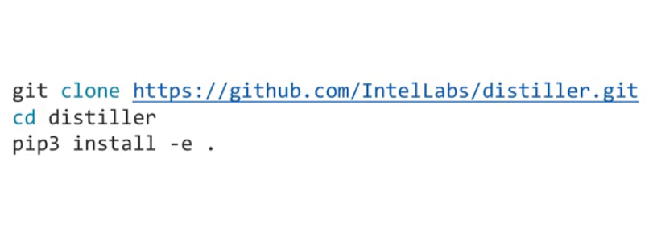
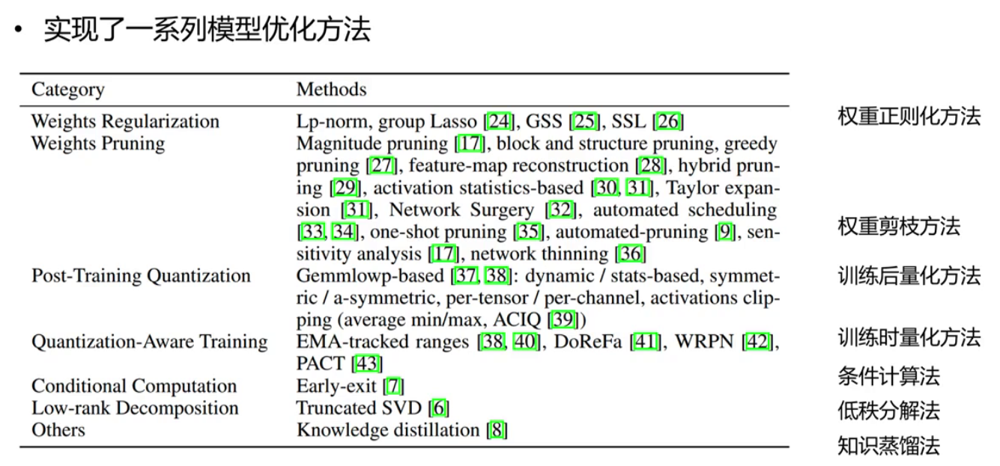
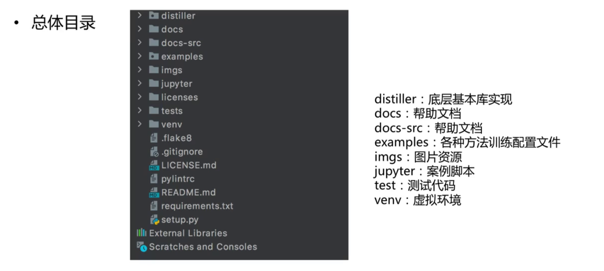
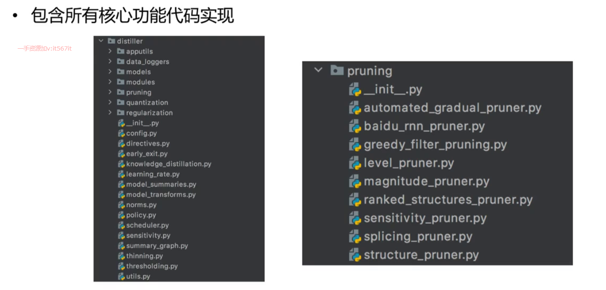
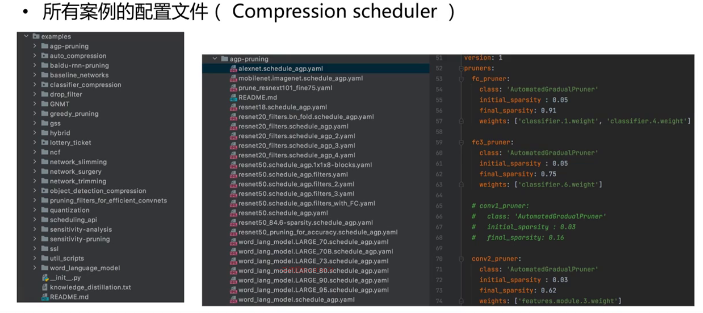
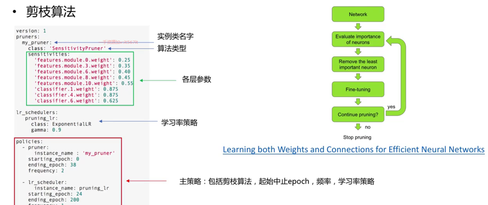

# Distiller学习-初认识

## 简介

* Intel AILab的神经网络压缩框架，建立在Pytorch基础上
  

## 安装

  

## 压缩方法

* 权重正则化方法
* 权重剪枝方法
* 训练后量化方法
* 训练时量化方法
* 条件计算
* 低质分解方法
* 知识蒸馏方法

  

## 总体目录

  

## 核心代码实现

  

## 所有案例的配置文件
  

## 举例

* 初始化网络
* 评价网络模型的参数重要性
* 移除不重要的神经元 
* fine-tuning
* 继续剪枝 重新训练

  

