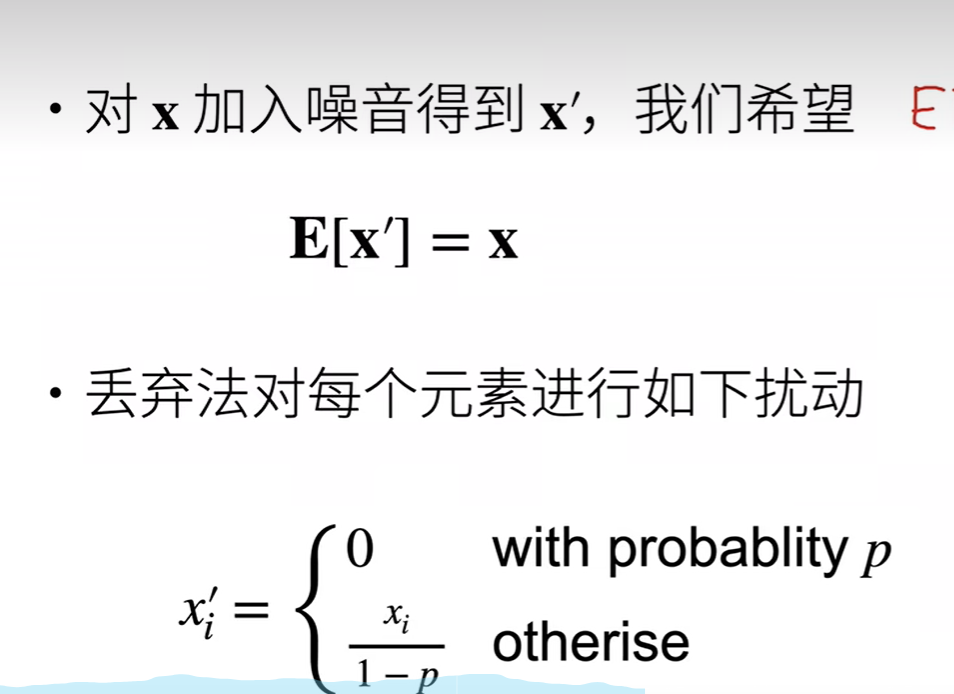
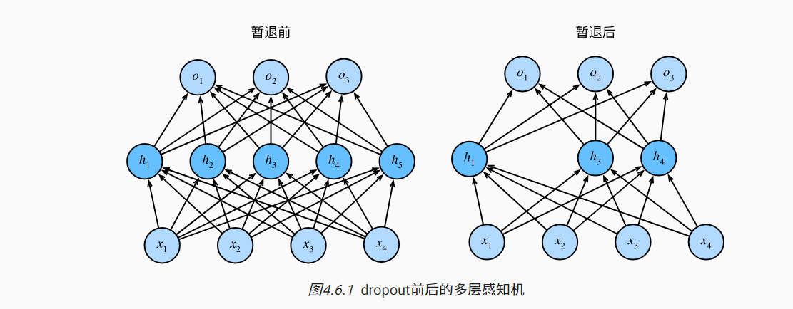
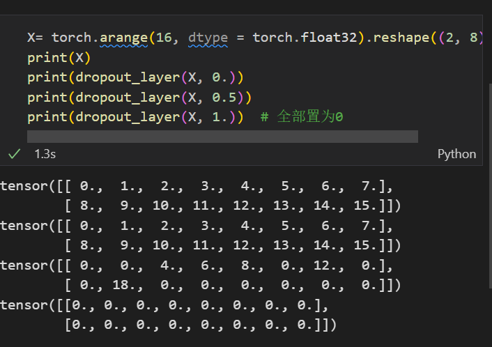

# Dropout

## 扰动的稳健性

* 好的预测模型：为了缩小训练和测试性能之间的差距，应该以简单的模型为目标
* 简单性：函数不对输入的微小变化敏感， 例如，当我们对图像进行分类时，我们预计向像素添加一些随机噪声应该是基本无影响的
*  具有输入噪声的训练等价于Tikhonov正则化
*  实际加噪声： 在训练过程中，他们建议在计算后续层之前向网络的每一层注入噪声。 因为当训练一个有多层的深层网络时，注入噪声只会在输入-输出映射上增强平滑性。

## 暂退法

* 暂退法：暂退法在前向传播过程中，计算每一个内部层的同时注入噪声，这已经成为训练神经网络的常用技术。之所以被称之为暂退法，是因为从表面看丢弃了训练过程中的一些神经元，然后在整个训练过程中的每一次迭代中，标准暂退法包括在计算下一层之前将当前层中的一些节点置0。

* 如何注入噪声：**无偏向的方式注入噪声，那么这样在固定其他层的时候，每一层的期望值等于没有噪音时的值**
* 将高斯噪声添加到线性模型的输入中，在每一次训练迭代中，将均值为0 的分布，采样噪声添加到输入x 从而产生扰动点
* Dropout可以比较有效的缓解过拟合的发生，在一定程度上达到正则化的效果。

  

  

**正则项只在训练中进行使用，他们影响模型参数的更新**

**Dropout可以作为训练深度神经网络的一种trick供选择。在每个训练批次中，通过忽略一半的特征检测器（让一半的隐层节点值为0），可以明显地减少过拟合现象。这种方式可以减少特征检测器（隐层节点）间的相互作用，检测器相互作用是指某些检测器依赖其他检测器才能发挥作用。Dropout说的简单一点就是：我们在前向传播的时候，让某个神经元的激活值以一定的概率p停止工作，这样可以使模型泛化性更强，因为它不会太依赖某些局部的特征，**


## 总结

* dropout 将一些输出项随机置0来控制模型的复杂度
* 常作用在多层感知机的隐藏层输出上
* 丢弃概率是控制模型复杂度的超参数

## 简单测试

```py
# 以dropout的概率丢弃张量输入X中的元素，重新缩放剩余部分：将剩余部分除以1.0- dropout

def dropout_layer(X,dropout):
    assert 0 <= dropout <= 1

    # 如果dropout 是1 将所有的x元素置为0
    if dropout == 1:
        return torch.zeros_like(X)
    
    #  在本情况中  所有元素都将被保留
    if dropout == 0:
        return X
    
    # 在 0  1之间 
    # 使用torch.rand创建一个与X形状相同的二值掩码张量，掩码张量中的每一个元素
    # 以概率1 - dropout 设置为1 否则是0  
    # 该掩码张量决定了dropout过程中那些元素被保留 那些元素被丢弃
    mask = (torch.rand(X.shape) > dropout).float()

    # 掩码张量和X进行相乘  将被丢弃的元素置为0
    return mask * X / (1.0 - dropout)


```

  

## 多层感知机中的使用

### 定义模型参数

 我们定义具有两个隐藏层的多层感知机，每个隐藏层包含256个单元。


 ### 定义模型

 &emsp;将暂退法应用于每一个隐藏层的输出（在激活函数之后）并且可以为每一层分别设置暂退概率：常见的技巧是在靠近输入层的地方设置较低的暂退概率，下面的模型将第一个和第二个隐藏层的暂退概率分别设置为0.2 和0.5  并且暂退法只在训练期间有效果

 ```py
dropout1, dropout2 = 0.2, 0.5

class Net(nn.Module):
    def __init__(self, num_inputs, num_outputs, num_hiddens1, num_hiddens2,
                 is_training = True):
        super(Net, self).__init__()
        self.num_inputs = num_inputs
        self.training = is_training
        self.lin1 = nn.Linear(num_inputs, num_hiddens1)
        self.lin2 = nn.Linear(num_hiddens1, num_hiddens2)
        self.lin3 = nn.Linear(num_hiddens2, num_outputs)
        self.relu = nn.ReLU()

    def forward(self, X):
        H1 = self.relu(self.lin1(X.reshape((-1, self.num_inputs))))
        # 只有在训练模型时才使用dropout
        if self.training == True:
            # 在第一个全连接层之后添加一个dropout层
            H1 = dropout_layer(H1, dropout1)
        H2 = self.relu(self.lin2(H1))
        if self.training == True:
            # 在第二个全连接层之后添加一个dropout层
            H2 = dropout_layer(H2, dropout2)
        out = self.lin3(H2)
        return out


net = Net(num_inputs, num_outputs, num_hiddens1, num_hiddens2)

 ```

## 训练和测试

```py

num_epochs, lr, batch_size = 10, 0.5, 256
loss = nn.CrossEntropyLoss(reduction='none')
train_iter, test_iter = d2l.load_data_fashion_mnist(batch_size)
trainer = torch.optim.SGD(net.parameters(), lr=lr)
d2l.train_ch3(net, train_iter, test_iter, loss, num_epochs, trainer)
```

## 简介实现

```py
# 简单首先  在每一个全连接层之后添加一个dropout层
net = nn.Sequential(nn.Flatten(),
                    nn.Linear(784,256),
                    nn.ReLU(),
                    nn.Dropout(dropout1),
                    nn.Linear(256,256),
                    nn.ReLU(),
                    nn.Dropout(dropout2),
                    nn.Linear(256,10))


def init_weights(m):
    if type(m) == nn.Linear:
        nn.init.normal_(m.weight,std = 0.01)

net.apply(init_weights)
trainer = torch.optim.SGD(net.parameters(), lr=lr)
d2l.train_ch3(net, train_iter, test_iter, loss, num_epochs, trainer)

```


