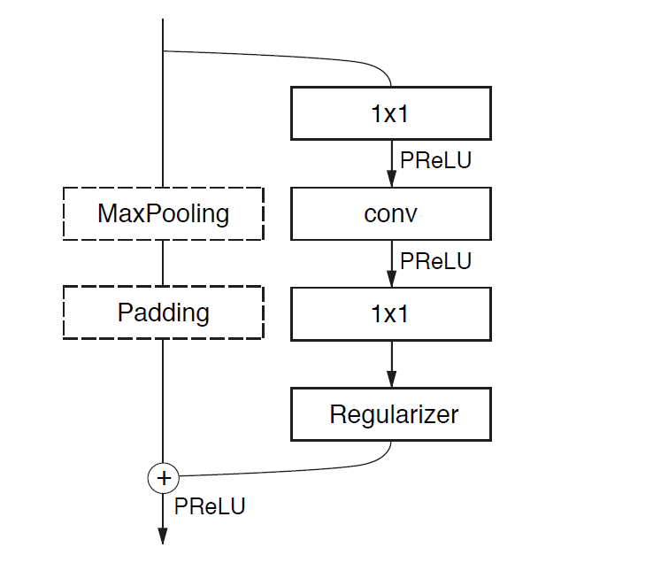
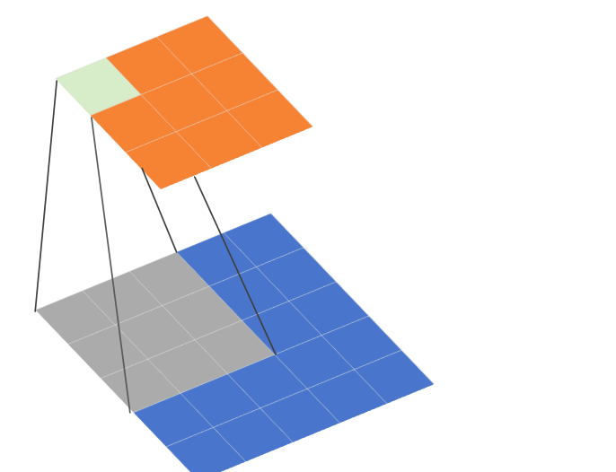

# ENet: A Deep Neural Network Architecture for Real-Time Semantic Segmentation

**本文介绍了目前最快的图像分割网络ENet,使用大量的trick**

## 摘要

&emsp;在边缘设备中，实时计算能力很重要，针对该任务的深度神经网络的缺点是需要大量的浮点计算，并且运行时间长，阻碍了其可用性

* 本文提出ENet高效神经网络的新型深度神经网络结构，专门针对要求低延迟操作的任务而创建。
* ENet的速度提高了18倍，所需要的Flop减少了75倍，参数减少了79倍，并且提供了与现有模型相似或者更高的精度。

## 引言

* 原来的对图像进行空间分类和精细分割架构：SegNet或者完全卷积网络 这些都是基于VGG16，但是这些架构是为了多类分类而设计的超大型模型，那么这些模型就有大量的参数和长推理时间的网络。
* ENET 快速推理和高精度而优化的新神经网络架构

## 网络结构

### ENet中bottleneck module

  

左边的是辅助 右边的是主要

### 五个stage

#### 初始化模块

  

左边使用十三个卷积核进行卷积操作，右边是MaxPooling，最后得到三个通道，将两边的结果concat一起，做通道合并，这样可以减少存储空间

#### stage 1

**属于encoder阶段，包括五个BottleNeck,第一个BottleNeck对输入做了下采样，后面有四个重复的bottleneck**

#### stage 2-3

**属于encoder阶段，stage2的bottle2.0做了下采样，后面加上空洞卷积或者分解卷积，stage3没有下采样，其他都是一样的**

#### stage 4-5
**属于decoder阶段。比较简单 一个上采样配置两个普通的bottleneck**

* 模型架构在任何投影上都没有使用bias,这样可以减少内核调用和存储操作
* 每个卷积操作中使用Batch Norm
* encoder阶段是使用padding配合max pooling做下采样
* decoder时使用max unpooling配合空洞卷积完成上采样

### 介绍encoder

* 下采样的bottleNeck
  * 降采样 图像大小变为128 x 128
  * 然后是卷积操作 conv是普通的卷积操作  asymmetric表示分解卷积，Dilated是空洞卷积
  * 每一个bottleneck都会先降低维度 经过卷积操作之后 升维
  * 每个卷积层之后都跟上batch norm 和PReLU操作

* 辅助线包括最大池化和padding操作 最大池化负责提取上下文信息
  * padding负责填充通道，然后达到后续的残差融合，融合之后进行PReLU操作

* 非下采样的bottleNeck
  * 主线包括三个卷积层
  * 首先是1x1 降维度
  * 然后是三种卷积
  * 最后是生维度
  *  batch norm PReLU

### 各种trick

* 为了较少内核调用和存储操作，作者的网络架构没有使用bias,只有weights。
* Feature map resolution
  * 对图像进行下采样会丢失特征信息
  * 使用空洞卷积，扩大感受野，可以收集更多的信息
* Early downsampling
  * 处理尺寸比较大的图像会耗费大量的计算资源
  * ENet的初始化模型会大大减少输入的大小，**因为视觉信息在空间上是高度冗余的，可以压缩成为更有效地表示方式**

* Decoder size
  * 作者的Encoder和Decoder不是镜像对称的，网络的大部分实现Encoder，较少部分实现Decoder。Encoder主要进行信息处理和过滤，而Encoder上采样编码器的输出，并进行细节微调。

* Nonlinear operations
  * 一般在卷积层之前做ReLU和Batch Norm效果会好点，但是在ENet上使用ReLU却降低了精度。
  * ENet的层数很少，所以使用PReLU

* Information-preserving dimensionality changes
  * 在初始化阶段，作者使用3 * 3 CNN 和maxpolling做并行操作 然后针对特征图进行contact操作，作者发现加速十倍时间

* 分解卷积
  * 将n × n 的卷积核拆为n × 1和1 × n (Inception V3提出的)。可以有效的减少参数量，并提高模型感受野。

* 空洞卷积

* SpatialDropout
  * 普通的dropout 会随机将这部分元素置为0，而SpatialDropout会随机将这部分区域的所有元素置为0
  * 

普通的dropout
  

Spatial Dropout:普通的dropout会随机独立地将部分元素置零，而SpatialDropout1D会随机地对某个特定的纬度全部置零

  

  

### 关于空洞卷积

* 卷积核大小为3 x 3 步长stride = 1 r = 2, r称之为膨胀因子。当r=1，表示卷积核各元素之间没有空隙，也就是相邻两个元素之间位置相差1，就是正常的卷积
* 这里的r = 2表示卷积核各个元素之间有一个空隙，相邻两个元素之间位置相差1

  

### 为什么使用空洞卷积

**扩大感受野，感受野指的是特征图的一个像素对应原图多少尺寸的像素**

  

* 使用空洞卷积一个关键原因就是可以增大感受野，这样在检测、分割任务中就能对大尺寸物体表现出较好的效果
* 空洞卷积的缺陷主要体现在存在网格效应
