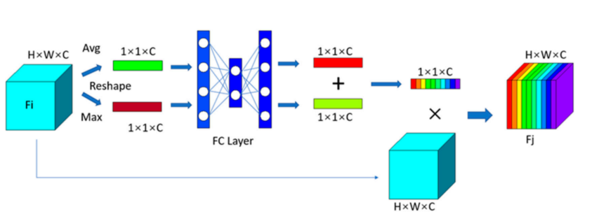

# Fine Classification Method for Massive Microseismic Signals Based on Short-Time Fourier Transform and Deep Learning


## 摘要

背景和问题陈述：

微地震信号是在地震、地质灾害或地下挖掘等过程中由岩体断裂产生的信号。
微地震信号监测中会捕捉到大量噪音信号。
一些噪音信号与微地震信号非常相似，这对于迅速准确地检测微地震信号和评估地质灾害造成了困扰。


解决方案：

提出了一种基于深度学习技术和短时傅里叶变换（STFT）技术的微地震信号识别和分类的精确模型。
使用STFT进行时间-频率分析，揭示了噪音、微地震和爆破信号的独特特征。
引入了注意力机制，将分类重点放在关键信号特征上。
具体步骤和方法：

首先，STFT时间-频率分析有助于在时域中细致地区分与微地震信号非常相似的噪音信号。
其次，引入的注意力机制使分类关注于信号的基本特征。
最后，通过考虑数万个实际监测数据点，在复杂的地质工程条件下训练和测试微地震分类的深度神经网络。
结果：

结果表明神经网络模型具有良好的时间-频率特征提取能力。
在经过充分训练的模型下，可以令人满意地完成每日的分类工作。
模型在分类相似噪音和低信噪比微地震信号时表现良好。
结论和展望：

认为这种考虑多个角度的信号处理方法可以推广到许多其他数据驱动领域的数据处理中。


## 1. Introduction

* 微地震监测的广泛应用：

微地震监测作为一种评估岩体稳定性的新技术，在地下采矿、地下电站、隧道开挖等岩体稳定性关键项目中得到了广泛应用。由于其良好的灾害预警能力，可以确保施工工作的顺利进行，并降低施工成本。

* 微地震监测的目标和原理：

微地震监测的目标是通过检测岩石微裂纹中产生的特定弹性波，从而定量评估岩体的稳定性。
这项技术的应用面临环境影响，而且应用环境通常复杂多变。
信号复杂性和噪音问题：

传感器接收到不同类型的信号，包括独特的噪音（在第2.3和第4.2.2节中将介绍，属于相似噪音 (SN)）。
相似噪音指的是在波形上类似于低信噪比微地震信号的信号。
在实际应用中，即使对于经验丰富的专业分类器来说，从每日信号大量中准确提取微裂纹信号也是耗时的。
特别是在存在独特噪音的情况下，确保准确性变得困难。
困难和需求：

* 多种因素阻碍了信号的分类，使得迅速、准确地识别微地震信号和精确定位震源点成为全球性问题。
文中强调了对于快速且准确分类微地震信号的迫切需求。


```

分析方法的分类：

微地震信号识别方法被分为多参数联合和时频分析方法两类。
统计模型和多特征指标的建立：

Dong等人通过统计分析建立了一个矿山爆破和微地震事件的样本数据库，并建立了一个自动识别多特征指标的统计模型。
基于多源参数和逻辑神经网络的分类算法：

Vallejos提出了一种基于多源参数和逻辑神经网络的矿山微地震和爆破信号分类算法。
基于主成分分析的人工神经网络：

Shang等人提出了一种基于主成分分析的人工神经网络，用于识别微地震信号和矿山爆破信号。
时频分析方法的应用：

近年来，时频分析方法在微地震信号识别中得到了越来越广泛的应用，不断涌现出相关技术。
Lu等人通过傅立叶变换分析了微地震信号的功率和频谱，并提出了一种通过波形识别微地震信号的方法。
经验模态分解（EMD）方法：

EMD是一种自适应分解算法，被应用于提取特征并进行分类。Shang等人使用EMD和奇异值分解提出了一种特征提取和分类方法，并使用支持向量机进行分类，取得了93%的准确度。
小波包分解和分形特征的应用：

Zhu等人使用小波包对信号进行分解，在特定频段获取分形盒维度，并确定不同信号具有明显的分形特征，可以作为分类的依据。
时频特性和波尔均分波变换方法的创新应用：

Zhao等人通过应用波尔均分波变换方法分析了微地震信号和爆破信号的时频特性，研究了能量在子频段的分布特征，构成了微地震信号识别的新应用。
计算机技术的发展对微地震信号处理的影响：

计算机技术的迅速发展改善了人类生活的各个方面，包括引入了大数据处理、人工智能等热门技术到地质行业的数据处理中。
深度学习模型的引入：

Zhang等人和Zhao等人分别提出了三分类（微地震、爆破和噪音）和多分类深度学习神经网络模型，准确度均超过90%。
Ma等人提出了基于人工神经网络中双模神经元的新型分类模型，是深度学习模型从多个角度识别信号的代表。

```


```
多参数联合分析方法的局限性：

多参数联合分析方法虽然具有高精度，但由于参数众多和操作复杂，不适用于快速和实时监测以及早期预警。
时频分析中快速傅里叶变换的挑战：

时频分析中的快速傅里叶变换在描述局部信号特性时面临挑战。
经验模态分解的问题：

经验模态分解显示出过度分解和组件错误的问题。
方法适用范围的局限性：

上述方法主要适用于区分矿山微地震信号和爆破信号，在隧道微地震监测方面的应用较为有限。
在存在相似噪音的情况下的问题：

当存在与岩石微裂纹信号高度相似的独特噪音信号时，分类器容易混淆，影响事件分类的准确性和预警效率。

```

```
处理方法的选择：

为了实现高效且可靠的分类，选择了短时傅里叶变换（STFT）来处理主要数据，其中包括岩石微裂纹信号、高相似度噪音、爆破信号、机械噪音和隧道环境噪音。
深度学习卷积神经网络的应用：

采用了深度学习卷积神经网络作为分类器，该网络具有注意力机制。
通过STFT方法处理后，对成千上万的信号进行学习和测试。
对比实验设计：

在评估关键模型的性能时，使用未经STFT处理的模型作为基准线。
结果呈现：

结果表明，在识别和分类单一信号以及从多个信号中联合识别微地震事件方面，基于时频域识别的模型明显优于基于时域识别的模型。
应用前景：

通过利用人工智能对时频域处理信号的识别，该模型在地震勘探、遥感等领域具有广泛的应用前景，特别是在需要高效信号处理的领域。
```

## 2. Methods and Data Preparation

### 2.1. Short-Time Fourier Transform (STFT)

```java

傅里叶变换作为频谱分析方法：

傅里叶变换是一种常见的频谱分析方法，用于信号处理。
通过将傅里叶变换应用于波形信号，可以获取波形在频率域中的分布，从而提取其频率特征。
傅里叶变换的局限性：

傅里叶变换在提取频率特征的同时，会使得原始时域中的信号特征丢失。
短时傅里叶变换（STFT）的介绍：

短时傅里叶变换是窗口傅里叶变换的一种形式。
STFT通过将原始信号在时域中划分为小节，并在提取每个小节的频率特征后进行重新组合，从而可以从时域和频域两方面提取信号的特征。
STFT的优势：

STFT处理后的信号不仅可以完成频域特征提取，而且在一定程度上保留了时域特征。
```

```java
这段文字指出短时傅里叶变换（STFT）存在一些缺点，主要是不能完全同时保留频域和时域的信息特征。具体而言，当窗口函数的宽度过大时，频率分辨率会增加，但时间分辨率会减小，反之亦然。因此，窗口函数宽度的选择取决于实际需求对于时间或频率域特征的强调。在该研究中，窗口函数的长度被设置为256，并选择了汉明（Hamming）窗口函数。

解析：

STFT的缺点：

STFT不能完全且同时地保留频域和时域的信息特征。
窗口函数的影响：

窗口函数的宽度影响着频率分辨率和时间分辨率的权衡。当窗口函数的宽度增大时，频率分辨率提高，但时间分辨率下降，反之亦然。
窗口函数宽度的选择：

窗口函数宽度的选择受实际需求的影响，即强调时间域特征还是频率域特征。
研究中的具体设置：

在该研究中，窗口函数的长度被设置为256。
汉明窗口函数被选择用于STFT的处理。

```

## 2.2. Analysis of Signal Time-Frequency Characteristics

```java
信号的复杂性：

传感器捕捉到了许多种类和复杂的信号，这些信号受到了建筑环境的影响。
分类的需求：

为了对这些信号进行分类，需要找到微地震和噪音信号之间一个或多个可靠的区分特征。
研究的方法：

研究者通过对时间域和时频域的波形特征进行研究，试图找到这些可靠的区分特征。
图示：

图1展示了六个信号的波形和时域频谱。
事件分类标准：

如果在一个事件中有三个或更多波形被识别为微地震信号，那么将该事件视为微地震事件。

```

```java
微地震信号：

图1a和b展示了高信噪比和低信噪比的微地震信号，它们在波形上表现为短暂的密集振荡，然后迅速消失，尾波不发展。
振幅范围从几十到2000毫伏（mV）不等。
时间谱分析显示，这些微地震信号的能量成分主要集中在500赫兹以上。
特殊类型的噪音（Highly SN）：

图1c展示了一种特殊类型的噪音，它在波形上类似于低信噪比的岩石微裂纹信号。
这种噪音具有短振荡持续时间和最大振幅，类似于低信噪比的微地震信号。
时间谱分析表明，这种噪音的能量成分主要集中在500赫兹以下。
爆破产生的冲击波：

图1d展示了爆破产生的冲击波，其特点是波形持续时间长、振幅大，并且具有相对丰富的频率成分。
机械噪音：

图1e展示了具有突出特征的机械噪音，包括规律的多次连续冲击。其单次冲击也类似于低信噪比的微地震信号。
频率成分主要分布在0–600赫兹范围内。
环境噪音：

图1f呈现了密集且无序的高斯环境噪音，其持续时间覆盖整个信号周期。振幅通常较低且易于区分，但频率成分复杂。

```

```

时域波形分析：

在时域波形中，低信噪比的岩石微裂纹信号与上文介绍的独特噪音信号非常相似。
时频域频率分析：

尽管在时域波形中它们相似，但在时频域频率上有明显差异。
具体而言，岩石微裂纹信号的频率分量总是高于500赫兹，而独特噪音的频率上限似乎低于500赫兹。
信号持续时间分析：

岩石微裂纹信号的持续时间非常简洁，呈现单峰，其峰值后的余波迅速衰减。
相比之下，独特噪音波形与低信噪比的岩石微裂纹信号波形相似，但通常呈现多个峰值。
区分不同噪音类型：

对于爆破、机械和环境噪音信号，它们在时域和时频域上都表现出明显的差异，因此容易被分类器识别。
分类器的应用：

通过在时域中仅对微地震信号进行区分，可以去除大多数噪音信号。
然而，要区分低信噪比的微地震信号和特殊噪音是具有挑战性的。
因此，通过同时利用时域和频域特征，可以实现足够的信号分类准确度。
```

## 2.3. Attention Mechanism

&emsp;通过引入注意力机制和合理配置计算机资源，研究者确保了模型能够有效地学习不同信号的特征，特别是在面对持续时间差异时。这有助于提高模型的性能和准确度。

&emsp;这段文字解释了注意力机制的原理，该原理借鉴了人类在接收信息时对于过度关注的倾向。为了获取完整的描述，人类关注描述中相对重要和有趣的部分，而相对不重要的信息描述则受到较少的关注。在机器学习中，当将注意力机制添加到神经网络中时，计算机在学习过程中专注于学习输入特征中相对重要的部分。该方法涉及对不同特征部分分配权重，然后根据权重的比例为每个部分分配计算资源。相比之下，没有注意力机制的神经网络将相同数量的计算资源分配给特征的每个部分

&emsp;采用卷积块注意力模块，特别是包括通道注意力和空间注意力，有助于模型更有效地学习输入数据中不同通道和空间位置的重要信息。这种注意力机制有助于提高模型性能


&emsp;采用卷积块注意力模块，其中包括通道注意力和空间注意力，有助于模型更全面、有针对性地关注输入数据的不同方面，提高了模型的学习能力和性能。这种注意力机制在卷积神经网络中广泛应用，用于增强网络对重要特征的关注。

  

  


```java
通道注意力模块：

通道注意力模块旨在识别输入特征中的有意义的部分。
通过对输入特征进行平均池化和最大池化操作，降低特征的维度以有效计算通道注意力。平均池化减少了输入特征的维度，最大池化突出了输入特征的独特性，并在通道上精炼了注意力。
通过全连接网络，得到两个特征图，然后这两个特征图叠加在一起。通过应用 sigmoid 激活函数，确保每个部分的权重之和等于1。
在输入特征矩阵与得到的权重矩阵相乘之前，成功分配了特征矩阵的每个部分的权重。这意味着在相对重要的部分加强了特征，在相对不重要的部分减弱了特征。
空间注意力模块：

空间注意力模块侧重于聚焦在最具信息的部分，这与通道注意力相辅相成。
首先，沿着通道轴应用平均和最大池化操作，然后将两个特征图连接在一起以生成有效的特征描述。
接着，利用卷积层生成空间注意力图，该图对需要强调或抑制的位置进行编码。
最后，在主要输入与得到的权重图相乘之后，生成带有权重分布的特征。
VGG13 修改网络：

文中提到了对VGG13网络的修改，VGG Net是由牛津大学视觉几何组（Visual Geometry Group）提出的深度卷积神经网络，在2014年的ImageNet比赛中获得了亚军。


```
```java
单一信号数据类型：

微震监测设备接收到的单一信号数据类型是 (30,000, 1)，即一个由30,000个数字组成的一维向量。
STFT 转换后的数据类型：

经过短时傅里叶变换（STFT）转换后，单一信号的数据类型变为 (129, 236, 2)。
这表示每个信号经过STFT处理后，产生了一个129行、236列、2通道的数据。
数据集包含的数据点：

经过STFT转换后，数据集包含13,824个时频信号数据点，其中包括6616个微震数据点和7208个噪声数据点（500个噪声信号）。
训练集和验证集划分：

数据集被随机划分为训练集和验证集。
训练集包含11,059个数据点，其中包括5308个微震数据点和5751个噪声数据点。
验证集包含2765个数据点，其中包括1308个微震数据点和1457个噪声数据点。
噪声数据中的SN（Signal-to-Noise Ratio）：

在训练集中，SN应该约为400个数据点。
在验证集中，SN应该约为100个数据点。

```
  

```java
泛化能力评估标准：

提到一个好的模型应该具有良好的泛化能力。泛化能力是指模型在未见过的数据上的表现能力。
性能指标的选择：

指出不同任务使用不同的性能指标来评估模型。在二分类任务中，通常使用召回率（recall）、精确率（precision）和 F1 分数（F1 score）来评估模型的泛化性能。
性能比较方法：

提到通过接收操作特征曲线（ROC）和基于真正例率（TPR）和假正例率（FPR）的 ROC 曲线下面积（AUC）进行了对模型的全面性能比较。
ROC 曲线是一种用于衡量二分类模型性能的图形工具，而 AUC 表示 ROC 曲线下的面积，用于量化分类器在不同阈值下的整体性能。

```

&emsp;TMC（时间域模型）和TFMC（时频域模型）在分类爆破信号和高斯噪声信号方面的性能表现（见表格5和表格6）。结果显示，在适当的训练后，TMC和TFMC模型在分类爆破信号和高斯噪声信号方面均取得了出色的性能。然而，TFMC模型的性能更好，特别是在爆破信号的识别方面；它没有错误地将爆破信号识别为地震信号，并且对于其余信号的准确率超过了96%。

  

## 总结
&emsp;
基于短时傅里叶时频分析和深度学习的微震信号分类方法实现了快速计算和高准确性。在深埋隧道的微震监测中，有助于自动智能地处理海量微震数据，减少冗余的人工工作，并提高隧道灾害评估和预警的效果。这种基于深度学习的信号处理方法具有高效性，并能够阐释许多传统数据驱动领域存在的不确定性，如雷达检测信号、地震波和个人识别等。
