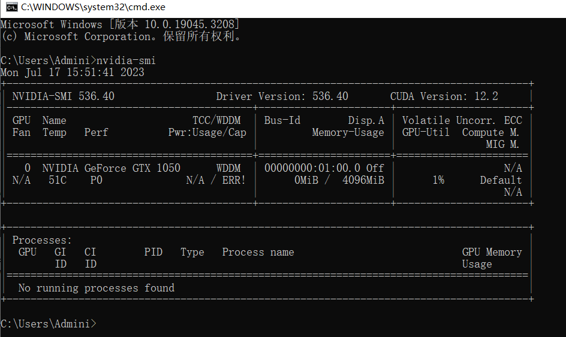

# 【动手学深度学习】GPU初步认识与使用

## 查看显卡

使用nvidia-smi命令来查看显卡信息

  


&emsp;pytorch中每一个数组都有一个设备，将其称之为环境，那么默认情况下都是在CPU上，有时候环境是GPU


## 计算设备

&emsp;默认情况下，张量是在内存中创建的，然后使用CPU计算它。

**CPU和GPU可以用torch.device('cpu') 和torch.device('cuda')表示。 应该注意的是，cpu设备意味着所有物理CPU和内存， 这意味着PyTorch的计算将尝试使用所有CPU核心。 然而，gpu设备只代表一个卡和相应的显存。 如果有多个GPU，我们使用torch.device(f'cuda:{i}') 来表示第块GPU（从0开始）。 另外，cuda:0和cuda是等价的。**

```py
# 使用cpu
print(torch.device('cpu'))

# 使用gpu
print(torch.device(type='cuda'))

# 表示使用第1块gpu
print(torch.device('cuda:1'))

# 查询可用gpu的数量
torch.cuda.device_count()

```


&emsp;现在我们定义了两个方便的函数， 这两个函数允许我们在不存在所需所有GPU的情况下运行代码。


```py
def try_gpu(i=0):  #@save
    """如果存在，则返回gpu(i)，否则返回cpu()"""
    if torch.cuda.device_count() >= i + 1:
        return torch.device(f'cuda:{i}')
    return torch.device('cpu')

def try_all_gpus():  #@save
    """返回所有可用的GPU，如果没有GPU，则返回[cpu(),]"""
    devices = [torch.device(f'cuda:{i}')
             for i in range(torch.cuda.device_count())]
    return devices if devices else [torch.device('cpu')]

try_gpu(), try_gpu(10), try_all_gpus()

```

## 张量与GPU


查询张量所在的设备，默认在cpu创建的，需要注意的是，无论何时我们要对多个项进行操作， 它们都必须在同一个设备上
```py
x = torch.tensor([1,2,3])
x.device
```


在GPU上面创建张量
```py
X = torch.ones(2,3,device=try_gpu())
X.device
X

```

在第二个GPU上面创建张量

```py

Y = torch.rand(2, 3, device=try_gpu(1))
Y
```


## 神经网络与GPU

神经网络模型可以指定设备，下面的代码将模型参数放在GPU
```py
net = nn.Sequential(nn.Linear(3,1))
net = net.to(device=try_gpu())  # 设置gpu

net(X)

```

确认模型的所有参数在同一个gpu设备上
```
net[0].weight.data.device
```