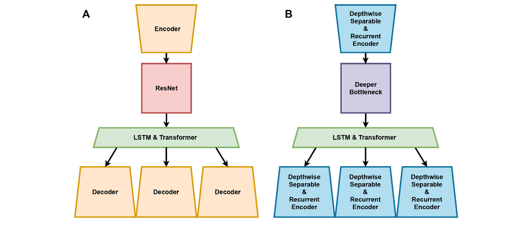

# LEQNet: Light Earthquake Deep Neural Network for Earthquake Detection and Phase Picking 论文阅读笔记


## 摘要

* 本文设计一个轻量级的深度神经网络模型
* 该模型可以在轻量级边缘设备运行
* 使用更深的瓶颈 递归结构 深度可分离卷积减少了深度学习模型的大小
* 使用斯坦福地震数据集训练
* 对标EQTransformer 模型大小减小了87.68% 但是我们的模型的性能与EQTransformer的性能相当

## INTRODUCTION

* 传统的P/S波检测方法：STA/LTA 使用连续地震波行振幅的短期和长期平均值处理地震信号，缺点:需要出去地震监测设备的地理位置和环境造成的各种噪声
* PhaseNet EQTransformer都是使用深度学习方法检测地震信号
* EQTransformer使用一个编码器和三个解码器组成 他们压缩和恢复数据，使用长短期记忆网络LSTM和注意力机制连接，EQTransoformer模型输出地震和P/S波的概率统计图

  

&emsp;上图绿色虚线表示地震的概率，蓝色虚线表示P波起点，红色虚线表示S波起点


* 尽管EQTransformer模型可以以高精度检测地震和P/S相位拾取，但是几乎不可能在配备有限计算资源的地震仪器上部署
* LEQNET使用各种轻量级的深度学习技术，比如递归 更深的瓶颈  深度可分离卷积  来减少深度学习模型的大小，使用STEAD数据集评估系统  LEQNET不仅大大减少了参数，而且没有显著的性能下降

* LEQNet 包括四个主要部分：使用具有循环 CNN 的深度可分离卷积的编码器，这是一种使用具有循环 CNN、剩余瓶颈 CNN 和 LSTM & Transformer 的深度可分离 CNN 的解码器

  

## 基线模型 EQTransformer

* EQTransformer使用编码器、解码器、ResNet 和 LSTM 和 Transformer 设计的的结构。编码器由七个卷积神经网络 (CNN) 层组成。在地震信号方面，这将STEAD地震信号数据降低到较低维度，并允许减少模型中的参数数量

* EQTransformer有三个解码器，ResNet有五个残差块组成，每一个残差块输出在两个线性连接的CNN层中添加输入和输出。**残差的引入避免由大量的层引起的性能下降**，LSTM学习编码器提取的顺序特征，该网络将地震信号的特征携带到每一个解码器


* EQTransformer 结构总共使用 323,063 个参数的 。编码器总共使用了 34672 个参数，ResNet 使用了 109,696 个，LSTM 和 Transformer 使用了 42,372 个参数。


## LEQNET用到的技术

* LEQNet 包括四个主要部分：使用具有循环 CNN 的深度可分离卷积的编码器，这是一种使用具有循环 CNN、剩余瓶颈 CNN 和 LSTM以及 Transformer 的深度可分离 CNN 的解码器。

下图展示的每一个部分的参数量：
  

## 模型轻量级技术

### Depthwise Separable CNN 深度可分离卷积

* 逐个通道卷积  参数量 3 x 3 x 3 = 27
  

* 逐点卷积 1 x 1 x 3 x 4 = 12

  

* 常规卷积  4 × 3 × 3 × 3 = 108

* 深度卷积通过每个通道执行卷积操作提取通道特征，因此输入和输出通道包含相同数量的通道

* 逐点卷积压缩每个通道内相同位置的数据。提取通道之间的特征，控制输入和输出之间的通道数，当CNN中的卷积操作在多个通道之间冗余执行时，深度可分离卷积减少通道之间所需要的大量计算

### 更深层次的瓶颈架构BottleNeck

**利用多个小卷积核代替一个大的卷积核，大大减少参数量,他是一种特殊的残差结构**

  


  


* 第一种直接使用 3 x 3卷积核 256维的输入经过卷积层，输出得到一个256的feature map  参数量：256 x 3 x 3 x 256 = 589824
* 第二种先使用1x1 在使用3 x 3 再使用1x 1 ,参数量256 x 1 x 1 x 64 + 64 x 3 x 3 x 64 + 64 x 1 x 1 x 256 = 69632


* 参数量大大减少！


### Recurrent CNN 递归CNN

* 递归CNN是一个重用CNN层输出的概念
* 要使用递归CNN 输入和输出的通道数需要相等 并且核形状相同
* 我们将递归CNN分别应用于编码器和解码器  通过重用参数减小模型的大小
* 其中卷积层被重复使用，而不需要引入新层来获得更好的性能,由于重复使用层，因此节省了大量的参数
* 可以降低内存访问成本（MAC），因为重用的层参数只能获取一次


论文：
```
Convolutional Neural Networks with Layer Reuse

```


  


## LEQNET


* 从STEAD采样的50000组地震数据和噪声数据学习了一个检测模型，并且将学习过程重复了十个周期
* 地震探测概率以及P和S相位拾取的阈值设置为探测概率=0.5、 P = 0.3和S=0.3 对标EQTransformer


### 结构

* 深度可分离卷积  应用于特征压缩和解压缩步骤中的编码器和解码器
* 更深的的瓶颈
* 递归CNN  由于只获取一次参数 大大降低了内存访问时间和减小模型
  
  


* LEQNET中的编码器和解码器由四层 BottleNeck由四层，编码器的输出通道数是32，和输入通道数相似，EQTransformer是64


### 模型尺寸减小

&emsp;LEQNet通过轻量级技术大大减少了参数数量和计算时间，和EQTransformer相比较，本研究的LEQNet的参数数量减少了88%。计算浮点运算的数量从79687040减少到5271488。与EQTransformer相比，这些结果将模型大小减少了约79%（4.5MB减小到0.94MB）


## 性能比较

* 将LEQNet对比其他方法EQTransformer PhaseNet  Yews  STA/LTA方法
* LEQNet和EQTransformer的F1得分几乎差不多
* LEQNet在P震相拾取的时候比PhaseNet高0.02分，在S震相拾取的时候高0.03分

  


  

## 讨论

* 与EQTransformer相比，CNN层中的参数数量减少了87.68%,模型的优化是通过应用深度可分离卷积和递归CNN来实现
* 减少ResNet中输出通道的数量也有助于减少LEQNet中的参数数量，但是当编码器和解码器中的一些参数减少时，性能下降，为了解决这个问题，模型中是用来更深层次的瓶颈架构EQTransformer，这增加了LEQNet的信息密度和Netscore


