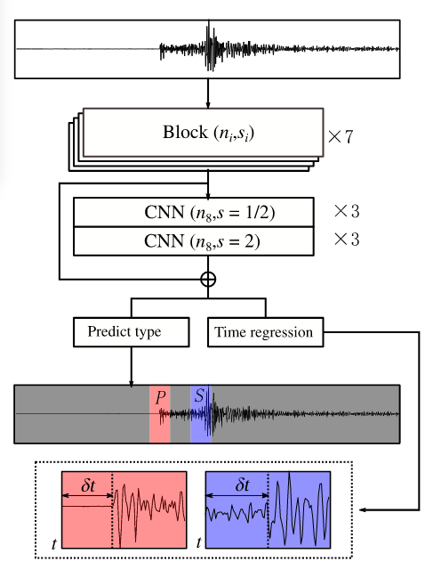
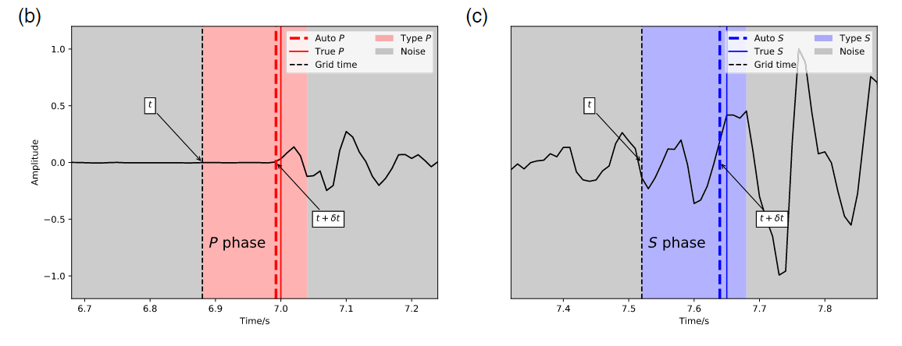

# LPPN论文阅读笔记

LPPN: A Lightweight Network for Fast Phase Picking

## 背景

&emsp;深度学习模型的问题在于计算复杂度较高，在实际数据处理中需要面临较高的处理代价，且需要专用的加速处理设备，如GPU。随着数据累积，迫切需要设计一种能够保证精度的轻量化高速震相拾取模型，以提高处理海量数据的效率，这种模型同时可以方便地部署在设备端。

* 具有更少的训练参数和轻量级网络在处理大规模数据集所需要
* 轻量级网络保证CPU上的运行效率
* 轻量级网络也减少训练所需要的标记数量
* 嵌入式系统总是需要比较小的内存需求模型，轻量级网路的模型尺寸比较小，适合嵌入到现场进行地震信号处理
* LPPN使用深度可分离卷积的优化减少模型参数 提高性能
* 渴求轻量级网络和传统方法相当的拾取精度以及比较高的速度实现

**LPPN首先对一小部分的波形的相位类型进行分类，然后使用回归输出所需要相位的准确起始时间。该结构使用深度卷积的优化减少了模型参数并且提高性能**

## 模型设计

* 相位选择包括两个任务：相位确定和起始时间选择
* LPPN完成两个工作：确定时间序列小区间的相位类型和选择期望相位的时间，分别对应分类问题和回归问题
* 深度神经网络根据从标记波形中学习到的特征来选择相位。特征数量和感受野是影响网络性能的两个重要因素。
* 虽然更多的特征可以更好地描述波形，但是也会导致更高的计算成本，适当数量有助于不降低性能的情况下提高效率
* 对于地震图，可以将**感受野视为提取特征的时间窗口长度**。接受野是CNN针对输入控件特定特征所关注的区域
* 对于相位选择，来自更广泛的感受野的特征可以提高对P/S或噪声的分类可靠性

## 模型架构

* 大多数相位拾取网络将输出每一个输入数据点的概率，那么**LPPN的思路是输出连续的几个点的相位类型概率**，降低计算成本
* 首先确定是否存在所需的相位，然后选择相位时间
* 如果输入的地震图长度是T个点，LPPN的总下采样率是S，那么有T/S概率输出 S是步长，每一个输出都是原始波形的一个小片段的概率，然后确定它所属的类型。第I个输出代表从Is到is + S - 1的S个采样点的概率，is是数据采样点的索引，对应于时间ti。那么准确的相位到达可能不精确的从ti开始。

* 分类和回归都是基于从连续T点提取的特征，但是输出将减少到由步幅控制的T/S
* 100HZ 30.71S  采样点是3072,那么采取大约30s的窗口来确保用于特征提取的足够长度。

  

* 分类的损失使用交叉熵损失函数
* 回归的损失函数使用均方差损失

## LPPN的网络优化

* LPPN设计用于在各种设备上运行，在训练时可以配置特征数量和步长，网络内部也进行优化
* n代表模型的特征数目
* 特征提取是通过七个CNN块进行的，每一个块执行两个任务：使用前一个块的特征并执行下采样来减少输出的长度，同时它扩展了特征的数量来恢复长度，将足够信息传递给下一个层。
* 每一个块包括两个点卷积层和一个深度卷积层，形成一个卷积单元来取代传统的CNN卷积层，这样的优化将参数数量减少45%
* 特征提取的输出被进一步输入到扩大感受野模块中，该模块使用三个下采样层和三个上采样层组成

## LPPN的训练与性能评估
* 对比PhaseNet数据集
* 使用STEAD数据集
* 评价指标
  * 预测和标记到达时间之间的时间残差的精度 召回率 平均值 标准差

* one-hot向量：p [0,1,0]  s[0,0,1] 噪声[1,0,0]

  

* 真正的P到时位于该段内部，表明相位分类是正确的
* 时间窗口是0.16s 说明窗口有16个点，
* 分段的初始时间t在真正的P时间拾取之前，在加上回归模块提供的&t之后，预测的P时间更加接近真实的P时间
* LPPN 可以使用不同的步长来节省内存占用并且加快相位拾取，但是较大的步长也会演唱回归的时间窗口，可能会导致比较低的精度
* 测试发现，步长为16的中等模型可以在模型性能和计算成本方面提供平衡的配置

* 对于所有模型，精度和召回率都随着信噪比的增加而增加，并且对于高信噪比，差异较小。对于低信噪比的波形，所有模型都表现出比较差的性能，但是参数比较多、步幅比较小的模型通常比其他模型更好，**表明LPPN模型更适合处理期望比较低的SNR波形数据**

## 讨论

* LPPN是从目标检测模型修改来处理地震波形的。LPPN只输出S个连续点的一个概率来预测相位类型，而不是每个输入点的输出概率。
* 可训练参数的数量表示模型的大小，内存需要存储这些参数，那么较大的步幅将减少内存需求
* 当模型被训练并且应用于真实的数据集之后，模型的性能会下降，可以通过添加一些局部样本，通过迁移学习提高性能

##  STanford EArthquake Dataset (STEAD): A Global Data Set of Seismic Signals for AI 

斯坦福地震数据集

* 局部地震波形（350km地震内）
* 没有地震信号的地震噪声波形
* 地震通常由配备一个垂直和两个正交水平传感器的三分量一起记录
* 第一个到达的脉冲是P波
* 地震并不是产生地震波的唯一来源。
* 尽管有数百TB的存档地震波形数据和数千万个人类拾取参数可用，但还没有存在用于地震波形的大型高质量标记基准数据集
* 每个模型都使用不同的数据集进行训练和演示其性能。在没有标准基准的情况下，作者设置了自己的评估性能标准。这抑制了进展，因为它很难确定每种方法的相对性能以及优缺点

