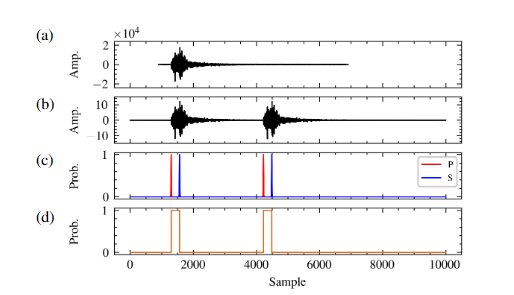
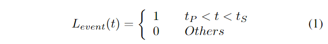
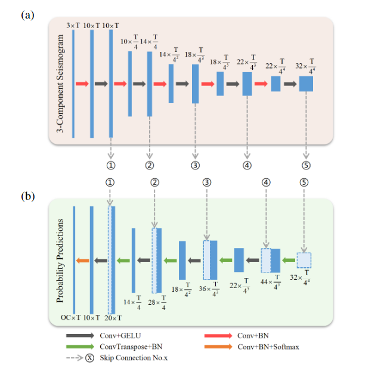
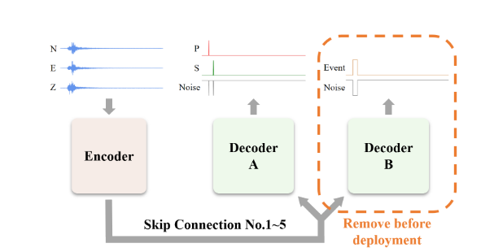
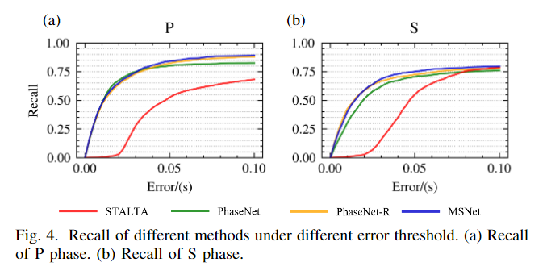

# 论文阅读笔记：MSNet: A Seismic Phase Picking Network Applicable to Microseismic Monitoring

## 摘要

* MSNet的微震相位拾取的全卷积网络
* 从模型结构、训练数据、训练策略三个方面提高模型的性能
* MSNet有两个解码器来允许辅助学习，其结构参考了最先进的全卷积网络进行了改进
* 使用STEDAD数据进行训练
* 在训练过程中，采用一种特殊的提前停止策略来获得具有最佳泛化性能的模型(发现测试集loss开始上升直接停止训练，使用当前参数)

## introduction

* 经典震相拾取算法
* 最典型的是短期平均/长期平均(STA/LTA)，它们不需要太多的计算，但很难获得准确的到达时间
* 利用赤池信息准则(Akaike information criterion, AIC)的算法从熵的角度判断到达时间。与基于振幅的算法相比，它们具有更高的时间精度
* UNet[10]的架构进行了改进，以处理一维时间序列波形数据
* Soto等[11]提出了一种从局部地震中检测和提取P、S地震相的两阶段方
* Chai等[12]利用迁移学习增强了模型的鲁棒性。
* 多任务学习是一种常用的将先验知识引入模型的方法，可以提高模型的泛化性能。
* Yu等人[13]提出了一种基于少量标记数据的多任务卷积神经网络(CNN)用于地震事件检测
* 引入辅助任务扩展了多任务学习的概念。与多任务学习不同，辅助任务的输出对主任务来说是不必要的。但它有助于模型理解主要任务。
* 模型在一个微地震数据集上表现的性能并不能很好的表现在其他数据集上
* 本文提出了一个辅助任务的神经网络模型msnet,更改了带有两个解码器的unet模型结构，我们参照最先进的全卷积神经网络改进了模型的结构

## 关于多任务学习

&emsp;多任务学习的关键就在于寻找任务之间的关系，如果任务之间的关系衡量恰当，那么不同任务之间就能相互提供额外的有用信息，利用这些额外信息，可以训练出表现更好、更鲁棒的模型。反之，如果关系衡量不恰当，不仅不会引入额外的信息，反而会给任务本身引来噪声，模型学习效果不升反降。当单个任务的训练数据集不充分的时候，此时多任务学习的效果能够有比较明显的提升，这主要是因为单个任务无法通过自身的训练数据集得到关于数据分布的足够信息。如果有多个任务联合学习，那么这些任务将能从相关联的任务中得到额外的信息，因此学习效果将有显著的提升。目前，多任务学习已经在多个领域得到广泛的应用，比如人脸属性的相关研究、人类疾病的研究、无人驾驶的研究等

## 方法

* STEAD的地震记录是由世界各地的地震仪收集的，因此它包含了全面的地震相位特征。与在某个区域或某个项目的数据上训练的模型相比，在这个全局数据集上训练的模型有望达到更好的泛化性能。
* 所有地震图都是三分量数据，100hz 6000个采样点

  

* a b 是原始波形和预处理波形
* c 是震相到时
* d 是检测地震事件

## 数据选择

* 只保留人工采集的数据
* 对地震波的震级进行限定
* p波和s波的时间间隔进行限制
* 限制地震深度和震中距离的比值
* 保留142000条数据 对数据进行归一化处理

## 数据增强

* 原因
* stead数据集中时间到达的多样性是不够的
* 每一条数据只有一个地震事件
* 微震事件的时间密度远远高于自然界的地震事件密度，单个真实数据可能包含多个微地震数据

* 步骤
* 波形数据的两端在时域上进行扩展，以避免突然的变化
* 扩展后的数据在时间轴上随机移动，使得数据在时间轴上的位置多样性变化
* 将移位数据和扩展数据相加  得到最后的数据集，在数据增强的过程中，所有标签数据与波形数据同步调整

## 解释数据扩展

* 扩展：在时频域中扩展波形数据，使其更加平滑，以避免突然的变化
  * 扩展数据的好处是帮助模型更好地应对数据中的突变情况，从而提高对其不同数据模式的适应能力
* 位移：扩展之后的数据被随机地在时间轴进行位移，来增加事件在数据中的位置变化
  * 目标：引入数据中事件发生时间的变化，使得模型可以识别不同时间点的事件
  * 随机位移可以模拟实际数据中事件出现在不同时间的情况，有助于训练模型更加全面地理解数据

* 叠加
  * 将位移之后的数据与扩展之后的数据相加，得到最终的数据，用于训练数据集
  * 这个步骤的目的将位移引入的数据变化和扩展之后的数据相结合，以增加数据的多样性
  * 通过叠加，模型将同时学习如何应对数据中的时间延迟和事件位置的变化，从而提高其泛化能力

## 标签生成

* 生成两组标签用来训练我们的模型
* 到时概率标签用于主要任务，事件检测标签用于辅助任务
* 到达概率标签：p s 在每个采样点的到达概率
* 我们添加了以STEAD提供的到达时间为中心的高斯掩码，以减轻人工挑选的效果

* 事件检测标签：个辅助标签表示 P 和 S 波之间的时间间隔
* 其中tP和tS分别表示P相和S相的到达样本点的索引

  

## 网络结构

* 编码器和解码器
* 与使用注意力机制的相位拾取模型相比，使用全卷积模型仍然具有优势
* 模型应该能从先验知识学习，以约束其学习过程
* 部署前可以去除冗余模型结构，以降低计算成本
* 提出的MSNet的体系结构，模型的整体结构，解码器B在部署之前应该删除
* 我们采用辅助学习的方法 ，辅助任务可以帮助找到在公共部分输入数据的丰富而健壮的表示，从中最终期望的主要任务利润
* 辅助分支在实际部署的时候是不需要的，在部署之前需要被删除
* MSNET有一个辅助任务，因此需要使用辅助解码器B 扩展模型。
* 它具有与主解码器（解码器A）相同的结构，除了输出通道的数量，编码器的输出同时发送到两个解码器
* 这种结构允许模型的每一个隐藏层更直接地受到辅助任务地约束，从而可以删除解码器B
* MSNET 还参照ConvNeXt改进了模型的结构，详细的改进包括减少批量归一化层和激活函数，使用GELU激活函数 并且删除所有的dropout层
  

  

  

## 验证集

* 采用强调泛化性能的评估策略获得最佳模型
* 从陕西省煤矿项目构建微地震检测数据的验证集
* 使用60个节点站
* 采样率500HZ
* 波形都是Z分量归一化和 带通滤波10-90HZ
* 手动标记了30min 数据，并从大约100个微地震事件中选择了大约3100个地震阶段

## 评价指标

* 召回率
* 准确率

* TP 本来是正确的 判定也是正确的
* FN 判定是错误的 本来是正确的  漏掉
* FP 判定是正确的 本来是错误的  误报
* TN 判定是错误的  本来是错误的

* 准确率是代表对正样本结果中的预测准确程度
* 精确率的提出是让模型的现有预测结果尽可能不出错
* 召回率是针对原样本，实际为正的样本被预测为正样本的概率

  

* 选择Rsv/Pick作为测试集上的评价指标，Pick表示选择的总数  Rsv表示保留的挑选数量，Rsv/Pick可以被认为是测试集的精度

## 实验

### Training

* 50个 epoch batch_size = 40 
* 使用AdamW优化器来更新模型
* 初始化学习率0.0005
* 使用Pytorch框架  重写PhaseNet

### 验证

  

* MSNet 在 P 和 S 阶段都达到了最高的召回率。它在 S 阶段的精度和 Rsv/Pick 明显优于 PhaseNet。同时，它在 P 阶段的 Pick 和 Rsv 上表现最好。这验证了我们的模型结构在提高泛化性能方面的有效性。

### 微地震事件位置

* 为了验证MSNET的准确性，使用Real和HypoDD定位测试机的所有事件
* REAL首先进行地震相位关联 使用模拟退火算法来优化定位结果

### 总结

* MSNet是一个全卷积的神经网络模型 有一个编码器和两个解码器组成
* 辅助解码器可以被删除
* MSNet和其他三种方法比较，验证机的结果表明，MSNet比其他方法是实现了更好地召回率，与PhaseNet相比  precision-S提高10.4%
  

