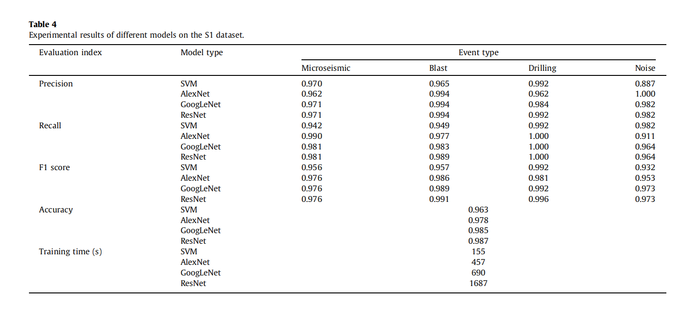

# Microseismic event waveform classification using CNN-based transfer learning models


## 摘要

&emsp;这篇论文的主要目的是通过卷积神经网络（CNN）的迁移学习和计算机视觉技术，实现对微震监测系统（MMS）收集的大量数据的高效处理，特别是对爆炸和噪声中的微震事件进行快速识别。这对于矿难预防至关重要。当前，这项工作主要由技术熟练的技术人员完成，但存在着严重的工作负担和低效率的问题。

论文的方法包括使用卷积神经网络进行迁移学习，结合计算机视觉技术，以实现对多通道微震信号波形的自动识别和分类。首先，通过MMS收集的数据被转换成基于事件的6通道原始波形。接下来，通过手动识别，建立了微震事件、爆炸、钻孔和噪声的样本数据集。这些数据集按照一定比例分成训练集和测试集，分别在AlexNet、GoogLeNet和ResNet50这三种预训练网络模型上进行迁移学习。在训练和调整之后，选择了最佳模型，并将其与支持向量机分类进行了比较。

研究结果显示，迁移学习模型在不同的测试集上表现良好。总体而言，GoogLeNet表现最佳，其识别准确率达到了99.8%。最后，论文讨论了训练集数量和不同类型样本数据不平衡对分类模型准确性和有效性的可能影响。

这项研究的成果对于提高微震事件自动识别和分类的效率，特别是在矿难预防方面，具有一定的实际应用和科研意义。


## 1. Introduction


&emsp;这段文字介绍了现代矿业和信息技术的整合，特别是物联网、大数据和人工智能等技术的应用，使得智能矿山成为现实。为了确保矿山安全，微震监测发挥着至关重要的作用。微震监测技术已经被应用于识别和预测岩爆、矿震、边坡滑坡等。特别是微震监测系统（MMS）是智能矿山的重要组成部分。MMS集成了多种功能，包括微震信号采集、多通道时钟同步、噪声抑制、准确的自动拾取、源定位、微裂缝应力分析和解释等。

通过运用定量地震学的方法，可以计算微震事件的源参数，如微震时刻、位置和震级大小。这些参数可用于推断微震事件的时空演化过程，为可能灾害的监测和预警提供基础。因此，微震监测在保障矿山安全方面发挥着关键作用。这种技术的应用有助于提高对潜在矿山灾害的监测和预测能力，从而在保障矿工安全和减少灾害损失方面具有重要价值。


```java
这段文字说明了微震监测系统（MMS）收集的信号的多样性和复杂性。系统涵盖了四类研究对象，分别是爆破事件、微震事件、钻孔事件和噪声事件。具体而言：

爆破事件（Blasting Events）： 指由爆炸性爆炸引起的冲击波，导致岩体破碎。

微震事件（Microseismic Events）： 是由于岩石变形和裂缝传播引起的结构不稳定性而发生的地震事件。

钻孔事件（Drilling Events）： 指在岩石中进行的钻孔工程操作。

噪声事件（Noise Events）： 包括除爆破和钻孔事件之外的干扰信号，如斗放、铲操作、风扇振动、电源干扰信号等。

不同类型的事件触发时，传感器接收到的数据会有所不同，图1展示了波形示例。为了准确分析微震事件，监测信号必须纯净且没有爆破、钻孔和噪声等干扰信号。尽管MMS已被广泛应用于岩体稳定性分析，但在复杂环境中直接提取准确的微震事件仍然具有一定难度。传统的微震事件识别方法依赖于手动或工程经验，这是一项耗时费力的工作。

```

&emsp;这段文字提到了机器学习在微震监测系统（MMS）研究中的广泛应用，尤其是在数据特征分类和微震事件识别方面 [14]。机器学习方法在MMS中的应用可以分为两类：监督学习和无监督学习。监督学习需要有标签的训练样本，而无监督学习使用无标签的样本。一些监督学习算法的例子包括线性回归、逻辑回归（LR）、朴素贝叶斯（NB）[15]、支持向量机（SVM）[16]、决策树（DT）、随机森林（RF）、人工神经网络（ANN）和卷积神经网络（CNN）[17,18]。一些无监督学习算法的例子包括K均值聚类[19]、深度置信网络、自编码算法和自组织映射网络。

在微震监测中，这些机器学习方法被用于分类数据特征和识别微震事件。监督学习的方法需要使用有标签的训练样本，使算法能够学习并预测未知事件的类别。无监督学习的方法则试图在没有明确标签的情况下发现数据的内在结构，这对于发现未知类型的微震事件或异常情况非常有用。这些机器学习方法的应用有助于自动化微震事件的识别和分类，提高了处理大量MMS数据的效率。

&emsp;这段文字指出，大量的研究集中在监督学习上，而CNN方法约占这些研究工作的50%左右。在这一领域的主要研究课题涉及微震信号的分类和识别 [21]。其他研究关注了岩爆发展过程中微震参数的演变趋势 [22]、地震源的深度检测 [23] 和微震事件的定位 [24]。近年来，对CNN和混合方法的改进已经得到实施 [25,26]。相比之下，对于无监督学习算法的研究相对有限。这一领域的研究通常涉及对微震事件和爆炸的自动分类 [27] 或对微震噪声信号的分类 [28]。

总体而言，监督学习方法，特别是基于CNN的方法，在微震事件的分类和识别方面得到了广泛的关注和应用。这些方法通过使用有标签的训练样本，使模型能够学习并预测未知事件的类别。而无监督学习方法在自动分类和识别微震事件方面的研究相对较少，但其在探索数据内在结构和发现未知事件方面具有潜在的应用前景。未来的研究可能会更加关注无监督学习算法在微震监测中的应用，以进一步提高对未知事件的探测和理解。


&emsp;这段文字提到了一些研究者在微震波形图像的自动识别和分类方面的工作。其中，Bi等人提出了两种基于深度卷积神经网络（DCNN）的自动分类方法，分别是基于DCNN-SPP（深度卷积神经网络-空间金字塔池）[29] 和基于DCNN-SVM [16]。前者在分类三种波形（微震事件、爆破事件和噪声事件）方面达到了91%的准确率，而后者获得了98%的准确率。Dong等人 [21] 应用了CNN方法来识别和分类微震和爆破信号的原始波形，实现了99%的识别准确率，超过了LR和ANN模型。与此同时，Li等人 [30] 使用了VGG16、ResNet18、AlexNet及其集成模型来自动识别和分类包括微震、爆破、电信号、口哨声和噪声在内的五种信号。研究验证了集成模型具有最高的98%的识别准确率。此外，结果显示原始波形和谱图之间的识别结果相似。

这些研究表明，使用深度学习方法，特别是基于CNN的方法，可以有效地实现微震波形图像的自动识别和分类。这些方法在不同类型的波形中取得了较高的准确率，为微震监测提供了一种更加自动化和高效的解决方案。值得注意的是，这些研究还表明集成多个深度学习模型或采用深度学习与传统方法的结合，有望进一步提高识别准确性。


```java

这项研究提出了一种基于卷积神经网络（CNN）的迁移学习模型，用于智能识别和分类复杂多样的多通道微震波形。与许多深度学习模型需要数万个或更多样本数据以开发充分的模型不同，本文选择了三个经典的CNN模型（AlexNet、GoogLeNet和ResNet50）用于图像分类。基于迁移学习的思想，我们构建了预训练网络，即使在小量样本数据的情况下，这些模型也能获得令人满意的分类结果。此外，该研究首次利用了定向梯度直方图（Histogram of Oriented Gradients，HOG）和支持向量机（SVM）方法来识别和分类微震信号，并取得了积极的结果。该研究的创新点主要体现在三个方面：

以事件为单位进行分类： 将事件作为单元，同时识别六种波形的特征，以有效地对事件进行分类。

细分废弃干扰信号： 将被丢弃的干扰信号细分为钻孔和噪声，从某种程度上利用环境噪声提供有效的岩石信息。

提出高精度的多类别CNN迁移学习模型： 为微震事件提出高精度的多类别CNN迁移学习模型，使用少量样本数据实现更高的分类准确性。

```


## 2. Image datasets


&emsp;该研究使用的数据库是由中国山西省一座矿山的微震监测系统（MMS）采集的实际野外数据。根据矿山的安全监测要求，在五个工作区域的不同深度安装了26个传感器。这些传感器连接到七个子采集系统，最终通过光纤连接到中央处理系统。每个传感器的采样频率在50到8000赫兹之间。研究使用了Python绘图库（Matplotlib）绘制了传感器采集到的数据的事件波形。基于波形特征和工程经验，微震和爆破事件占据了原始数据集的主要部分。此外，噪声事件占据了记录数据的相当大部分，岩石钻孔事件特别频繁。通过将“噪声转为用处”，研究将原始数据集的波形图与工程经验结合起来，创建了一个包含四个不同事件类别的数据库，这些类别分别是微震事件、爆破事件、钻孔事件和噪声事件，每个事件都被视为一个独立的单元。


&emsp;在这项研究中，研究人员以事件为单位输入图像，每次包含六个波形，以区分单个有效事件。研究使用的微震监测系统（MMS）配备有26个传感器，只有在六个或更多传感器被微震事件触发时，系统才将事件视为有效。否则，信号将被过滤掉。在评估事件的有效性时，随着更多传感器同时检测到信号，微震事件的可靠性增加。先前的研究表明，如果在事件检测期间触发的传感器少于四个，那么已知的参数将不足以精确计算微震源的位置和其他关键信息。为确保事件的完全有效性，研究选择了至少被六个传感器捕获的事件。研究根据信号捕获顺序呈现了数据波形，并最终生成了一个包含六个子图的事件波形输出。图1展示了这四种类型事件波形的典型结果。


```java
这四种类型的事件展示了独特的波形特征：

微震事件： 显示为单一连续波形，具有小振幅、低频率、短持续时间和快速衰减，如图1a所示。

爆破事件： 根据爆炸之间的时间间隔变化，呈现出循环的大波峰。它们通常具有高振幅、高频率信号，持续时间较长，信号变化明显。爆炸信号通常从快速初始衰减到未发展的尾波，再到慢速发展的尾波，如图1b所示。

钻孔事件： 表现为重复的周期振动，反映了岩石钻孔设备的操作冲击频率，如图1c所示。

噪声事件： 噪声源种类繁多，导致了不同的波形：

斗放信号：主振幅上呈现小振幅振荡，通常由靠近斗的传感器检测到。
刮板操作：持续两到三秒的连续波形事件。
风扇振动：通常表现为无序的连续波形，可由靠近风扇的传感器检测到。
电源干扰信号：通常呈现为振幅大、信号上升时间短、振荡模式简单且没有衰减特征的连续波形，如图1d所示。这些信号主要由靠近电源的传感器接收到。
这些波形特征的独特性使得通过观察波形可以有效地区分不同类型的事件，为事件的自动识别和分类提供了基础。

```


&emsp;识别这四种类型的事件面临着几个挑战。首先，微震事件和爆破事件的波形有时相似，使它们难以互相区分。其次，这四种类型事件的分布不均匀，当样本大小较小时，可能导致模型训练不足，最终影响识别准确性。最后，噪声事件很容易与各种事件混合，进一步复杂化信号识别过程。

这些挑战点出了在微震波形分类中的一些关键问题，包括波形相似性、数据不均衡和噪声干扰。解决这些问题的方法可能包括改进特征提取方法，使用更复杂的模型进行分类，或者采用数据增强技术来扩充样本量。此外，对于不均衡的数据分布，可以使用一些平衡类别的技术，如过采样或欠采样，以确保模型在所有类别上都有足够的训练经验。噪声干扰的问题可能需要采用更复杂的信号处理方法或者更精细的噪声分类模型。


&emsp;研究准备了三个数据集 S1、S2 和 S3，以评估在事件分布不均匀的情况下图像数量对分类准确性和模型鲁棒性的影响。数据集 S1 包含有限且不平衡的事件选择，而 S2 包含每个类别不少于 1000 个事件的更大规模且平均分布的数据。最后，S3 是一个大规模而不平衡的数据集。通过手动经验识别和分类，我们获取了四种类型事件的波形数据集，表1显示了每种事件数据集的样本大小。总共收集了 14800 个实验样本，包括 4265 个微震事件、4624 个爆破事件、3130 个钻孔事件和 2781 个噪声事件。为了确保对不同模型的分类效果进行准确比较和分析，我们通过将每个事件数据集分为独立的训练集和测试集来建立控制变量。具体而言，每个数据集的80%构成训练集，而剩余的20%作为测试集。在训练过程中，使用训练集中随机选择的20%数据创建一个单独的验证集，以建立改进和调整模型的基准，从而解决潜在的过拟合或欠拟合问题。


&emsp;在这项研究中，波形图像被统一缩放以符合算法的输入要求。图像缩放是将图像调整到算法的输入大小。由于不同的算法对图像输入有一定的要求，不符合输入大小要求的波形图像不能直接加载到模型中。例如，AlexNet的输入层图像大小（宽 x 高 x 通道数）为227 x 227 x 3像素，而GoogLeNet和ResNet50的图像输入层大小为224 x 224 x 3像素，但本研究中原始图像的大小为288 x 432 x 3像素。因此，我们根据算法的要求对波形图像进行了统一缩放。


## 3. Methodology

&emsp;根据机器学习的一般步骤，我们介绍了本研究采用的技术路线，如图2所示。具体而言，我们利用了三个著名的卷积神经网络模型（AlexNet、GoogLeNet 和 ResNet50）进行迁移学习，以准确分类事件图像。由于序列和残差的不同网络结构，以及序列结构中不同的深度和卷积核大小，神经网络在识别四种波形方面存在差异。此外，我们使用HOG算法进行特征提取，结合传统的机器学习方法SVM分类器。因此，训练了多种不同的模型以进行比较分析。

这一技术路线的关键点在于使用迁移学习技术，充分利用了预训练的卷积神经网络模型，同时结合了传统的特征提取和机器学习方法，以提高对复杂微震波形的分类准确性。


&emsp;通过使用这些经典模型作为起点，研究者进一步探索了具有专家构建和成熟架构的深度学习模型。迁移学习是一种机器学习方法，它将在先前领域/任务中学到的知识和模式应用于新的领域/任务，从而在目标领域取得更好的学习结果。迁移学习的优势在于预训练的网络学到了丰富的特征集，可以应用于广泛的其他相似任务。迁移的卷积神经网络模型需要更少的数据和计算资源。具体而言，通过使用在数百万图像上训练过的网络，网络只需用几百张额外的图像重新训练，就能够对新的对象进行分类。

这种方法的优势在于，通过使用在庞大数据集上训练的模型，可以将学到的特征迁移到微震波形分类问题上。这提供了更好的初始权重和特征表示，有助于模型更快地学习和收敛。迁移学习的思想是将从一个领域学到的知识迁移到另一个相关的领域，这在处理相对较小且领域特定的问题时尤其有效。


&emsp;经典的CNN图像分类模型包括AlexNet [31]、GoogLeNet [32]、VGG [33]、ResNet [34]、ResNeXt [35]、SENet [36]等。CNN的架构如图3所示，包括一个输入层、多个隐藏层和一个输出层。隐藏层可以分为卷积层、池化层、激活函数和全连接层。

使用CNN进行图像识别和分类的基本原理是通过多次卷积和池化操作从输入图像中提取特征，然后将这些特征传递到全连接层进行分类。在CNN中，输入图像首先被送到由多个卷积和池化层组成的卷积块。每个卷积层使用一组可学习的滤波器对输入特征图进行卷积，提取不同大小和方向的特征。池化层进一步减少了空间维度和特征图的数量，从而减少了计算和过拟合。接下来，通常在卷积块的末尾连接一个或多个全连接层，将所有特征图压缩成一个一维向量，并使用softmax函数进行分类。在训练过程中，CNN通过反向传播算法自动学习滤波器和权重参数，使模型能够更准确地识别和分类图像。


* 介绍AlexNet resnet GoogleNet


## 4. Experiment


  


## 6. Discussion


&emsp;研究中关于样本量对分类准确性和模型有效性的影响的讨论对于理解所开发模型的鲁棒性和局限性至关重要。这些模型在S2和S3数据集上进行了训练和测试，结果呈现在图13中。

在S2数据集中，四类事件的数量相等，与S1数据集相比，模型的预测准确性有所提高。准确性的提高范围在0.4%到1.6%之间，其中SVM表现最好，从96.3%提高到97.9%，而GoogLeNet和ResNet50分别达到98.9%和99.1%。这表明对于每种事件类型有一个平衡的训练样本数量对模型的准确性有积极的影响。

另一方面，在S3数据集中，四类事件的数量不平衡，与S2相比，准确性提高了0.4%到0.9%。值得注意的是，GoogLeNet的提高最为显著，达到了99.8%。使用S3训练的模型测试S2测试集，识别准确性提高了0.1%到0.5%。这表明，尽管平衡的数据集是有益的，但即使处理不平衡的数据集，模型仍然表现良好。

结果表明，样本数量在一定程度上影响模型的识别准确性。额外的样本对提高准确性有积极作用，直到一个点，之后准确性趋于平稳，逐渐接近100%。这强调了拥有足够大而多样化的训练数据集的重要性。

此外，表示每种类型的波形事件的足够数量确保了模型的稳健性，即使在样本数量不平衡的情况下也是如此。然而，如果输入数据与现有的训练样本显著不同，准确性可能会受到威胁。因此，在实现高准确性和泛化能力的真实场景中，保持足够的高质量和数量的训练样本至关重要。


```java
本研究通过对比使用的模型与先前文献的情况，以及对迁移学习有效性的探讨，为不同方法的性能提供了有价值的见解。

ResNet50 vs. ResNet18： 本研究采用的ResNet50模型在识别准确性方面取得了更高的成绩（98.7%），相比文献中的ResNet18模型（96%）。这一改进突显了使用更深层次的网络架构在给定分类任务中的优势。

HOG + SVM vs. DCNN + SVM： 本研究中的HOG + SVM方法（96%）在识别和分类方面略逊于文献中的DCNN + SVM方法（98%）。这表明在图像分类任务中，深度卷积神经网络（DCNN）通常优于传统方法，如方向梯度直方图（HOG）。

迁移学习的有效性： 通过从零开始构建模型（AlexNet、GoogLeNet、ResNet50）的实验显示，在处理有限样本量时，这些模型的识别准确性明显较低。这强调了迁移学习的有效性，其中预训练的权重和偏差参数被转移到较小的数据集，并进行微调以实现准确的识别。

实际模型构建： 本研究强调了在构建实际模型之前定义问题和评估预先存在的模型的重要性。根据分析调整模型结构和训练参数可以实现令人满意的准确性和效率。

考虑模型复杂性： 讨论涉及卷积神经网络模型中层数量与复杂性之间的权衡。随着层数的增加，复杂性也增加，导致更长的训练时间和过拟合的风险。这强调了在选择模型架构时需要进行具体问题的详细分析和实际比较分析。

```

&emsp;图像的分辨率在图像识别和分类任务中起着重要作用，直接影响模型捕捉图像细节和特征的能力。在我们的研究中，我们降低了事件波形图像的分辨率，以适应不同分类模型的输入要求。然而，这种处理可能会对时间序列数据产生影响。首先，降低分辨率可能导致时间信息的丢失，模糊或遮蔽微弱但重要的特征，从而影响事件区分的能力。其次，这可能导致波形失真和形状变化，从而影响模型的泛化性能。特别是对于识别微妙的波动特征，图像变形可能导致特征偏移、错位或混淆，使模型难以准确识别和分类不同类型的事件。然而，通过实验，我们发现这些经典模型对图像分辨率的降低影响较小。这可能归因于CNN在一定程度上的鲁棒性，特别是对于稳定的事件类型。然而，研究结果可能受数据挖掘的限制，建议在更长的信号中调整分辨率，平衡信息和性能。总之，降低图像分辨率可能对模型的识别性能产生潜在影响，特别是在保留事件细节和形状特征方面。在未来的研究中，我们将继续探讨不同图像分辨率对不同事件类型识别的影响，并为不同的采矿项目提供更深入的考虑。


## 7. Conclusions


&emsp;这篇论文使用了机器学习方法和计算机视觉技术，实现了对多通道波形的分类，实现了矿山微震信号的智能识别和分类。它不仅分类了微震事件和爆破，还包括了钻井和噪声事件。以微震事件的识别准确度为代表，并以数据集S2的测试结果作为基准，SVM、AlexNet、GoogLeNet和ResNet50模型的识别准确度分别为98.4%、98.4%、99.2%和99.2%。


&emsp;使用卷积神经网络（CNN）迁移学习模型对小样本数据集进行实时事件波形识别是一种有效且高效的方法。

&emsp;小样本数据集对模型分类准确性的影响并不显著，如果样本集是代表性的，准确性的变化大致保持在1%左右。相反，即使有大量数据，如果样本集不具代表性，改善模型的分类准确性将变得困难。

&emsp;这四种模型在对不同类型事件的学习能力上存在一些差异。在对四类事件进行分类和识别时，由于爆破和岩石钻探的特征明显，精度和召回率较高，其次是微震事件。然而，对噪声的识别误差相对较大。主要原因是样本数据集中噪声图像的特征与微震事件和岩石钻探存在许多混合相似性。

&emsp;所提方法的建模过程和设置的超参数可以为具有微震监测系统的矿山建立其事件波形智能分类模型提供参考。
