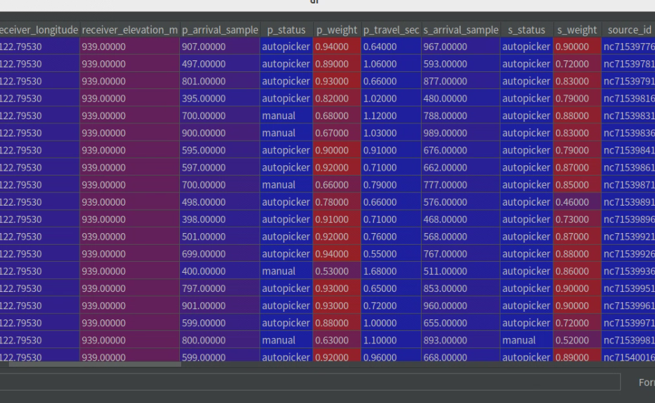
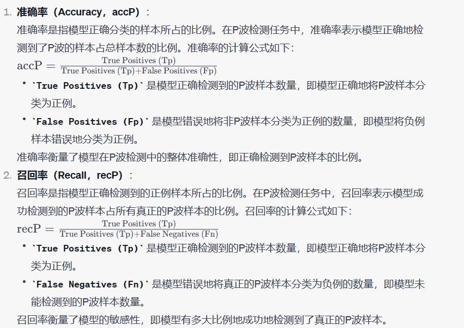

# PhaseNet训练流程梳理总结


## 制作数据集

### 看一下STEAD 数据集的构成


  

* trace_name 数据的名称
* trace_category 数据类型  局部地震或者是噪声
* snr_avg 是信噪比
* P_arrival_sample 是p到时
* S_arrival_sample 是s到时

  


### hdf5 文件的结构

```py

# 获取文件中的所有顶级组
top_level_groups = list(file.keys())


# 遍历所有组
for group_name in top_level_groups:
    group = file[group_name]
    print(f'Group: {group_name}')
    
    # 获取组中的数据集  针对每一组获取所有的keys
    datasets_in_group = list(group.keys())
    
    for dataset_name in datasets_in_group:
        print(f'Dataset: {dataset_name}')
```


* 对于STEAD数据集  data是顶级组
* 然后顶级组下面的所有组都是一个trace_name 数据shape是6000 x 3


&emsp;在HDF5文件中，attrs 方法用于访问数据集（dataset）和组（group）的属性（attributes）。属性是与数据集或组相关联的元数据，它们通常包含有关数据的描述性信息或其他重要信息。以下是关于使用 attrs 方法的详细说明;

&emsp;attribute_names 将包含数据集或组的所有属性名称。你可以根据需要使用这些属性名称来访问或操作数据集或组的属性值。

  
