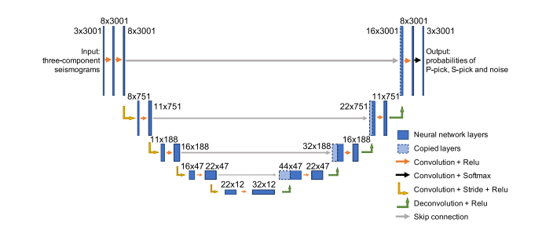

# PhaseNet论文阅读总结

## 背景

* 地震监测和定位是地震学的基础
  * 地震目录的质量主要取决于到达时间测量的数量和精度
  * 相位拾取一般都是网络分析员来执行
  * 但是地震仪越来越多，数据流增加，人工拾取难以进行

* 相位拾取中S波最难
  * S波是从P波的散射波中出现的
  * S波可以减少基于P波对地震位置的深度原点权衡
  * S波结构对强地面运动预测很重要

## 过去的研究

* 短期平均/长期平均(STA/LTA)方法
  * 该方法记录短期窗口中的能量和长期窗口中的能量之比
  * 高于阈值的峰值，标识P、S到达
  * 该方法容易收到噪声的影响，准确度比较低

* 统计模型
  * 基于高阶统计（峰度和偏度）的方法识别从高斯型到非高斯的转变，这与地震事件的发生相吻合

* 浅层神经网络
  * 根据四个手动定义的特征对传统的浅层神经网络进行测试
  * 方差、偏度的绝对值、风度以及基于滑动窗口预测的偏度和峰度的组合
  * 大多数相位选择都是比较侧重P波

* 尽管有了上面工作，但是自动拾取的准确性还是不行
  * 因为地震波行由于多种效应而高度复杂
  * 传统的自动拾取算法都是手动定义特征 还需要仔细进行数据处理

## 论文idea

* 深度神经网络不是使用人工定义的特征，而是从标记数据上学习特征
* 输入：未经过过滤的三分量地震波行  垂直 南北 东西
* 输出：三种概率分布：P S 噪声
* P波和S波概率分布的峰值被设计为对应于预测的P S 到达时间
* 高准确率和召回率

## 数据集

* 北加州
* 779514条记录
* 分为训练集  验证机和测试数据集 623054 77866 78592
* 训练集和验证集用于训练和微调参数 模型选择
* 测试集用于评估性能
* 该数据集涵盖了广泛的信噪比SNR 各种仪器

## 数据预处理

* 随机选择一个包含P S到达时间的30S时间窗口作为phaseNet输入
  * 100Hz采样，然后这是原始数据集最常见的采样率，那么输入的波形每一个分量都有3001个数据点
  * 通过减去均值 然后除以标准差 来对每一个分量的波形进行归一化

## 模型

  

* PhaseNet的架构是修改U-Net网络得到的
* U-Net网络是一种用于生物医学图像处理的深度神经网络方法，旨在定位图像中的属性
* 将时间序列的属性定位为三类：P波 S波 噪声
* 输入是地震三分量地震图
* 输出是P S 噪声概率分布
* 输入和输出序列包含3001个数据点  30S 100HZ采样
* 输入地震数据经过四个下采样阶段和四个上采样阶段
* 在一个阶段 使用一维卷积和RELU
* 下采样从地震数据中提取有用信息将其缩小为更少的神经元
* 上采样将琪扩展为每一个时间点的P S 噪声的概率分布

* 输入维度是3 x 3001
* 输出是3 x 3001 p  s 噪声 在每一个采样点的概率

## 实验

* 评价指标：精确率 召回率 F1分数

  

* 自动和人工标记的P和s到达时间的时间残差分布
* P picks的残差分布比S picks窄 P波更容易被挑选
* 与AR选择器相比PhaseNet的P和S选择的残差分布更窄

  

* 不同仪器上面的测试
  

* 不同信噪比
* 根据 log10(SNR) 的值将测试集分为 10 个不同的类别。 为每个类别计算精度、召回率和 F1 分数。
* 即使对于低 SNR 数据，PhaseNet 的精度也很高，而召回率变得相对较小。
  

