## RNN学习笔记


## 时间序列

&emsp;将单词序列转换为向量，这里有五个单词，然后对于每一个单词都进行独热编码，编码成一个特定的向量。

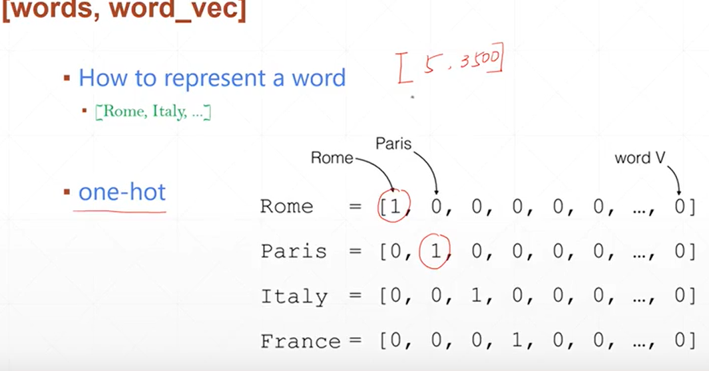  


对于RNN网络，需要一次性读取多个句子，那么涉及到batch_size，这里第二个表达就是：batch,单词，单词的表达方式

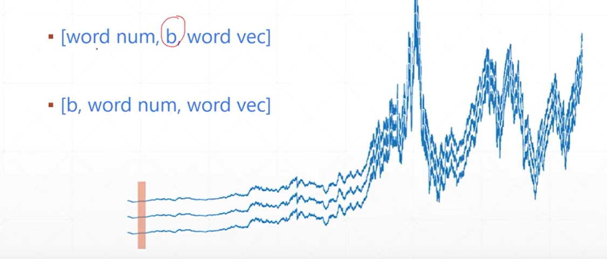  

## RNN原理


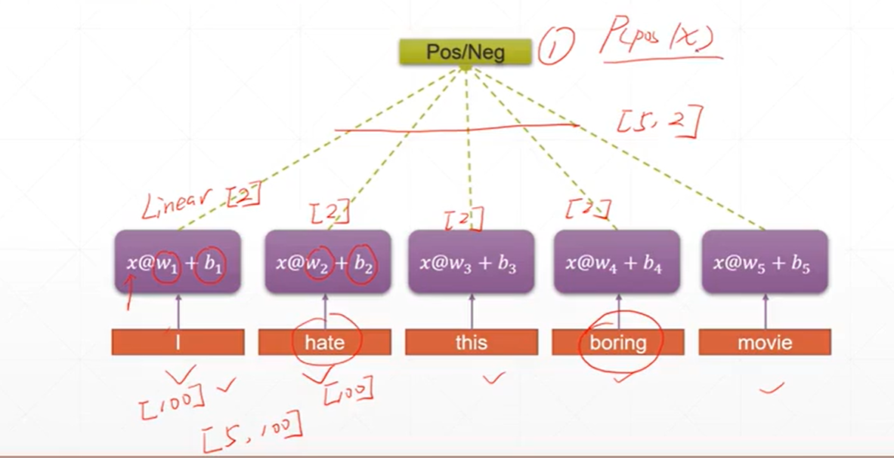  

&emsp;这里生成一个5 x 100的向量，对于每一个单词我们都使用100个特征进行表示，然后经过每一个线性层，这100维的向量转换为更小的向量 比如五个向量特征，那么对于一个句子的每一个单词都进行这样的提取特征，那么就需要对每一个单词都进行线性层的变换，最后得到一个5x5的向量

但是上面的做法有两个缺点：
* 单词数量太多 句子太长 
* 参数两太多 对于每一个单词都需要生成特定的w b的线性层  这样参数过多
* 只考虑每一个单词 没有考虑语境信息


那么，对于每一个线性层，我们不仅输入每一个单词的向量，还需要输入语境信息h

  

现在举一个例子，对于每一个单词我们使用 100个特征进行表示，对于一个句子五个单词就是5 x 100的向量表示，那么我们选择batch_size是3 一次输入三个单词，那么对于每次的输入xt，就是[3,100]的向量，我们初始化语境信息向量h[0,0..],输入网络


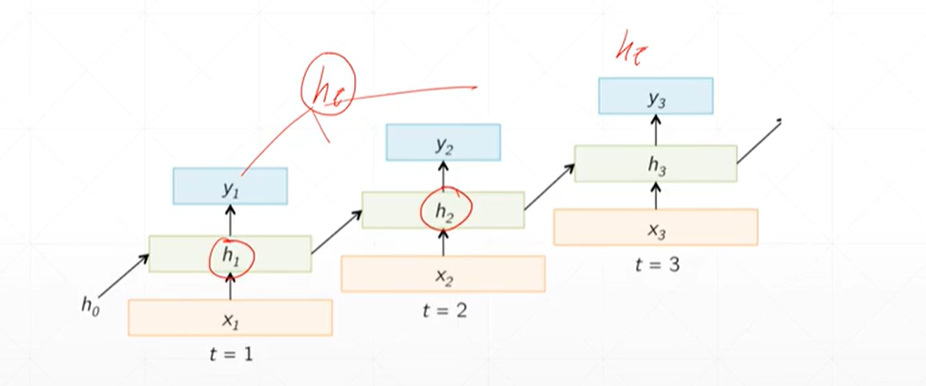  

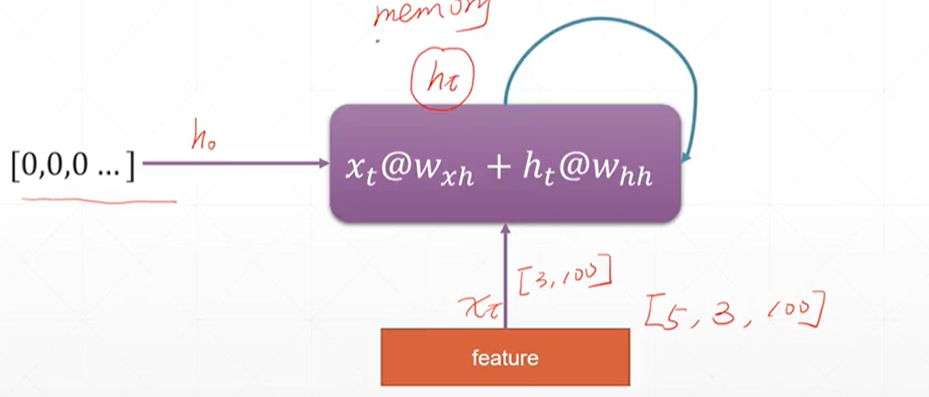  

针对上面的讲述，整理成公式化，对于每一个输出ht 都是由ht-1 和xt得到的，也就是当前层的输入xt和上一层计算的输出作为当前层的输入，然后，使用Whh和WXh分别对输入的xt和ht-1进行特征提取，得到的输出向量经过激活函数进行激活

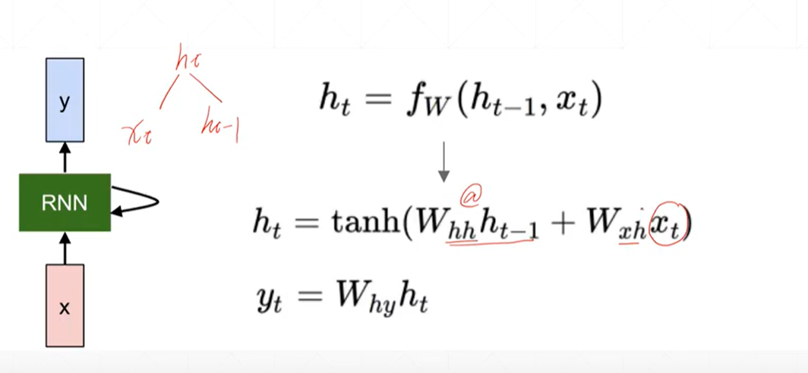  


如何推导出梯度？

**为RNN网络的权重whh和Wxh都是共享的，那么最后的输出一定是关系到每一个时刻的权重，所以我们需要使用损失对每一个时刻的权重进行求导，然后进行累加**

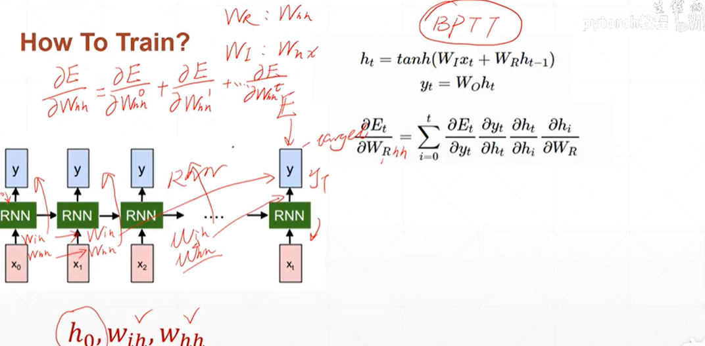  


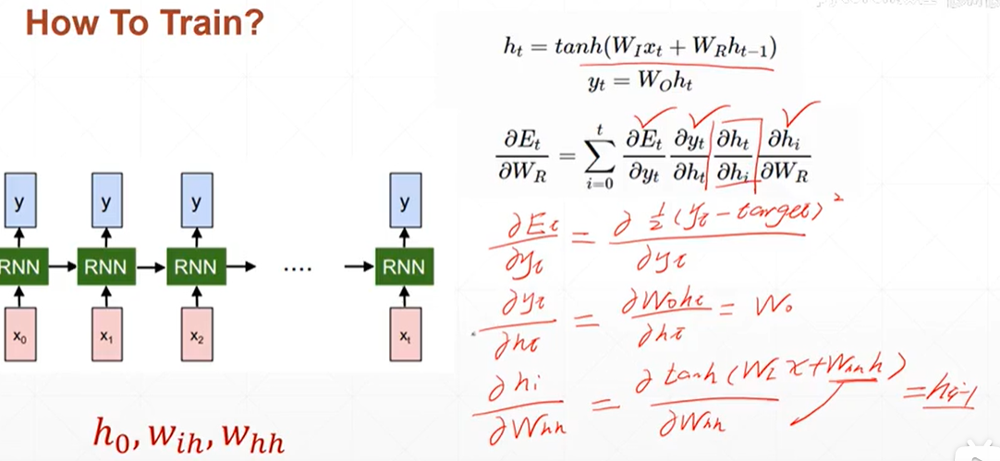  


对于ht求导hi

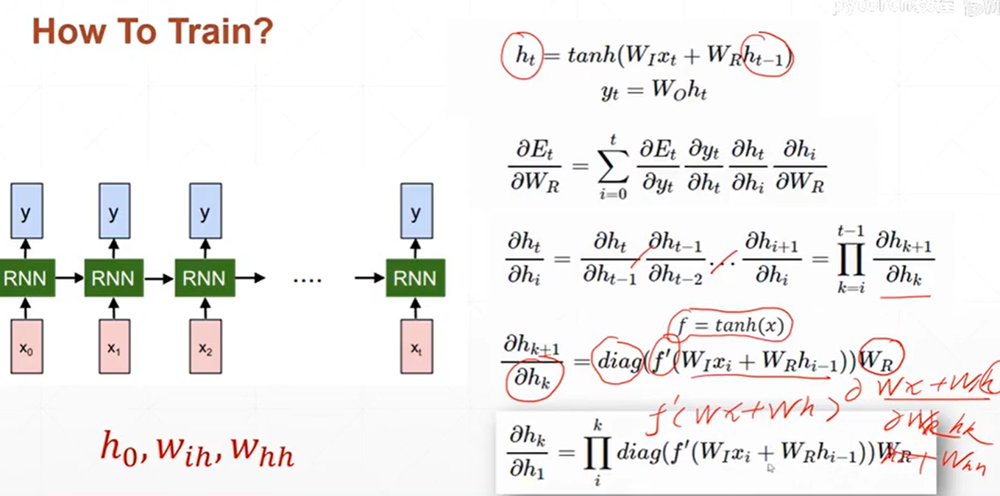  

## RNN Layer的使用


&emsp;输入的向量xt是[3,100],那么 Wxh是[100,20]的形状的参数向量，也就是说相乘之后变成了[3,20] 原先单词使用100个特征进行表示，现在使用20个特征进行表示。同样的对于语境信息向量ht[3,20] 那么Whh是[20,20]的向量，想成之后变成了[3,20],然后两个[3,20]的向量相加得到ht+1向量

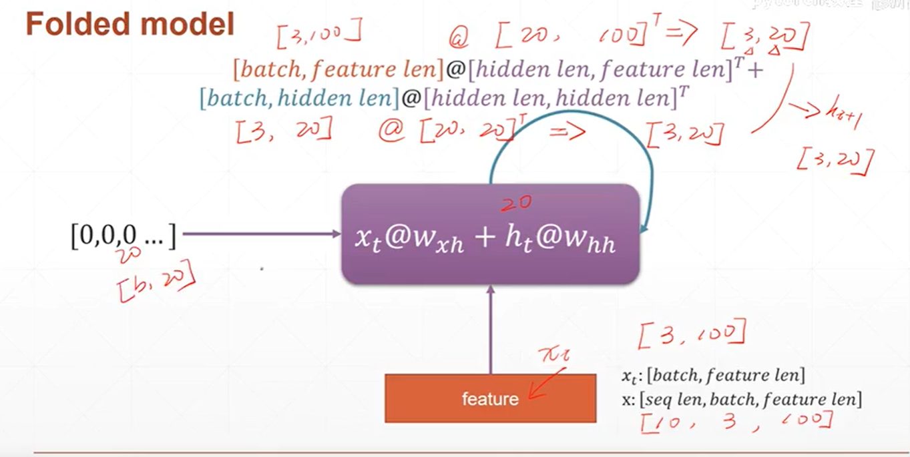  

```py
rnn=nn.RNN(100,10)  #每个单词用100维表示，memory/hidden为10维
rnn._parameters.keys()
#out:odict_keys(['weight_ih_l0', 'weight_hh_l0', 'bias_ih_l0', 'bias_hh_l0'])
 
rnn.weight_hh_l0.shape,rnn.weight_ih_l0.shape
#out:(torch.Size([10, 10]), torch.Size([10, 100]))
 
rnn.bias_hh_l0.shape,rnn.bias_ih_l0.shape
out:(torch.Size([10]), torch.Size([10]))

```

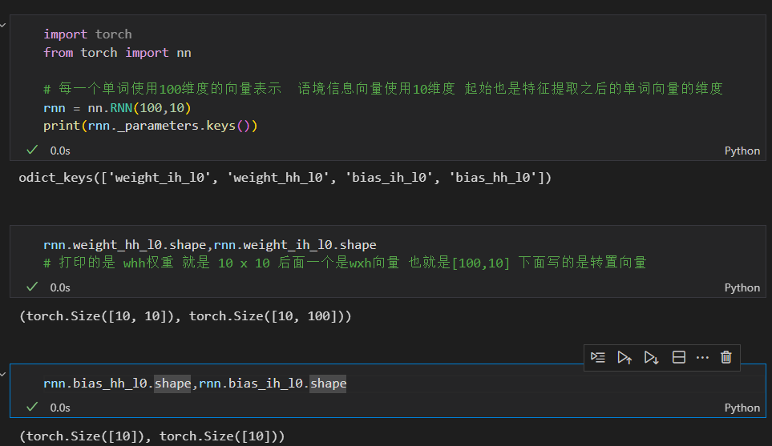  

**这里创建了一个RNN模型，其中参数100表示输入数据的特征维度，每个单词用100维的向量表示；参数10表示RNN内部隐层的大小，也称为记忆维度，即隐状态的维度。**

nn.RNN模块有四个可训练参数，它们是:

weight_ih_l0: 输入到隐层的权重矩阵，形状为(10, 100)，表示从输入层到隐层的权重参数。
weight_hh_l0: 隐层到隐层的权重矩阵，形状为(10, 10)，表示从上一时刻隐层到当前时刻隐层的权重参数。
bias_ih_l0: 输入到隐层的偏置向量，形状为(10)，表示从输入层到隐层的偏置参数。
bias_hh_l0: 隐层到隐层的偏置向量，形状为(10)，表示从上一时刻隐层到当前时刻隐层的偏置参数。


**输入到隐层的权重矩阵（weight_ih_l0）的形状为 (hidden_size, input_size)，而不是 (input_size, hidden_size)。这里 (10, 100) 表示有 10 个隐状态单元（记忆单元）和每个单词用 100 维的向量表示作为输入特征。**


## 单层的RNN


**因为是单层的RNN，那么h向量只有一个**
```py
# RNN创建
rnn = nn.RNN(input_size = 100,hidden_size = 20,num_layers=1)
print(rnn)

#  10代表每一个句子的单词数量  3代表三个句子  100 代表每一个单词的维度
x = torch.randn(10,3,100)

#  第一个参数是输入向量x 第二个参数是h向量  只有一个单词 每一层三个句子 每一个单词使用20个维度
out,h = rnn(x,torch.zeros(1,3,20))

# 最后的输出out 是一个 10 x 3 x 20 的向量 也就是被提取成20个维度  然后h是一个1 3 20的向量
print(out.shape,h.shape)

```


## 多层的RNN

因为有多层RNN，那么就有多个h向量，但是out输出形状不会变


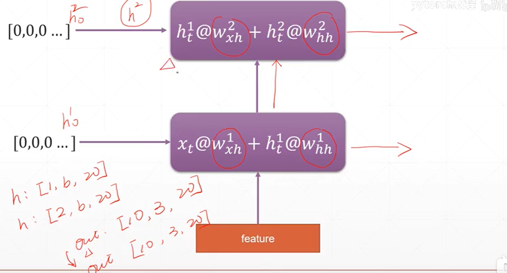  


```py
rnn = nn.RNN(input_size = 100,hidden_size = 20,num_layers = 4)
print(rnn)

x = torch.randn(10,3,100)

# 这里面的h 是多层的 应该是[4,3,20]
out,h = rnn(x)

print(out.shape,h.shape)

```


## 单层RNNCell

&emsp;处理三个句子，每一个句子10个单词，每一个单词使用长度100的向量，送入RNN的shape就是[10,3,100]

&emsp;如果使用RNNCell 针对每一个时刻都分开处理，这里十个单词就是十个时刻，每次输入的向量是[3,100] 那么计算单元运行十次，

**显然，RNNCelll没办法想RNN直接求出网络的输出，那么只需要将最后一层每一个时刻得输出h组合起来。out = torch.stack([h1,h2,...,ht])**


```py

#  100代表输入得特征维度  20代表提取的特征维度
cell = nn.RNNCell(100,20)

# 初始化输入  某一个时刻得输入
x = torch.randn(3,100)

# 初始化所有时刻得输入
xs = [torch.randn(3,100) for i in range(10)]

# 初始化隐藏层记忆单元
h = torch.zeros(3,20)


#  针对每一个时刻得输入 传入RNN单元
for xt in xs:
    h = cell(xt,h)

# 查看最后的输出
print(h.shape)


```


## 多层RNNCell

```py

#  定义两层计算单元
cell_l0 = nn.RNNCell(100,30)
cell_l1 = nn.RNNCell(30,20)


# 定义两层的隐藏单元
h_l0 = torch.zeros(3,30)
h_l1 = torch.zeros(3,20)


# 初始化原始输入
xs = [torch.randn(3,100) for i in range(4)]

for xt in xs:
    h_l0 = cell_l0(xt,h_l0)
    h_l1 = cell_l1(h_l0,h_l1)


print(h_l0.shape)
print(h_l1.shape)

```

## 简单案例

预测正弦曲线的下一段波形

因为是输入一段波形曲线,**不同于一个句子,句子中的每一个单词都是不能直接输入,需要做embedding,也就是对每一个单词进行编码成一个向量,但是波形曲线每一个点都是一个数字,不需要做embedding,那么如果给出五十个点,只提供一条曲线,那么seq_len = 50,feature_len =1,那么输入就是[50,1,1],但是batch需要提前,也就是输入[1,50,1],但是因为最后的输出是[seq_len,batch,hidden_len] 我们还是需要添加一个线性层变换一下,不能是hidden_len,需要变换成1 也就是[seq_len,batch,1]**


* 定义网络

```py
class Net(nn.Module):
    def __init__(self):
        super(Net,self).__init__()
        # RNN
        self.rnn = nn.RNN(
            input_size = 1, # feature_len = 1
            hidden_size = 16, # 隐藏层记忆单元尺寸
            num_layers = 1,# 层数
            batch_first = True  # 确保输入时 按照[batch,seq_len,feature_len]的模式 1 x 50 x 1
        )

        #  对RNN 进行参数初始化
        for p in self.rnn.parameters():
            nn.init.normal_(p,mean=0.0,std=0.001)

        #  输出层 直接使用一个线性变换 吧每一个时刻的记忆单元的Hidden_len的输出为所需要的feature_len = 1 因为是一个数据点
        #  50 x 16 -> 50 x 1
        self.linear = nn.Linear(16,1)


    def forward(self,x,h):
        # 这里的out原始形状是 1 x 50 x 16 最后变成 50 x 16
        # h的原始形状是 1x 1  x 16  
        out,h = self.rnn(x,h)
        # 因为最后需要传递给线性层处理,所以需要展平
        out = out.view(-1,16)
        out = self.linear(out)

        # 在把batch维度添加进去
        out = out.unsqueeze(dim=0)

        return out,h

```


* 训练网络


```py
lr = 0.01 
model = Net()
from torch import nn, optim
criterion = nn.MSELoss()  # 均方差损失函数
optimizer = optim.Adam(model.parameters(),lr) # 学习率

# 初始化记忆单元 
h = torch.zeros(1,1,16)

# 生成样本数据
num_points = 50
seq_len = num_points - 1

import numpy as np
for iter in range(6000):
    k = np.random.randint(3, size=1)[0]
    # 取点的区间是[k, k+10],均匀地取num_points个点
    time_steps = np.linspace(k, k + 10, num_points)
    # 在这num_points个时刻上生成函数值数据
    data = np.sin(time_steps)
    # 将数据从shape=(num_points,)转换为shape=(num_points,1)
    data = data.reshape(num_points, 1)  # feature_len=1
    # 输入前49个点(seq_len=49),即下标0~48
    x = torch.tensor(data[:-1]).float().view(1, seq_len, 1)  # batch,seq_len,feature_len
    # 预测后49个点,即下标1~49
    y = torch.tensor(data[1:]).float().view(1, seq_len, 1)  # batch,seq_len,feature_len

    # 至此,生成了x->y的样本对, x和y都是shape如上面所写的序列
    
    # 将数据输入
    out,h = model(x,h)
    # h在循环中被
    h = h.detach()

    # 计算和预期输出之间的损失
    loss = criterion(out,y)

    # 更新网络参数
    model.zero_grad()

    # 计算梯度
    loss.backward()
    # 优化
    optimizer.step()


    if iter % 1000 == 0:
        print("迭代次数:{}, loss:{}".format(iter + 1, loss.item()))


```

* 测试


```py
from matplotlib import pyplot as plt
# 先用同样的方式生成一组数据x,y
k = np.random.randint(3, size=1)[0]
time_steps = np.linspace(k, k + 10, num_points)
data = np.sin(time_steps)
data = data.reshape(num_points, 1)  # feature_len=1
x = torch.tensor(data[:-1]).float().view(1, seq_len, 1)  # batch,seq_len,feature_len
y = torch.tensor(data[1:]).float().view(1, seq_len, 1)  # batch,seq_len,feature_len

# 用于记录预测出的点
predictions = []

# 取训练时输入的第一个点,即在x(1,seq_len,1)取seq_len里面第0号的数据
# 这里将输入seq_len'设置为1(而不是49)
# 输入什么长度的数据会自动调整网络结构来给出输出
input = x[:, 0, :]
# 输入的shape变成标准的(batch=1,seq_len'=1,feature_len=1)
input = input.view(1, 1, 1)

# 迭代seq_len次,每次预测出一个点
for _ in range(x.shape[1]):
    # 送入模型得到预测的序列，输入了一个点的序列也就输出了(下)一个点的序列
    pred, h = model(input, h)
    # 这里将预测出的(下一个点的)序列pred当成输入,来给到下一次循环
    input = pred
    # 把里面那个点的数取出来记录到列表里
    # 这里用ravel()而不用flatten(),因为后者是原地操作,会改变pred也就是input
    predictions.append(pred.detach().data.numpy().ravel()[0])

# 绘制预测结果predictions和真实结果y的比较
plt.scatter(time_steps[1:], y.data.numpy().ravel())
plt.scatter(time_steps[1:], predictions, c='r')
plt.show()
```
