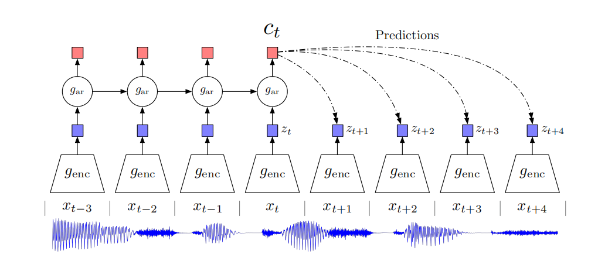

# Representation Learning with Contrastive Predictive Coding

## 摘要

* 这段文字是论文的摘要，作者讨论了监督学习在许多应用中取得的巨大进展，然而无监督学习并没有得到如此广泛的应用，仍然是人工智能中一个重要且具有挑战性的任务。在这项工作中，作者提出了一种通用的无监督学习方法，用于从高维数据中提取有用的表示，被称为“对比预测编码”（Contrastive Predictive Coding）。

* 该模型的关键思想是通过使用强大的自回归模型在潜在空间中预测未来，从而学习这些表示。作者使用了一种概率对比损失，通过负采样使潜在空间捕获对预测未来样本最有用的信息。而大多数先前的工作都集中在评估特定模态的表示上，作者展示了他们的方法能够学习到在四个不同领域取得强大性能的有用表示，包括语音、图像、文本以及在3D环境中的强化学习。

## Introduction

* 这段文字的主要思想是，通过使用分层可微模型，我们可以在一个端到端的框架中从标记数据中学习到高级别的表示，而无需手动指定特征。这种方法在现实世界的多个应用中取得了显著的进展，但仍然面临一些挑战，例如数据效率、鲁棒性和泛化能力等方面的问题。这表明尽管已经取得了成功，但在人工智能领域仍然需要进一步的研究和创新，以克服这些挑战并推动领域的发展

* 为了更好地适应各种任务，表示学习需要通过无监督学习获得一些不那么专门化的特征。这可以提高表示的泛化能力，使其在不同领域和任务中都能表现良好。通过无监督学习，模型可以更好地捕捉数据中的共性和潜在结构，从而产生更具通用性的特征表示。这对于构建更鲁棒和通用的人工智能系统至关重要

* 这段文字强调了尽管无监督学习的重要性，但迄今为止尚未出现类似于监督学习的突破：从原始观测中建模高层次表示仍然是困难的。此外，什么是理想的表示形式并不总是明确的，以及是否可能在没有额外监督或专门针对特定数据模态的情况下学习这样的表示形式也是不确定的。

* 尽管监督学习取得了显著的进展，但无监督学习在建模高层次表示方面仍然面临挑战。从原始观测中学习到有意义且可传递的表示形式是一个复杂的问题，且尚未实现类似于监督学习领域的显著突破。此外，关于理想的表示形式是什么的问题也没有清晰的答案，以及是否可能在没有额外监督或专门化到特定数据模态的情况下学习这样的表示形式仍然是未解之谜。

* 这段文字介绍了一种常见的无监督学习策略，即预测未来、缺失或上下文信息。这种预测编码的思想[5, 6]是信号处理中用于数据压缩的最古老的技术之一。在神经科学中，预测编码理论表明大脑在各个抽象层次上预测观察结果[7, 8]。最近的无监督学习工作成功地利用了这些思想，通过预测相邻单词来学习单词表示[9]。对于图像，预测从灰度图像中的颜色或图像块的相对位置也被证明是有用的[10, 11]。作者提出的假设是，这些方法在一定程度上是成功的，部分原因是我们预测相关值的上下文往往在条件上依赖于相同的共享高级潜在信息。通过将这视为一个预测问题，我们自动地推断出这些特征对于表示学习是感兴趣的。
* 在这篇论文中，我们提出了以下方法：首先，我们将高维数据压缩成一个更紧凑的潜在嵌入空间，这样条件预测就更容易建模。其次，我们在这个潜在空间中使用强大的自回归模型，以预测未来多个时间步。最后，我们依赖于噪声对比估计[12]作为损失函数，类似于在自然语言模型中学习单词嵌入所使用的方式，使整个模型可以端到端地进行训练。我们将得到的模型 Contrastive Predictive Coding (CPC) 应用于广泛不同的数据模态，包括图像、语音、自然语言和强化学习，并展示了相同的机制在每个领域学到了有趣的高层信息，胜过了其他方法

## 2 Contrastive Predicting Coding

* 首先通过提出动机和解释方法的直觉来引导读者。接下来，介绍了 Contrastive Predictive Coding (CPC) 的架构。之后，解释了基于噪声对比估计的损失函数。最后，对与 CPC 相关的研究进行了讨论。

### 2.1 Motivation and Intuitions

* 这段文字解释了论文模型背后的主要直觉。该模型的主要目的是学习表示，这些表示编码了（高维）信号不同部分之间的共享信息。同时，它舍弃了更本地的低级信息和噪声。在时间序列和高维建模中，利用下一步预测的方法可以利用信号的局部平滑性。然而，当预测更远的未来时，共享信息的量变得更低，模型需要推断更全局的结构。这些跨足多个时间步的“慢特征”[13]通常更加有趣（例如语音中的音素和语调，图像中的对象，或书籍中的故事线）。

简而言之，该模型的直觉是通过学习对信号不同部分之间的共享信息进行编码，从而捕获信号中的高级、全局结构。这使得模型能够在处理时间序列和高维信号时更好地理解慢变化的特征，从而提高其对复杂数据的表达能力

* 这段文字探讨了在预测高维数据时面临的挑战之一。作者指出，对于高维数据，像均方误差和交叉熵这样的单模损失并不是很有用。通常需要强大的条件生成模型来重构数据中的每一个细节。然而，这些模型在计算上很昂贵，并且浪费计算能力来建模数据 x 中的复杂关系，通常忽略上下文 c。例如，图像可能包含数千位的信息，而高级潜在变量（例如类别标签）包含的信息要少得多（对于 1,024 个类别只有 10 位信息）。这表明直接建模 p(x|c) 可能不是在提取 x 和 c 之间的共享信息方面最优的方法。在预测未来信息时，作者相反地将目标 x（未来）和上下文 c（现在）编码成紧凑的分布式向量表示（通过非线性学习映射），以最大程度地保留原始信号 x 和 c 之间的互信息，定义为

### 2.2 Contrastive Predictive Coding

* 非线性编码器 (Non-linear Encoder - genc): 首先，一个非线性编码器 genc 将输入序列的观测 xt 映射到潜在表示序列 zt = genc(xt)。这里的潜在表示可能具有较低的时间分辨率。
* 自回归模型 (Autoregressive Model - gar): 接下来，一个自回归模型 gar 对潜在表示序列 z≤t 进行总结，并生成上下文潜在表示 ct = gar(z≤t)。这个上下文表示将包含关于序列过去的信息，为模型提供了一种处理时间动态的方式

* 自回归模型 (Autoregressive Model - gar): 接下来，一个自回归模型 gar 对潜在表示序列 z≤t 进行总结，并生成上下文潜在表示 ct = gar(z≤t)。这个上下文表示将包含关于序列过去的信息，为模型提供了一种处理时间动态的方式
  

* 这段文字表明，与其直接使用生成模型 pk(xt+k|ct) 预测未来观测 xt+k，作者选择建模一个密度比率，该密度比率保留了 xt+k 和 ct 之间的互信息（参见方程1）。具体细节将在接下来的子节中进一步讨论。

* 这个选择的思路是通过建模密度比率来间接地捕捉 xt+k 和 ct 之间的关系，而不是直接对未来观测进行生成性建模。密度比率的建模可能有助于更有效地学习共享信息，以及在无监督学习任务中更好地推断序列的结构。接下来的子节可能会提供关于如何计算密度比率以及为什么这是一种有效的方法的更多详细信息

* 通过引入密度比率并且使用编码器推断潜在表示，避免模型对高维数据分布直接进行建模的问题。这样的方法可以使得模型利用采样技术

* 这段文字说明在提出的模型中，zt 和 ct 中的任何一个都可以用作下游任务的表示。如果来自过去的额外上下文有用，可以使用自回归模型输出 ct。一个例子是语音识别，其中 zt 的感受野可能不包含足够的信息来捕捉语音内容。在其他情况下，如果不需要额外的上下文，可能使用 zt 会更好。如果下游任务需要整个序列的一个表示，例如图像分类，可以在所有位置上对 zt 或 ct 的表示进行池化。

* 最后，注意在提出的框架中可以使用任何类型的编码器和自回归模型。为了简化，作者选择了标准的架构，例如用于编码器的带有 ResNet 块的步幅卷积层，以及用于自回归模型的 GRUs [17]。更近期的自回归建模进展，如带有掩码卷积结构的架构[18, 19]或自注意力网络[20]，可能有助于进一步提高结果。这强调了该框架的灵活性，可以根据任务需求选择适当的编码器和自回归模型结构。

### 2.3 InfoNCE Loss and Mutual Information Estimation

* 编码器和自回归模型都经过联合训练，以最大程度地优化基于噪声对比估计（NCE）的损失，我们将其称为 InfoNCE。给定一个包含来自 p(xt+k|ct) 的一个正样本和 N-1 个来自“提议”分布 p(xt+k) 的负样本的 N 个随机样本的集合 X = {x1, . . . xN}，我们进行优化：

* 在这个优化过程中，目标是最大化正样本的概率，同时最小化负样本的概率。这种训练方法基于噪声对比估计的理念，通过引入负样本，模型被迫学习区分正样本和负样本，从而更好地捕捉数据中的结构和共享信息

* Equation 4中的损失是分类正样本的交叉熵，其中 fk_p_X 是模型的预测。让我们将这个损失的最优概率表示为 p(d = i|X, ct)，其中 [d = i] 是指示符，表示样本 xi 是“正样本”。样本 xi 是从条件分布 p(xt+k|ct) 而不是提议分布 p(xt+k) 中抽取的概率可以推导如下：

## 2.4 Related Work

* CPC（Contrastive Predictive Coding）是一种新的方法，它将预测未来观测（预测编码）与概率对比损失（Equation 4）结合起来。这使得我们能够提取慢特征，即在长时间范围内最大化观测之间的互信息。对比损失和预测编码以前分别以不同的方式被使用，我们现在将讨论它们的用途。

* 预测编码 (Predictive Coding): 预测编码是一种思想，它建议通过预测输入数据的未来状态来学习有关数据的表示。这种方法基于对观测数据的未来状态进行建模，从而使模型能够捕捉数据中的关系和结构。在 CPC 中，预测编码的思想被应用于学习有用的表示。

* 概率对比损失 (Probabilistic Contrastive Loss): 概率对比损失是一种损失函数，用于训练模型以区分正样本和负样本。在 CPC 中，作者使用概率对比损失来优化模型，以使模型更好地理解观测数据中的共享信息。

* 将这两种思想结合在一起，CPC 通过预测编码的方式学习潜在表示，并通过概率对比损失进行优化，从而使模型能够在长时间范围内捕捉数据的慢特征。这种方法的结合提供了一种有效的方式来学习有用的表示，尤其是在无监督学习任务中。

* 对比损失函数在过去被许多作者广泛使用。例如，[21, 22, 23] 提出的技术是基于三元损失，采用最大间隔方法来区分正例和负例。更近期的工作包括 Time Contrastive Networks [24]，该方法提出最小化同一场景多个视点的嵌入之间的距离，同时最大化从不同时间步提取的嵌入之间的距离。在 Time Contrastive Learning [25] 中，对比损失用于预测多变量时间序列的段标识作为提取特征和执行非线性 ICA 的一种方式。

* 这些先前的工作表明，对比损失函数是一种强大的方法，用于学习数据中的表示并区分正例和负例。不同的对比损失函数可以在不同的任务和数据领域中发挥作用，这也突显了其灵活性和通用性。在 CPC 中，对比损失被用于预测未来观测，以最大化共享信息的提取，从而使模型更好地理解数据中的结构

## 4 Conclusion

* 在这篇论文中，我们介绍了Contrastive Predictive Coding（CPC），这是一个用于提取紧凑潜在表示以编码对未来观测的预测的框架。CPC结合了自回归建模和噪声对比估计，结合了预测编码的直觉，以无监督的方式学习抽象表示。我们在多个领域进行了这些表示的测试：音频、图像、自然语言和强化学习，并在作为独立特征使用时取得了强大或最新技术水平的性能。训练模型的简单性和低计算需求，以及在与主要损失结合使用时在具有挑战性的强化学习领域取得的令人鼓舞的结果，都是朝着通用适用于更多数据模态的有用无监督学习的发展的积极进展。

