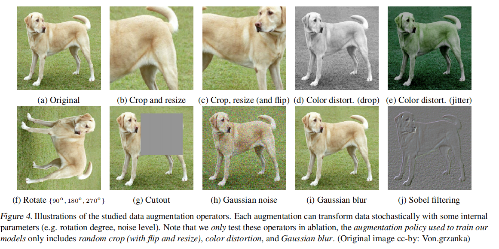
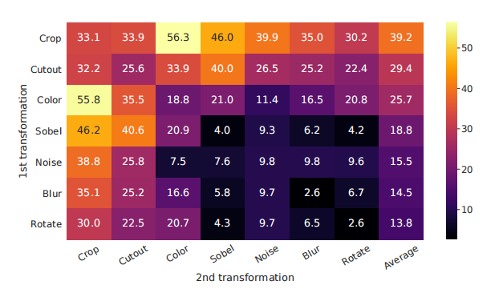

# 【论文阅读笔记】SimCLR - A Simple Framework for Contrastive Learning of Visual Representations

## 摘要

这篇文章介绍了SimCLR，这是一个用于对视觉表示进行对比学习的简单框架。该框架简化了最近提出的对比自监督学习算法，而无需专门的架构或内存库。为了理解对比预测任务如何学习到有用的表示，文章对该框架的主要组成部分进行了系统性的研究。作者指出：

* 数据增强的组合在定义有效的预测任务中发挥了至关重要的作用。
* 在表示和对比损失之间引入可学习的非线性变换显著提高了学到的表示的质量。
* 对比学习从较大的批次大小和更多的训练步骤中获益，相比之下，与监督学习相比，其效果更好。

通过结合这些发现，作者成功地在ImageNet数据集上显著超越了先前的自监督和半监督学习方法。在SimCLR学到的自监督表示上训练的线性分类器实现了76.5%的top-1准确率，相对于之前的最先进水平提高了7%，与一个监督的ResNet-50的性能相匹配。当仅在1%的标签上进行微调时，他们实现了85.8%的top-5准确率，优于使用100倍更少标签的AlexNet。

## 1. Introduction

&emsp;这段文字指出像素级别的生成是计算密集型的，而且在表示学习中可能并非必要。相比之下，判别式方法使用与监督学习相似的目标函数学习表示，但训练网络执行先验任务，其中输入和标签都来自未标记的数据集。许多这类方法依赖于试探性任务的启发式设计（参考Doersch等人，2015年；Zhang等人，2016年；Noroozi和Favaro，2016年；Gidaris等人，2018年），这可能限制了所学表示的普遍性。基于潜在空间中的对比学习的判别式方法最近显示出很大的潜力，实现了最先进的结果（参考Hadsell等人，2006年；Dosovitskiy等人，2014年；Oord等人，2018年；Bachman等人，2019年）。

&emsp;具体来说，判别式方法的一种形式是对比学习，它通过让模型学习区分不同样本，从而在潜在空间中学习有用的表示。这种方法避免了像素级别的生成，取而代之的是通过比较数据中的不同实例来学习。文章中提到的SimCLR正是这样一种对比学习方法，通过对比图像的不同视图来学习有用的视觉表示。这种方法避免了对特殊架构或内存库的需求，使其更为简单和高效

&emsp;在这项工作中，作者引入了一个简单的框架，用于对视觉表示进行对比学习，被称为SimCLR。SimCLR不仅优于先前的工作（见图1），而且更简单，不需要专门的架构（参考Bachman等人，2019年；Hénaff等人，2019年）或内存库（参考Wu等人，2018年；Tian等人，2019年；He等人，2019年；Misra和van der Maaten，2019年）。

&emsp;这里提到的SimCLR是一个对比学习的框架，通过对比图像的不同视图来学习有用的视觉表示。相比之下，其他一些方法可能需要特殊的网络架构或者内存库来实现类似的任务。作者通过比较SimCLR与其他方法的性能（在图1中），强调了SimCLR的优越性和简单性。这种简单性体现在不需要复杂的网络结构或存储大量数据的内存库，使SimCLR更易于理解和实施

* 数据增强的组合： 对比预测任务的定义中，多个数据增强操作的组合至关重要，这有助于产生有效的表示。作者强调了数据增强的关键作用，即通过对原始数据进行多样性的变换，模型能够更好地学到有用的特征。

* 可学习的非线性变换： 在表示和对比损失之间引入可学习的非线性变换显著提高了学到的表示的质量。这表明模型通过学习适当的表示和损失之间的映射，能够更好地理解数据。

* 归一化嵌入和温度参数： 使用对比交叉熵损失的表示学习受益于归一化嵌入和适当调整的温度参数。这些操作有助于更好地规范表示，提高学到的特征的质量。

* 批量大小和训练时长： 对比学习受益于较大的批次大小和更长的训练时间，相较于其监督学习的对应部分。这表明对比学习需要更多的数据来学到有用的表示，并且需要更多的迭代来进行训练。

* 深度和宽度： 与监督学习类似，对比学习也受益于更深和更宽的网络结构。这表明模型的复杂性对于学习复杂的表示是有益的。

&emsp;在SimCLR中，通过结合上述发现，作者在ImageNet ILSVRC-2012（Russakovsky等人，2015年）上实现了自监督和半监督学习的新的最先进水平。在线性评估协议下，SimCLR实现了76.5%的top-1准确率，相对于之前的最先进水平（Hénaff等人，2019年）提高了7%。当仅使用ImageNet标签的1%进行微调时，SimCLR实现了85.8%的top-5准确率，相对于之前的方法（Hénaff等人，2019年）提高了10%。在对其他自然图像分类数据集进行微调时，SimCLR在12个数据集中的10个上表现与或优于强有力的监督基线（Kornblith等人，2019年）。

&emsp;这些结果表明SimCLR在不需要人类监督的情况下，通过对比学习在图像表示学习任务中取得了显著的性能提升。特别是，在使用极少标签进行微调时，SimCLR仍然能够取得很高的准确率，相较于传统监督学习方法有更大的优势。这表明SimCLR在自监督和半监督学习中都能够作为一个强大的框架。

## 2. Method
### 2.1. The Contrastive Learning Framework

受到最近对比学习算法的启发（详见第7节概述），SimCLR通过在潜在空间中使用对比损失，通过最大化同一数据示例的不同增强视图之间的一致性来学习表示。如图2所示，这个框架包括以下四个主要组成部分。

* Data Augmentation: 数据增强是SimCLR中的关键组成部分之一。通过对原始数据进行不同的增强操作，例如裁剪、旋转、翻转等，生成多个视图，从而增加了数据的多样性。

* Encoder Network: 编码器网络负责将数据映射到潜在空间。SimCLR使用了一个共享的骨干编码器来处理不同的视图，确保学到的表示在潜在空间中能够保持一致性。

* Projection Head: 投影头是一个可学习的非线性变换，用于将编码器的输出映射到潜在空间中。这一步的引入有助于提高学到的表示的质量。

* Contrastive Loss: 对比损失是SimCLR的核心组成部分。它通过最大化同一数据示例的不同增强视图之间的相似性，从而使得相似的样本在潜在空间中距离更近，不相似的样本距离更远。这有助于学到的表示能够更好地捕捉数据之间的关系。

通过这四个组成部分的协同工作，SimCLR能够通过对比学习实现视觉表示的无监督学习，为自监督和半监督学习任务提供了强大的性能。

&emsp;这段文字描述了SimCLR中的神经网络基础编码器，表示为 f(·)，它从增强的数据示例中提取表示向量。SimCLR的框架允许使用各种网络架构，没有具体的限制。作者选择了简单性，并采用了常用的ResNet（He等人，2016年）来获得 hi = f(˜xi) = ResNet(˜xi)，其中 hi ∈ ℝ^d 是经过平均池化层后的输出向量。

&emsp;具体而言，编码器的任务是将输入的增强数据示例（˜xi）映射为表示向量（hi）。作者在这里选择了ResNet作为编码器的网络结构，ResNet是一种深度卷积神经网络结构，因其在训练深层网络时的性能而受到广泛使用。模型的输出 hi 是通过对 ResNet 输出进行平均池化层得到的，这个输出向量包含了输入数据示例的表示信息。这样，编码器的选择和结构对于SimCLR的性能起到了重要的作用。

### 2.2. Training with Large Batch Size

&emsp;为了保持简单，SimCLR不使用记忆库（memory bank）进行模型训练（参考Wu等人，2018年；He等人，2019年）。相反，SimCLR通过改变训练批量大小 N，从256到8192不等。批量大小为8192时，每个正对样本对都有16382个负例，分别来自两个增强视图。然而，使用标准的SGD/Momentum和线性学习率缩放进行大批量训练可能不稳定（参考Goyal等人，2017年）。为了稳定训练，SimCLR使用了LARS优化器（You等人，2017年）来处理所有批量大小。

&emsp;SimCLR的模型训练是在Cloud TPUs上进行的，根据批量大小的不同使用了32到128个核心。使用TPUs有助于高效处理大规模的数据和模型，提高了训练速度和效率。这种方式使得SimCLR能够在较大的批次上进行训练，从而更好地学习有效的视觉表示。

&emsp;这段文字讨论了全局批量归一化（Global BN）在SimCLR中的应用。标准的ResNet使用批量归一化（Batch Normalization）（参考Ioffe和Szegedy，2015年）。在具有数据并行性的分布式训练中，通常会在每个设备上本地聚合批量归一化的均值和方差。在SimCLR的对比学习中，由于正对样本对是在同一设备上计算的，模型可以利用本地信息泄漏来提高预测准确性，而不必改善表示。

&emsp;为了解决这个问题，SimCLR采用了在训练期间在所有设备上聚合批量归一化均值和方差的方法。这意味着在训练过程中，每个设备上的均值和方差都被收集和整合，以确保模型在训练时获得全局的统计信息。其他方法包括在设备之间洗牌数据示例（参考He等人，2019年）或用层归一化（Layer Normalization）替换批量归一化（参考Hénaff等人，2019年）。

&emsp;通过在全局范围内聚合批量归一化的统计信息，SimCLR试图减轻由于局部信息泄漏而可能导致的问题，确保模型在学习表示时更具一致性。这种方法有助于提高模型的泛化性能。

### 2.3. Evaluation Protocol

&emsp;默认设置： 除非另有说明，我们在数据增强中使用随机裁剪和调整大小（带有随机翻转）、颜色失真以及高斯模糊（详见附录A）。我们使用ResNet-50作为基础编码器网络，并使用一个2层MLP投影头将表示投影到128维的潜在空间。作为损失函数，我们使用NT-Xent，并使用LARS进行优化，学习率为4.8（= 0.3 × BatchSize/256），权重衰减为10^(-6)。我们以4096的批次大小训练100个epochs。此外，我们对前10个epochs使用线性warm-up，并使用余弦衰减调度（Loshchilov和Hutter，2016年）而不是重新启动的方式衰减学习率。

## 3. Data Augmentation for Contrastive Representation Learning

&emsp;数据增强定义了预测任务： 虽然数据增强已经在监督学习和无监督表示学习中被广泛使用（Krizhevsky等人，2012年；Hénaff等人，2019年；Bachman等人，2019年），但它并没有被视为系统性定义对比预测任务的方式。许多现有方法通过改变架构来定义对比预测任务。例如，Hjelm等人（2018年）；Bachman等人（2019年）通过约束网络架构中的感受野实现了全局到局部的视图预测，而Oord等人（2018年）；Hénaff等人（2019年）通过固定的图像分割过程和上下文聚合网络实现了相邻视图的预测。我们展示了通过对目标图像进行简单的随机裁剪（带有调整大小），可以避免这种复杂性，从而创造了一个包含上述两者的预测任务家族，如图3所示。这个简单的设计选择方便地将预测任务与其他组件（如神经网络架构）解耦。通过随机组合扩展这些增强方式，可以定义更广泛的对比预测任务。

  

### 3.1. Composition of data augmentation operations is crucial for learning good representations

&emsp;系统研究数据增强的影响： 为了系统地研究数据增强的影响，我们考虑了几种常见的增强方式。一种类型的增强涉及对数据进行空间/几何变换，例如裁剪和调整大小（带有水平翻转），旋转（Gidaris等人，2018年）和cutout（DeVries＆Taylor，2017年）。另一种类型的增强涉及外观变换，例如颜色失真（包括颜色抖动、亮度、对比度、饱和度、色调）（Howard，2013年；Szegedy等人，2015年）、高斯模糊和Sobel滤波。图4可视化了我们在这项工作中研究的增强方式。

  

&emsp;一种增强组合显得突出：随机裁剪和随机颜色失真。我们猜测，当仅使用随机裁剪作为数据增强时，一个严重的问题是图像中的大多数块都共享相似的颜色分布。图6显示颜色直方图本身就足以区分图像。神经网络可能会利用这种捷径来解决预测任务。因此，将裁剪与颜色失真结合起来学习可泛化的特征是至关重要的。

## 3.2. Contrastive learning needs stronger data augmentation than supervised learning

&emsp;为了进一步展示颜色增强的重要性，我们调整颜色增强的强度，如表1所示。更强的颜色增强显著提高了学到的无监督模型的线性评估性能。在这种情况下，AutoAugment（Cubuk等人，2019年），一个使用监督学习找到的复杂的增强策略，不比简单的裁剪+（更强的）颜色失真效果更好。在使用相同的增强集合训练监督模型时，我们观察到更强的颜色增强并不会提高甚至会降低它们的性能。因此，我们的实验证明，与监督学习相比，无监督对比学习受益于更强的（颜色）数据增强。尽管以前的工作已经报告了数据增强对自监督学习的有用性（Doersch等人，2015年；Bachman等人，2019年；Hénaff等人，2019年；Asano等人，2019年），我们展示了对于监督学习没有准确性提升的数据增强仍然可以在对比学习中起到相当大的帮助。

## 4. Architectures for Encoder and Head

### 4.1. Unsupervised contrastive learning benefits (more) from bigger models

&emsp;图7显示，或许并不令人意外的是，增加深度和宽度都可以提高性能。虽然类似的发现适用于监督学习（He等人，2016年），但我们发现在无监督模型和线性分类器之间的差距随着模型大小的增加而缩小，这表明与监督学习相比，无监督学习更受益于更大的模型。

### 4.2. A nonlinear projection head improves the representation quality of the layer before it

&emsp;然后，我们研究了包含投影头（即g(h)）的重要性。图8显示了使用三种不同架构的头部进行线性评估的结果：（1）身份映射；（2）线性投影，如一些先前方法所使用的（Wu等人，2018年）；（3）具有一个额外的隐藏层（和ReLU激活）的默认非线性投影，类似于Bachman等人（2019年）。我们观察到非线性投影比线性投影更好（+3%），而且比没有投影好得多（>10%）。当使用投影头时，观察到无论输出维度如何，结果都是相似的。此外，即使使用非线性投影，投影头之前的层h仍然比投影头之后的层z = g(h)好得多（>10%），这表明投影头之前的隐藏层是比之后的层更好的表示。

&emsp;我们推测使用非线性投影之前的表示的重要性是由于对比损失引起的信息损失。特别是，z = g(h) 被训练为对数据变换不变。因此，g 可能会去除对下游任务有用的信息，比如对象的颜色或方向。通过利用非线性变换 g(·)，可以在 h 中形成并保持更多信息。为了验证这一假设，我们进行了实验，使用 h 或 g(h) 来学习预训练期间应用的变换。在这里，我们设置 g(h) = W(2)σ(W(1)h)，具有相同的输入和输出维度（即2048）。表3显示 h 包含有关应用的变换的更多信息，而 g(h) 丢失了信息。可以进行更深入的分析。

## 5. Loss Functions and Batch Size

### 5.1. Normalized cross entropy loss with adjustable temperature works better than alternatives

&emsp;我们将NT-Xent损失与其他常用的对比损失函数进行比较，如 logistic 损失（Mikolov等人，2013年）和 margin 损失（Schroff等人，2015年）。表2显示了目标函数以及损失函数输入的梯度。观察梯度，我们注意到：1）`2 归一化（即余弦相似性）结合温度有效地对不同的示例进行加权，适当的温度可以帮助模型从难例中学习；2）与交叉熵不同，其他目标函数不通过相对难度加权负例。因此，对于这些损失函数，必须应用半难例负采样（Schroff等人，2015年）：而不是计算所有损失项上的梯度，可以使用半难例负项计算梯度（即在损失边界内且距离最近，但比正例更远的负例）。

### 5.2. Contrastive learning benefits (more) from larger batch sizes and longer training

&emsp;图9显示了在模型训练不同数量的epochs时，批量大小的影响。我们发现，当训练的epochs数量较小时（例如100 epochs），较大的批量大小相比较小的批量大小具有显著优势。随着更多的训练步骤/epochs，只要批次被随机重新采样，不同批量大小之间的差距会减小或消失。与监督学习（Goyal等人，2017年）相比，在对比学习中，较大的批量大小提供更多的负例，有助于收敛（即对于给定的准确性，需要更少的epochs和步骤）。较长的训练还提供更多的负例，改善结果。在附录B.1中，提供了更长训练步骤的结果。

