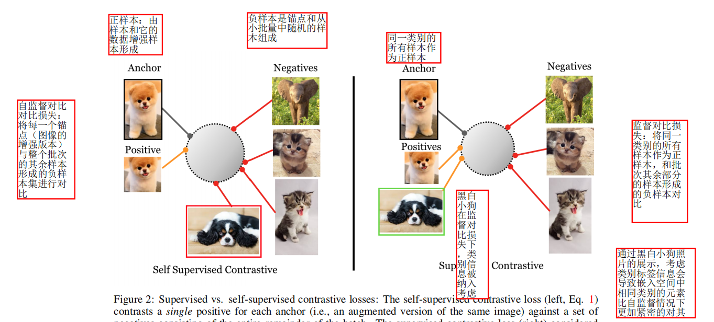
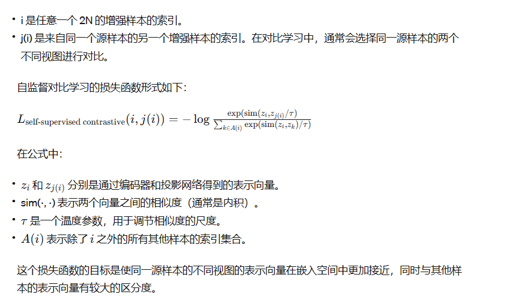

# 【论文阅读笔记】Supervised Contrastive Learning

## 摘要

* 自监督批次对比方法扩展到完全监督的环境中，以有效利用标签信息
* 提出两种监督对比损失的可能版本
  
  
## 介绍
* 交叉熵损失函数的不足之处，对噪声标签的不鲁棒性和可能导致交叉的边际，降低了泛化能。
* 监督对比损失：将同一类别的所有样本作为正样本，并将批次中其余部分的样本作为负样本进行对比
* 自监督对比对比损失：将每一个锚点（图像的增强版本）与整个批次的其余样本形成的负样本集进行对比。
* 通过黑白小狗照片的展示，考虑类别标签信息会导致嵌入空间中相同类别的元素比自监督情况下更加紧密地对齐

  

* 自监督对比学习：在嵌入空间中将一个锚点和一个正样本拉在一起，并将锚点与许多负样本进行推散。没有标签可用，正样本通常由样本的数据增强形成，而负样本由锚点和从小批量随机选择的样本组成。
* 对比学习通过比较正样本和负样本之间的关系来学习有意义的表示，而无需使用标签信息。
* 创新点在于考虑除了许多负样本之外，还有很多正样本，这与自监督对比学习不同，后者通常只使用单一正样本
* 允许每一个锚点有多个正样本是对比学习在完全监督设置下的一项创新。
* 相对于交叉熵损失更稳健

## 相关工作

* 相对于交叉熵损失，该损失对于超参数的选择更加不敏感。这意味着在使用该损失时，调整超参数的需求相对较小，更容易在不同的任务和设置中获得良好的性能。
* 这句话指出了交叉熵损失的缺点，主要包括对噪声的敏感性、对抗性示例的存在以及边际不足。
* 这句话提到了自监督学习领域的最新进展。
* 三元组损失是一种用于监督学习的损失函数。在这种损失函数中，每个锚点都与一个正样本和一个负样本配对。正样本通常来自同一类别，而负样本则来自其他类别。这种损失的目标是使得锚点与正样本之间的距离尽可能小，而与负样本之间的距离尽可能大，从而促使模型学到更好的表示。在提供的链接中，可能包含了更详细的关于三元组损失的信息。
* 自监督对比损失是一种损失函数，其使用方式类似于三元组损失，但有一些关键的区别。在自监督对比损失中，每个锚点样本仍然有一个对应的正样本，但与三元组损失不同的是，每个锚点会使用许多负样本对。这些负样本对通常是通过在整个批次中随机选择样本来形成的。
* 这种损失函数的目标是通过拉近同一类别样本的表示，并将不同类别样本的表示推开，从而在嵌入空间中形成更好的聚类。这通过在训练时将每个锚点与来自同一类别和其他类别的样本进行对比来实现。这种对比损失的设计使得模型能够学到数据的更有意义的表示，而无需使用显式的类别标签。

## Method

* 对于给定的数据批次，首先对每个样本进行两次数据增强，从而获得两个增强版本的批次。这两个副本表示数据的两个不同视图，以提供更多的信息。

* 然后，这两个增强版本的批次都通过编码器网络进行前向传播，其中编码器网络将每个样本映射到一个2048维度的归一化嵌入。这个嵌入是表示样本在嵌入空间中的位置的向量。

* 这个过程的关键点是，通过在两个增强版本上进行前向传播，模型能够学习到更具鲁棒性和泛化能力的特征表示，而无需使用显式的标签信息。这些学到的表示可以在后续的任务中进行微调或用于其他下游任务。
* 步骤
  * 数据准备： 对于输入的数据批次，进行两次数据增强，生成两个批次的副本，以提高模型对数据的鲁棒性和泛化性能。

  * 编码器网络： 通过编码器网络，对两个副本进行前向传播，得到每个样本的2048维度的归一化嵌入，形成在高维空间中的紧凑表示。

  * 投影网络： 在训练阶段，通过投影网络对表示进行下一步传播，提炼特征以更好地支持监督学习任务。在推断阶段，投影网络被丢弃。

  * 损失计算： 在投影网络的输出上设置一个监督对比损失，该损失用于引导模型学习有助于分类的特征表示。

  * 分类器训练： 为了在具体的分类任务中使用训练好的模型，冻结表示后，训练一个线性分类器，并使用交叉熵损失来优化分类器，以实现更好的分类性能。

* 自监督对比学习： 通过自监督对比学习方式，学习数据的表示。这是通过在数据批次上引入对比损失，使得相同样本的不同视图之间更加相似，不同样本之间更加分散，从而促使模型学到更具有区分性和泛化性的表示。

* 监督微调： 利用自监督学习得到的表示，通过监督学习任务对这些表示进行微调。这是通过在冻结的表示上添加一个线性分类器，使用监督学习的交叉熵损失来微调模型，使其适应具体的分类目标。这个过程在冻结了大部分网络参数的情况下，只更新分类器的参数。

* 一组N个随机采样的样本/标签对（N个数据点，每个数据点包括一个样本和相应的标签）。训练时的相应批次包含2N对。这意味着每个样本会有两个随机增强版本，即每个数据点有两个样本。记作 x2k 和 x2k-1，它们是 xk 的两个随机增强版本。这里 k 表示样本的索引

  

* 对于监督学习，原始的自监督对比损失公式无法处理由于存在标签而已知多个样本属于同一类的情况。在监督学习中，通常会有多个样本属于相同的类别，而原始的自监督对比损失是为自监督学习设计的，其中每个样本只有一个正样本。

* 在监督学习中，正样本通常来自同一类别，而负样本来自其他类别。由于多个正样本可能属于同一类别，原始自监督对比损失需要进行适当修改以处理这种情况。文章进一步介绍了两种修改方案，即公式2和公式3，来适应监督学习中存在多个正样本的情况。这些修改允许每个锚点有多个正样本，从而更好地处理监督学习任务
* 这段话指出在监督学习的背景下，需要修改损失函数以适应已知同一类别的多个样本的情况。在原始的自监督对比损失中，损失函数假定每个锚点只有一个正样本。然而，在监督学习中，由于已知同一类别的多个样本，需要对损失函数进行修改，以允许每个锚点有多个正样本。

* 监督对比学习与三元组损失[53]密切相关，三元组损失是监督学习中广泛使用的损失函数之一。在附录中，我们展示了当使用一个正样本和一个负样本时，三元组损失是对比损失的一个特例。当使用多个负样本时，我们表明SupCon损失等同于N-pairs损失[45]。
* 1. AutoAugment:自动搜索数据增强策略的方法，通过在训练集上进行搜索。属于自适应的数据增强方法

* RandAugment:随机数据增强方法，通过在每一个训练批次中应用不同的增强，增加对多样性和不同视角的学习

* SimAugment:SimAugment是一种基于相似性的数据增强方法，他利用多个随即增强操作堆叠在一起，创建一个更强大和多样性的增强策略
* 泛化性能： SupCon 在不同数据集和任务上都表现得更好，具有更强的泛化能力。

* 最先进准确度： 使用 AutoAugment 策略，该方法取得了新的最先进的准确度。

* 对比学习与数据增强结合： 结合对比学习和先进的数据增强技术可能产生更好的性能，这强调了方法的综合效果。
