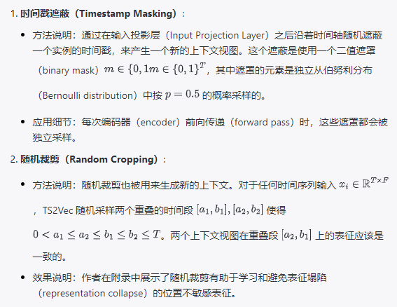
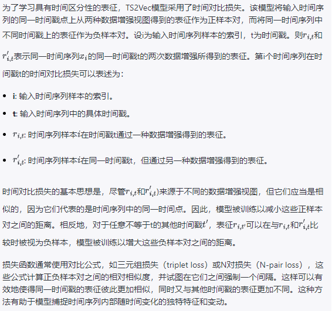

# TS2Vec: Towards Universal Representation of Time Series

## 摘要

&emsp;这篇论文介绍了TS2Vec，这是一个用于在任意语义级别上学习时间序列表示的通用框架。与现有方法不同，TS2Vec以层次化方式在增强的上下文视图上执行对比学习，从而为每个时间戳提供了稳健的上下文表示。此外，为了获得时间序列中任意子序列的表示，我们可以对相应时间戳的表示应用简单的聚合方法。我们进行了大量实验，以评估时间序列表示的质量。结果表明，TS2Vec在125个UCR数据集和29个UEA数据集上相较于现有的无监督时间序列表示方法取得了显著改进。学到的时间戳级别表示还在时间序列预测和异常检测任务中取得了优异的结果。在学习表示之上训练的线性回归模型在时间序列预测方面表现优于以往的方法。此外，我们提出了一种简单的方法来应用学到的表示进行无监督异常检测，在文献中取得了SOTA的结果。源代码公开可用于https://github.com/yuezhihan/ts2vec。

## Introduction

&emsp;时间序列在诸如金融市场、需求预测和气候建模等各个行业中起着重要作用。学习时间序列的通用表示是一个基本但具有挑战性的问题。许多研究（Tonekaboni、Eytan和Goldenberg，2021年；Franceschi、Dieuleveut和Jaggi，2019年；Wu等人，2018年）都专注于学习实例级别的表示，这些表示描述了输入时间序列的整个段落，并在聚类和分类等任务中取得了巨大成功。此外，最近的研究（Eldele等人，2021年；Franceschi、Dieuleveut和Jaggi，2019年）采用了对比损失来学习时间序列的固有结构。然而，现有方法仍然存在显著的局限性。

&emsp;首先，实例级别的表示可能不适用于需要精细表示的任务，例如时间序列预测和异常检测。在这类任务中，需要推断特定时间戳或子序列的目标，而对整个时间序列的粗略表示不足以实现令人满意的性能。

&emsp;第三，大多数现有的无监督时间序列表示方法受到计算机视觉（CV）和自然语言处理（NLP）领域的经验启发，这些领域具有诸如变换不变性和裁剪不变性等强归纳偏差。然而，这些假设并不总是适用于建模时间序列。例如，裁剪是图像经常使用的增强策略。然而，时间序列的分布和语义可能随时间变化，裁剪的子序列可能具有与原始时间序列不同的分布。

&emsp;为了解决这些问题，本文提出了一种称为TS2Vec的通用对比学习框架，它能够在所有语义级别上学习时间序列的表示。它以实例和时间维度分层区分正负样本；对于任意子序列，可以通过对相应时间戳进行最大池化来获取其整体表示。这使得模型能够在多个分辨率下捕获时间数据的上下文信息，并为任何粒度生成精细的表示。此外，在TS2Vec中的对比目标基于增强的上下文视图，即两个增强上下文中相同子序列的表示应该一致。通过这种方式，我们可以为每个子序列获得稳健的上下文表示，而不引入像变换不变性和裁剪不变性这样的不受欢迎的归纳偏差。

&emsp;我们提出了TS2Vec，这是一个统一的框架，用于学习各种语义级别上的任意子序列的上下文表示。据我们所知，这是第一个为时间序列领域中所有类型的任务提供灵活和通用表示方法的工作，包括但不限于时间序列分类、预测和异常检测。

&emsp;为了实现上述目标，我们在对比学习框架中采用了两个新颖的设计。首先，我们在实例级别和时间维度上使用分层对比方法来捕获多尺度的上下文信息。其次，我们提出了上下文一致性来选择正样本对。与以往的最新技术不同，这更适合具有不同分布和尺度的时间序列数据。广泛的分析表明，TS2Vec对于具有缺失值的时间序列具有鲁棒性，并且通过消融研究验证了分层对比和上下文一致性的有效性。

&emsp;TS2Vec在三个基准时间序列任务上优于现有的最新技术，包括分类、预测和异常检测。例如，与分类任务上最佳无监督表示方法相比，我们的方法在125个UCR数据集上平均提高了2.4%的准确率，在29个UEA数据集上提高了3.0%的准确率。

## Method

### Problem Definition

&emsp;给定一个包含N个实例的时间序列集合X = {x1, x2, · · · , xN}，目标是学习一个非线性嵌入函数fθ，将每个xi映射到其最佳描述自身的表示ri。输入时间序列xi的维度为T × F，其中T是序列长度，F是特征维度。表示ri = {ri,1, ri,2, · · · , ri,T} 包含每个时间戳t的表示向量ri,t ∈ ℝ^K，其中K是表示向量的维度。

### Model Architecture

&emsp;TS2Vec的整体架构如图1所示。我们从输入时间序列xi中随机采样两个重叠的子序列，并鼓励在共同片段上一致的上下文表示。原始输入被送入编码器，该编码器与时间对比损失和实例对比损失联合优化。总损失在分层框架中的多个尺度上求和。

&emsp;编码器fθ包括三个组件，包括一个输入投影层，一个时间戳掩码模块和一个扩张的CNN模块。对于每个输入xi，输入投影层是一个全连接层，将时间戳t处的观测xi,t映射到高维潜在向量zi,t。时间戳掩码模块在随机选择的时间戳处对潜在向量进行掩码，以生成增强的上下文视图。请注意，我们掩码潜在向量而不是原始值，因为时间序列的值范围可能是无界的，不可能为原始数据找到一个特殊的标记。我们将在附录中进一步证明这种设计的可行性。

&emsp;我们应用一个具有十个残差块的扩张卷积神经网络（CNN）模块来提取每个时间戳的上下文表示。每个残差块包含两个具有扩张参数（对于第l个块为2^l）的1维卷积层。扩张卷积使得在不同领域具有大的感受野（Bai、Kolter和Koltun，2018年）。在实验部分中，我们将展示它在各种任务和数据集上的有效性

### Contextual Consistency

在对比学习中，正样本对的构建是至关重要的。先前的研究采用了各种选择策略（见图2），总结如下：
• 子序列一致性（Franceschi、Dieuleveut和Jaggi，2019年）鼓励时间序列的表示与其采样的子序列更接近。
• 时间一致性（Tonekaboni、Eytan和Goldenberg，2021年）通过选择相邻的片段作为正样本，强化表示的局部平滑性。
• 变换一致性（Eldele等人，2021年）通过不同的转换（如缩放、排列等）增强输入序列，鼓励模型学习变换不变的表示。

&emsp;然而，上述策略基于对数据分布的强假设，可能不适用于时间序列数据。例如，子序列一致性在存在水平偏移时容易受到影响（见图3a），而时间一致性在出现异常时可能会引入错误的正样本对（见图3b）。在这两个图中，绿色和黄色部分具有不同的模式，但先前的策略将它们视为相似的。为了克服这个问题，我们提出了一种新的策略，即上下文一致性，它将两个增强上下文中相同时间戳的表示视为正样本对。上下文是通过对输入时间序列应用时间戳掩码和随机裁剪来生成的。其优点有两个。首先，掩码和裁剪不会改变时间序列的幅度，这对于时间序列很重要。其次，它们通过强制每个时间戳在不同的上下文中重新构建自身，提高了学习表示的鲁棒性。

&emsp;这段文字进一步述说了上文提到的新策略中的两种方法：时间戳遮蔽（Timestamp Masking）和随机裁剪（Random Cropping），这两种方法都是为了生成新的上下文视图来提高模型的健壮性。以下是对这两种方法的详细解析：

  

 
&emsp;文章强调，时间戳遮蔽和随机裁剪这两种方法仅在训练阶段应用。这意味着它们被用来增强训练数据，使模型能够在面对不完整或被扰动的数据时仍能进行有效的学习和泛化。总之，时间戳遮蔽通过随机丢弃信息来促使模型提取出更加健壮的特征，而随机裁剪通过从原时间序列中选取子序列段，鼓励模型学习能够覆盖整个序列的一致性表征。两者结合能够有效地提高时间序列数据的对比学习性能。

### Hierarchical Contrasting

**层次性对比损失 (Hierarchical Contrastive Loss)**：
* 目的：该损失函数旨在让编码器不仅仅学习到最细粒度的时间戳特征（timestamp-level representation），而且还要学习到不同粒度级别，即多尺度的数据表征。
* 方法实施：这通常是通过引入一种结构来实现，该结构可以捕获数据在不同时间尺度上的特性，并鼓励模型识别出这些尺度下的共性和差异性。
**最大池化 (Max Pooling)**：
* 应用方式：对时间戳级别的特征表征沿时间轴进行最大池化操作，以简化信息并着眼于更加抽象的特征。
* 效果：通过最大池化，可以将一段时间内的多个特征点综合成一个代表性强的特征点，这有助于编码器捕获到更广泛的上下文信息。
* 递归计算：
* 操作：在所提出的层次性对比损失框架内，递归地应用一个特定的计算公式（即公式3），可能是对于将多尺度的表征纳入损失函数的一种方式。
* 顶层语义级别的对比：
* 目的：顶层语义级别的对比，即在非常宽泛的层面上比较数据点，是为了促进实* 例级表征的学习。
* 实际意义：实例级表征是指模型不仅能识别出每个时间戳的特性，还能在整个数据实例的层面理解和表征数据。

&emsp;总而言之，文章提出的层次性对比损失是为了迫使编码器在多个尺度上学习特征表征，这有助于提高模型对不同级别抽象特征的理解，进而提升模型的表现力和泛化能力。通过在不同的语义层次上进行对比，模型能更好地学习到数据中潜在的结构和模式。

* 为了捕捉时间序列的上下文表征，文章中的方法同时利用了实例级别（instance-wise）和时间级别（temporal）的对比损失来编码时间序列的分布。这些损失函数被应用到层次性对比模型中所有的粒度级别。
* 实例级别的对比损失 (Instance-wise Contrastive Loss):
  * 目的：实例级别的对比损失聚焦于整个时间序列实例，并尝试区分不同的序列实例。这就意味着模型需要在高层次上区分整个序列的差异，识别每个独立实例的唯一性。
* 时间级别的对比损失 (Temporal Contrastive Loss):
  * 目的：时间级别的对比损失则关注序列内部的各个时间点或时间段，并希望模型能够学习时间序列内部的动态变化和局部模式。
* 将这两种损失联合使用的目的在于让模型同时理解序列的全局特性以及内部的细节变化。这可以帮助模型在不同的层次上学习潜在的模式，并更好地适应各种不同的时间序列分析任务。
详细来说，层次性对比模型允许模型在不同的层次上捕捉和比较特征：
**在底层（例如时间戳层次），它可以关注于短期的变化和小尺度的模式。
在高层（例如整个时间序列的层次），它关注序列的整体趋势和形状。
这种联合的损失函数策略让模型能够更加全面地理解数据，并增强了模型对时间序列变化的编码能力，使之能够生成更加丰富和有区分性的表征。通过这样的方法，模型可以更好地将时间序列的不同部分关联起来，并在不同尺度下保持表征的一致性。**

  

