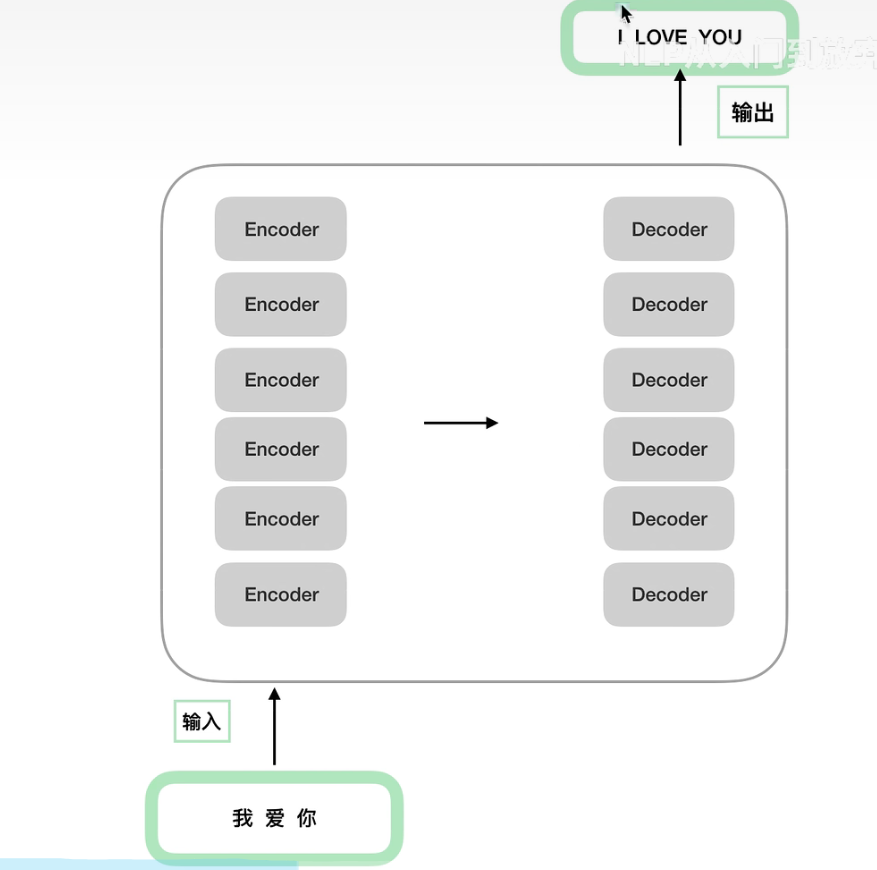
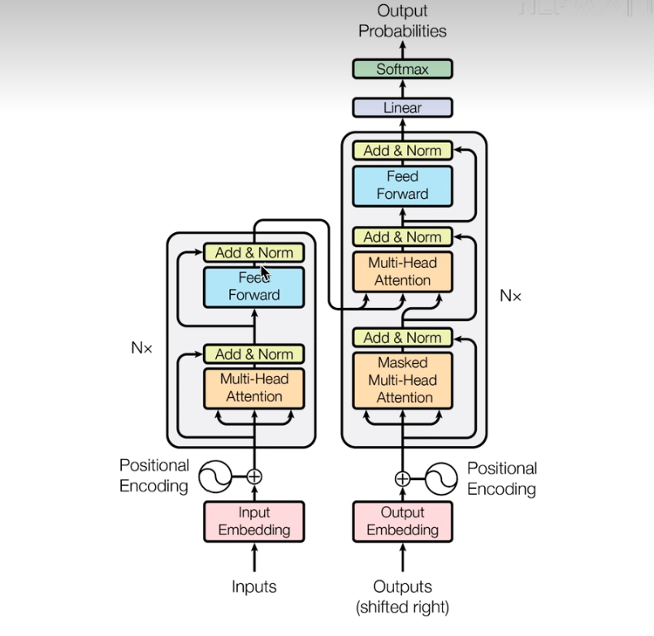
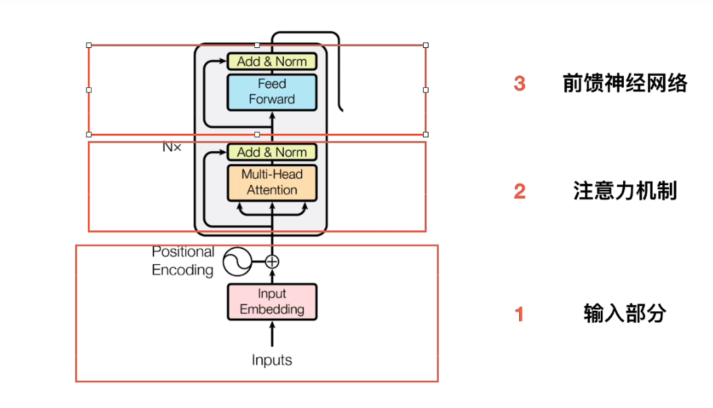
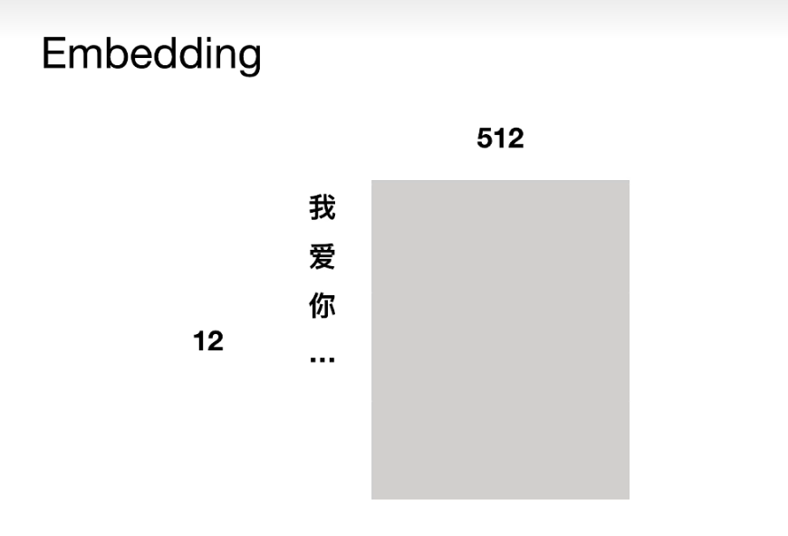

# Transformer学习笔记

## 大致理解

  

* Encoder与decoder的结构是不一样的
* Encoder之间结构相同，参数之间是在独立训练
* 抛弃传统的RNN CNN模型，仅仅是Attnetion机制实现的，并且encoder全部是并行计算的，训练时间大大缩短
* Encoder层引入了Muti-Head机制，可以并行计算，Decoder层仍旧需要串行计算
* Decoder接受output输入的同时接受encoder的输入，帮助当前节点获取到需要重点关注的内容

  

## 讲解encoder

* 输入部分
* 注意力机制
* 前馈神经网络
* Encoder端全部并行计算，训练时间大大缩小
* 传统seq2seq最大的问题在于将Encoder端的所有信息压缩到一个固定长度的向量中，并且将其作为Decoder端首个隐藏状态的输入，来预测Decoder端第一个单词(token)的隐藏状态，在输入序列比较长的时候，这样会显示很多信息
* Tamsformer优点： transformer架构完全依赖于Attention机制，解决了输入输出的长期依赖问题，并且拥有并行计算的能力，大大减少了计算资源的消耗，self-attention模块，让原序列和目标序列首先子关联起来，这样的话，原序列和目标序列自身的embedding表示所蕴含的信息更加丰富，而且后续的FFN层也增强了模型的表达能力，Muti-Head Attention模块是的Encoder端拥有并行计算的能力

  

对于输入部分：我们需要进行Embedding，以及位置嵌入

* 对于一个句子 十二个字，我们对每一个字使用
  

