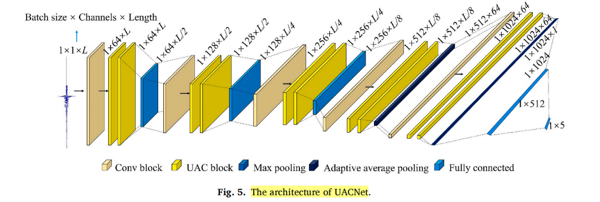

# 【论文阅读笔记】UACNet: A universal automatic classification network for microseismic signals regardless of waveform size and sampling rate

## 摘要


&emsp;这段文字描述了在微震监测中，通常会收集到各种类型的振动事件。实现对许多可疑事件进行微震事件的自动识别是确保监测及时性的基础。然而，由于不同产品提供的微震数据采样方法不同，数据通常包含不同的波形大小和采样频率。这使得现有方法在没有数据预处理的情况下难以在不同项目中广泛使用。在本文中，提出了通用自动分类网络（UACNet），这是一种深度学习方法，可以在工程中自动识别微震数据而无需预处理。UACNet模型包括多个卷积层、自适应平均池化层、全连接层和UAC块。UAC块是一个带有多个卷积层、重置和更新门的残差结构。自适应平均池化层统一了输入大小，而UAC块则作为特征提取网络，从数据中提取足够的特征。作者在工程数据上测试了提出的UACNet，并与现有的常见和高级方法进行了比较。结果表明，UACNet通过了消融研究，其分类准确度为95.62%，高于CNN的89.14%、ResNet的91.24%、CapsNet的91.04%和RTFN的86.16%。此外，还分析了波形大小、采样率、信噪比和幅度对UACNet准确度的影响。结果显示，UACNet能够克服这些因素的影响，真正实现了对微震信号的自动实时分类，无需预处理。


## 1. Introduction


&emsp;这段文字讨论了岩石力学领域多年来的研究成果，表明地下采矿活动将显著影响岩体的力学状态。此外，由力学状态变化引发的岩爆危险更有可能发生在采矿区域附近（Zhu等人，2019年，2021年）。这一风险要求我们找到一种方式来保障人员和设备的安全。通过嵌入在岩石中的传感器，微震监测系统可以利用微震活动来评估岩体的力学状态（X. B. Li等人，2021年；Zhu等人，2022年，2023年）。因此，微震监测已成为当今世界对抗岩爆风险最广泛使用的方法。在全球范围内，一些机构如澳大利亚的Integrated Seismic System（ISS）和加拿大的Engineering Seismology Group（ESG）推动了专业微震监测系统的发展（Feng等人，2012年）。这些系统为岩体工程中的微震监测提供了专业而便捷的技术支持。然而，尽管微震监测系统取得了显著进展，最近出现了一些问题。其中一个复杂的问题是现有微震监测系统的自动化能力无法满足实际需求。

&emsp;这一段文字解释了微震监测系统自动化困境的主要原因，即收集到的信号过多，并且不仅包括微震信号（He等人，2022年）。得益于先进的传感器技术，微震采集系统将在岩体工程中收集到许多振动源，如微震、爆破、机械、人类等。只有在将微震信号与其他信号分离后，才能进行后续处理和分析。因此，在初期，许多研究尝试利用源参数或特征的显著差异来识别和获取微震事件。例如，Malovichko（2012年）利用一组振动特征来量化采矿环境中爆破的概率。Vallejos和Mckinnon（2013年）通过事件特征和在线监测系统的源参数区分地震和爆炸，并比较了 logistic 回归和神经网络的优缺点。Ma和Zhao（Ma等人，2015年；Zhao等人，2015年）比较了不同源参数和特征对微震信号识别的影响，然后利用波形起始特征对矿山中的爆破和微震事件进行分类。Dong等人（2016年）以19个源参数为基础，利用 logistic 和 log-logistic 分布建立概率密度函数来区分爆破和微震事件。


&emsp;这一段文字讨论了由于许多噪音信号没有源参数，使用源参数的方法只能对爆破和微震事件进行计算，从而无法实现微震监测数据处理和分析的自动化。因此，许多研究尝试从波形阶段直接区分不同信号以获取微震信号。Mousavi等人（2016年）尝试使用连续小波变换（CWT）直接从信号中提取特征，然后与神经网络和 logistic 回归结合成功实现了信号分类。B. Li等人（2017a，2017b）从波形中提取主导频率、持续时间、衰减和多重分形参数，以区分煤矿中的微震和爆破信号。为了对地震事件和采石场爆破进行分类，Budako˘
glu和Horasan（2018年）利用了时频特征、最大S/P比、谱比、最大频率和信号持续时间来呈现信号。Provost等人（2017年）在他们的分类研究中列出了71个特征。提出并使用了越来越多的波形特征，说明直接从波形中识别微震信号的挑战。因此，许多数学方法被用来尝试从波形中自动提取特征来识别微震信号，如变分模态分解（VMD）（Zhang等人，2018年）、奇异值分解（SVD）（X. Li等人，2017年）、主成分分析（PCA）（Shang等人，2017年；Wei等人，2020年）、集合经验模态分解（EEMD）（Zhang等人，2019年）、改进的完全集合经验模态分解与自适应噪声（I-CEEMDAN）（Jiang等人，2020年）、梅尔频率倒谱系数（MFCC）（Peng等人，2019年）、局部均值分解（LMD）（Jiang和Wei，2021年）以及平滑伪-Winger-Ville分布（SPWVD）（B. X. Li等人，2021年）


&emsp;随着人工智能的发展，基于特征提取的深度学习方法在微震信号识别中得到了广泛应用，结合了特征提取方法，取得了许多成就。Lin等人（2019年，2018年）尝试使用深度学习和机器学习的结合自动分类多通道微震数据。Zhou等人（2018年）提出了一种基于信号复杂性和反向传播神经网络（BPNN）的微震和爆破事件分类方法。Dong等人（2020年）利用波形图像和卷积神经网络（CNN）建立了判别方法。Peng等人（2020a，2020b）从波形中提取了11个特征来表征波形，然后结合CNN和胶囊网络（CapsNet），实现了各种微震信号的分类。Song等人（2020年）利用Stockwell变换将微震信号转换为二维图像，然后通过CNN识别微震事件。Wilkins等人（2020年）将同一事件的不同通道组合成一个“图像”，然后使用CNN从噪音信号中识别微震事件。Xu等人（2021年）将六个参数作为改进神经网络（INN）的输入，以准确分类微震信号。最近，Li等人（2022年）提出了一种将微震波形保存为图像并基于计算机视觉进行分类的方法。Xiao等人（2022年，2021年）提出了一种新颖的稳健时序特征网络（RTFN）用于时序分类中的特征提取，而Xing等人（2022年）还提出了一种高效的联邦蒸馏学习系统（EFDLS）用于多任务时序分类。

&emsp;这一段文字指出当前微震信号分类研究的发展趋势是基于深度学习方法尽量减少人工干预。然而，在目前最先进的方法中，有些将人为设定或提取的特征作为输入，而其他则将数据转化为图像作为输入。前者增加了人工干预，而后者则丧失了信号信息。此外，正如上文所述，这些方法增加了使用的复杂性。另外，基于卷积的深度学习方法在现有研究的分析中被广泛使用。ResNet的梯度控制更适合进行更深层次的特征挖掘。因此，基于残差结构的基本思想，本文提出了一种微震信号分类的深度学习方法，称为通用自动分类网络（UACNet）。直接将信号作为UACNet的输入不需要任何预处理，即使这些信号的长度和采样率不同。UACNet由通用自动分类块（UAC块）组成。我们将UAC块设计为改进的门控残差块。UAC块是一个带有多个卷积层、重置门和更新门的残差结构。UAC块可以有效地将时域中的任意形状信号转换为规范特征域，并通过重置门和更新门智能选择保留和丢弃特征维度的数据。UACNet可以高精度地对微震信号进行分类。更重要的是，我们可以将UACNet充分应用于微震监测过程，而不仅仅局限于特定的系统或数据。


```java

无预处理的微震事件自动识别： 鉴于实际工程的需求，研究提出了在不进行信号预处理的情况下自动识别微震事件的想法。这有助于将研究结果应用于不同的项目中。

UAC块的设计： 介绍了UAC块的设计，它是一个带有多个卷积层、重置门和更新门的残差结构。该结构能够有效地从不同波形大小和采样率的信号中提取显著特征。

UACNet的测试和分析： 对构建的UACNet在实际工程数据中进行了测试、比较和分析。最终证明了UACNet能够在不进行预处理的情况下实现对微震事件的自动识别。
```


## 2. Engineering background and data preparation


&emsp;UACNet旨在确保深度学习方法在微震监测信号分类中的通用性和准确性。因此，我们的数据集是从两个工程项目中收集的，分别是东瓜山铜矿和黄土坡铜锌矿。

东瓜山铜矿： 位于中国安徽省铜陵市，主矿体的海拔为-680到-1000米，大部分在-730米以下，矿体走向为35度，长度为1820米，水平投影宽度为204到882米，厚度为30到50米。大规模开采和矿体与柱的复杂分布导致了东瓜山铜矿中复杂的岩爆活动。因此，我们在东瓜山铜矿部署了一个微震监测系统，包括七个传感器，用于预警岩爆灾害。

黄土坡铜锌矿： 位于中国新疆维吾尔自治区哈密市，矿体的走向长度为560米，水平投影宽度为650米，矿体厚度为1.0349.91米，平均厚度为9.06米，矿体的倾角相对较缓（10度35度）。黄土坡铜锌矿存在几个大型采空区威胁生产安全。因此，我们在黄土坡铜锌矿部署了一个包含八个传感器的微震监测系统，用于监测这些采空区的稳定性。

通过从这两个工程项目中收集的数据，研究旨在确保UACNet模型在微震监测信号分类中的适用性和准确性。


&emsp;在日常微震监测过程中，收集到的信号主要包括五种类型：微震事件、爆破、电信号、机械信号和人声。因此，我们构建了一个包含30,000个信号的数据集，用于训练和测试UACNet。在这个数据集中，每种类型都包括6000个信号。为了验证UACNet的通用性，每个信号的波形大小和采样率都不需要一致。图1显示了该数据集中不同类型信号的波形大小和采样率的分布情况。信号的最大波形大小为48,280，最小波形大小为768。采样率包括2000、4000、5000、8000和10,000 Hz。每种类型随机分配了5000个信号到训练集，剩余的信号分配到测试集。数据集中一些信号的示例显示在图2中。


## 3. The universal automatic classification network (UACNet)


```java
这篇论文设计了一个 UACNet，用于处理微震信号，不受波形大小和采样率的影响。UACNet通过三个层次实现通用自动分类：

自适应平均池化层（Adaptive Average Pooling Layer）： 该层消除了波形大小和采样率的不一致性。

UAC块（UAC Blocks）： 这些块精确提取了信号的固有特征。

深度网络： 由UAC块、自适应平均池化层和全连接层组成，用于最终的分类。

```

### 3.1. Adaptive average pooling


&emsp;在深度学习中，池化是一种对特征进行采样的过程。池化通常用于降低输入特征的维度和数据压缩，以加快训练速度（Lin等人，2019年；Paoletti等人，2019年）。在常见的用法中，标准的池化方法包括最大池化和平均池化。最大池化或平均池化使用固定的步幅 s、填充 p 和核大小 k 计算最大值或平均值，输出大小 Sout 取决于输入大小 Sin。


&emsp;然而，如果使用常见的最大池化和平均池化，则在训练之前必须对不同波形大小或采样率的信号进行预处理。因此，在UACNet中使用了自适应平均池化。自适应平均池化的独特特点在于可以为不同的输入大小 Sin 提供统一的输出大小 Sout。对于自适应平均池化，步幅 s'、填充 p' 和核大小 k' 也随着 Sin 的变化而变化，从而导致相同的 Sout。


&emsp;正如图3所示，展示了不同池化方法的示例。可以看出，自适应平均池化可以提供统一的输出大小。这个特性使得UACNet适用于不同波形大小或采样率的信号。


&emsp;考虑到需要直接将信号的波形作为UACNet的输入，我们设计了一个基于门控的块进行特征提取。这个块被称为通用自动分类块，由两个卷积层、一个重置门和一个更新门组成。卷积层用于特征提取，而重置门和更新门用于特征选择。卷积层通过卷积操作将原始输入转换为多通道特征图。然后，重置门和更新门用于去除冗余特征。此外，基于门控的块还可以防止由于网络深度导致的过拟合，类似于残差网络（ResNet）（Zhang和Sheng，2020年）。重置门控制要保留的现有特征数量。其中，X ∈ Rn×l 是UAC块的输入，重置门 R ∈ Rn×l 的计算如下：


&emsp;基于门控的UAC块主要受到门控循环单元（GRU）的启发。GRU在深度学习中的成功证明了基于门控模型设计的可靠性。重置门使我们能够管理要保留的先前特征的数量，而更新门使我们能够控制旧特征的新副本的数量。因此，我们设计了一种将ResNet与重置门和更新门相结合的新型UAC块。尽管参考了GRU，UAC具有自己的特点：

```java
UAC具有以下特点，与GRU不同：

从整个信号中提取特征： 与GRU从时间序列数据中按时间步骤提取特征不同，UAC只关心整个信号的特征。在执行操作时，UAC将整个信号作为一个整体进行分析。

重置门和更新门的计算方法： 对于输入数据和特征提取，UAC中的重置门和更新门的计算方法与GRU不同。

重置门和更新门对输出的影响不同： 在GRU中，重置门必须再次与输入数据一起计算以获得候选隐藏状态，然后通过更新计算最终的隐藏状态。而UAC基于ResNet架构，通过重置门确认是否保留输入特征，通过更新确认输入特征是否更新。

```

## 3.3. Architecture of the UACNet

&emsp;在UACNet中，卷积块用于在通道方向提取和扩展一维信号。这样，微震信号被扩展为一个二维特征图。对于这个特征图，一个维度是波形大小，另一个维度是通道数，也是信号的特征。卷积块的输出可以表示为，其中 Relu(x) = max(0, x) 是激活函数，xij 是第 i 个输入到第 j 个神经元，kij 是第 i 个输入与第 j 个神经元之间的卷积核，bj 是神经元 j 的偏置，Mj 是输入图的选择。在UACNet中，所有卷积层都使用7 × 7的卷积核和步幅为1。通过卷积块，微震信号在特征域中扩展，信号的不一致的时间域可以通过池化层进行调整。


  


&emsp;此外，我们分析了输入大小为（1，10000）时UACNet的计算复杂度。总参数数为27,771,653，可训练参数数为27,767,685，不可训练参数数为3968。前向/后向传递的大小为327.88 Mb，参数大小为105.94 Mb，估计的总大小为433.83 Mb。

## 4. Results


&emsp;我们在收集的数据集上基于训练集训练了UACNet模型。每种类型随机分配了5000个信号到训练集，剩余的信号分配到测试集。训练持续了100个epochs，并使用随机梯度下降进行参数优化。初始学习率和权重衰减率分别设置为0.0001和0.0001，在训练期间，学习率每20个epochs有一个0.1的衰减率。此外，在NVIDIA RTX 2080 GPU上，每个epoch的训练大约需要32分钟。图6显示了UACNet在我们的数据集上的训练过程。


&emsp;我们用TP表示真正例，FP表示假正例，FN表示假负例，TN表示真负例。计算并列出了精度（Precision）、召回率（Recall）、真负率（True negative rate）、负预测值（Negative predictive value）、假正率（False positive rate）、假负率（False negative rate）和假发现率（False discovery rate），具体数值见表2。在这些结果中，微震、爆破、电器、机械和人声的[精度，召回率]分别为[0.951，0.946]，[0.887，0.957]，[0.994，0.997]，[0.993，0.893]和[0.965，0.988]。最终，UACNet在我们的数据集中的分类准确率为95.62%。

&emsp;我们在相同的测试集上进行了消融研究，分别得到了没有重置门的UAC的测试准确率为94.80%，没有更新门的UAC的测试准确率为91.94%。消融研究的结果呈现为图8中的混淆矩阵。消融研究的结果显示，单独使用重置门和更新门的自动分类准确率低于两者结合使用时的准确率。同时，还可以发现如果没有更新门，模型的效果将会显著降低。添加重置门也可以有效提高网络的性能。因此，可以证明UAC块增强了整个网络模型的效果。


&emsp;为了验证UACNet在微震事件分类中的优越性，本文将其与现有的常见和先进方法进行了比较。主要用于比较的方法包括卷积神经网络（CNN）、残差网络（ResNet）、胶囊网络（CapsNet）和鲁棒时序特征网络（RTFN）（Xiao等，2021）。其中，CNN目前在工程中被广泛使用，ResNet比CNN更适合深度数据挖掘，CapsNet更注重数据的空间位置信息，而RTFN考虑了注意力机制。然而，在使用比较方法之前，由于波形大小和采样率的限制，需要对它们进行预处理。


&emsp;UACNet能够忽略波形大小和采样率的不一致性。然而，现有的方法都没有这个功能。因此，作为比较，我们只能提取特征然后将其输入到深度学习网络中。这是目前典型的数据预处理方法。如图9所示，本文选择了当前文献中常用的20个特征，包括过零率、能量、能量熵、频谱质心、频谱展宽、频谱熵、频谱通量、频谱滚降和12个梅尔频率倒谱系数。然后，每个信号被分成20帧，分别计算特征参数，最终将波形信号转换为一个20×20的特征矩阵。这种预处理确保了用于比较的方法可以进行训练和测试。


&emsp;在相同的配置下，我们训练并测试了CNN、ResNet、CapsNet和RTFN。所有方法使用与UACNet相同的训练参数。如图11所示，这些方法的测试结果由混淆矩阵呈现。更多的评估指标（精度、召回率、F1分数）列在表3中。CNN、ResNet、CapsNet和RTFN的准确度分别为89.14%、91.24%、91.04%和86.16%。不同类型波形的分类难度进行了分析。不同模型对于微震、爆破、电信号、机械和人声的平均精度分别为0.860、0.911、0.929、0.979和0.896。平均召回率分别为0.928、0.934、0.980、0.718和0.985。平均F1分数分别为0.892、0.922、0.953、0.822和0.937。从不同类别的角度来看，可以发现对于微震和机械的预测能力相对较弱。不同模型的分类能力进行了分析。从不同模型的角度来看，UACNet、CNN、ResNet、CapsNet和RTFN的平均精度分别为0.958、0.902、0.921、0.917和0.878，平均召回率分别为0.956、0.891、0.925、0.910和0.862，平均F1分数分别为0.956、0.891、0.919、0.908和0.851。UACNet的预测能力优于其他方法。因此，这些结果证明了UACNet不仅能够忽略输入波形的大小和采样率，而且与残差块相比，UAC块能够显著提高分类精度。

&emsp;由于UACNet是一个实用的分类器，我们还分析了不同波形大小、采样率、信噪比（SNR）和振幅对分类结果的影响。在测试数据集中，最小波形大小为768个采样点，最大波形大小为49,210个采样点。因此，从零开始，每10,000个采样点被用作一个大小段，以计算每个大小段的分类准确性。如图12(a)所示，对于[0, 10000]的波形大小，准确性为94.56%；对于(10000, 20000]的波形大小，准确性为97.18%；对于(20000, 30000]的波形大小，准确性为98.86%；对于(30000, 40000]的波形大小，准确性为100%；对于波形大小大于40000，准确性为100%。统计结果表明，波形大小对UACNet分类准确性的影响几乎可以忽略不计。只有包含信息过少的较短波形才会降低分类准确性。


## 5. Discussion

&emsp;这篇论文提出了一种深度学习方法，直接将波形作为输入，而不考虑波形大小和采样率，用于分类微震信号。我们在现场数据集中对我们的方法进行了训练和测试，取得了有价值且积极的结果。这一发现具有重要意义，因为它提供了一种能够替代生产应用中人工劳动的微震信号分类方法。同时，该方法也是实现微震监测实时分析和预警的关键技术。此外，这是首次实现了无需信号处理的自动分类理念。在现有方法中，为确保输入信号的大小一致，通常从信号中提取特征，或对信号进行裁剪和重采样。同时，现有的网络结构仅设计用于单个项目，并且网络结果大多是在现有形成的网络上进行调整。网络模型并不专为微震事件的特定研究对象而设计。这种方法无疑增加了复杂性，并通过比较实验证明信号预处理并不提高分类准确性。然而，我们的方法在没有任何信号处理的情况下实现了高准确度的分类。此外，我们提出了一种新的基于门的深度学习块，比常用的残差块更有效。

&emsp;因此，我们取得了95.62%的准确性，比ResNet的89.66%准确性更好。错误率较高的类别主要是微震、爆破和机械。微震、爆破和机械分类的准确性分别为94.5%、95.3%和88.7%。这是由于这三种信号之间的相似性较高，使得难以区分。因此，在未来的研究中，可以通过增加网络深度、使用更先进的方法（如胶囊网络）来替代全连接层来改进本文方法。同时，本文的研究思路可以扩展到微震数据处理的整个过程，即实现微震数据的整个智能处理过程，无需预处理。在这项研究中，我们提出了一种用于微震信号自动分类的UACNet。UACNet能够忽略波形大小、采样率等的不一致性，并与基于门的UAC块合作，实现微震信号的实时高精度分类。通过UACNet，可以实现微震监测系统的实时监测和预警。

## 6. Conclusions


&emsp;UACNet 提出了一种在微震信号分类领域的重要方法。它能够自动分类微震信号，而不考虑波形大小和采样率，同时还引入了基于门控的 UAC 块，有助于在训练期间消除大小方面的约束，提取有意义的特征以实现准确的表示。UACNet 的体系结构包括卷积块、UAC 块、最大池化层、自适应平均池化层和全连接层，展示了其在处理采矿环境中多样信号时的有效性。

通过使用来自东瓜山铜矿和黄土坡铜锌矿的实际数据验证了 UACNet 的可行性，其在测试集上达到了 95.62% 的分类准确度。与同样网络深度的比较方法（ResNet）相比，UACNet 表现出色，突显了其卓越性能。对波形大小、采样率和信噪比（SNR）对分类准确度的详细分析进一步证明了 UACNet 的稳定性和可靠性。

总的来说，UACNet 提供了一种可靠而适应性强的解决方案，用于微震信号的自动分类，有望提升微震监测应用中的实时监测和预警系统。通过消除信号预处理的需求以及在各种条件下的强大性能，UACNet 在微震监测领域具有重要的应用潜力。


