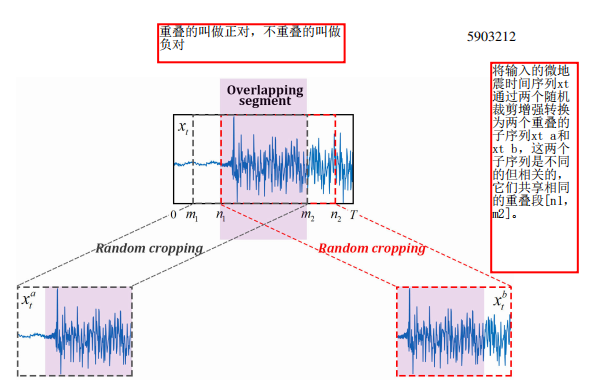
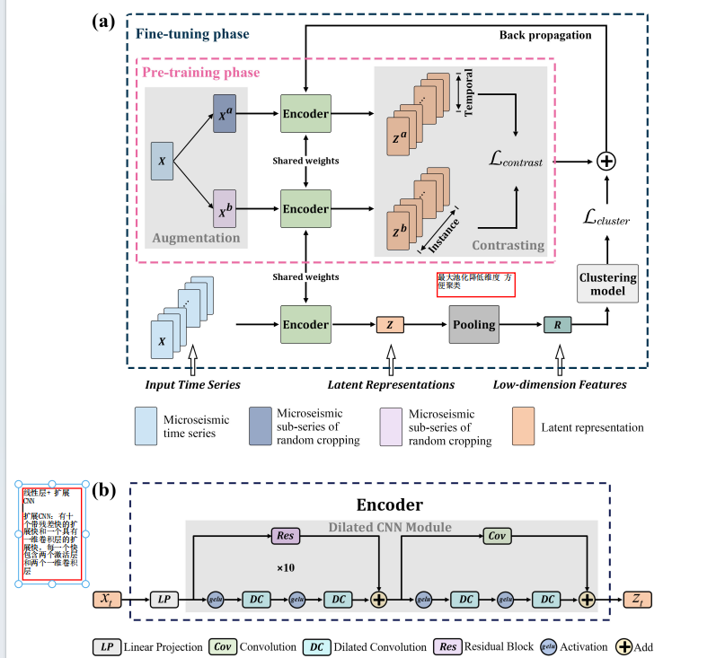
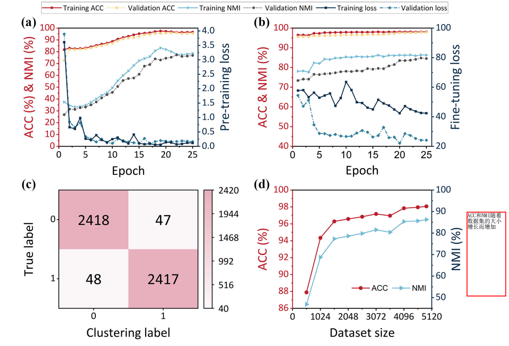

# Unsupervised Clustering of Microseismic Signals Using a Contrastive Learning Model

## 摘要

* tscc:预训练和微调
* 预训练：数据增强：时间序列微地震数据使用随机裁剪增强进行转换，创建两个不同但相关的数据视图
* 对比学习：模型采用多尺度时序和实例对比学习，这意味着学会区分预训练期间创建的正
负面数据，也就是使得编码器从多个角度捕捉上下文信息

## Introduction

* 传统方法需要大量的信号处理知识，以及人类专家的经验
* 机器学习方法远远超越传统方法，但是由于数据和标签的重要性，大规模数据的质量无
法得到保证
* 由于数据量不足数据质量不好，聚类这种无监督学习方法也不好
* 自监督学习的主要优势在于从未标记的数据中提取信息，便于后续的聚类任务。研究端到
端方式学习数据表示，将原始数据映射到潜在空间执行聚类任务
* 如果使用生成模型来提取特征的话，在训练数据集不足的时候可能会学到非判别性表示，由于生成目标的点对点性质，生成模型生成的数据在点对点层面是分散的，生成模型主要关注点的细节，没有建立数据样本本身之间的空间结构关系，学习到低级的特征。然后大多数分类和聚类的方法依赖于高级特征，导致性能差。
* 对比自监督表示学习的进展，可以从微地震时间序列中提取更有价值的信息。结合时间序列表示的对比学习框架和基于距离的聚类模型。
* 对比学习相比生成子监督学习更具有竞争力，对比学习的目标旨在澄清数据样本之间的相似性和差异性的分类。
  

## Methods

* 自监督学习的目标是为下游任务学习一个良好的潜在表示空间z，我们可以将主流的子监督学习总结为两个一般性的类别：生成式子监督学习和对比式自监督学习。

* 生成式自监督学习模型由一个编码器和解码器组成。生成模型的目的是训练编码器将输入x编码为潜在空间z，并且训练解码器在最小化重构损失的情况下从z重构出x。
* 由于生成目标的点对点性质，一些固有的缺陷限制了性能。首先，生成模型的表示分布在点对点层面建模，这未能建立数据点之间的空间结构关系，生成了低级表示。然后，大多数分类和聚类任务都针对高级抽象，尤其是微地震信号识别。

* l1和l2损失对输入数据的所有信息进行编码，这导致生成了一些对于对象识别而言不太有用的信息。因此，对所有内容进行编码导致分类或者聚类任务表现不佳
* 对比学习仅仅包含一个编码器，目标在于通过最大化正对相似性和最小化负对相似性
* 核心思想：在表示空间中最大化正对相似性，同时最小化负对相似性，其中，正对和负对是使用数据增强在表示空间中构建的。正对表示相同样本的增强试图，而其他对被定义为负对。构建正对和负对在对比学习中至关重要，对学到的表示的质量有显著影响。
* 从单个微地震时间序列xt中构建两个随即裁剪来生成两个子序列xta,xtb对于每一个时间数据xt,对比模型随机选择两个重叠的时间段[m1,m2]和[n1,n2]然后将这两个子序列馈送到编码器中，来提取它们的高维潜在表示

  

* 两个子序列，送入编码器，提取高维潜在表示，对比上下文视图重叠段[n1,m2] 这些被是认为是正对，但是在不一致的段表示为负对，

* 核心思想是通过最大化正对的相似性和最小化负对的相似性来学习微地震时间序列的判别表示。这通过时间对比和实例对比损失来实现。这种方法旨在使模型学会对微地震信号进行有效的区分和表示
* 正对是指来自输入微地震时间序列的两个子序列中相同时间戳的表示，而负对是指来自同一时间序列的不同时间戳的表示
* 直接分析不同样本之间的实例级局部表示的相似性
* 对比学习的一个重要目标是将相似的实例在表示空间中拉近，同时将不相似的实例推远。通过最大化正对的相似性和最小化负对的相似性，模型可以学到更具判别性的表示。这种方法有助于在表示空间中形成对数据分布的更好的捕捉，使得相似的样本在该空间中更接近，而不相似的样本则更远离，为后续的聚类或分类任务提供更好的基础。
* 总体对比损失是时间对比损失和实例对比损失的总和
* 质心是一种基于质心的聚类算法，其核心思想是通过计算数据点与聚类中心（质心）的距离来进行聚类。然而，在大规模数据集上，由于表示学习的限制，质心可能无法很好地捕捉数据的复杂结构，导致聚类效果较差。

* 在表示学习的框架下，聚类质心的表现受到所学习表示的影响。如果表示空间中的距离不准确地反映了数据之间的相似性，聚类质心可能无法很好地捕捉数据的固有结构。因此，在大规模数据集上，可能需要更先进的表示学习方法，或者考虑其他类型的聚类算法，以提高聚类的效果。

* 在你的场景中，使用对比学习框架进行微地震时间序列的表示学习是一个先进的方法，但你也指出了其在大规模数据集上的限制。在未来的工作中，可以尝试结合其他先进的表示学习方法，或者考虑使用更适合大规模数据集的聚类算法，以进一步提高聚类的性能。

* 由于表示学习的限制，基于质心的聚类算法在大规模数据集容易产生比较差的效果
* 聚类算法通过迭代满足最小化聚类损失函数Lcluster的必要条件，同时更新聚类中心u和成员关系p
* 使用ri和uj之间的欧氏距离作为测量xi和第j个数据簇成员度的手段

## 网络架构

* 编码器：线性投影层和一个卷积CNN对于每一个输入xi,将时间戳t的观测值映射到高维潜在向量。然后使用CNN来提取每一个时间戳的上下文表示
* 最大池化：将潜在表示Z转换为更加低纬度的特征空间R，这可以减少潜在的变量数量
* 预训练：从时间序列信号随机采样两个重叠的子序列，然后将这两个子序列的原始输入送到编码其中，该编码器与时间对比损失和实例对比损失一起进行优化。多尺度损失学习到数据的最显著表示
* 将学习到的潜在表示Z 通过一个最大池化层转换为低维度特征R，然后使用低维度特征R来使用K均值初始化聚类中心u
* 微调阶段通过使用对比损失和聚类损失训练编码器来提供数据聚类，目标是最小化损失函数L，该函数是两个损失的加权组合

  

* 迭代更新聚类中心和微调编码器的权重，可以学习到更加有利于聚类的表示，从而进一步提高了聚类的效果

## 测试结果

* 所有波形都进行了去均值、去趋势和归一化处理
* NMI用于确定同一个数据点的两个不同标签之间的归一化相似度度量
* ACC用于找到真实和预测的聚类标签之间的最佳映射
* 输入波形是一个长度为500的时间戳的时间序列
* 潜在空间的维数设置为32 因此每一个时间序列学到的潜在表示的维度是500x 32
* 最大池化层将学习到的表示降维到32 x 1

* 使用TSCC和四种传统方法进行对比ACC和NMI，Kmeans产生的效果差 dec产生的效果最差
* 评估TSCC网络学习到的特征质量，训练三个流行的监督学习分类器：线性分类器，K最近邻分类器  SVM
* 用于比较在原始时间序列 振幅谱的主成分和学习到的特征R的分类性能特征R 效果最好

  

## DISCUSSION

* TSCC会生成可靠的聚类结果，准确率达到98%准确率随着数据集大小的增加而增加，但是数据集大小增加到一定程度就不增加准确率 表示TSCC不依赖于庞大的数据集

* DEC网络基于全连接网络 需要大量数据集来提取特征，DCA和DCSS是基于生成模型的深度学习聚类方法  使得自编码器可以学习输入数据的最显著特征
* 对于DCA和DCSS 将原始时间数据转换为频谱图 改善了聚类性能
* TSCC编码器训练之后 将最大池化层学习到的潜在表示转换为一个维度较低的特征空间，然后用于K-means聚类
*  微调阶段更新编码器的权重，使得能够从输入时间序列中提取更好地特征，并且为聚类分配学到了更有用的表示
*  TSCC网络可以捕捉时间序列的隐藏特征使得可以适用于下游任务
*  时间戳：指的是时序数据的具体时间点或者时刻，TSCC模型可以区分这些时间戳

* 演变趋势：TSCC学到的32维度清晰反映不同时间戳信号的演变趋势

* 信号的聚类：TSCC模型对微震信号和噪声进行聚类
* 训练TSCC模型需要大量内存

* 空间信息：信号和噪声之间存在空间的相关性
* TSCC: 编码器和一个聚类模型，通过优化对比和聚类损失来进行学习