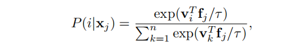
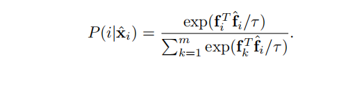
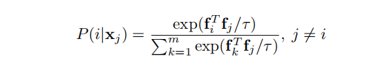
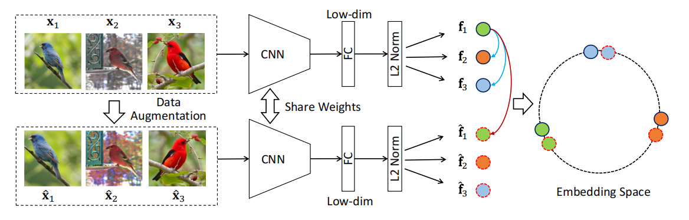
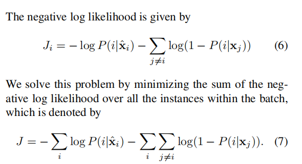
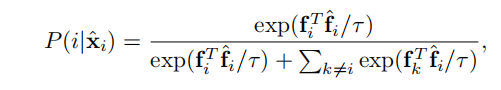
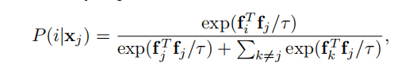

# Unsupervised Embedding Learning via Invariant and Spreading Instance Feature

## 摘要

* 这篇文章研究了无监督嵌入学习问题，即在低维度嵌入空间中需要有效相似度测量样本之间关系的问题。作者受到类别-wise监督学习中观察到的正向集中和负向分离的特性的启发，提出利用实例级别的监督来近似这些特性，旨在学习对数据增强不变和实例分散的特征。为了实现这一目标，作者提出了一种新颖的基于实例的Softmax嵌入方法，直接优化Softmax函数之上的“真实”实例特征。该方法在学习速度和准确性方面显著优于所有现有方法。该方法在使用余弦相似度进行已知和未知测试类别时表现良好。即使在没有对细粒度类别的预训练网络的情况下，它也能在样本上取得有竞争力的性能。

## Introduction
  

* 这段文章讨论了计算机视觉中的深度嵌入学习，这是一项基础任务。该任务的目标是学习具有以下特性的特征嵌入：1) 正向集中，属于相同类别的样本的嵌入特征彼此靠近；2) 负向分离，属于不同类别的样本的嵌入特征尽可能分离。为了实现这些目标，已经研究了监督嵌入学习方法，并在各种视觉任务中展示出令人印象深刻的能力。然而，监督方法所需的注释数据可能难以获取。为不同任务收集足够的带有注释的数据需要昂贵的人力和特殊领域专业知识。为了解决这个问题，该论文着手解决了无监督嵌入学习问题，即在没有人工标签的情况下学习具有区分性嵌入特征。这也被称为在文献中的无监督度量学习问题。

* 通常，无监督嵌入学习要求学到的嵌入特征之间的相似度与输入图像的视觉相似性或类别关系一致。相比之下，一般的无监督特征学习通常旨在从未标记的数据中学习一个良好的“中间”特征表示。然后，通过使用目标任务的一小部分标记训练数据对模型进行微调（例如线性分类器、物体检测器等），将学到的特征泛化到不同的任务中。然而，学到的特征表示可能无法保留视觉相似性，且在基于相似性的任务（例如最近邻搜索）中性能急剧下降。

* 通常，无监督嵌入学习要求学到的嵌入特征之间的相似度与输入图像的视觉相似性或类别关系一致。相比之下，一般的无监督特征学习通常旨在从未标记的数据中学习一个良好的“中间”特征表示。然后，通过使用目标任务的一小部分标记训练数据对模型进行微调（例如线性分类器、物体检测器等），将学到的特征泛化到不同的任务中。然而，学到的特征表示可能无法保留视觉相似性，且在基于相似性的任务（例如最近邻搜索）中性能急剧下降。

* 无监督嵌入学习的主要挑战在于从未标记的样本中发现视觉相似性或弱类别信息。Iscen等人提出在流形上挖掘难以处理的正负样本。然而，其性能严重依赖于用于标签挖掘的初始化特征表示的质量，这限制了其在通用任务中的适用性。在这篇论文中，作者建议利用实例级别的监督来近似之前提到的正向集中和负向分离的特性。学习过程仅依赖于实例级别的关系，不依赖于预定义类别之间的关系，因此可以很好地推广到以前未见过的任意类别的样本（未知测试类别）。

* 为了实现正向集中：使用随机初始化的网络通常难以挖掘可靠的正向信息。因此，对每个图像实例应用随机数据增强（例如变换、缩放），并使用增强后的图像作为正样本。换句话说，每个图像实例在不同数据增强下的特征应该是不变的。对于负向分离：由于未标记数据通常高度不平衡，因此每个图像实例的负样本数量远远大于正样本数量。因此，可以将随机选择的小批量实例近似地视为每个实例的负样本。在这种假设下，我们尝试将每个实例与批次中所有其他抽样实例分开，产生分散的特性。显然，这种假设不一定总是成立，每个批次可能包含一些误分类的负样本。然而，通过我们广泛的实验证明，分散的特性有效地提高了可区分性。总之，我们的主要思想是学习一个具有数据增强不变和分散特性的判别性实例特征，如图1所示，用于无监督嵌入学习。

* 为了实现这些目标，我们引入了一种新颖的基于实例特征的Softmax嵌入方法。现有的Softmax嵌入通常建立在分类器权重或记忆特征的基础上，其效率和区分性有限。我们提出通过直接使用Softmax函数之上的实例特征的内积来明确优化特征嵌入，从而实现显著的性能和效率提升。Softmax函数挖掘难处理的负样本，并充分利用所有抽样实例之间的关系来提高性能。实例的数量显著大于类别的数量，因此我们引入了一种Siamese网络训练策略。我们将多类别分类问题转换为二分类问题，并使用最大似然估计进行优化。这种方法通过直接优化实例特征的内积，提高了性能和效率。

* 我们展示了数据增强不变性和实例分散性对于实例级别无监督嵌入学习都是重要的。它们有助于捕捉样本之间明显的视觉相似性，并在未知测试类别上具有良好的泛化能力。

## 2. Related Work

无监督特征学习在文献中得到了广泛研究。现有的工作可以大致分为三类[3]：

生成模型：该方法旨在学习图像和预定义噪声信号之间的参数化映射，从而约束原始数据和噪声之间的分布。Boltzmann机器（RBM）[24, 40]、自编码器（Auto-encoders）[20, 42]和生成对抗网络（GAN）[7, 10, 11]是广泛研究的代表。

估计图像之间的标签：通常使用聚类技术[3, 9, 26]或基于kNN的方法[41]来估计图像之间的标签信息。然后，标签信息和特征学习过程被迭代更新。

自监督学习：该方法设计了用于生成“伪标签”的前提任务/信号，然后将其制定为一个预测任务来学习特征表示。前提任务可以是局部补丁的上下文信息[6]、随机重新排列补丁的位置[31]、图像的缺失像素[34]或灰度图像中的颜色信息[51]。一些尝试还利用视频信息提供弱监督来学习特征表示[1, 44]。

无监督嵌入学习根据评估协议可以分为两种情况：

测试类别与训练类别相同（已见测试类别）；
测试类别与训练类别不重叠（未见测试类别）。
后一种情况更具挑战性。在没有类别标签的情况下，Iscen等人提出在流形上挖掘难处理的正负样本，然后使用三元组损失训练特征嵌入。然而，这严重依赖于用于标签挖掘的初始化表示。

## 3. Proposed Method

* 将图像实例的特征表示fθ(xi)表示为fi，并假设所有特征都是L2归一化的，即k fik 2 = 1。一个好的特征嵌入应该满足以下要求：1) 视觉上相似的图像的嵌入特征应该彼此靠近；2) 不相似的图像实例的嵌入特征应该分离。

* 在没有类别标签的情况下，我们利用实例级别的监督来近似正向集中和负向分离的特性。具体来说，相同实例在不同数据增强下的嵌入特征应该是不变的，而不同实例的特征应该是分散的。在本节的其余部分，我们首先回顾两种现有的实例级特征学习方法，然后提出一种更加高效和具有区分性的基于实例特征的softmax嵌入方法。最后，我们将进行详细的理论分析，并介绍我们基于Siamese网络的训练策略。

### 3.1. Instance-wise Softmax Embedding

* 使用分类器权重的Softmax嵌入。Exemplar CNN [8]将每个图像视为一个独特的类别。在遵循传统的分类器训练之后，它定义了一个矩阵W = [w1, w2, · · · , wn]T ∈ R
n×d，其中第j列wj被称为第j个实例的对应分类器权重。Exemplar CNN确保在不同的图像变换下，图像实例可以使用学习到的权重被正确分类为其原始实例。基于Softmax函数，样本xj被识别为第i个实例的概率可以表示为

  

* 在每一步中，网络将样本特征fi朝着其对应的权重wi移动，并将其与其他实例的分类器权重wk分开。然而，分类器权重阻止了对特征进行明确比较，这导致了有限的效率和可区分性。
* 为了提高效率，Wu等人[46]提出建立一个内存库来存储在先前步骤中计算的实例特征fi。存储在内存库中的特征被表示为vi，它在以下步骤中充当相应实例的分类器权重。因此，样本xj被识别为第i个实例的概率可以写为

  

* 其中τ是控制样本分布浓度级别的温度参数[17]。viTfj度量了特征fj与第i个记忆特征vi之间的余弦相似度。对于每一步的实例xi，网络将其特征fi移向相应的记忆向量vi，并将其推离其他实例的记忆向量。由于效率问题，与实例xi对应的记忆特征vi仅在将xi作为输入的迭代中更新。换句话说，记忆特征vi每个时代只更新一次。然而，网络本身在每次迭代中都会更新。将实时实例特征fi与过时的记忆特征vi进行比较会妨碍训练过程。因此，内存库方案仍然效率低下。

* 提高效率的一个直接的想法是直接优化特征本身，即用fi替换权重{wi}或记忆{vi}。然而，由于两个原因，这是不切实际的：1) 考虑到识别xi为自身的概率P(i|xi)，由于fiTfi=1，即特征和“伪分类器权重”（特征本身）始终完美对齐，优化网络将不会提供任何正向集中的特性；2) 为了计算方程（2）中的分母，即特征的所有样本（fk，k = 1，...，n）的计算是不切实际的，尤其是对于大规模实例数量的数据集。

### 3.2. Softmax Embedding on ‘Real’ Instance Feature

* 为了解决上述问题，我们提出了一种用于无监督嵌入学习的Softmax嵌入变体，直接优化真实的实例特征，而不是分类器权重[8]或内存库[46]。为了实现相同实例在不同数据增强下的特征是不变的，而不同实例的特征是分散的目标，我们提出考虑以下两点：1) 原始图像及其增强图像，2) 一小批随机选择的样本，而不是整个数据集。

* 对于每次迭代，我们从数据集中随机采样m个实例。为了简化表示，不失一般性，我们用{x1, x2, · · · , xm}表示选择的样本。对于每个实例，对原始图像应用随机数据增强操作T(·)以轻微修改原始图像。增强样本T(xi)用ˆxi表示，其嵌入特征fθ(ˆxi)用ˆfi表示。我们将实例特征学习看作是一个二元分类问题，而不是多类别分类问题，通过最大似然估计（MLE）来解决。具体而言，对于实例xi，增强样本ˆxi应该被分类为实例i，其他实例xj，j = i不应该被分类为实例i。ˆxi被识别为实例i的概率定义为

  
  

  

* 假设不同实例被识别为实例i是独立的，ˆxi被识别为实例i并且xj，j = i没有被分类为实例i的联合概率是

  

* 最大似然估计

  

### 3.3. Rationale Analysis

  
  

* 最大化正样本之间的相似性，最小化正样本与其他负样本的相似性

### 3.4. Training with Siamese Network

* 我们提出了一个Siamese网络来实现所提出的算法，如图2所示。在每次迭代中，首先将随机选择的m个图像实例输入第一个分支，然后将相应的增强样本输入第二个分支。请注意，数据增强也在第一个分支中使用，以丰富训练样本。对于实现而言，每个样本有一个随机增强的正样本和2N - 2个负样本来计算等式（7），其中N是批次大小。所提出的训练策略极大地降低了计算成本。同时，这种训练策略还充分利用了在小批次中采样的所有实例之间的关系[32]。从理论上讲，我们还可以通过在批次中考虑每个实例的多个增强图像来使用多分支网络。

## 4. Experimental Results

* 我们进行了两种不同设置的实验来评估所提出的方法。第一个设置是训练集和测试集共享相同的类别（已见测试类别）。这个协议在一般的无监督特征学习中被广泛采用。第二个设置是训练集和测试集没有任何共同的类别（未见测试类别）。这个设置通常用于监督嵌入学习[32]。按照[21]的方法，在训练集中不使用任何语义标签。后一个设置比前一个设置更具挑战性，显然能够展示在未见类别上学到的特征的质量。

### 4.1. Experiments on Seen Testing Categories

* 我们遵循[46]中的实验设置，在CIFAR-10 [23]和STL-10 [4]数据集上进行实验，其中训练集和测试集共享相同的类别。具体而言，采用ResNet18网络[15]作为骨干网络，输出嵌入特征的维度设置为128。初始学习率设置为0.03，在第120和160个epoch时按0.1和0.01衰减。网络训练了200个epoch。温度参数τ设置为0.1。该算法在PyTorch上实现，使用动量的SGD优化器。权重衰减参数为5×10^(-4)，动量为0.9。对于两个数据集上的所有竞争方法，训练批次大小设置为128。采用PyTorch中带有默认参数的四种数据增强方法（RandomResizedCrop，RandomGrayscale，ColorJitter，RandomHorizontalFlip）。
与[46]一样，我们采用加权kNN分类器来评估性能。给定一个测试样本，我们根据余弦相似度检索其前k（k = 200）个最近邻，然后应用加权投票来预测其标签[46]。

* 分类准确率。表格1表明我们提出的方法在kNN分类器下取得了最佳性能（83.6%）。DeepCluster [3]在学习大规模无标签数据的良好“中间”特征方面表现良好，但在kNN分类中性能急剧下降。同时，它对聚类数量也非常敏感，不适用于不同的任务。与使用分类器权重进行训练的Exemplar CNN [8]相比，我们提出的方法的性能提高了9.1%。与使用记忆特征进行优化的NPSoftmax [46]和NCE [46]相比，我们提出的方法分别提高了2.8%和3.2%。性能改善清楚地归因于直接在特征本身上执行优化的思想。与三元损失相比，我们提出的方法也明显优于它。这种优越性是由于Softmax函数中的硬挖掘性质。

## 4.4. Understanding of the Learned Embedding

* 我们计算了查询特征与同一类别的5个最近邻特征（正样本）以及来自不同类别的5个最近邻特征（负样本）之间的余弦相似度。不同方法余弦相似度的分布如图5所示。更可分离的分布表示更好的特征嵌入。结果显示所提出的方法在分离正样本和负样本方面表现最佳。我们还可以观察到我们学到的特征保留了最佳的分散性质。
展示学到的实例级特征如何帮助类别标签预测是很有趣的。我们基于其他类别定义（[19]中的属性）而不是语义标签报告余弦相似度分布，如图6所示。分布清楚地显示了所提出的方法在分离其他属性方面也表现出色，这证明了学到的特征的泛化能力。

## 5. Conclusion

* 在这篇论文中，我们提出通过学习数据增强不变性和实例分散特征来解决无监督嵌入学习问题。具体而言，我们提出了一种基于实例特征的新型softmax嵌入方法，使用Siamese网络进行训练，明确地将同一实例在不同数据增强下的特征拉近，并将不同实例的特征推开。全面的实验证明，直接优化实例特征导致了显著的性能和效率提升。我们在实证中表明，分散性质特别重要，并有助于捕捉样本之间的视觉相似性。
  

