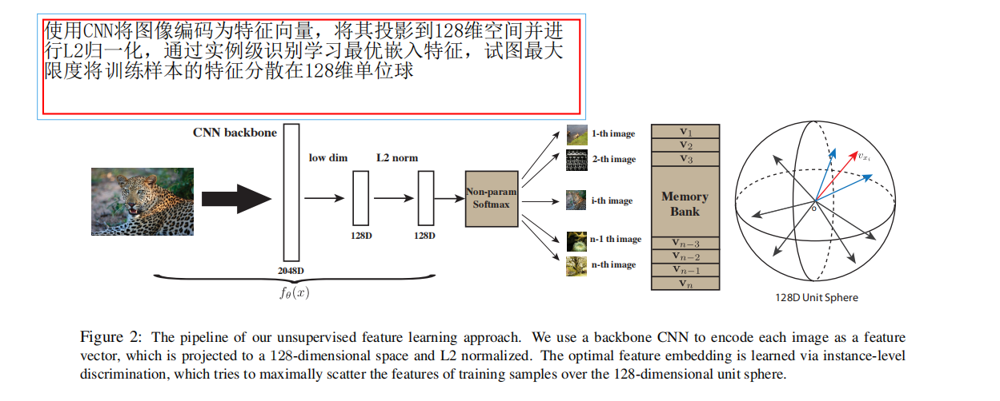

# Unsupervised Feature Learning via Non-Parametric Instance Discrimination

## 摘要

这篇论文探讨了神经网络分类器在具有注释类标的数据上训练时，是否能够捕捉到不仅仅是被指导学习的类别之间的相似性，而且还能捕捉到实例之间的视觉相似性。作者通过提出一种非参数化的实例级分类问题，并使用噪声对比估计来解决由大量实例类别带来的计算挑战，以探讨这一观察结果是否能够推广到超越监督学习的传统领域。

具体而言，作者的方法旨在学习一个优秀的特征表示，该表示能够捕捉实例之间的明显相似性，而不是类别之间的相似性。通过在无监督学习设置下进行实验，论文的结果表明，他们的方法在ImageNet分类任务上远远超过了现有技术水平。此外，该方法在更多训练数据和更好的网络架构下能够保持测试性能的稳定提升。通过对学到的特征进行微调，作者还获得了在半监督学习和目标检测任务上的竞争性结果。

值得注意的是，该非参数模型非常紧凑，每个图像只需128个特征，对于一百万张图像仅需600MB的存储空间，从而在运行时实现快速的最近邻检索。这使得该方法在实际应用中具有很高的效率。

## 1. Introduction

* 尽管监督学习在深度神经网络中取得了成功，但由于需要大量标注的数据，它在实践中可能存在一些限制。为了克服这一挑战，研究者们开始关注无监督学习，这种方法不依赖于大量标注的数据，而是尝试从未标注的数据中学习有用的特征表示。这种方法在一些情况下可能更经济，因为不需要手动标注大量的训练数据

* 这一段讨论了作者在无监督学习方面的新方法的来源，该方法源于对有监督学习在目标识别方面的结果的一些观察。在ImageNet上，top-5分类错误显著低于top-1错误[18]，而对于一张图像，softmax输出中第二高响应的类别更有可能在视觉上与原始类别相关联。图1显示，对于属于“leopard”类的图像，其在“jaguar”类别中的得分远高于在“bookcase”类别中的得分[11]。这些观察表明，典型的判别学习方法能够自动发现语义类别之间的显著相似性，而无需明确引导。

* 换句话说，作者认为明显的相似性不是从语义注释中学到的，而是从视觉数据本身中学到的。这种观察启发了作者提出一种无监督学习方法，该方法旨在利用这种对视觉相似性的自动发现，而不是依赖于语义注释。这可能是该方法的创新之处，它试图通过学习视觉数据中的潜在相似性来提高特征表示的质量。

* 在这段文字中，作者将类别级别的监督学习推向了实例级别的极致，提出了一个问题：我们是否能够通过纯粹的判别学习来学习一个有意义的度量，反映出实例之间的显著相似性？每张图像都有其独特之处，而且在同一语义类别中，每个图像可能与其他图像存在显著差异[23]。如果我们学习区分各个实例，而没有任何关于语义类别的概念，我们可能会得到一个表示，捕捉到实例之间的显著相似性，就像类别级别的监督学习仍然保留了类别之间的显著相似性一样。将无监督学习表述为实例级别的判别问题在技术上也具有吸引力，因为它可以受益于判别式监督学习的最新进展，例如在新的网络架构上取得的成果。

* 这里的关键问题是，由于实例数目与整个训练集大小相当，类别数目巨大，简单地应用传统的softmax分类在计算上变得不可行。为了解决这一问题，作者采用了噪声对比估计（NCE）来近似softmax分布，这是一种有效的方法，允许模型只需关注少量的负样本而不是整个类别集合。此外，为了稳定学习过程，作者使用了一种称为近端正则化的方法。这可能包括在损失函数中引入附加项，以限制权重的变化幅度，从而更稳定地进行模型训练。

* 这里提出的疑问涉及到特征的泛化能力。线性分类器（如SVM）在某些情况下可能适用于将学到的特征与类别进行连接，但并不一定能够很好地适应新的、未知的任务。作者似乎在这里强调了一个更深层次的问题，即通过无监督学习学到的特征在测试时能否泛化到未知任务，并且为何线性分类器能够有效地连接这些特征和类别。

* 作者倡导一种非参数化的方法，用于训练和测试。他们将实例级别的判别问题表述为度量学习问题，其中实例之间的距离（相似性）直接从特征中以非参数化的方式计算。也就是说，每个实例的特征被存储在一个离散的内存库中，而不是网络中的权重。在测试时，他们利用学到的度量进行基于k最近邻（kNN）的分类。这使得训练和测试保持一致，因为模型的学习和评估都涉及到图像之间的相同度量空间。

* 这种非参数化方法的优势在于，学到的度量不仅仅适用于训练数据，而且同样适用于测试数据。这是因为在测试时，模型使用相同的度量空间和k最近邻分类进行推断。相比之下，传统的参数化方法（如SVM）在测试时可能面临从训练数据到测试数据的泛化问题，因为权重的线性组合可能对未见过的数据不够鲁棒。

* 根据实验结果，作者表明在无监督学习的设置下，他们的方法在图像分类方面远远超过了现有技术水平，其在ImageNet 1K [1]上的 top-1 准确率达到了46.5%，在 Places 205 [49] 上为41.6%。这表明他们的方法在无监督学习任务中取得了显著的成功，尤其是在大规模图像分类的场景下。

* 值得注意的是，作者指出他们的方法在更多的训练数据和更好的网络架构下能够保持一致地提高测试性能，这突显了该方法的鲁棒性和通用性。通过对学到的特征进行微调，他们还在半监督学习和目标检测任务上获得了具有竞争力的结果。最后，作者指出他们的非参数模型非常紧凑，每个图像只需128个特征，对于一百万张图像仅需600MB的存储空间，这使得在运行时进行快速的最近邻检索成为可能。

* 总体而言，这一部分总结了作者的实验结果，强调了他们方法在多个任务和设置下的卓越性能。这进一步支持了他们在前文提到的无监督学习方法的优越性。

## 2. Related Works

* 生成模型： 这类方法旨在学习数据的生成分布，以便生成与训练数据相似的新样本。生成对抗网络（GAN）是一个著名的例子，其中生成器和判别器相互竞争，使得生成器能够生成逼真的样本。其他生成模型还包括变分自编码器（VAE）等。

* 自监督方法： 这类方法通常利用数据自身的结构或性质来生成自我监督信号，而无需人工标签。例如，通过将图像的一部分作为输入，预测图像的其他部分，或者通过对图像进行某种形式的变换（如旋转或颜色变换），来学习对应的自监督任务

* 生成模型的主要目标是尽可能忠实地重建数据的分布。传统的生成模型包括限制玻尔兹曼机（Restricted Bolztmann Machines，RBM）[12, 39, 21]和自编码器（Autoencoders）[40, 20]。这些模型旨在通过学习数据的潜在表示，以更好地理解和重建输入数据。

* 其中，限制玻尔兹曼机（RBM）是一种基于概率图模型的生成模型，主要用于学习数据的概率分布。自编码器（Autoencoders）是一类神经网络模型，通过学习将输入数据编码为潜在空间表示，再从该表示解码出近似输入数据。

* 生成模型产生的潜在特征也可以有助于目标识别。近年来，一些新的方法，如生成对抗网络（Generative Adversarial Networks，GANs）[8, 4]和变分自编码器（Variational Autoencoder，VAE）[14]，在提高生成质量和特征学习方面取得了显著的进展。GANs引入了生成器和判别器的竞争，以生成逼真的样本，而VAE则使用变分推断的方法来学习潜在表示

* 自监督学习利用数据的内在结构，通过制定预测性任务来训练模型。具体而言，模型需要预测一个实例的某个被省略的方面或组件，而给出其余的信息。在学习图像表示时，这些任务可能包括：预测上下文[2]、计算物体数量[28]、填充图像的缺失部分[31]、从灰度图像中恢复颜色[47]，甚至解决拼图问题[27]。对于视频，自监督学习策略包括：利用跟踪来实现时间上的连续性[44, 45]、预测未来[42]，或者保持自身运动的等变性[13, 50, 30]。最近的工作[3]尝试结合多个自监督任务以获得更好的视觉表示。尽管自监督学习可以捕捉实例的各个部分或方面之间的关系，但目前尚不清楚为什么特定的自监督任务应该有助于语义识别，以及哪个任务是最优的。

## 3. Approach

* 作者提出的无监督特征学习方法是实例级别的判别。他们将每个图像实例视为一个独立的类别，并训练一个分类器来区分各个实例类别（参见图2）。这种方法的目标是通过让模型学会区分图像实例之间的差异，从而使得学到的特征对视觉相似性有敏感性。

### 3.1. Non-Parametric Softmax Classifier

* 这种形式的 softmax 公式是常见的用于多类别分类任务的表达方式，它将特征经过线性变换后应用 softmax 函数，得到每个类别的概率分布。在这个设置中，作者使用了参数化的方式，其中 
�
θ 是分类器的参数。这种分类器的目标是通过学习参数，使得模型能够在训练数据上准确地进行实例级别的分类。

  

### 3.2. Noise-Contrastive Estimation

* 作者采用了 NCE 方法来近似计算 softmax 函数，从而降低计算的复杂性。NCE 是一种采样技术，通过对比真实数据和噪声数据的概率来进行估计，从而在计算上更为高效。这种处理方式使得在大规模的类别情况下，模型仍然能够进行高效的训练和推断。

## 总结

* 通过卷积神经网络将图片进行编码成一个低维特征，然后使得这些特征在特征空间上都尽可能区分开，个体判别任务每一个图片都是一类
* 训练神经网络的损失函数是对比学习损失，正样本是图像本身，有数据增强，负样本是数据集中其余的所有图，使用一个memory bank存储这些负样本
* 使用INfoNCE loss来更新CNN 参数，使用CNN编码得到的向量会替换掉memory bank中原来的存储
* 循环往复的更新CNN和memory bank

