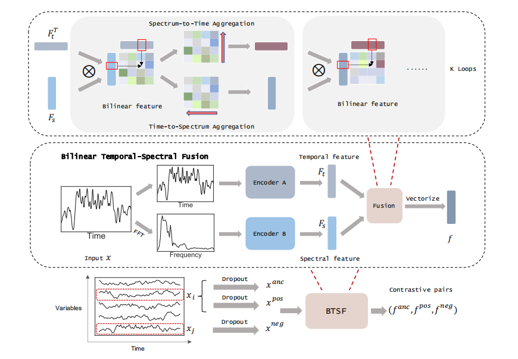
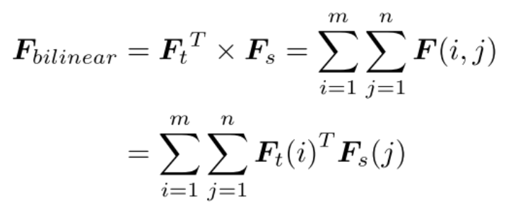

# 【论文阅读笔记】Unsupervised Time-Series Representation Learning with Iterative Bilinear Temporal-Spectral Fusion

## 摘要

* 背景介绍:时间序列表示学习（尤其是无监督或自监督学习）是一个充满挑战的问题，主要因为时间序列数据的复杂动态性和稀疏的注释。现有的研究大多采用基于对比学习的框架，并通过时间基增强技术来采样正样本和负样本进行对比训练。
* 现有方法的问题:这些方法主要使用从时间切片派生的段级增强，可能会导致采样偏差和因全局上下文丢失而产生的错误优化（伪负样本问题）。此外，现有方法没有关注到在特征表示中融入频谱信息的重要性。

* 提出的方法 - 双线性时频融合（BTSF）框架:文章提出了一个统一的框架，称为双线性时频融合（BTSF）。具体来说，首先利用实例级增强通过在整个时间序列上简单应用dropout，以最大化捕获长期依赖性。然后，提出了一种新颖的迭代双线性时频融合技术，显式编码丰富的时频对的相似性，并通过频谱到时间（S2T）和时间到频谱（T2S）聚合模块，以融合-挤压的方式迭代细化表示。

* 在时间序列的三个主要任务上进行了下游评估，包括分类、预测和异常检测。实验结果显示，BTSF方法在所有任务上都显著优于现有的最先进方法。

## Introduction

&emsp;这一段落进一步阐述了时间序列分析在各种实际场景中的重要性，如交通预测、临床试验和金融市场，并介绍了时间序列分析的主要任务：分类、预测和异常检测。随后，作者指出在时间序列数据中常常缺乏足够的标注数据，特别是在数据稀疏标注或无监督的情况下，训练结果往往不理想。因此，无监督表示学习的研究对于时间序列分析来说十分有价值，学习到的表示能够用于上述下游任务。

&emsp;接着，段落回顾了在计算机视觉和自然语言处理领域已经得到广泛研究的无监督表示学习，但指出只有少数研究关注于时间序列分析。作者列举了近期主要使用基于时间对比学习框架的研究工作，如时间对比学习（TCL）、对比预测编码（CPC）、可扩展表示学习（SRL）、时间和上下文对比（TS-TCC）和时间邻域编码（TNC），这些都是沿时间轴采样对比对的段级方法。

&emsp;然而，作者指出这些方法都没有利用时间序列中的时频亲和性，从而限制了表示的辨别力和表现力。通过对这些方法进行实验分析，作者发现现有工作在仅使用时间或频谱特征时，错误预测的重叠百分比大约为30%，这表明他们的时间和频谱表示之间几乎没有关联。此外，之前的段级方法基于远距离段是负对，邻近段是正对的假设，这在长期场景下通常表现不佳，无法捕获全局上下文。

&emsp;这一段重点强调了在时间序列分析中，现有的无监督表示学习方法面临的局限性和挑战，尤其是在利用时频信息以及捕获长期依赖性方面的不足，为提出新的方法奠定了理论基础。

&emsp;基于现有工作的上述不足之处，这一段提出了一个新的无监督时间序列表示学习框架，称为双线性时频融合（BTSF）。BTSF从两个方面促进表示学习过程：更合理的对比对构建和时频信息的充分整合。

* 对比对的构建:BTSF通过使用整个时间序列作为输入，并简单应用标准dropout作为实例级增强来产生时间序列的不同视图，以此来保留全局时间信息并捕获时间序列的长期依赖性。这种对比对的构建方式确保了增强的时间序列不会改变它们的原始属性，有效减少了可能的假阴性和假阳性
* 时频信息的有效组合:为了有效组合时频信息并在特征表示中进一步实现它们之间的对齐，采用了迭代双线性融合在时间和频谱特征之间进行操作，以产生细粒度的二阶特征，明确保留丰富的时频对亲和力。为了充分利用这些信息性亲和力，进一步设计了跨域交互，通过频谱到时间和时间到频谱聚合模块迭代细化时间和频谱特征进行循环更新。与简单的组合操作（如求和和连接）相比，双线性融合使得时间（频谱）特征能够直接通过相同时间序列的频谱（时间）信息得到增强，这一点通过进一步的实验和理论分析被证明是有效的

主要贡献总结:

* 重新审视了现有的段级对比学习框架，提出了实例级增强技术来最大限度地保留全局上下文。
* 提出了一种新颖的迭代双线性时频融合方法，以融合-挤压的方式明确建模跨域对的依赖性，从而在区分和丰富表示方面发挥作用。
* 进行了充分的评估，包括对齐和一致性检验，以确定学习表示的泛化能力。
* 广泛的实验表明，BTSF在下游分类、预测和异常检测任务中显著优于之前的工作，并且与监督方法具有竞争力。

##  releated

* 无监督表示学习在时间序列中的应用:

尽管序列数据的表示学习已经被广泛研究，但针对时间序列的无监督表示学习的研究相对较少。早期的方法包括使用自编码器和序列到序列模型以编解码器架构重构输入。Rocket方法通过在大量随机卷积核提取的特征上训练线性分类器，是一种快速的方法。SPIRAL方法通过保持原始时间序列数据的成对相似性，弥合了时间序列数据与静态聚类算法之间的差距。另外，有研究通过整合时间重构和K-means目标来生成特定于簇的时间表示。

* 时间序列对比学习：
  * 采用不同的样本策略，结合对比学习来处理没有监督的时间序列表示学习.
  * 收到word2vec启发的SRL提出了一种新颖的三重损失，并且通过随机采样时间段来学习可扩展表示
  * cpc通过使用强大的自回归模型在潜在空间中进行表示学习，并且依赖于噪声对比估计作为类似方式的损失函数
  * TS-TCC是cpc的改进工作，通过针对不同时间戳和增强的引入的干扰的更难预测任务学习鲁棒表示，TNC提出一种基于领域的新颖无监督学习框架，并且为非平稳多变量时间序列应用样本权重调整，这些方法的主要区别在于他们根据不同的段级采样政策选择对比对，然而，这些方法容易收到假负样本的影响，并且由于全局上下文的丢失而无法捕获长期依赖。因为 他们只提取时间特征，忽略利用频谱特征和设计时间频率关系
* 作者提出了一个统一的框架来解决上述所有问题，强调了现有方法的局限性，**并指出这些方法倾向于由于全局上下文的丢失而无法捕获长期依赖，以及它们只关注时间特征而忽视了频谱特征和时频关系的重要性**。这为BTSF框架的提出提供了理论基础，该框架旨在通过合理构造对比对和充分整合时频信息来提升时间序列的表示学习

## The Proposed Method

* 采样偏差与长期依赖性:现有的表示学习方法因采用段级采样策略而无法捕捉到时间序列的长期依赖性，这主要是因为时间切片方法在保持时间序列全局语义信息方面的不足。
* 实例级增强的动机:为了探索一种有效的增强方法来构建对比对，作者首先研究了时间序列的一般增强方法。根据一项最新的实证调查，评估了12种时间序列数据增强方法在128个时间序列分类数据集上的效果，结果显示没有一种增强方法能够在所有数据集上一致地提高性能，这归因于时间序列对序列顺序和时间模式的敏感性。
* 实例级增强技术的具体实现：为了保留全局时间信息并不改变时间序列的原始属性，作者采用标准的dropout作为最小数据增强，以生成不同视角，从而进行无监督表示学习。具体而言，通过在时间序列上独立采样两个dropout掩码来获得一个正样本对，将其他变量的时间序列视为负样本，以此构建负样本对。这种实例级的对比对使方法能够捕获长期依赖性，并有效减少采样偏差
* 实验设置和结果:在实验中，dropout率设置为0.1。通过与其他增强方法的实验比较以及对dropout率的敏感度分析（详见附录A），证明了该实例级增强技术在处理非平稳和周期性时间序列方面的通用性和有效性，相比时间切片方法，在处理周期性时间序列时避免了选择错误的负样本。

## 迭代双线性时频融合（BTSF）

* BTSF旨在为多变量的时间序列学习区分性特征表示，BTSF同时使用频谱和时间的特征，而且更加细粒度的方式增强了表示学习的过程，和简单的求和连接不同，BTSF框架采用迭代双线性融合来探索和精细化时间和频谱特征之间的成对亲和力，从而产生一个交互特征表示，这有助于增大正负样本对之间的差异
* 每个增强的时间序列首先通过快速傅里叶变换（FFT）转换到频谱域，然后时间和频谱信号分别传递给两个编码网络进行特征提取。使用简单的扩张因果卷积堆叠编码时间特征，使用1D卷积块提取频谱特征，并在编码网络末端应用最大池化层以确保特征大小一致，使模型能够适应不同长度的输入
* 在获得时间特征(Ft)和频谱特征(Fs)后，BTSF通过迭代双线性融合在这两类特征之间进行迭代融合。具体来说，通过频道间的交互来建立两个域特征间的联系，充分建模时间-频率间的细粒度亲和力。然后，通过一系列的迭代过程，如频谱到时间（S2T）和时间到频谱（T2S）聚合模块，来自适应性地精细化时间和频谱特征
* 为了解决由于特征维度二次扩张带来的内存开销问题，BTSF通过插入和分解交互矩阵W将最终的双线性特征转换为低秩形式，从而显著降低了存储原始特征所需的内存空间。此外，为了不忘记原始的时间和频谱信息，BTSF将初始的时间特征和频谱特征与双线性特征结合起来，以增强表示能力。
* 通过最小化正样本对的距离并最大化负样本对的距离来构建损失函数，进一步训练模型。此过程通过内积来衡量两个归一化特征向量之间的距离，并使用温度参数τ。这种方法使得在构建正样本对时，所有其他变量的时间序列都被视为负样本，有助于模型更好地学习区分性特征表

## 总结步骤

  

* 每个增广时间序列xt首先通过快速傅里叶变换(FFT)变换到光谱域，得到光谱信号xs。然后将xt和xs分别交付到两个编码网络进行特征提取
* BTSF对Ft和Fs进行了迭代双线性融合，具体来说，在两个域的特征之间建立如下的通道级交互
* 实现时域和频域信息的相乘

  

