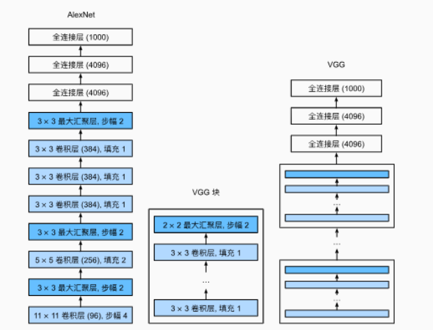

# VGG简单学习

## 简单介绍

&emsp; 在AlexNet网络的基础上，为了设计深层神经网络，牛津大学设计了VGG网络,采用块的设计理念，将AlexNet中多个重复的卷积层和池化层组成一个块


&emsp;论文中，使用3x3卷积核，padding=1的卷积层 和带有2x2的汇聚窗口，步幅为2 的最大汇聚层

  

* VGG使用可重复使用的卷积块来构建深度卷积神经网络
* 不同的卷积块个数和超参数可以得到不同复杂度的变种

## 模型搭建与训练

&emsp;VGG神经网络连接几个VGG块由超参数变量conv_arch定义，该变量指定列每一个VGG块中卷积层的个数和输出通道数目，全连接模块和AlexNet中的相同。


* 定义单个VGG块  Num_convs定义了层的数量 使用循环进行添加 一个卷积层 之后添加一个激活函数

```py
import torch 
from torch import nn
from d2l import torch as d2l
# 参数分别对应：卷积层数量  输入通道数量 输出通道数量
def vgg_block(num_convs,in_channels,out_channels):
    layers = []
    for _ in range(num_convs):
        # 添加一个卷积层
        layers.append(nn.Conv2d(in_channels=in_channels,out_channels=out_channels,kernel_size=3,padding=1))
        
        # 添加激活函数
        layers.append(nn.ReLU())
        # 因为添加多个卷积层 上一层的输出通道 对应下一层的数通道
        in_channels = out_channels

    # 添加一个最大池化层
    layers.append(nn.MaxPool2d(kernel_size=2,stride=2))
    return nn.Sequential(*layers)

```

&emsp;原本的VGG网络由五个卷积块，其中前两个快有一个卷积层，后面三个快包含两个卷积层，第一个模块有64个输出通道，每一个后续模块将输出通道数量翻倍，直到该数字达到512，由于该网络使用八个卷积层和三个全连接层，**该网络是用来八个卷积层和三个全连接层，因此称之为VGG-11**

```java
conv_arch = ((1,64),(1,128),(2,256),(2,512),(2,512))

```

* 定义vgg网络

```py
def vgg(conv_arch):
    conv_blks = []
    in_channels = 1  # 初始化输入通道数 在一个卷积层添加之后 需要更新输入通道数

    # 卷积层部分
    for(num_convs,out_channels) in conv_arch:
        # 遍历元组
        # 初始化VGG 块  然后添加进去
        conv_blks.append(vgg_block(num_convs=num_convs,in_channels=in_channels,out_channels=out_channels))


        # 更新输入通道数
        in_channels = out_channels

    # 全连接层  经过一系列卷积层之后 需要将4D向量 转换为2D向量
    return nn.Sequential(
        *conv_blks,nn.Flatten(),
        # 全练级曾部分
        nn.Linear(out_channels * 7 * 7,4096),nn.ReLU(),nn.Dropout(0.5),
        nn.Linear(4096,4096),nn.ReLU(),nn.Dropout(0.5),
        nn.Linear(4096,10)
    )


```


* 初始化 打印结构


```py
net = vgg(conv_arch=conv_arch)

X = torch.randn(size=(1,1,224,224))

for blk in net:
    X = blk(X)
    print(blk.__class__.__name__,'output shape:\t',X.shape)

```

```

Sequential output shape:	 torch.Size([1, 64, 112, 112])
Sequential output shape:	 torch.Size([1, 128, 56, 56])
Sequential output shape:	 torch.Size([1, 256, 28, 28])
Sequential output shape:	 torch.Size([1, 512, 14, 14])
Sequential output shape:	 torch.Size([1, 512, 7, 7])
Flatten output shape:	 torch.Size([1, 25088])
Linear output shape:	 torch.Size([1, 4096])
ReLU output shape:	 torch.Size([1, 4096])
Dropout output shape:	 torch.Size([1, 4096])
Linear output shape:	 torch.Size([1, 4096])
ReLU output shape:	 torch.Size([1, 4096])
Dropout output shape:	 torch.Size([1, 4096])
Linear output shape:	 torch.Size([1, 10])
```

* 训练网络

```py
lr, num_epochs, batch_size = 0.05, 10, 128
train_iter, test_iter = d2l.load_data_fashion_mnist(batch_size, resize=224)
d2l.train_ch6(net, train_iter, test_iter, num_epochs, lr, d2l.try_gpu())

```

