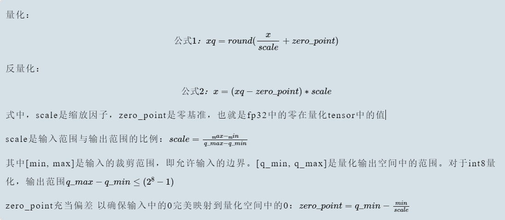
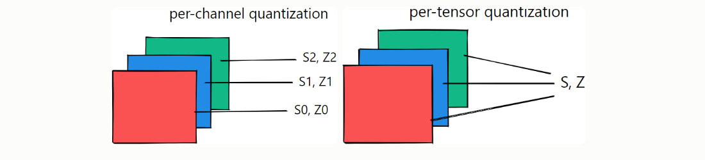

#  PyTorch模型训练完毕后静态量化、保存、获取int8量化模型

&emsp;模型的量化指的是使用更少的bit来存储原本以浮点数存储的tensor ,以及使用更少的Bit来完成原本以浮点数完成的计算，好处：

* 更少的模型体积 四倍的减少
* 更快的计算 因为更少的内存访问和更快的int8计算 
* 量化之后的模型 部分或者全部的tensor操作使用int类型的计算，而不是使用量化之前的float类型 当然量化还需要底层硬件支持


## 最基础的Tensor量化


  


* 首先缩放因子Scale:首先，计算一个缩放因子(scale)，这个因子用来确定如何将浮点数值映射到整数范围。通常，这个因子是一个常数，可以通过以下公式计算得到


* 其中，max_range和min_range是你希望量化的数值的最大和最小值。
* [q_min,q_max]是量化输出空间中的范围
* zero_point充当偏差  来确保输入的0完美映射到量化空间中的0 :zero_point = q_min - min/ scale
* zero_Point充当偏差 来确保输入的0完美的映射到量化空间中的0：zero_point  = q_min - min/scale


## 校准

&emsp; 选择输入限幅范围的过程 称之为校准，最简单的技术就是记录运行过程中的最小值和最大值，TensorRT还使用熵最小化（KL散度）、均方误差最小化或者输入范围的百分位数

* Pytorch中，Observer模块收集输入值的统计信息 并且计算scale和zero_point,不同的校准方案会产生不同的量化输出，最好凭借经验验证哪一种方案最适合您的应用程序和架构


```py
import torch
from torch.quantization.observer import MinMaxObserver, MovingAverageMinMaxObserver, HistogramObserver

# 定义通道数和序列长度
C, L = 3, 4
# 创建一个正太分布随机数生成器
normal = torch.distributions.normal.Normal(0, 1)

# 生成两个随机输入张量
inputs = [normal.sample((C, L)), normal.sample((C, L))]

for x in inputs:
    print(x.shape)

print(inputs)
# [tensor([[-0.0590,  1.1674,  0.7119, -1.1270],
#          [-1.3974,  0.5077, -0.5601,  0.0683],
#          [-0.0929,  0.9473,  0.7159, -0.4574]]]),

# tensor([[-0.0236, -0.7599,  1.0290,  0.8914],
#          [-1.1727, -1.2556, -0.2271,  0.9568],
#          [-0.2500,  1.4579,  1.4707,  0.4043]])]

# 创建观察者对象
observers = [MinMaxObserver(),          # 最小值、最大值 观察者
             MovingAverageMinMaxObserver(),     # 移动平均最小值、最大值 观察者
             HistogramObserver()]

# 遍历观察者对象列表
# 对于每一个观察者 遍历输入数据并且使用观察者对象 观察每一个输入张量
# 打印观察者的类名以及观察之后的计算的量化参数 这些参数包括量化的最小值和最大值


for obs in observers:
    for x in inputs:
        obs(x) # 使用观察者对象 观察输入数据
    print(obs.__class__.__name__, obs.calculate_qparams())
    # MinMaxObserver (tensor([0.0112]), tensor([124], dtype=torch.int32))
    # MovingAverageMinMaxObserver (tensor([0.0101]), tensor([139], dtype=torch.int32))
    # HistogramObserver (tensor([0.0100]), tensor([106], dtype=torch.int32))


```

* 对于MinMaxObserver: 计算出的最小值tensor([0.0112])，最大值124，以整数类型32表示
* 对于MovingAverageMinMaxObserver  计算出的移动平均最小值是0.0101，计算出的移动平均最大值是159，也是使用整数类型表示
* HistogramObserver 表示通过直方图统计计算出的最小值是0.0188 直方图统计计算出的最大值是94，使用整数类型表示
* 这些输出是量化神经网络的关键信息，最小值和最大值是量化过程中的关键参数，而不同的观察值可以提供不同的方式来计算这些参数

## 两种不同的量化方案


```py
for qscheme in [torch.per_tensor_affine, torch.per_tensor_symmetric]:
    # 计算移动最大平均值 和最小平均值
    obs = MovingAverageMinMaxObserver(qscheme=qscheme)
    for x in inputs:
        obs(x)
    print(f"Qscheme: {qscheme} | {obs.calculate_qparams()}")
    # Qscheme: torch.per_tensor_affine | (tensor([0.0101]), tensor([139], dtype=torch.int32))
    # Qscheme: torch.per_tensor_symmetric | (tensor([0.0109]), tensor([128]))

```

```
Qscheme: torch.per_tensor_affine | (tensor([0.0111]), tensor([159], dtype=torch.int32))
Qscheme: torch.per_tensor_symmetric | (tensor([0.0138]), tensor([128]))

```
* qscheme 是指量化方案的设置，可以是torch.per_tensor_affine或者是torch.per_tensor_symmetric  这些方案定义了如何量化张量的数据
* 创建 MovingAverageMinMaxObserver观察者对象  将qscheme设置为不同的方案
* 打印每一种qscheme设置下的计算的量化参数
*   Qscheme: torch.per_tensor_affine | (tensor([0.0101]), tensor([139], dtype=torch.int32))  这个表示使用torch.per_tensor_affline 方案进行量化，计算出的移动平均最小值是0.0101,最大值是139  
* 不同的qscheme设置会影响量化的方式，torch.per_tensor_affine适用于任意数据范围，但是torch.per_tensor_symmetric适用于数据范围在对称范围内的情况，选择适当的qscheme取决于输入数据的性质和量化的需求

* torch.per_tensor_affine
  * Affline量化：这是该方案的关键，Affline量化表示对着每一个张量，我们使用一个线性变换来将浮点值映射到固定点数值，这个线性变换通常由两个参数组成：缩放因子（scale）和偏置（zero_point）
  * 单一缩放因子和偏执：对于 per_tensor_affine 方案，一个缩放因子和一个偏置值适用于整个张量。这意味着对于每个张量，所有元素都被映射到相同的固定点数值范围内
* torch.per_tensor_symmetric
  * Symmetric量化，采用对称的方式进行量化，这意味零点是张量数据范围的中心点，但是缩放因子scale控制了数据范围的大小，
  * 适用于数据范围在对称范围内，这个方案适用于数据范围在零点周围对称的情况，例如正数和负数的数据范围，这种情况下，采用对称量化可以有效地表示数据


**torch.per_tensor_affine 使用单一的缩放因子和偏置来映射整个张量的浮点数据，而 torch.per_tensor_symmetric 使用对称方式映射数据，零点位于数据范围的中心，缩放因子控制范围的大小。选择哪种方案取决于输入数据的性质以及在量化神经网络时的需求。**

**仿射量化会导致计算量更大的推理，对称量化可能会导致量化分辨率不佳，因为裁剪范围包括从未出现在输入中的值**

## 每张量和每通道量化方案
 
* Per-tensor量化：将层的整个权重张量作为一个整体计算量化参数，相同的裁剪范围应用于层中的所有通道，为每一个张量对整个张量使用相同的qparams（scale 和 offse）
* per-channel量化，将每一个通道单独计算量化参数，为每一个通道使用一组qparams（scale和offse）
* 对于权重量化，per-Channel 对称量化提供更好的精度；per-tensor 量化表现不佳，可能是由于 BatchNorm 折叠 [3] 跨通道的 Conv 权重差异很大

  

* 每张量量化（Per Tensor Quantization）
  * 每张量量化是指整个张量中的所有数据都使用相同的量化参数进行量化
  * 缩放因子和零点是共享的：对于每个张量，使用一个缩放因子（scale）和一个零点（zero_point）。这意味着整个张量的数据被映射到相同的固定点数值范围内。
  * 适用性：适用于张量中的数据范围大致相同的情况，其中整个张量的数据都可以使用相同的缩放因子和零点来表示。
  * 优点：简单，适用于许多情况，特别是当张量中的数据范围一致时。
*  每通道量化（Per Channel Quantization）：
  * 每通道量化是指对张量中的每一个通道都使用不同的量化参数进行量化
  * 通道级别的缩放因子和零点：对于每个通道，使用独立的缩放因子和零点。这意味着不同通道中的数据可以在不同的固定点数值范围内表示。
  * 适用性：适用于张量中的不同通道具有不同数据范围的情况，通道之间的数据差异比较大
  * 优点：更加灵活，更好适应不同通道之间的数据差异


**选择哪种方案通常取决于输入数据的性质以及在量化神经网络时的需求。每张量量化适用于数据范围大致相同的情况，而每通道量化适用于不同通道之间具有不同数据范围的情况。根据实际情况，可以选择适当的方案来最大程度地减小内存占用并保持模型性能**

```py
from torch.quantization.observer import MovingAveragePerChannelMinMaxObserver

# 通道参数量化
obs =MovingAveragePerChannelMinMaxObserver(ch_axis=0)  # 分别计算所有' C '通道的qparams
for x in inputs:
    obs(x)
print(obs.calculate_qparams())
# (tensor([0.0090, 0.0075, 0.0055]), tensor([125, 187,  82], dtype=torch.int32))

```

* 第一个张量 (tensor([0.0090, 0.0075, 0.0055])) 包含每个通道的缩放因子。这表示每个通道都有自己的缩放因子，用于量化数据。
* 第二个张量 (tensor([125, 187, 82], dtype=torch.int32)) 包含每个通道的零点值。这表示每个通道都有自己的零点值，用于量化数据。


## 量化后端引擎配置


```py

backend = 'fbgemm' if x86 else 'qnnpack'
qconfig = torch.quantization.get_default_qconfig(backend)  
torch.backends.quantized.engine = backend
```

* backend = 'fbgemm' if x86 else 'qnnpack'：在这行代码中，选择了一个量化的后端引擎。这个选择是根据条件 x86 来决定的。如果 x86 为真，那么选择 'fbgemm' 作为量化后端，否则选择 'qnnpack'。后端引擎是执行量化操作的库或引擎，不同的后端可以提供不同的性能和功能
* qconfig = torch.quantization.get_default_qconfig(backend)：在这行代码中，通过调用 torch.quantization.get_default_qconfig() 函数获取了一个默认的量化配置（qconfig）。这个配置是根据选择的后端引擎（backend）而生成的，以便为量化操作提供适当的设置。
* torch.backends.quantized.engine = backend：这一行代码将 PyTorch 的量化引擎设置为选择的后端引擎（'fbgemm' 或 'qnnpack'）。这将确保后续的量化操作使用正确的引擎来执行，以提供性能和功能上的支持


## QConfig

* QConfig NamedTuple 存储观察者和用于量化激活和权重的量化方案。请务必传递 Observer 类（而非实例）或返回 Observer 实例的可调用对象。用于with_args()覆盖默认参数。

* activation 字段使用MovingAverageMinMaxObserver观察者 并且设置qscheme为torch.per_tensror_affline 这意味着针对激活值使用每张张量量化，使用每张量的缩放因子和零点
* weight字段使用MovingAveragePerChannelMinMaxObserver观察者，并且设置qscheme为torch.qint8 这意味着针对权重使用每通道量化，使用每个通道的缩放因子和零点
* 自定义量化配置允许你精确控制激活值和权重的量化方式，激活值通常使用每张量的量化，而权重通常可以根据实际需求选择每通道或者每张量的量化，这种精细的配置使你可以根据不同的模型需求和硬件特性来优化量化设置

```py

my_qconfig = torch.quantization.QConfig(
  activation=MovingAverageMinMaxObserver.with_args(qscheme=torch.per_tensor_affine),
  weight=MovingAveragePerChannelMinMaxObserver.with_args(qscheme=torch.qint8)
)
# >>>>>
# QConfig(activation=functools.partial(<class 'torch.ao.quantization.observer.MovingAverageMinMaxObserver'>, qscheme=torch.per_tensor_affine){}, weight=functools.partial(<class 'torch.ao.quantization.observer.MovingAveragePerChannelMinMaxObserver'>, qscheme=torch.qint8){})
```


## Tensor量化

* 为了实现量化，PyTorch 引入了能够表示量化数据的Quantized Tensor，可以存储 int8/uint8/int32类型的数据，并携带有scale、zero_point这些参数。把一个标准的float Tensor转换为量化Tensor的步骤如下：

```py
import torch

x = torch.randn(2, 2, dtype=torch.float32)
# tensor([[ 0.9872, -1.6833],
#         [-0.9345,  0.6531]])

print(x)

# 公式1(量化)：xq = round(x / scale + zero_point)
# 使用给定的scale和 zero_point 来把一个float tensor转化为 quantized tensor
xq = torch.quantize_per_tensor(x, scale=0.5, zero_point=8, dtype=torch.quint8)
# tensor([[ 1.0000, -1.5000],
#         [-1.0000,  0.5000]], size=(2, 2), dtype=torch.quint8,
#        quantization_scheme=torch.per_tensor_affine, scale=0.5, zero_point=8)

# print(xq.int_repr())  # 给定一个量化的张量，返回一个以 uint8_t 作为数据类型的张量
# tensor([[10,  5],
#         [ 6,  9]], dtype=torch.uint8)

# 公式2(反量化)：xdq = (xq - zero_point) * scale
# 使用给定的scale和 zero_point 来把一个 quantized tensor 转化为 float tensor
xdq = xq.dequantize()
# tensor([[ 1.0000, -1.5000],
#         [-1.0000,  0.5000]])

print(xdq)

```


```py

tensor([[-0.5235,  0.8499],
        [-3.1486,  0.0299]])
tensor([[-0.5000,  1.0000],
        [-3.0000,  0.0000]])
```

* x和xdq的值不一样
* 量化会有精度损失
* 随便选取的scale和zp太烂，选择合适的scale和zp可以有效降低精度损失，这两个参数需要前向推理来计算出来


## Post Training Static Quantization (训练后静态量化)

&emsp;静态量化需要把模型的权重和激活值都进行量化，静态量化需要把训练集或者训练集分布类似的数据喂给模型（没有反向传播），然后通过每一个op输入的分布来计算activation的量化参数(scale和zp),这一步作为定标，因为静态量化的前向推理过程中自始至终都是int计算，activation需要确保一个op的输入符合下一个op的输入。

### fuse_model:融合网络中的一些层

**合并一些可以合并的layer。这一步的目的是为了提高速度和准确度**

```py
fuse_modules(model, modules_to_fuse, inplace=False, fuser_func=fuse_known_modules, fuse_custom_config_dict=None)

```

比如合并网络中的fc和relu

```py
torch.quantization.fuse_modules(F32Model, [['fc', 'relu']], inplace=True)

```

一旦成功融合，**那么原始网络中的fc就可以替换为新的合并之后的module（因为是list中的第一个元素），而relu（list中剩余的元素）会被替换为nn.Identity(),这个模块是占位符。直接输出输入**

```py
import torch
from torch import nn


class F32Model(nn.Module):
    def __init__(self):
        super(F32Model,self).__init__()
        self.fc = nn.Linear(3,2,bias=False)
        self.relu = nn.ReLU(inplace=False)
        
    def forward(self,x):
        x = self.fc(x)
        x = self.relu(x)
        
        return x
    
    
model_fp32 = F32Model()

print(model_fp32)


model_fp32_fused = torch.quantization.fuse_modules(model_fp32,[['fc','relu']])

print(model_fp32_fused)


```

**如果要fuse的model被Sequential封装起来了，请参考下面的代码，但是有顺序安排**

```py

torch.quantization.fuse_modules(a_sequential_module, ['0', '1', '2'], inplace=True)
```
```
Convolution, BatchNorm
Convolution, BatchNorm, ReLU
Convolution, ReLU
Linear, ReLU
BatchNorm, ReLU
ConvTranspose, BatchNorm

```

## 设置qCONFIG

```py
#如果要部署在x86 server上
model_fp32.qconfig = torch.quantization.get_default_qconfig('fbgemm')

#如果要部署在ARM上
model_fp32.qconfig = torch.quantization.get_default_qconfig('qnnpack')

```


## prepare: 定标 ：scale 和 zero_point

* prepare用来给每一个子module插入Observer 用来收集和定标数据
* 观察输入数据得到四元组的min_val和max_val 至少观察几百个迭代的数据
* 然后由这个四元组得到scale和zp这两个参数的值


```py
model_fp32_prepared = torch.quantization.prepare(model_fp32_fused)

```


## 喂数据

* 为了获取数据的分布特点 来更好地计算activation的scale和zp,至少需要几百个迭代的数据

```py
#至少观察个几百迭代
for data in data_loader:
    model_fp32_prepared(data)

```


## 转换模型

**上一步完成之后，得到各个op的权重的四元组(min_val,max_val,qmin,qmax)中的(min_val,max_val)都已经有了，各个op的activation中的四元组(min_val,max_val,qmin,qmax)中的（min_val,max_val）也都已经观察出来了，然后调用convert_API**

```py
model_prepared_int8 = torch.quantization.convert(model_fp32_prepared)

```


## 完整的demo-针对单层的网络

```py

import torch
from torch import nn


class F32Model(torch.nn.Module):
    def __init__(self):
        super(F32Model,self).__init__()
        
        self.quant = torch.quantization.QuantStub()  # 转换张量从浮点到量化
        
        
        self.conv =  nn.Conv2d(1,1,1)
        self.fc = nn.Linear(2,2,bias = False)
        self.relu = nn.ReLU()
        
        # 将量化张量  转换为浮点
        self.dequant = torch.quantization.DeQuantStub()
        
    def forward(self,x):
        x = self.quant(x)
        x = self.conv(x)
        x = self.fc(x)
        x = self.relu(x)
        x = self.dequant(x)
        
        return x
    
model_fp32 = F32Model()

# 量化需要开启验证模式
model_fp32.eval()

# 将模型部署在arm
model_fp32.qconfig = torch.quantization.get_default_qconfig('qnnpack')

#  将网络的一些层进行融合

model_fp32_fused = torch.quantization.fuse_modules(model_fp32,[['fc','relu']])

#  准备模型  插入观察对象    观察activation 和weight
model_fp32_prepared = torch.quantization.prepare(model_fp32_fused)


# 代表性数据集 获取与数据的分布特点  来更好的计算 及或者的scale 和zp

# batch x channel x h x w
input_fp32 = torch.randn(1,1,2,2)

#  喂数据  计算参数
model_fp32_prepared(input_fp32)


# 量化模型

model_int8 = torch.quantization.convert(model_fp32_prepared)

# 运行模型  计算都以int8来计算

import time

# 测量float32模型的执行时间
start_time_fp32 = time.time()
output_fp32 = model_fp32(input_fp32)
# end_time_fp32 = 
execution_time_fp32 = time.time() - start_time_fp32

# 测量int8模型的执行时间
start_time_int8 = time.time()
output_int8 = model_int8(input_fp32)
# end_time_int8 = 
execution_time_int8 = time.time() - start_time_int8

print("Execution time (float32): {:.8f} seconds".format(execution_time_fp32))
print("Execution time (int8): {:.8f} seconds".format(execution_time_int8))
```

```
Execution time (float32): 0.00096154 seconds
Execution time (int8): 0.00000000 seconds

```


## 完整的demo-针对Sequential


```py
import torch

from torch import nn
import copy

# 部署的后端计算引擎  运行在x86 芯片
backend = "fbgemm"


model = nn.Sequential(
    nn.Conv2d(2,64,3),
    nn.ReLU(),
    nn.Conv2d(64,128,3),
    nn.ReLU()
)

m = copy.deepcopy(model)

m.eval()

#  然后 开始融合模型
torch.quantization.fuse_modules(m,['0','1'],inplace=True)
torch.quantization.fuse_modules(m,['2','3'],inplace=True)

# 插入Stub

m = nn.Sequential(
    torch.quantization.QuantStub(),
    m,
    torch.quantization.DeQuantStub()
)

# 设置后端
m.qconfig = torch.quantization.get_default_qconfig(backend)

#  插入观察对象
torch.quantization.prepare(m,inplace = True)


# 喂数据  计算scale和zero_point

#  推理模式  没有反向传播计算
with torch.inference_mode():
    for _ in range(10):
        x = torch.rand(1,2,28,28)
        m(x)
    
# 转换为int8量化模型 
torch.quantization.convert(m,inplace=True)

# 检查一下 权重参数是不是Int8 

# print(m[[1]].weight().element_size())


"""Check"""
print(m[1][0].weight().element_size()) # 1 byte instead of 4 bytes for FP32

from torch.quantization import quantize_fx


m = copy.deepcopy(model)
m.eval()


```

```

nn.Conv2d(2, 64, 3)：这是一个卷积层，包括以下参数：

输入通道数 2：表示输入数据具有2个通道（通常对应于彩色图像的R和G通道）。
输出通道数 64：表示卷积层将生成64个输出通道，每个通道对应一个卷积核。
卷积核大小 3：表示卷积核的大小是3x3
```
## quantize_fx来进行量化操作

* quantize_fx（也称为 FX Graph Mode Quantization）是 Facebook 提供的量化库，建立在 PyTorch FX（PyTorch JIT 编译器）之上。它使用 FX 图来表示模型，然后通过 PyTorch JIT 动态图来执行量化操作。因此，quantize_fx 采用了一种不同的方法来处理模型的量化。
* quantize_fx 提供了更多的细粒度控制和自定义选项，使用户能够更灵活地调整量化过程，包括选择每通道量化、选择量化后端引擎等。

```py
from torch.quantization import quantize_fx
# 用于创建模型的深拷贝，以便不影响原始模型。
m = copy.deepcopy(model)
m.eval()

# 配置引擎
qconfig = {"":torch.quantization.get_default_qconfig(backend)}

# 插入观察对象
model_prepared = quantize_fx.prepare_fx(m,qconfig)

with torch.inference_mode():
  for _ in range(10):
    x = torch.rand(1,2,28, 28)
    model_prepared(x)
# quantize
model_quantized = quantize_fx.convert_fx(model_prepared)

```


## 保存和加载量化模型


```py
import torch
from torch import nn


class F32Model(torch.nn.Module):
    def __init__(self):
        super(F32Model,self).__init__()
        
        self.quant = torch.quantization.QuantStub()  # 转换张量从浮点到量化
        
        
        self.conv =  nn.Conv2d(1,1,1)
        self.fc = nn.Linear(2,2,bias = False)
        self.relu = nn.ReLU()
        
        # 将量化张量  转换为浮点
        self.dequant = torch.quantization.DeQuantStub()
        
    def forward(self,x):
        x = self.quant(x)
        x = self.conv(x)
        x = self.fc(x)
        x = self.relu(x)
        x = self.dequant(x)
        
        return x
    
model_fp32 = F32Model()

# 量化需要开启验证模式
model_fp32.eval()

# 将模型部署在arm
model_fp32.qconfig = torch.quantization.get_default_qconfig('qnnpack')

#  将网络的一些层进行融合

model_fp32_fused = torch.quantization.fuse_modules(model_fp32,[['fc','relu']])

#  准备模型  插入观察对象    观察activation 和weight
model_fp32_prepared = torch.quantization.prepare(model_fp32_fused)


# 代表性数据集 获取与数据的分布特点  来更好的计算 及或者的scale 和zp

# batch x channel x h x w
input_fp32 = torch.randn(1,1,2,2)

#  喂数据  计算参数
model_fp32_prepared(input_fp32)


# 量化模型

model_int8 = torch.quantization.convert(model_fp32_prepared)

# 运行模型  计算都以int8来计算

import time

# 测量float32模型的执行时间
start_time_fp32 = time.time()
output_fp32 = model_fp32(input_fp32)
# end_time_fp32 = 
execution_time_fp32 = time.time() - start_time_fp32

# 测量int8模型的执行时间
start_time_int8 = time.time()
output_int8 = model_int8(input_fp32)
# end_time_int8 = 
execution_time_int8 = time.time() - start_time_int8

print("Execution time (float32): {:.8f} seconds".format(execution_time_fp32))
print("Execution time (int8): {:.8f} seconds".format(execution_time_int8))

```

```py
torch.save(model_int8.state_dict(), "./state_dict.pth")
model_int8.load_state_dict(torch.load("./state_dict.pth"))
print(model_int8)

```
* QuantizedConv2d：这是一个量化卷积层。它接受量化输入，执行卷积操作，并生成量化输出。它还包括了缩放因子（scale）和零点值（zero_point），用于量化输出
* qscheme 设置为 torch.per_tensor_affine，表示每张量使用单独的缩放和零点。
* Identity：这是一个标识操作，它不进行任何处理，直接将输入传递给输出。在这个模型中，它用作 ReLU 激活函数的标识操作，因此没有引入额外的量化操作。
* DeQuantize：这是一个反量化操作，用于将量化输出从整数转换回浮点数。这个操作是从量化输出到浮点输出的转换。
* QuantizedConv2d 和 QuantizedLinearReLU 分别是卷积层和线性层，它们处理不同的输入数据和进行不同的操作。因此，它们的量化参数可能会不同，以便更好地适应其操作。这种差异是正常的，量化参数的选择旨在最大程度地减小量化误差并保持模型性能。

```
F32Model(
  (quant): Quantize(scale=tensor([0.0068]), zero_point=tensor([45]), dtype=torch.quint8)
  (conv): QuantizedConv2d(1, 1, kernel_size=(1, 1), stride=(1, 1), scale=0.006129027809947729, zero_point=0)
  (fc): QuantizedLinearReLU(in_features=2, out_features=2, scale=0.004328194074332714, zero_point=0, qscheme=torch.per_tensor_affine)
  (relu): Identity()
  (dequant): DeQuantize()
)

```


## 查看参数

**其实，只有权重被量化为整形，偏置如果有的话 还是浮点型**

```
print(model_int8.fc.weight().int_repr())
print(model_int8.fc.bias())

```