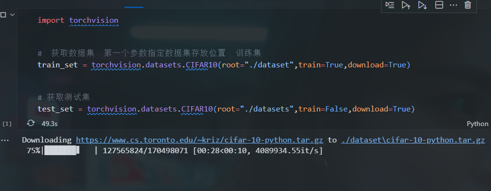
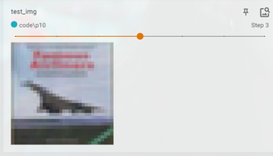
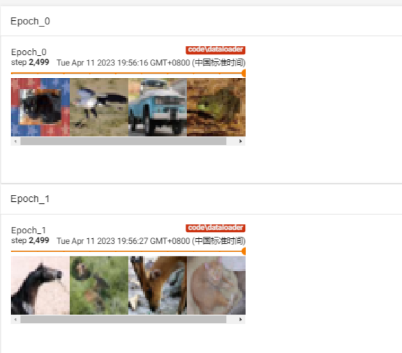

# torchvision的数据集使用-dataset与dataloader

## datasets与transform的使用

**下载数据集**

  

**将PIL_image转换成tensor张量**
```py
import torchvision
from tensorboardX import SummaryWriter


dataset_transform = torchvision.transforms.Compose([
    torchvision.transforms.ToTensor()
])

# transform直接使用在dataset中

#  获取数据集  第一个参数指定数据集存放位置  训练集
#  将获取到的每一张图片转换成tensor数据类型
train_set = torchvision.datasets.CIFAR10(root="./dataset",train=True,transform = dataset_transform,download=True)


# 获取测试集  将获取到的每一张图片转换成tensor数据类型
test_set = torchvision.datasets.CIFAR10(root="./dataset",train=False,transform = dataset_transform,download=True)


# print(train_set[0])  # 张量数据类型

#  导入tensorBoard
writer = SummaryWriter("p10")


for i in range(10):

    #  获取图片以及 标签  这里的img 其实已经是tensor数据类型
    img,target = test_set[i] 
    # print(img)
    # print(target)

    writer.add_image("test_img",img,i)


writer.close()

```

**获取连续的十张图片**

  


## dataloader与transform的使用

**dataloader的作用是从dataset中取出数据**

  


```py
import torchvision

from torch.utils.data import DataLoader

from tensorboardX import SummaryWriter

#  下载测试集  同时将PIL_IMAGE 转换成张量形式  测试集  非训练集
test_data =torchvision.datasets.CIFAR10("./dataset",train=False,transform=torchvision.transforms.ToTensor())


#  数据集选择测试数据集  批量大小 选择4
#  表示每次取出四个数据 进行打包

#  shuffle 表示打乱顺序
test_loader = DataLoader(dataset = test_data,batch_size = 4,shuffle=True,num_workers=0,drop_last = False)

#  测试数据集的第一张图片
img,target = test_data[0]

# 张量形式
# print(img.shape)
# print(target)

writer = SummaryWriter("dataloader")

# 遍历测试数据集两轮  

for epoch in range(2):
    step = 0
    #  循环遍历 test_loader数据  每次批量取出四张图片
    for data in test_loader:
        imgs,targets = data
        writer.add_images("Epoch:{}".format(epoch),imgs,step)
        step = step + 1

writer.close()

```

