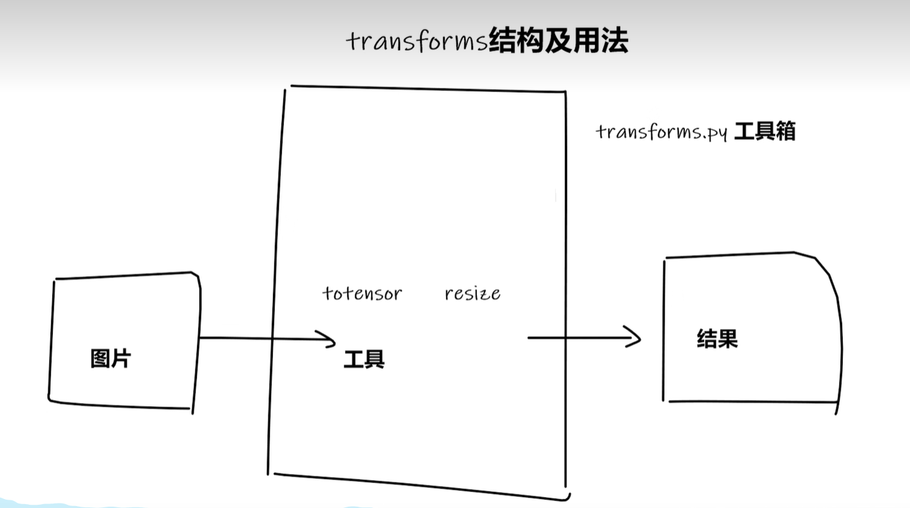
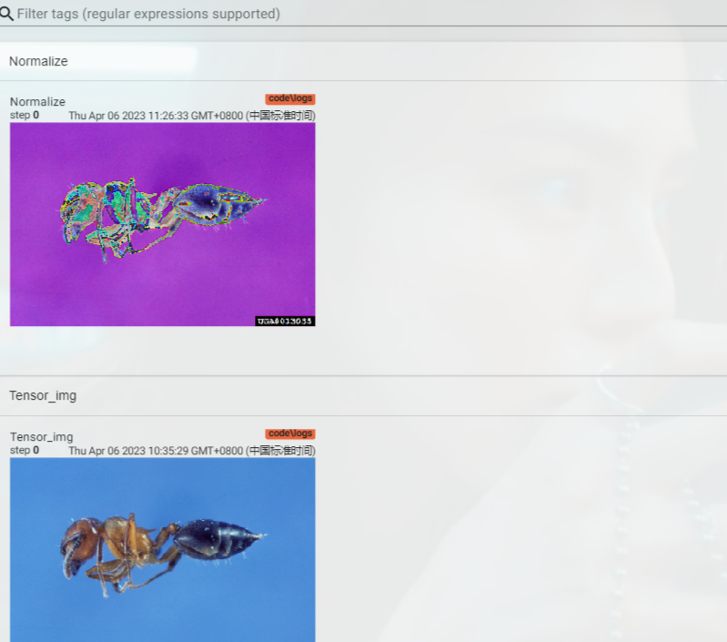

# Transform的简单操作


## 结构以及用法

  

**下面的代码先使用Image获取一张图片 然后使用Transform将图片转换为张量,最后使用tensorboard工具打开图片**

```py
from torchvision import transforms
from PIL import Image
from tensorboardX import SummaryWriter

#  根据相对路径 获取图片
img_path = "../AllData/dataset1/train/ants_image/0013035.jpg"
img = Image.open(img_path)


#  获取tensor工具箱  将图片转换为张量
tensor_trans = transforms.ToTensor()
## 将图片转换成tensor
tensor_img = tensor_trans(img)
print(tensor_img)
print(tensor_img.shape)

# 使用tensorboard 
writer = SummaryWriter("logs")

#  使用add_image方法 添加图片  第二个参数使用tensor张量
writer.add_image("Tensor_img",tensor_img)

writer.close()

```

## 常用的Transform工具

### ToTensor

<!-- image转换为张量 -->


```py
from PIL import Image
from torchvision import transforms
from tensorboardX import SummaryWriter

img = Image.open("../AllData/dataset1/train/ants_image/0013035.jpg")
print(img)


#  获取tensorboard
writer = SummaryWriter("logs")
trans_toTensor = transforms.ToTensor()
#  获取图片张量
img_tensor = trans_toTensor(img)

writer.add_image("ToTensor",img_tensor)

writer.close()
```

## 归一化操作

```py
from PIL import Image
from torchvision import transforms
from tensorboardX import SummaryWriter


img = Image.open("../AllData/dataset1/train/ants_image/0013035.jpg")
print(img)


#  获取tensorboard
writer = SummaryWriter("logs")
trans_toTensor = transforms.ToTensor()
#  获取图片张量
img_tensor = trans_toTensor(img)

writer.add_image("ToTensor",img_tensor)

print(img_tensor[0][0][0])  ## 输出第一个像素点

# 正则化  transforms  获取正则化对象 2 X - 1
trans_norm = transforms.Normalize([0.5,0.5,0.5],[0.5,0.5,0.5])

#  对图片张量进行正则化  得到的仍然是一个张量
img_norm = trans_norm(img_tensor)

print(img_norm[0][0][0])

writer.add_image("Normalize",img_norm)

writer.close()

```

  


## Resize

<!-- 返回的仍然是图片数据类型  指定图片的大小 -->

```py
from PIL import Image
from torchvision import transforms
from tensorboardX import SummaryWriter


img = Image.open("../AllData/dataset1/train/ants_image/0013035.jpg")
print(img)


#  获取tensorboard
writer = SummaryWriter("logs")
trans_toTensor = transforms.ToTensor()
#  获取图片张量
img_tensor = trans_toTensor(img)

writer.add_image("ToTensor",img_tensor)

print(img_tensor[0][0][0])  ## 输出第一个像素点

# 正则化  transforms  获取正则化对象 2 X - 1
trans_norm = transforms.Normalize([0.5,0.5,0.5],[0.5,0.5,0.5])

#  对图片张量进行正则化  得到的仍然是一个张量
img_norm = trans_norm(img_tensor)

print(img_norm[0][0][0])

writer.add_image("Normalize",img_norm)


# 打印图片的尺寸
print(img.size)

# 获取512 512 resize对象
trans_resize = transforms.Resize((512,512))

img_resize = trans_resize(img) # 返回的是图片数据类型

print(img_resize)

#  转换成张量  放到tensorboard
imgRes_tensor = trans_toTensor(img_resize)
writer.add_image("Resize",imgRes_tensor,0)

writer.close()
```


## Compose

<!-- compose函数完成了先裁剪 然后转换成张量的两步行为 -->

```py
from PIL import Image
from torchvision import transforms
from tensorboardX import SummaryWriter


img = Image.open("../AllData/dataset1/train/ants_image/0013035.jpg")
print(img)


#  获取tensorboard
writer = SummaryWriter("logs")
trans_toTensor = transforms.ToTensor()
#  获取图片张量
img_tensor = trans_toTensor(img)

writer.add_image("ToTensor",img_tensor)

print(img_tensor[0][0][0])  ## 输出第一个像素点

# 正则化  transforms  获取正则化对象 2 X - 1
trans_norm = transforms.Normalize([0.5,0.5,0.5],[0.5,0.5,0.5])

#  对图片张量进行正则化  得到的仍然是一个张量
img_norm = trans_norm(img_tensor)

print(img_norm[0][0][0])

writer.add_image("Normalize",img_norm)


# 打印图片的尺寸
print(img.size)

# 获取512 512 resize对象
trans_resize = transforms.Resize((512,512))

img_resize = trans_resize(img) # 返回的是图片数据类型

print(img_resize)

#  转换成张量  放到tensorboard
imgRes_tensor = trans_toTensor(img_resize)
writer.add_image("Resize",imgRes_tensor,0)


#  Compose - Resize - 2
trans_resize_2 = transforms.Resize(512)

#  第一个参数是图片 第二个参数是张量
trans_compose = transforms.Compose([trans_resize_2,trans_totensor])
img_resize_2 = trans_compose(img)
writer.add_image("Resize",img_resize_2,1)


writer.close()


```

## RandomCrop

**随机裁剪十次**

```py
# from torch.utils.tensorboardX import SummaryWriter
from tensorboardX import SummaryWriter
import numpy as np
from PIL import Image

## 创建一个实例
writer = SummaryWriter("logs")

# 填写相对路径
image_path = "../AllData/dataset1/train/ants_image/0013035.jpg"

#  获取图片
img_PIL = Image.open(image_path)

# 转换为numpy张量
img_array = np.array(img_PIL)

#  打印类型 以及形状
print(type(img_array))
print(img_array.shape)

#  指定图片形状 H W C   第二个参数也可以是tensor张量
writer.add_image("test",img_array,1,dataformats='HWC')


for i in range(100):

    #  绘制图像
    #  y轴  x轴
    writer.add_scalar("y=2x",2 * i,i)

writer.close()

```


