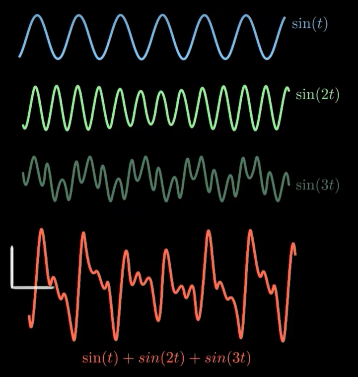
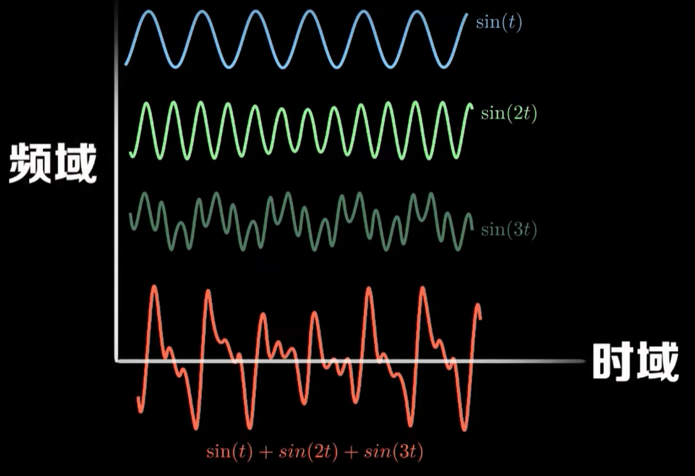
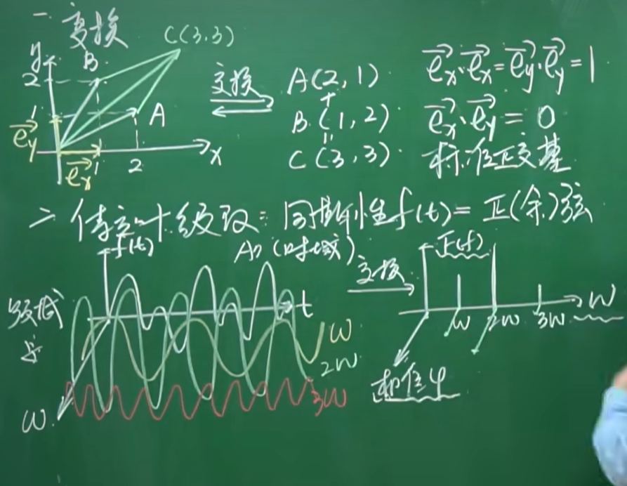
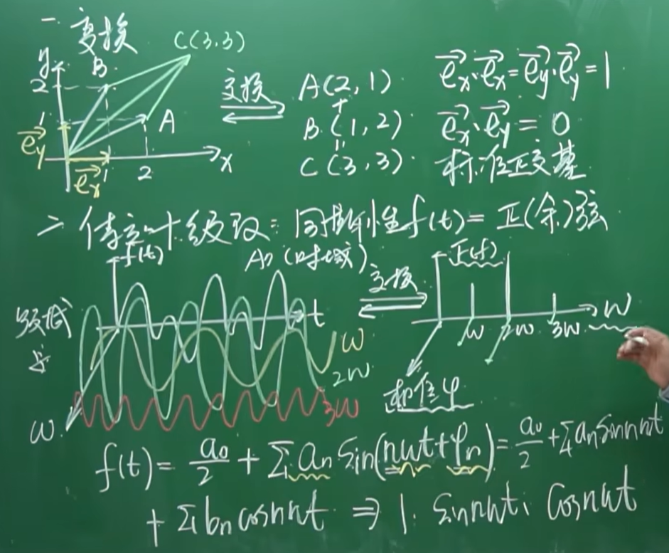

# FNO一维傅里叶卷积算子解释

## 解释


```py

class SpectralConv1d(nn.Module):
    def __init__(self, in_channels, out_channels, modes1):
        super(SpectralConv1d, self).__init__()

        """
        1D Fourier layer. It does FFT, linear transform, and Inverse FFT.    
        """

        self.in_channels = in_channels
        self.out_channels = out_channels
        self.modes1 = modes1  #Number of Fourier modes to multiply, at most floor(N/2) + 1

        self.scale = (1 / (in_channels*out_channels))
        self.weights1 = nn.Parameter(self.scale * torch.rand(in_channels, out_channels, self.modes1, dtype=torch.cfloat))

    # Complex multiplication
    def compl_mul1d(self, input, weights):
        # (batch, in_channel, x ), (in_channel, out_channel, x) -> (batch, out_channel, x)
        return torch.einsum("bix,iox->box", input, weights)

    def forward(self, x):
        batchsize = x.shape[0]
        #Compute Fourier coeffcients up to factor of e^(- something constant)
        x_ft = torch.fft.rfft(x)  # 将输出转换回物理空间，这一操作确保了输出是实数

        # Multiply relevant Fourier modes
        out_ft = torch.zeros(batchsize, self.out_channels, x.size(-1)//2 + 1,  device=x.device, dtype=torch.cfloat)
        out_ft[:, :, :self.modes1] = self.compl_mul1d(x_ft[:, :, :self.modes1], self.weights1)

        #Return to physical space
        x = torch.fft.irfft(out_ft, n=x.size(-1))
        return x

```

* 傅里叶神经算子用于一维问题
* 傅里叶层，SpectralConv1d类定义了一维的傅里叶层，执行快速傅里叶变换FFT,线性变换，逆快速傅里叶变换IFFT,这个层通过在频域中进行操作，允许网络捕捉输入数据的全局特征
* 网络结构：fno1d类构建了整体网络，包含四个傅里叶层，网络首先通过一个全连接层将输入提升到期望的通道维度，然后通过多个傅里叶层和标准卷积层处理数据，最后通过另一个全连接层将结果映射到输出空间
* 数据处理：代码使用下采样来减少数据的规模，是的训练过程更加高效


论文地址:```https://arxiv.org/pdf/2010.08895.pdf``

### 前向传播

* 傅里叶变换：使用torch,fft.rfft 对输入x进行实数快速傅里叶变换，得到傅里叶系数，这一步将输入信号从物理空间转换到频域
* 应用权重：在频域中，仅仅对最多modes1个频率模式应用复数权重矩阵，实现了在频域中的线性变换，是FNO的核心操作，通过这种方式模型能学习到不同频率之间的相互作用
* 逆傅里叶变换 使用irfft将变换之后的频域信号转换到物理空间，rfft只计算非负频率部分的傅里叶系数，irfft相应的从这些系数恢复出物理空间的信号


### 傅里叶变换

**一个周期性函数由一系列的正余弦函数组合而成**

  


  


  

* 那么针对该函数是由三个函数复合而成的。那么频率范围内有三个频率 还有振幅F(t)
* 同时还有相位

  


**但是大部分函数都不是周期性，傅里叶变换的目的就是提取出一段信号的所有正余弦信号成分**

# 傅里叶变换的推导讲解

傅里叶变换是一种重要的数学工具，用于将函数或信号从时域转换到频域。它可以将一个复杂的信号分解为一系列简单的正弦波。

## 基本概念

傅里叶变换的基本思想是任何周期函数都可以表示为不同频率的正弦波和余弦波的和的形式，即：

$$
f(t) = A_0 + \sum_{n=1}^{\infty} [A_n \cos(n \omega_0 t) + B_n \sin(n \omega_0 t)]
$$

其中，$A_0$、$A_n$ 和 $B_n$ 是傅里叶系数，$\omega_0$ 是基频。

## 傅里叶级数到傅里叶变换

对于非周期函数，我们可以将其视为周期无限大的周期函数。在这种情况下，傅里叶级数转化为傅里叶变换。傅里叶变换公式如下：

$$
F(\omega) = \int_{-\infty}^{\infty} f(t) e^{-j \omega t} dt
$$

## 推导过程

1. **从欧拉公式出发**：
   欧拉公式表达了复指数函数与三角函数之间的关系：$e^{jx} = \cos(x) + j\sin(x)$。

2. **构造傅里叶变换对**：
   傅里叶变换的基本形式是对函数$f(t)$乘以一个复指数函数$e^{-j\omega t}$并对时间$t$积分，从$-\infty$到$+\infty$，其中$j$是虚数单位，$\omega$是角频率。这可以看作是$f(t)$与一系列复指数函数的内积。

   $$
   F(\omega) = \int_{-\infty}^{\infty} f(t) e^{-j \omega t} dt
   $$

3. **理解傅里叶变换的意义**：
   上述变换实质上是在测量函数$f(t)$在每个频率$\omega$处的频谱成分。复指数函数$e^{-j\omega t}$可以视为频率为$\omega$的正弦波和余弦波的组合。通过对所有可能的频率$\omega$进行积分，我们可以得到$f(t)$在每个频率上的分量，即其频谱$F(\omega)$。

4. **逆傅里叶变换**：
   逆傅里叶变换允许我们从频谱$F(\omega)$重构原始信号$f(t)$，其公式为：

   $$
   f(t) = \frac{1}{2\pi} \int_{-\infty}^{\infty} F(\omega) e^{j \omega t} d\omega
   $$

通过这种方式，傅里叶变换及其逆变换为我们提供了一种从时域到频域，再从频域回到时域的桥梁。

## 结论

傅里叶变换是一种强大的数学工具，它不仅能够帮助我们理解信号或函数的频率成分，还能在许多科学和工程领域中应用于信号处理、图像处理、通信系统等。以上便是傅里叶变换的简化推导过程。

