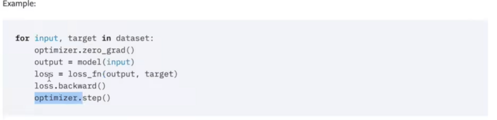

# 优化器

## 优化器的意义

**经过backward的反向传播之后，计算出梯度，然后使用优化器进行优化参数**

  

## 在神经网络中使用优化器

**使用优化器来优化参数**

```py
from torch import nn
# from tensorboardX import SummaryWriter
from  torch.nn import Conv2d,MaxPool2d,Flatten,Linear,Sequential
import torch
import torchvision
from torch.utils.data import DataLoader


dataset = torchvision.datasets.CIFAR10("../data",train=False,transform=torchvision.transforms.ToTensor(),download=True)

# 每次只取出一张图片
dataloader = DataLoader(dataset,batch_size=1)

from torch.utils.tensorboard import SummaryWriter

class Tudui(nn.Module):
    def __init__(self):
        super(Tudui,self).__init__()
        self.model1 = Sequential(
            Conv2d(3,32,5,padding=2),
            MaxPool2d(2),
            Conv2d(32,32,5,padding=2),
            MaxPool2d(2),
            Conv2d(32,64,5,padding=2),
            MaxPool2d(2),
            Flatten(),
            Linear(1024,64),
            Linear(64,10)
        )

    def forward(self,x):
        x = self.model1(x)
        return x
    
loss = nn.CrossEntropyLoss()
tudui = Tudui()
# print(tudui)

# 定义优化器  第一个是神经网络的参数  第二个是学习率
optim = torch.optim.SGD(tudui.parameters(),lr = 0.01)

#  循环遍历所有数据20次
for epoch in range(20):
    running_loss = 0.0
    for data in dataloader:
        imgs,targets = data
        # 经过神经网络处理得到的输出  一个一维向量  包含十个数据
        outputs = tudui(imgs)
        #  计算损失
        result_loss = loss(outputs,targets)
        optim.zero_grad()
        # 优化器需要每一个参数的梯度
        result_loss.backward()

        # 优化参数
        optim.step()
        print(result_loss)
        running_loss = running_loss + result_loss

    print(running_loss)
```

