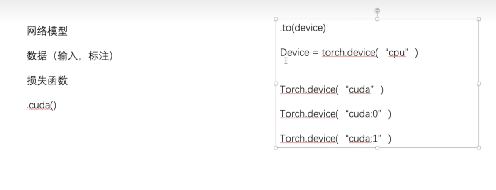
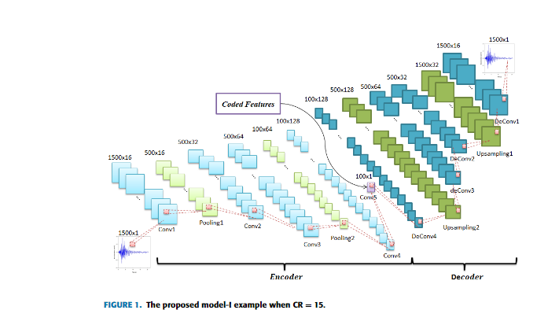

# 使用GPU进行训练

## 定义device

  

**多个GPU可以指定cuda的序号**

```py
import torchvision
from torch.utils.data import DataLoader  

from torch import nn
import torch

# 定义训练的设备 使用gpu进行训练
device = torch.device("cuda")

# 准备数据集
train_data = torchvision.datasets.CIFAR10(root = "../data",train=True,transform=torchvision.transforms.ToTensor(),download=True)

test_data = torchvision.datasets.CIFAR10(root = "../data",train=False,transform=torchvision.transforms.ToTensor(),download=True)

train_data_size = len(train_data)
test_data_size = len(test_data)

print("训练数据集的长度为：{}".format(train_data_size))
print("测试数据集的长度为：{}".format(test_data_size))

#  dataloader加载数据集
train_dataloader = DataLoader(train_data,batch_size = 64)
test_dataloader = DataLoader(test_data,batch_size = 64)

# 搭建神经网络

class Tudui(nn.Module):
    def __init__(self):
        super(Tudui,self).__init__()
        self.model = nn.Sequential(
            #  inpuT 3 output 32  卷积核5 stride 1 padding 2
            #  第一次卷积操作
            nn.Conv2d(3,32,5,1,2),

            #  最大池化操作 2 是kernel size
            nn.MaxPool2d(2),

            # 卷积操作 
            nn.Conv2d(32,32,5,1,2),

            nn.MaxPool2d(2),

            nn.Conv2d(32,64,5,1,2),

            nn.MaxPool2d(2),

            # 展平 将64个channel的4 x 4的图片全部展平 
            # 展平之后的结果是 6 4 * 4 * 4  一个一维向量
            nn.Flatten(),
            #  线性层
            nn.Linear(64 * 4 * 4,64),
            nn.Linear(64,10)
        )

    #  前向传播
    def forward(self,x):
        x = self.model(x)
        return x

import torch

#  创建网络模型
tudui = Tudui()
tudui = tudui.to(device)

# 定义损失函数
loss_fn = nn.CrossEntropyLoss()
loss_fn = loss_fn.to(device)

learning_rate = 0.01
# 定义优化器  随机梯度下降
optimizer = torch.optim.SGD(tudui.parameters(),lr = learning_rate)


#  设置训练网络的一些参数
total_train_step = 0
# 记录测试的次数
total_test_step = 0

# 训练的轮数
epoch = 10
from torch.utils.tensorboard import SummaryWriter

#  添加tensorboard

writer = SummaryWriter("../logs_train")

for i in range(epoch):
    print("------第{}轮训练开始".format(i + 1))

    # 训练步骤开始
    tudui.train()
    for data in train_dataloader:
        imgs,targets = data

        imgs = imgs.to(device)
        targets = targets.to(device)

        # 64 x 10
        outputs = tudui.forward(imgs)

        #  计算损失
        loss = loss_fn(outputs,targets)

        #  将梯度清0
        optimizer.zero_grad()

        # 反向传播  计算梯度
        loss.backward()

        # 优化
        optimizer.step()

        #  统计训练次数
        total_train_step = total_train_step + 1

        if total_train_step % 100 == 0:
            # item 将tensor转换为一个数据类型
            print("训练次数:{},Loss:{}".format(total_train_step,loss.item()))
            #  绘制训练损失
            writer.add_scalar("train_loss",loss.item(),total_train_step)

    #  测试步骤开始
    tudui.eval()
    total_test_loss = 0
    total_accuracy = 0
    with torch.no_grad():

        #  取出测试数据集的数据
        for data in test_dataloader:

            #  取出数据
            imgs,targets = data
            imgs = imgs.to(device)
            targets = targets.to(device)

            outputs = tudui(imgs)

            loss = loss_fn(outputs,targets) # 计算损失

            #  统计测试集上面的总损失
            total_test_loss = total_test_loss + loss.item()
            accuracy = (outputs.argmax(1) == targets).sum()
            total_accuracy = total_accuracy + accuracy


    print("整体测试集上面的Loss:{}".format(total_test_loss))
    print("整体测试及上面的正确率:{}".format(total_accuracy / test_data_size))
    writer.add_scalar("test_loss",loss.item(),total_test_step)
    writer.add_scalar("test_accuracy",total_accuracy / test_data_size,total_test_step)
    total_test_step = total_test_step + 1

```

**使用cpu运行代码需要十一分钟，使用GPU运行代码需要2min多**


