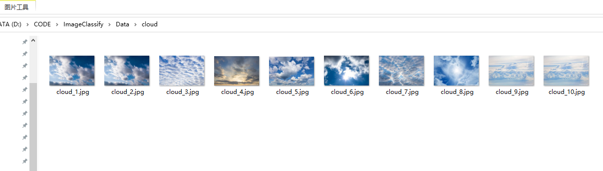
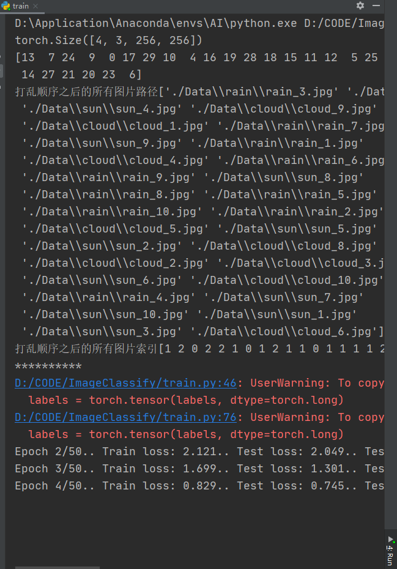
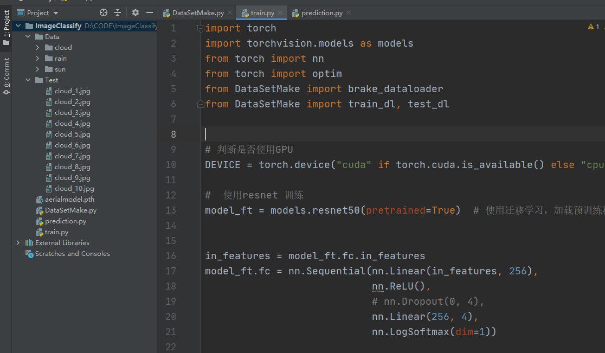

# 制作图像标签数据集以及训练


## 制作DataSet

* 先从网络收集十张图片 每种十张
  


* 定义dataSet和dataloader


```py
import glob
import torch
from torch.utils import data
from PIL import Image
import numpy as np
from torchvision import transforms
import matplotlib.pyplot as plt


# 通过创建data.Dataset子类Mydataset来创建输入
class Mydataset(data.Dataset):
    # init() 初始化方法，传入数据文件夹路径
    def __init__(self, root):
        self.imgs_path = root

    # getitem() 切片方法，根据索引下标，获得相应的图片
    def __getitem__(self, index):
        img_path = self.imgs_path[index]

    # len() 计算长度方法，返回整个数据文件夹下所有文件的个数
    def __len__(self):
        return len(self.imgs_path)


# 使用glob方法来获取数据图片的所有路径
all_imgs_path = glob.glob(r"./Data/*/*.jpg")  # 数据文件夹路径

# 利用自定义类Mydataset创建对象brake_dataset
# 将所有的路径塞进dataset  使用每张图片的路径进行索引图片
brake_dataset = Mydataset(all_imgs_path)
# print("图片总数:{}".format(len(brake_dataset)))  # 返回文件夹中图片总个数


# 制作dataloader
brake_dataloader = torch.utils.data.DataLoader(brake_dataset, batch_size=2)  # 每次迭代时返回4个数据
# print(next(iter(break_dataloader)))

```

## 制作标签


```py

# 为每张图片制作对应标签
species = ['sun', 'rain', 'cloud']
species_to_id = dict((c, i) for i, c in enumerate(species))
# print(species_to_id)

id_to_species = dict((v, k) for k, v in species_to_id.items())
# print(id_to_species)

# 对所有图片路径进行迭代
all_labels = []
for img in all_imgs_path:
	# 区分出每个img，应该属于什么类别
	for i, c in enumerate(species):
		if c in img:
			all_labels.append(i)
# print(all_labels)
```

## 制作数据和标签一起的dataset和dataloader

* 上面的dataset不够完善


```py
# 将数据转换为张量数据
# 对数据进行转换处理
transform = transforms.Compose([
	transforms.Resize((256, 256)),  # 做的第一步转换
	transforms.ToTensor()  # 第二步转换，作用：第一转换成Tensor，第二将图片取值范围转换成0-1之间，第三会将channel置前
])


class Mydatasetpro(data.Dataset):
	def __init__(self, img_paths, labels, transform):
		self.imgs = img_paths
		self.labels = labels
		self.transforms = transform

	# 进行切片
	def __getitem__(self, index):
		img = self.imgs[index]
		label = self.labels[index]
		pil_img = Image.open(img)  # pip install pillow
		pil_img = pil_img.convert('RGB')
		data = self.transforms(pil_img)
		return data, label

	# 返回长度
	def __len__(self):
		return len(self.imgs)


BATCH_SIZE = 4
brake_dataset = Mydatasetpro(all_imgs_path, all_labels, transform)
brake_dataloader = data.DataLoader(
	brake_dataset,
	batch_size=BATCH_SIZE,
	shuffle=True
)

```

```py
imgs_batch, labels_batch = next(iter(brake_dataloader))

# 4 X 3 X 256 X 256
print(imgs_batch.shape)

plt.figure(figsize=(12, 8))
for i, (img, label) in enumerate(zip(imgs_batch[:10], labels_batch[:10])):
	img = img.permute(1, 2, 0).numpy()
	plt.subplot(2, 3, i + 1)
	plt.title(id_to_species.get(label.item()))
	plt.imshow(img)
plt.show()  # 展示图片


```

## 制作训练集和测试集


```py
# 划分数据集和测试集
index = np.random.permutation(len(all_imgs_path))

#  打乱所有图片的索引
print(index)

# 根据索引获取所有图片的路径
all_imgs_path = np.array(all_imgs_path)[index]
all_labels = np.array(all_labels)[index]

print("打乱顺序之后的所有图片路径{}".format(all_imgs_path))
print("打乱顺序之后的所有图片索引{}".format(all_labels))

# 80%做训练集
s = int(len(all_imgs_path) * 0.8)
# print(s)

train_imgs = all_imgs_path[:s]
# print(train_imgs)
train_labels = all_labels[:s]
test_imgs = all_imgs_path[s:]
test_labels = all_labels[s:]


# 将训练集和标签 制作dataset 需要转换为张量
train_ds = Mydatasetpro(train_imgs, train_labels, transform)  # TrainSet TensorData
test_ds = Mydatasetpro(test_imgs, test_labels, transform)  # TestSet TensorData
# print(train_ds)
# print(test_ds)
print("**********")
# 制作trainLoader
train_dl = data.DataLoader(train_ds, batch_size=BATCH_SIZE, shuffle=True)  # TrainSet Labels
test_dl = data.DataLoader(train_ds, batch_size=BATCH_SIZE, shuffle=True)  # TestSet Labels


```


## 训练代码


```py
import torch
import torchvision.models as models
from torch import nn
from torch import optim
from DataSetMake import brake_dataloader
from DataSetMake import train_dl, test_dl


# 判断是否使用GPU
DEVICE = torch.device("cuda" if torch.cuda.is_available() else "cpu")

#  使用resnet 训练
model_ft = models.resnet50(pretrained=True)  # 使用迁移学习，加载预训练权


in_features = model_ft.fc.in_features
model_ft.fc = nn.Sequential(nn.Linear(in_features, 256),
							nn.ReLU(),
							# nn.Dropout(0, 4),
							nn.Linear(256, 4),
							nn.LogSoftmax(dim=1))

model_ft = model_ft.to(DEVICE)  # 将模型迁移到gpu

# 优化器
loss_fn = nn.CrossEntropyLoss()
loss_fn = loss_fn.to(DEVICE)  # 将loss_fn迁移到GPU

# Adam损失函数
optimizer = optim.Adam(model_ft.fc.parameters(), lr=0.003)


epochs = 50  # 迭代次数
steps = 0
running_loss = 0
print_every = 10
train_losses, test_losses = [], []

for epoch in range(epochs):
	model_ft.train()
	# 遍历训练集数据
	for imgs, labels in brake_dataloader:
		steps += 1

		# 标签转换为 tensor
		labels = torch.tensor(labels, dtype=torch.long)

		# 将图片和标签 放到设备上
		imgs, labels = imgs.to(DEVICE), labels.to(DEVICE)

		optimizer.zero_grad()  # 梯度归零

		#  前向推理
		outputs = model_ft(imgs)

		# 计算loss
		loss = loss_fn(outputs, labels)
		loss.backward()  # 反向传播计算梯度
		optimizer.step()  # 梯度优化

		# 累加loss
		running_loss += loss.item()

		if steps % print_every == 0:
			test_loss = 0
			accuracy = 0

			# 验证模式
			model_ft.eval()

			# 测试集 不需要计算梯度
			with torch.no_grad():
				# 遍历测试集数据
				for imgs, labels in test_dl:
					#  转换为tensor
					labels = torch.tensor(labels, dtype=torch.long)

					#  数据标签 部署到gpu
					imgs, labels = imgs.to(DEVICE), labels.to(DEVICE)

					#  前向推理
					outputs = model_ft(imgs)

					#  计算损失
					loss = loss_fn(outputs, labels)

					# 累加测试机的损失
					test_loss += loss.item()

					ps = torch.exp(outputs)
					top_p, top_class = ps.topk(1, dim=1)

					equals = top_class == labels.view(*top_class.shape)
					accuracy += torch.mean(equals.type(torch.FloatTensor)).item()

			train_losses.append(running_loss / len(train_dl))
			test_losses.append(test_loss / len(test_dl))

			print(f"Epoch {epoch + 1}/{epochs}.. "
				  f"Train loss: {running_loss / print_every:.3f}.. "
				  f"Test loss: {test_loss / len(test_dl):.3f}.. "
				  f"Test accuracy: {accuracy / len(test_dl):.3f}")

			#  回到训练模式 训练误差清0
			running_loss = 0
			model_ft.train()
torch.save(model_ft, "aerialmodel.pth")


```
  


## 预测代码


```py
import os
import torch
from PIL import Image
from torch import nn
from torchvision import transforms, models

i = 0  # 识别图片计数
# 这里最好新建一个test_data文件随机放一些上面整理好的图片进去
root_path = r"D:\CODE\ImageClassify\Test"  # 待测试文件夹
names = os.listdir(root_path)

for name in names:
	print(name)
	i = i + 1
	data_class = ['sun', 'rain', 'cloud']  # 按文件索引顺序排列


	#  找出文件夹中的所有图片
	image_path = os.path.join(root_path, name)
	image = Image.open(image_path)
	print(image)

	#  张量定义格式
	transform = transforms.Compose([transforms.Resize((256, 256)),
									transforms.ToTensor()])
	# 图片转换为张量
	image = transform(image)
	print(image.shape)

	#  定义resnet模型
	model_ft = models.resnet50()

	# 模型结构
	in_features = model_ft.fc.in_features
	model_ft.fc = nn.Sequential(nn.Linear(in_features, 256),
								nn.ReLU(),
								# nn.Dropout(0, 4),
								nn.Linear(256, 4),
								nn.LogSoftmax(dim=1))


	# 加载已经训练好的模型参数
	model = torch.load("aerialmodel.pth", map_location=torch.device("cpu"))

	# 将每张图片 调整维度
	image = torch.reshape(image, (1, 3, 256, 256))  # 修改待预测图片尺寸，需要与训练时一致
	model.eval()

	#  速出预测结果
	with torch.no_grad():
		output = model(image)
	print(output)  # 输出预测结果
	# print(int(output.argmax(1)))
	# 对结果进行处理，使直接显示出预测的种类  根据索引判别是哪一类
	print("第{}张图片预测为：{}".format(i, data_class[int(output.argmax(1))]))


```


## 工程目录结构
  


