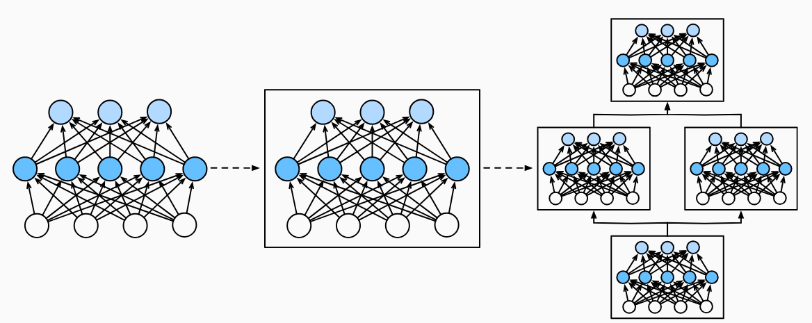

# 层和块

## 简单介绍

* 块：描述单个层，由多个层组成的组件或整个模型本身。使用块进行抽象的一个好处是可以将一些块组合成更大的组件，这一过程通常是递归的

  

## 简单入门

```py

import torch
from torch import nn
from torch.nn import functional as F

# 直接定义两层  两个线性层
net = nn.Sequential(nn.Linear(20,256),nn.ReLU(),nn.Linear(256,10))

X = torch.rand(2,20)
net(X)
```


* 实例化nn.Sequential来构建我们的模型，层的执行顺序是作为参数进行传递的
* nn.Sequential定义一种特殊的Module，维护了一个Module组成的有序列表，两个全连接层都是Linear类的实例。
* 前向传播函数很简单：将列表中的每一个块连接在一起，将每一个块的输出作为下一个快的输入

## 自定义块

* 将输入数据作为其前向传播函数的参数。

* 通过前向传播函数来生成输出。请注意，输出的形状可能与输入的形状不同。例如，我们上面模型中的第一个全连接的层接收一个20维的输入，但是返回一个维度为256的输出。
* 计算其输出关于输入的梯度，可通过其反向传播函数进行访问。通常这是自动发生的。
存储和访问前向传播计算所需的参数。

* 根据需要初始化模型参数。

```py
class MLP(nn.Module):
    # 用模型参数声明层。这里，我们声明两个全连接的层
    def __init__(self):
        # 调用MLP的父类Module的构造函数来执行必要的初始化。
        # 这样，在类实例化时也可以指定其他函数参数，例如模型参数params（稍后将介绍）
        super().__init__()
        self.hidden = nn.Linear(20, 256)  # 隐藏层
        self.out = nn.Linear(256, 10)  # 输出层

    # 定义模型的前向传播，即如何根据输入X返回所需的模型输出
    def forward(self, X):
        # 注意，这里我们使用ReLU的函数版本，其在nn.functional模块中定义。
        return self.out(F.relu(self.hidden(X)))

```

* init函数通过super操作调用父类初始化，然后实例化两个全连接层

* 块的一个主要优点是它的多功能性。 我们可以子类化块以创建层（如全连接层的类）、 整个模型（如上面的MLP类）或具有中等复杂度的各种组件。 我们在接下来的章节中充分利用了这种多功能性， 比如在处理卷积神经网络时。


## 顺序块

* Sequential的设计是将其他模块串接起来
* 自定义MySequential：一种将块逐个追加到列表的函数，一种前向传播函数，用于将输入按追加块的顺序传递给块组成的链条

```py
class MySequential(nn.Module):
    def __init__(self,*args):
        super().__init__()
        for idx,module in enumerate(args):
            self._modules[str(idx)] = module

    def forward(self,X):
        for block in self._modules.values():
            X = block(X)
        return X
    
```

* init函数将每一个模块逐个添加到有序字典_modules中，使用_modules的好处是：在模块的参数初始化过程中，系统知道在_modules字典中查找需要初始化参数的子块

* 当MySequential的前向传播函数被调用的时候，每一个添加的块都按照它们被添加的顺序执行

```py
net = MySequential(nn.Linear(20,256),nn.ReLU(),nn.Linear(256,10))
net(X)

```


