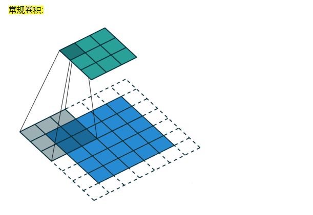
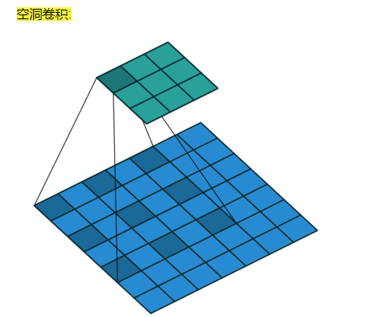
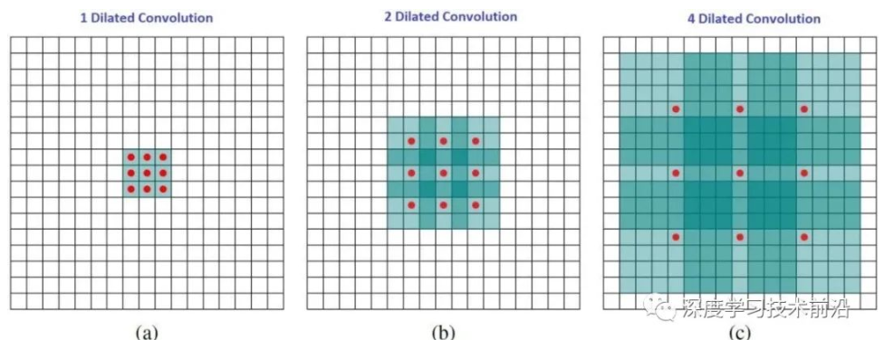
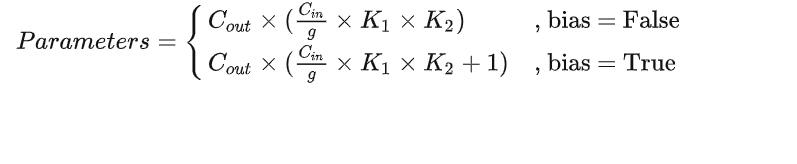

# 动手学模型压缩-对模型结构进行优化


## 概述


* 模型压缩通常都是对推断过程而言，训练过程的计算代价通常不考虑，因为GPU可以快速完成任意复杂度模型的训练
* 对于推断过程来说，模型应用才是对于速度敏感的场景
* 多数情况下 希望使用尽可能少的能耗完成京可能多的数据处理
* 推断过程不仅仅需要在CPU设备上完成测试，还需要再低功耗设备完成推断


## 卷积结构基础优化-空洞卷积

* 增大感受野，增大感受野基本方式就是增大卷积核大小
* 增大卷积核大小会增大训练参数 拖慢计算
* 使用空洞卷积进行优化
* 空洞卷积将卷积可训练参数之间添加多个1
* 二维空洞卷积的核心形式就是再普通空洞卷积核心的横向纵向都添加1
* pytorch中再conv添加dilation参数  默认为1

```
https://blog.csdn.net/mrjkzhangma/article/details/104929302
```

* 关于常规卷积

  

* 关于空洞卷积

  

* 空洞卷积计算：扩张率D，那么就在横纵方向添加D -1 行

  


## 增大感受野的原因

* 下采样过程中大量池化操作，损失一些信息，再解码重建过程中产生影响

## 关于分组卷积

* 将输入特征图按照通道均分为g组，然后对每一组进行常规卷积
* 由于分组之后，每一组输入特征图的通道数变成Cin / g,那么每一个卷积核的通道数也降低到Cin / g
* 由于每一组进行的是常规卷积，所以每一组至少需要一个卷积核，也就是分组卷积输出通道数至少为g,那么如果每一组有n个卷积核 输出Cout = n x g, 所以输出通道数是分组数的整数倍
* 分组卷积中要求输入和输出通道数均能整除分组数g
* 分组卷积的运算量和参数量的减少，本质原因就是一个卷积核本身通道数减少为原来的g分之一
* 整个分组卷积的参数量：

  

## 分组卷积的作用

* 减少运算量和参数，原来的1/g
* 隔绝不同组的信息交换
* 如果需要考虑所有输入特征图信息的情况，分组卷积会降低模型的性能，对于这个问题，需要在两个分组卷积之间加入Channel_Shuffle模块打乱通道顺序，从而实现不同分组之间的信息交换


## 关于分组卷积

```py
import torch
import torch.nn as nn


# batch 5 channel 128  大小 28 x 28
x = torch.zeros([5,128,28,28])

cnn = nn.Conv2d(128,256,3,groups=2)

#  计算cnn 的参数数量  只有一层卷积
#  第一个参数是权重 torch.Size([256, 64, 3, 3])
# 因为分为两组 每一组输入特征图的通道数变成64,然后每一个卷积核的通道数 也是64
# 3 x 3 卷积核 输出256 输入64 总共256个卷积核个数
for var in cnn.parameters():
    print(var.shape)

# cnn = nn.Conv1d(128,256,3,groups=2)
# for var in cnn.parameters():
#     print(var.shape)


```


```py
from torchvision.models import resnet50,mobilenet_v2
import torch
import time


model1 = resnet50()
model2 = mobilenet_v2()  # 卷积速度优化


# 输入1 输出3  大小 224 x 224
x = torch.randn([1,3,224,224],dtype=torch.float32)

# 进行十次推理测试 每一次测试都测量模型推理时间  然后打印结果
for i in range(10):
    t1 = time.perf_counter()
    y = model2(x)
    t2 = time.perf_counter()

    # 计算推理时间 进行十次推理 发现每一次推理的时间都减小
    print(f"{t2-t1:.3f}")


torch.save(model1.state_dict(),"resnet.pth")


#  使用torch.save  保存模型的权重参数  然后以后可以加载这些模型权重  然后重用
torch.save(model2.state_dict(),"mobilenetv2.pth")

```


## 关于深度可分离卷积
```py
import torch
import torch.nn as nn
import time

# 产生随机测试数据
x = torch.randn([32,64,300,300])
# 定义卷积网络


# 逐层卷积  g = Cin = Cout  卷积核大小 3 x 3
cnn1 = nn.Conv2d(64,64,3,groups=64)

# 逐点卷积 
cnn2 = nn.Conv2d(64,128,1,groups=1)


cnn1.eval() # 推断模型
cnn2.eval() 


for i in range(10):
    t1 = time.perf_counter()
    x = cnn1(x)
    y = cnn2(x)
    t2 = time.perf_counter()
    print(f"{t2 - t1:.3f}")


```


