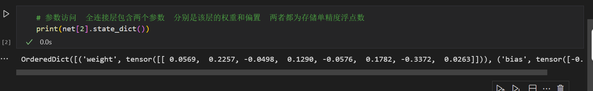
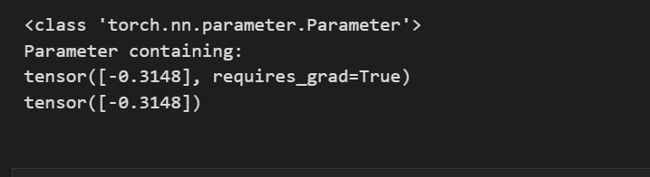
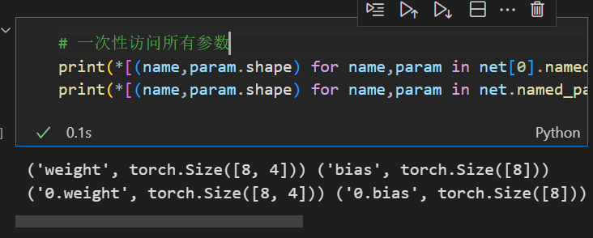
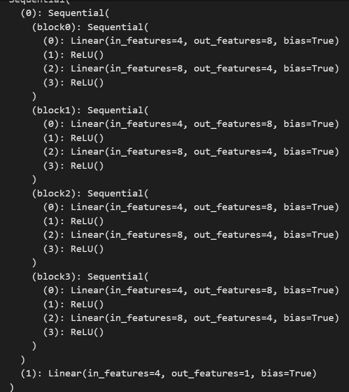
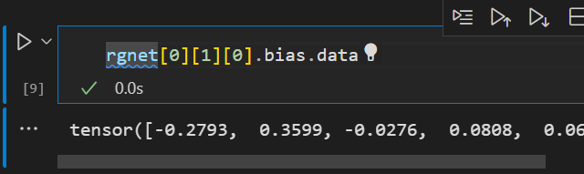

# pytorch-参数管理


## 概述


&emsp;我们的目标是找到使损失函数最小化的模型参数值。 经过训练后，我们将需要使用这些参数来做出未来的预测。 此外，有时我们希望提取参数，以便在其他环境中复用它们， 将模型保存下来，以便它可以在其他软件中执行， 或者为了获得科学的理解而进行检查。

```py
# 创建一个单隐藏层的MLP
import torch
from torch import nn

net = nn.Sequential(nn.Linear(4,8),nn.ReLU(),nn.Linear(8,1))
X = torch.rand(size = (2,4))
net(X)


```


## 参数访问


```py
# 参数访问  全连接层包含两个参数  分别是该层的权重和偏置  两者都为存储单精度浮点数
print(net[2].state_dict())

```
  


```py
print(type(net[2].bias))
print(net[2].bias)
print(net[2].bias.data)

```
  


```py
# 一次性访问所有参数
print(*[(name,param.shape) for name,param in net[0].named_parameters()])
print(*[(name,param.shape) for name,param in net.named_parameters()])

```
  

## 嵌套块收集参数


```py

def block1():
    return nn.Sequential(nn.Linear(4,8),nn.ReLU(),
                         nn.Linear(8,4),nn.ReLU())

def block2():
    net = nn.Sequential()
    for i in range(4):
        net.add_module(f'block{i}',block1())

    return net

#  块和层之间进行组合
rgnet = nn.Sequential(block2(),nn.Linear(4,1))
rgnet(X)
```

  

**访问第一个主要的块中第二个子块的第一层的偏置**
  

## 参数初始化

&emsp;pytorch根据一个范围均匀初始化权重和偏置矩阵 这个范围是根据输入和输出维度计算得到，Pytorch.init模块提供了多种预置初始化方法。


### 内置初始化

下面的代码将所有的权重参数初始化为标准差为0.01的高斯随机变量 并且将偏置参数设置为0

```py
def init_normal(m):
    if type(m) == nn.Linear:
        nn.init.normal_(m.weight,mean = 0,std = 0.01)
        nn.init.zeros_(m.bias)

net.apply(init_normal)
net[0].weight.data[0],net[0].bias.data[0]

```


可以将所有的参数初始化为1

```py

def init_constant(m):
    if type(m) == nn.Linear:
        nn.init.constant_(m.weight,1)
        nn.init.zeros_(m.bias)

net.apply(init_constant)
net[0].weight.data[0],net[0].bias.data[0]
```


针对不同的块进行初始化

```py
def init_xavier(m):
    if type(m) == nn.Linear:
        nn.init.xavier_uniform_(m.weight)

def init_42(m):
    if type(m) == nn.Linear:
        nn.init.constant_(m.weight,42)

net[0].apply(init_xavier)
net[2].apply(init_42)
print(net[0].weight.data[0])
print(net[2].weight.data)

```

### 自定义初始化

```py
def my_init(m):
    if type(m) == nn.Linear:
        print("Init", *[(name, param.shape)
                        for name, param in m.named_parameters()][0])
        nn.init.uniform_(m.weight, -10, 10)
        m.weight.data *= m.weight.data.abs() >= 5

net.apply(my_init)
net[0].weight[:2]

```


### 参数共享

第三层和第四层共享一个参数

```py
shared = nn.Linear(8,8)
net = nn.Sequential(nn.Linear(4,8),nn.ReLU(),
                    
                    shared,nn.ReLU(),
                    shared,nn.ReLU(),
                    nn.Linear(8,1))


net(X)

print(net[2].weight.data[0] == net[4].weight.data[0])


```
