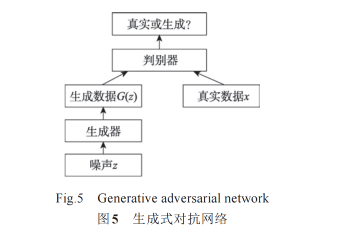

# 【论文阅读笔记】序列数据的数据增强方法综述


## 摘要

&emsp;这篇论文探讨了在深度学习模型中由于对精度的要求不断提高导致模型框架结构变得更加复杂和深层的趋势。随着模型参数量的增加，训练模型需要更多的数据，但人工标注数据的成本高昂，且由于客观原因，获取特定领域的数据可能变得困难。为了缓解数据不足的问题，作者提出了数据增强的概念，通过人为生成新的数据来增加数据量。

&emsp;论文指出，数据增强方法在计算机视觉领域取得了显著的成果，并探讨了这些方法是否可以应用在序列数据上。除了在时间域进行增强的方法（如翻转、裁剪）外，论文还描述了在频率域实现数据增强的方法。此外，除了基于经验或知识设计的方法，还详细论述了一系列基于生成对抗网络（GAN）的通过机器学习模型自动生成数据的方法。

&emsp;论文对应用在自然语言文本、音频信号和时间序列等多种序列数据上的数据增强方法进行了介绍，并涉及了它们在医疗诊断、情绪判断等问题上的表现。尽管这些数据类型不同，论文总结了应用在它们上的数据增强方法背后的相似设计思路。最后，论文以这一思路为线索，梳理了应用在各类序列数据类型上的多种数据增强方法，并进行了一定的讨论和展望

## Introduction


* 线下增强：训练之前，将整个数据集进行整体操作，再把增强之后的数据集喂入模型中
* 线上增强：更为常用的是线上增强（online augmentation），对即将送入到模型的每一批（batch）数据执行转换，不必显式地占用磁盘空间


## 基础方法

* 如变换取值维度的翻转、缩放（scaling）或 变 换 时 间 维 度 的 窗 口 规 整

* 窗口切片：滑动窗口在时序数据不断采样，切片需要随机性

* 添加噪声：对于数值型序列数据，可以对每一个取值随机地添加一定的噪声来生成新的序列[4,8]，且不影响序列的整体性质和标签信息

  

* 通过对时间域数据进行傅里叶变换得到频率域的振幅谱和相位谱
* 在振幅谱上随机选择区间，用基于原始振幅的统计参数重新生成一段信号替换，如图2[9]（b）所示；在相位谱上随机选择区间并添加白噪声


  

## 频率域变换

* 首先对时序数据进行短时傅里叶变换，得到时序关系的谱特征，
* 再在普特征上面使用两种数据增强的方法，一种是对每一个属性做局部平均，将局部平均序列接在原始序列的后面
* 二是打乱顺序，以增加数据的方差，这种方法会使得数据尺寸发生变化
* 由于STFT变换得到的普特征仍然是具有时序关系，这种数据增强方法也被认为是时间-频率域进行的
* AAFT：赋值调整傅里叶变换可以实现只在频率域进行数据增强


## 基于分解或混合的方法

```java

STL方法的应用：

使用STL（Seasonal and Trend Decomposition using Loess）方法将时间序列分解为基础项、趋势项、季节项和残差项。
基础项、趋势项和季节项被认为是确定性部分，包含了原始序列的绝大部分信息。
Kegel等人基于相似矩阵和最近邻搜索等方法为不同成分分配权重，以组合新的时间序列。
随机的残差项通过重新建模生成，利用其分布特征和自相关特征。

Bergmeir等人的简单方法：

对时间序列信号进行分解，得到趋势项和季节项之外的剩余项。
对剩余项进行有放回的重复采样（bootstrap），生成新的剩余项序列，然后与前两者混合成新的时间序列。
在M3数据集上的实验证明，这种方法在月频数据上对预测精度的提升较为显著，但在长度较短的序列数据上表现一般。


```

* 第一种方法以数据集为单位产生新的序列，而第二种方法以序列为单位产生新的序列。

* 第一种方法更能利用数据集整体的分布特征进行数据增强，避免可能发生在第二种方法中对不典型序列进行增强的情况。

## 异常标签扩展

* 对异常检测任务的数据增强方法，称为异常标签扩展（label expansion）。该方法旨在解决类别不平衡的问题，尤其是为了增加数量较少的异常标签。
  


## 基于深度学习的序列数据增强方法


* 使用生成对抗网络生成数据

* GAN由生成器和判别器组成
* 判别器判断样本是原始数据集的还是模型生成的，而生成器尽可能地最大化判别器判断错误的概率，整个模型的优化是一个二元极大极小博弈

  

## 总结

  


