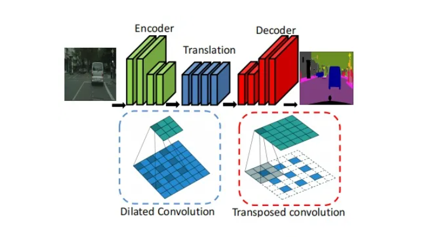
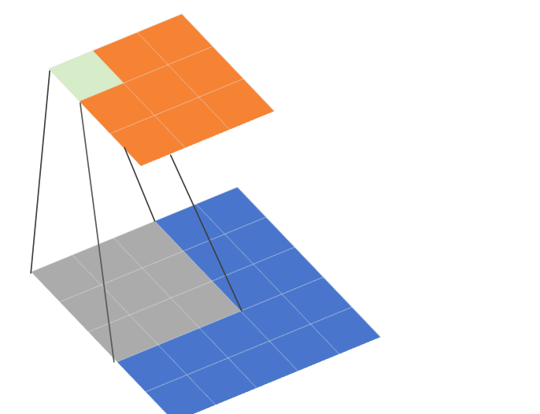

# 扩展和转置卷积分解的高效加速器

论文阅读：Efficient Accelerator for Dilated and Transposed Convolution with Decomposition

## 摘要

* 扩展和转置卷积的硬件加速，可以实时执行分割等相关任务
* 针对空洞卷积和专职卷积的输入或者权重进行分解，来跳过冗余计算，从而在现有的密集CNN硬件上高效执行
* 本文提出的结构减少了87.8%的周期计数，获得8.2倍的加速

## 导言

* stride one 卷积 3x3 这里称之为密集CNN
* Chen等人采用空间阵列结构和行固定数据流进行分类
* Tu等人提出了一种脉动阵列结构，对不同的卷积核进行完全重构
* Shin等人使用不同的硬件单元来支持CNN和RNN
* 分割网络主要由空洞和转置卷积组成，这些卷积在权重或输入处有许多零，这会导致CNN稀疏
* Liu等人提供了一个统一的脉动阵列来加速不同类型的循环。
* Mao等人使用级联滤波器结构来支持生成型神经网络的转置卷积。

* 本文提出了对空洞卷积和转置卷积的输入或者权重进行分解，使得所有这些卷积都简化为普通密集的CNN,并在现有密集的CNN硬件上面轻松执行，无需任何开销
* 对比ENet中的空洞卷积和转置卷积节省97% 和71%的循环计数

## 本文方法

### 分割概述

* 图像分割网络由编码器、翻译和解码器组成的分割网络架构
* 编码器用来提取高级特征
* 然后对特征进行空洞卷积处理  使用更大的和进行0插入，以保证特征图在翻译部分的大小不变
* 对这些图进行上采样，生成与解码器的转置卷积输入大小相同的输出，转置卷积通过在相邻输入元素之间插入0来放大输入，并于正常核进行卷积以生成放大的输出
  
**空洞卷积和转置卷积都包含大量的0计算，如何跳过这些0不增加复杂控制成本**

  

### 关于空洞卷积

* 卷积核大小为3 x 3 步长stride = 1 r = 2, r称之为膨胀因子。当r=1，表示卷积核各元素之间没有空隙，也就是相邻两个元素之间位置相差1，就是正常的卷积
* 这里的r = 2表示卷积核各个元素之间有一个空隙，相邻两个元素之间位置相差1

  

### 为什么使用空洞卷积

**扩大感受野，感受野指的是特征图的一个像素对应原图多少尺寸的像素**

  

* 使用空洞卷积一个关键原因就是可以增大感受野，这样在检测、分割任务中就能对大尺寸物体表现出较好的效果。
* 空洞卷积的缺陷主要体现在存在网格效应

