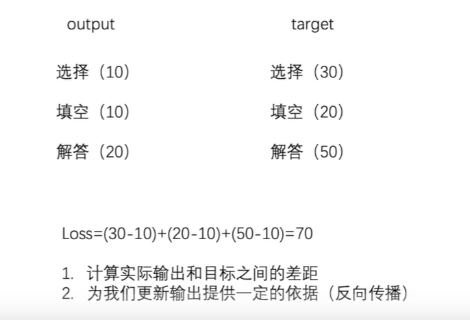
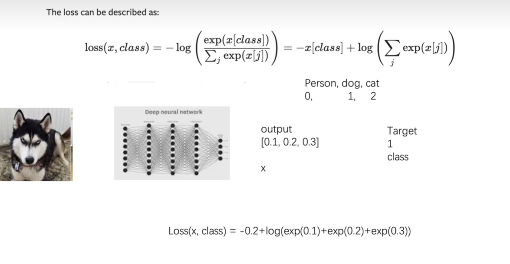

# 损失函数与反向传播

## Loss损失意义

  

##  L1损失函数

```py
import torch
from torch.nn import L1Loss

# 转换成tensor张量
inputs = torch.tensor([1,2,3],dtype = torch.float32)
targets = torch.tensor([1,2,5],dtype = torch.float32)

#  转换成四维张量  batch_size channel 大小
inputs  = torch.reshape(inputs,(1,1,1,3))
targets  = torch.reshape(inputs,(1,1,1,3))

#  定义一维损失
loss = L1Loss()
result = loss(inputs,targets)

#  产生损失结果
print(result)

```


## MSELoss

```py
loss_mse = nn.MSELoss()

# 平方损失 
result_mse = loss_mse(inputs,targets)

```

## 交叉熵损失函数

  


```py
x = torch.tensor([0.1,0.2,0.3])
y = torch.tensor([1])  # target
x = torch.reshape(x,[1,3])
loss_cross = nn.CrossEntropyLoss()

result_cross = loss_cross(x,y)
print(result_cross)

```

## 搭建神经网络

```py
from torch import nn
# from tensorboardX import SummaryWriter
from  torch.nn import Conv2d,MaxPool2d,Flatten,Linear,Sequential
import torch
import torchvision
from torch.utils.data import DataLoader


dataset = torchvision.datasets.CIFAR10("../data",train=False,transform=torchvision.transforms.ToTensor(),download=True)

# 每次只取出一张图片
dataloader = DataLoader(dataset,batch_size=1)

from torch.utils.tensorboard import SummaryWriter

class Tudui(nn.Module):
    def __init__(self):
        super(Tudui,self).__init__()
        self.model1 = Sequential(
            Conv2d(3,32,5,padding=2),
            MaxPool2d(2),
            Conv2d(32,32,5,padding=2),
            MaxPool2d(2),
            Conv2d(32,64,5,padding=2),
            MaxPool2d(2),
            Flatten(),
            Linear(1024,64),
            Linear(64,10)
        )

    def forward(self,x):
        x = self.model1(x)
        return x
    
loss = nn.CrossEntropyLoss()
tudui = Tudui()
# print(tudui)

for data in dataloader:
    imgs,targets = data
    # 经过神经网络处理得到的输出  一个一维向量  包含十个数据
    outputs = tudui(imgs)
    # print(outputs)
    # print(targets)

    #  计算损失
    result_loss = loss(outputs,targets)

    print(result_loss)

```
