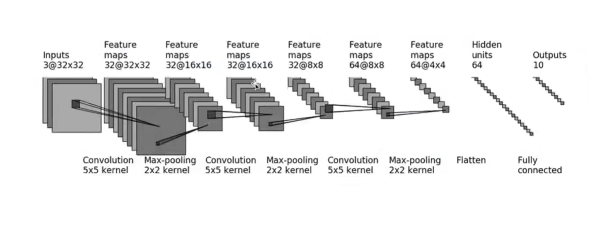
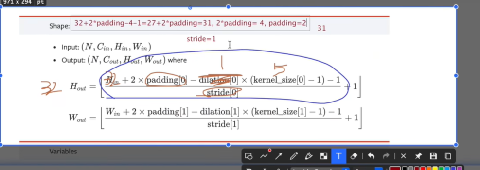
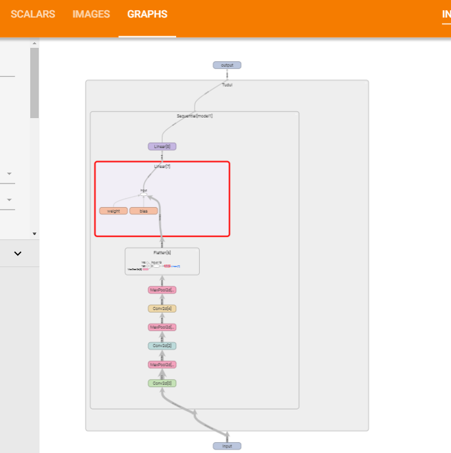

# 搭建网络模型的实战

**对CIFAR10数据集进行分类，根据图片内容识别这是哪一类**


## CIFAR10 model structure

  

* 输入input:3通道的32 x 32 图片
* 卷积操作的通道数不变 那是因为经过了padding操作
* 最大池化 不改变channel数
* 输出是一个一维向量  十种类别

## 搭建网络

**第一次卷积操作之后，图片大小不变，经过了padding操作  padding = 2**

  

```py
from torch import nn
from  torch.nn import Conv2d,MaxPool2d,Flatten,Linear

class Tudui(nn.Module):
    def __init__(self):
        super(Tudui,self).__init__()

        #  第一层 卷积层  填充操作 保证图片大小不变
        self.conv1 = Conv2d(3,32,5,padding = 5)

        #  最大池化 操作
        self.maxpool1 = MaxPool2d(2)

        # 第二层卷积  通道数不变
        self.conv2 = Conv2d(32,32,5,padding=2)

        #  x最大池化 操作
        self.maxpool2 = MaxPool2d(2)

        #  第三层卷积操作
        self.conv3 = Conv2d(32,64,5,padding=2)

        # 最大池化操作
        self.maxpool3 = MaxPool2d(2)

        # 将数据进行展平 64 * 4 * 4 = 1024 一维向量

        # 64 x 1024  这里的64是batch_size
        self.flatten = Flatten()


        #  将展平之后的向量 输入全连接层

        # 输入1024  输出64
        self.linear1 = Linear(1024,64)
        self.linear2 = Linear(64,10)

    def forward(self,x):
        x = self.conv1(x)
        x = self.maxpool1(x)
        x = self.conv2(x)
        x = self.maxpool2(x)
        x = self.conv3(x)
        x = self.maxpool3(x)

        x= self.flatten(x)
        x = self.linear1(x)
        x = self.linear2(x)

        return x
    
tudui = Tudui()

print(tudui)

input  = torch.ones((64,3,32,32))
output = tudui.forward(input)
print(output.shape)
    
```


## 使用Sequential进行搭建网络模型

**将上面的代码使用sequential进行置换**


```py
from torch import nn
from  torch.nn import Conv2d,MaxPool2d,Flatten,Linear,Sequential
import torch

class Tudui(nn.Module):
    def __init__(self):
        super(Tudui,self).__init__()

        # #  第一层 卷积层  填充操作 保证图片大小不变
        # self.conv1 = Conv2d(3,32,5,padding = 5)

        # #  最大池化 操作
        # self.maxpool1 = MaxPool2d(2)

        # # 第二层卷积  通道数不变
        # self.conv2 = Conv2d(32,32,5,padding=2)

        # #  x最大池化 操作
        # self.maxpool2 = MaxPool2d(2)

        # #  第三层卷积操作
        # self.conv3 = Conv2d(32,64,5,padding=2)

        # # 最大池化操作
        # self.maxpool3 = MaxPool2d(2)

        # # 将数据进行展平 64 * 4 * 4 = 1024 一维向量

        # # 64 x 1024  这里的64是batch_size
        # self.flatten = Flatten()

        # #  将展平之后的向量 输入全连接层
        # # 输入1024  输出64
        # self.linear1 = Linear(1024,64)
        # self.linear2 = Linear(64,10)


        self.model1 = Sequential(
            Conv2d(3,32,5,padding=2),
            MaxPool2d(2),
            Conv2d(32,32,5,padding=2),
            MaxPool2d(2),
            Conv2d(32,64,5,padding=2),
            MaxPool2d(2),
            Flatten(),
            Linear(1024,64),
            Linear(64,10)
        )

    def forward(self,x):
        # x = self.conv1(x)
        # x = self.maxpool1(x)
        # x = self.conv2(x)
        # x = self.maxpool2(x)
        # x = self.conv3(x)
        # x = self.maxpool3(x)

        # x= self.flatten(x)
        # x = self.linear1(x)
        # x = self.linear2(x)
        x = self.model1(x)

        return x
    
tudui = Tudui()
print(tudui)

input  = torch.ones((64,3,32,32))
output = tudui.forward(input)
print(output.shape)

```


## 使用tensorboard查看网络结构


  


```py
from torch import nn
# from tensorboardX import SummaryWriter
from  torch.nn import Conv2d,MaxPool2d,Flatten,Linear,Sequential
import torch

from torch.utils.tensorboard import SummaryWriter

class Tudui(nn.Module):
    def __init__(self):
        super(Tudui,self).__init__()

        self.model1 = Sequential(
            Conv2d(3,32,5,padding=2),
            MaxPool2d(2),
            Conv2d(32,32,5,padding=2),
            MaxPool2d(2),
            Conv2d(32,64,5,padding=2),
            MaxPool2d(2),
            Flatten(),
            Linear(1024,64),
            Linear(64,10)
        )

    def forward(self,x):

        x = self.model1(x)

        return x
    
tudui = Tudui()

print(tudui)

input  = torch.ones((64,3,32,32))
output = tudui.forward(input)


#  输出是 64 x 10 64代表batch_size
print(output.shape)

writer = SummaryWriter("../logs_seq")
writer.add_graph(tudui,input)
writer.close()

```


