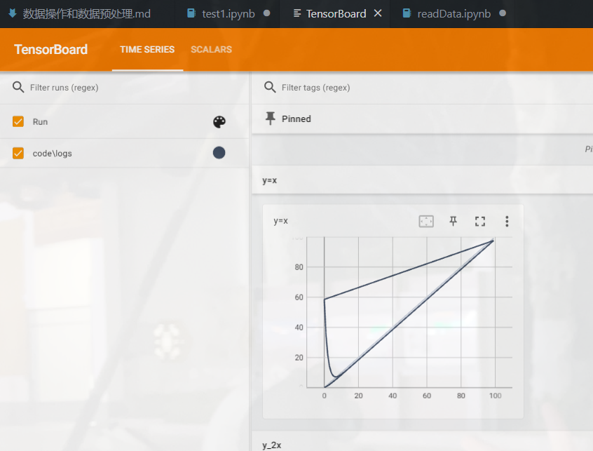
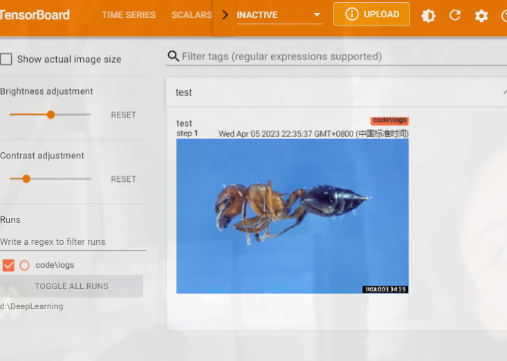

# Pytorch快速入门学习-数据操作和数据预处理

## 加载数据

* DataSet:提供一种方式获取数据以及它的标签
* DataLoader:为后面的网络提供不同的数据形式

复习一下anaconda操作：

* 查看现有的虚拟环境 conda info -e 
* 激活指定的虚拟环境  conda activate 名称
* 安装jupyter conda install jupyter notebook


## DataSet类代码实战

```python
from torch.utils.data import Dataset
from PIL import Image
import os

class MyData(Dataset):
    def __init__(self,root_dir,label_dir):
        self.root_dir = root_dir
        self.label_dir = label_dir
        ## 拼接文件夹路径
        self.path = os.path.join(self.root_dir,self.label_dir)
        ## 获取图片文件列表
        self.img_path = os.listdir(self.path)

    def __getitem__(self, index) :
        ## 获取图片名称
        img_name = self.img_path[index]
        ## 获取图片路径  使用图片文件名进行拼接 获取相对路径
        img_item_path = os.path.join(self.root_dir,self.label_dir,img_name)
        ## 读取图片
        img = Image.open(img_item_path)
        label = self.label_dir
        ## 返回图片和标签
        return img,label

    def __len__(self):

        ## 返回图片列表的长度
        return len(self.img_path)


root_dir = "../../AllData/dataset1/train"
ants_label_dir = "ants"

## 实例化对象
ants_dataset = MyData(root_dir,ants_label_dir)

## 124张图片
print(ants_dataset.__len__())

## 根据索引 获取图片和标签
img,label = ants_dataset[0]
img.show()
print(label)

## 获取蜜蜂数据集  
bees_label_dir = "bees"

bees_dataset = MyData(root_dir,bees_label_dir)

## 获取总数据集
train_dataset = ants_dataset + bees_dataset

## 展示蜜蜂数据
img,label = train_dataset[124]
img.show()
```


## Tensorboard的使用

**主要是用来绘图的**

* 安装tensorboard  conda install tensorboard
  

运行下面的代码，得出Log文件夹  tensorboard的事件文件

```python
from torch.utils.tensorboard import SummaryWriter

writer = SummaryWriter("logs")

for i in range(100):
    writer.add_scalar("y=x",i,i)

writer.close()
```

  


**获取图片**

```py
# from torch.utils.tensorboardX import SummaryWriter
from tensorboardX import SummaryWriter
import numpy as np
from PIL import Image

## 创建一个实例
writer = SummaryWriter("logs")

# 填写相对路径
image_path = "../AllData/dataset1/train/ants_image/0013035.jpg"

#  获取图片
img_PIL = Image.open(image_path)

# 转换为numpy张量
img_array = np.array(img_PIL)

#  打印类型 以及形状
print(type(img_array))
print(img_array.shape)

#  指定图片形状 H W C
writer.add_image("test",img_array,1,dataformats='HWC')


for i in range(100):

    #  绘制图像
    #  y轴  x轴
    writer.add_scalar("y=2x",2 * i,i)

writer.close()

```

  


## Transform使用


