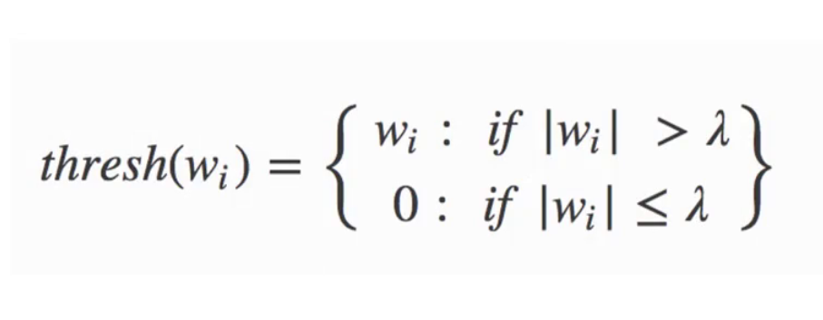
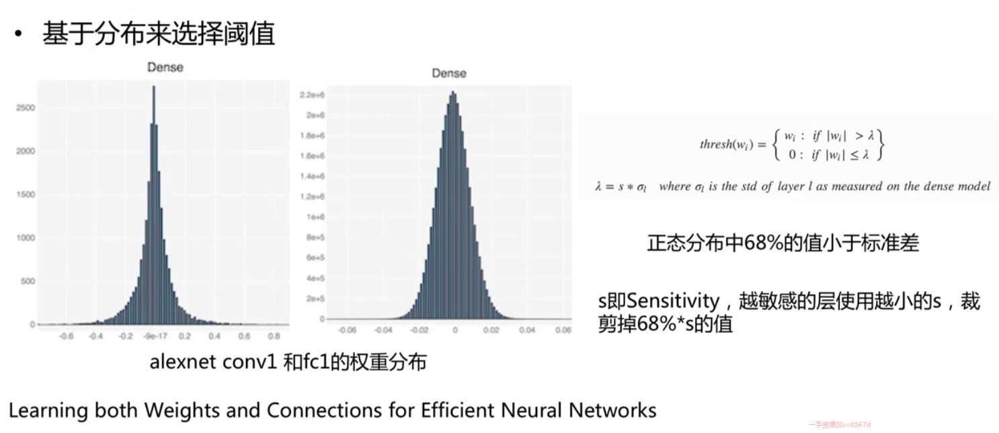
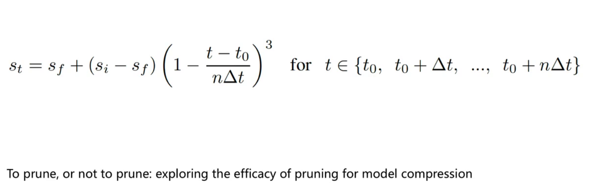
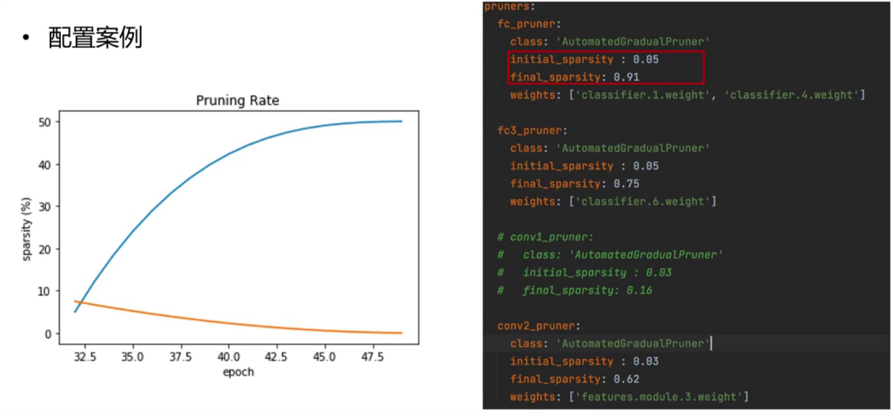
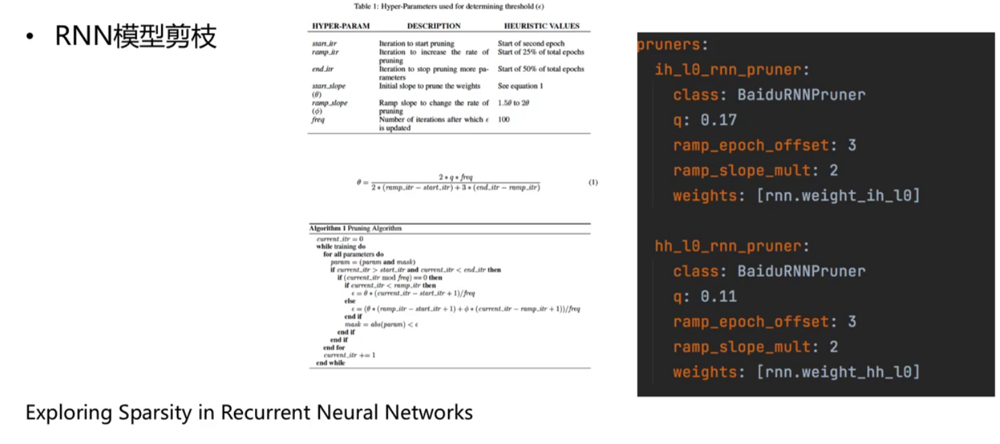
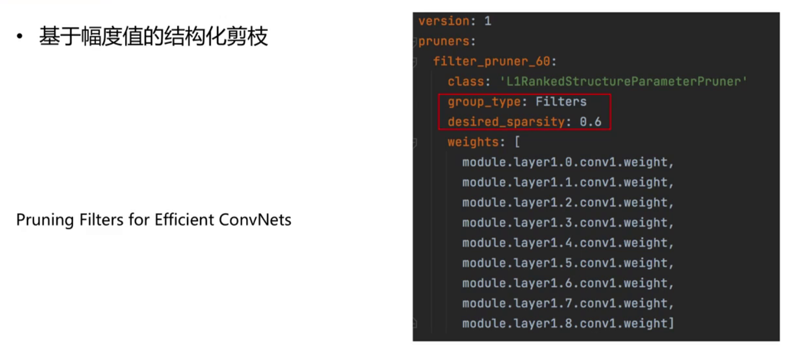

# 模型剪枝模块

## 最基本的基于阈值策略

  

## 基于分布来选择阈值

* 假定权重是符合一个正太分布
* 正态分布有68% 小于标准差  将标准差作为阈值
* 卷积层的敏感度要比全连接层更大：导致有些层over-pruning 有些层 under-pruning

  

## 设置预期的稀疏率

* 权重值按照绝对值进行排序
* 从最小的权重开始去除，直到得到想要的稀疏率

  

## 逐渐增加稀疏率AGP

* 一种逐步剪枝方法
* 在n个剪枝步骤中，稀疏度从初始的稀疏度（通常为0）增加到最终的稀疏度

  

## RNN模型剪枝

  

## 基于幅度值的结构化剪枝

  

