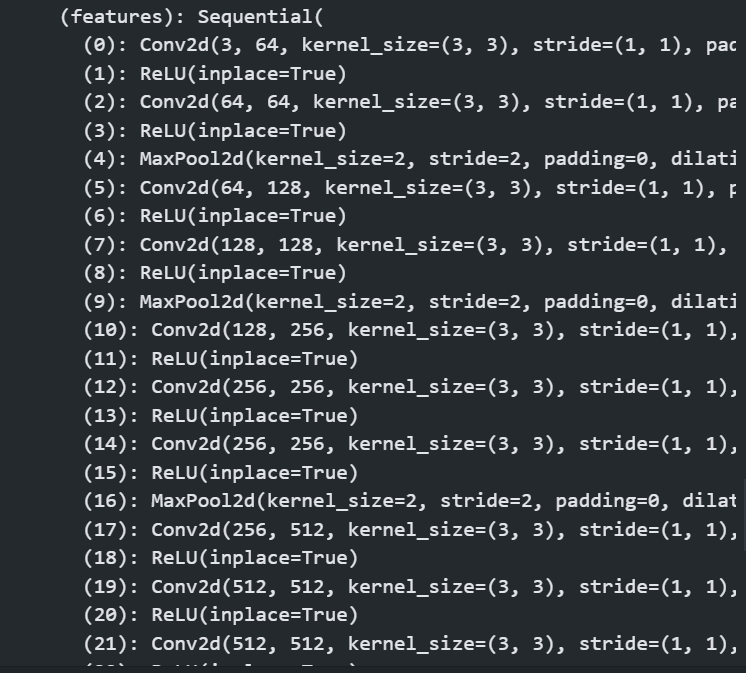

# 模型的保存和使用


## 模型的保存

### 保存方式1

**这种方式保存的是模型的结构和参数**

```py
import torch
import torchvision

vgg16 = torchvision.models.vgg16(pretrained = False)

#  保存方式1  保存模型
torch.save(vgg16,"vgg16_method1.pth")

```

### 加载方式1

```py
import torch
import torchvision

vgg16 = torchvision.models.vgg16(pretrained = False)

#  保存方式1  保存模型
torch.save(vgg16,"vgg16_method1.pth")


#  模型的加载
model = torch.load("vgg16_method1.pth")

print(model)

```

打印结果：

```
VGG(
  (features): Sequential(
    (0): Conv2d(3, 64, kernel_size=(3, 3), stride=(1, 1), padding=(1, 1))
    (1): ReLU(inplace=True)
    (2): Conv2d(64, 64, kernel_size=(3, 3), stride=(1, 1), padding=(1, 1))
    (3): ReLU(inplace=True)
    (4): MaxPool2d(kernel_size=2, stride=2, padding=0, dilation=1, ceil_mode=False)
    (5): Conv2d(64, 128, kernel_size=(3, 3), stride=(1, 1), padding=(1, 1))
    (6): ReLU(inplace=True)
    (7): Conv2d(128, 128, kernel_size=(3, 3), stride=(1, 1), padding=(1, 1))
    (8): ReLU(inplace=True)
    (9): MaxPool2d(kernel_size=2, stride=2, padding=0, dilation=1, ceil_mode=False)
    (10): Conv2d(128, 256, kernel_size=(3, 3), stride=(1, 1), padding=(1, 1))
    (11): ReLU(inplace=True)
    (12): Conv2d(256, 256, kernel_size=(3, 3), stride=(1, 1), padding=(1, 1))
    (13): ReLU(inplace=True)
    (14): Conv2d(256, 256, kernel_size=(3, 3), stride=(1, 1), padding=(1, 1))
    (15): ReLU(inplace=True)
    (16): MaxPool2d(kernel_size=2, stride=2, padding=0, dilation=1, ceil_mode=False)
    (17): Conv2d(256, 512, kernel_size=(3, 3), stride=(1, 1), padding=(1, 1))
    (18): ReLU(inplace=True)
    (19): Conv2d(512, 512, kernel_size=(3, 3), stride=(1, 1), padding=(1, 1))
    (20): ReLU(inplace=True)
    (21): Conv2d(512, 512, kernel_size=(3, 3), stride=(1, 1), padding=(1, 1))
    (22): ReLU(inplace=True)
...
    (5): Dropout(p=0.5, inplace=False)
    (6): Linear(in_features=4096, out_features=1000, bias=True)
  )
)

```


### 保存方式2

```py
#  保存方式2  模型的参数 保存成一个字典形式  官方推荐

torch.save(vgg16.state_dict(),"vgg16_method2.pth")
#  模型的加载


```

### 加载方式2

```py
# 加载模型

model = torch.load("vgg16_method2.pth")
print(model)

```

**加载的形式是：字典的形式**


**采取另一种加载方式，加载模型的形式**

```py
#  加载模型

vgg16 = torchvision.models.vgg16(pretrained = False)
vgg16.load_state_dict(torch.load("vgg16_method2.pth"))
print(vgg16)

```

  


