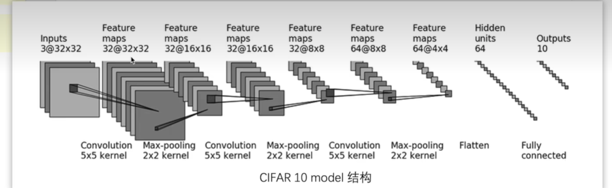
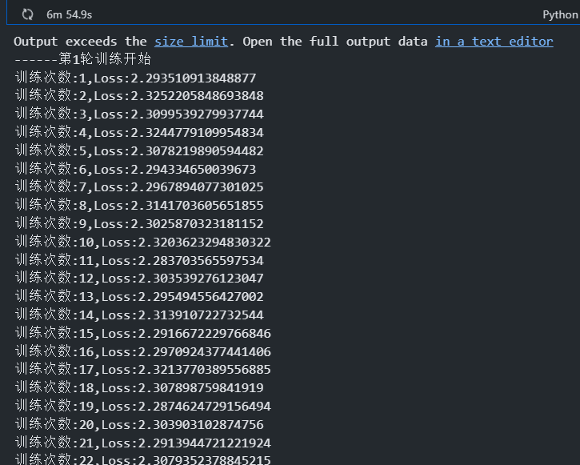

# 模型训练套路1

## 准备数据集

```py
import torchvision

# 准备数据集
train_data = torchvision.datasets.CIFAR10(root = "../data",train=True,transform=torchvision.transforms.ToTensor(),download=True)

test_data = torchvision.datasets.CIFAR10(root = "../data",train=False,transform=torchvision.transforms.ToTensor(),download=True)


```


## Dadaloader加载数据集

```py
#  dataloader加载数据集
train_dataloader = DataLoader(train_data,batch_size = 64)
test_dataloader = DataLoader(test_data,batch_size = 64)


```


## 搭建神经网络

  

```py
# 搭建神经网络

class Tudui(nn.Module):
    def __init__(self):
        super(Tudui,self).__init__()
        self.model = nn.Sequential(
            #  inpuT 3 output 32  卷积核5 stride 1 padding 2
            #  第一次卷积操作
            nn.Conv2d(3,32,5,1,2),

            #  最大池化操作 2 是kernel size
            nn.MaxPool2d(2),

            # 卷积操作 
            nn.Conv2d(32,32,5,1,2),

            nn.MaxPool2d(2),

            nn.Conv2d(32,64,5,1,2),

            nn.MaxPool2d(2),

            # 展平 将64个channel的4 x 4的图片全部展平 
            # 展平之后的结果是 6 4 * 4 * 4  一个一维向量
            nn.Flatten(),
            #  线性层
            nn.Linear(64 * 4 * 4,64),
            nn.Linear(64,10)
        )

    #  前向传播
    def forward(self,x):
        x = self.model(x)
        return x


```

## 定义损失函数和随机梯度下降优化器

```py
#  创建网络模型
tudui = Tudui()


# 定义损失函数
loss_fn = nn.CrossEntropyLoss()


learning_rate = 0.01


# 定义优化器  随机梯度下降
optimizer = torch.optim.SGD(tudui.parameters(),lr = learning_rate)


```


## 设置训练网络的参数并且训练


```py

#  设置训练网络的一些参数
total_train_step = 0
# 记录测试的次数
total_test_step = 0

# 训练的轮数
epoch = 10


for i in range(epoch):
    print("------第{}轮训练开始".format(i + 1))

    # 训练步骤开始
    for data in train_dataloader:
        imgs,targets = data

        # 64 x 10
        outputs = tudui.forward(imgs)

        #  计算损失
        loss = loss_fn(outputs,targets)

        #  将梯度清0
        optimizer.zero_grad()

        # 反向传播  计算梯度
        loss.backward()

        # 优化
        optimizer.step()

        #  统计训练次数
        total_train_step = total_train_step + 1


        # item 将tensor转换为一个数据类型

        print("训练次数:{},Loss:{}".format(total_train_step,loss.item()))

```

  


